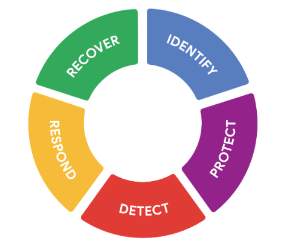

# Riesgo y Seguridad de los recursos

## Elementos de un plan de Seguridad
- ​La protección de los recursos se extiende mucho más allá de una persona o ​un grupo de personas en un departamento de TI.
- ​La verdad del asunto es que la seguridad es una cultura.
- ​Es un conjunto de valores compartidos que abarca todos los niveles de una organización.
- ​Estos valores afectan a todo el mundo, desde los empleados hasta los proveedores y los clientes.
- ​Proteger los recursos digitales y físicos requiere la participación de todos, ​lo que puede suponer todo un reto.
- ​¡Para eso están los planes de seguridad!
- ​Los planes tienen muchas formas y tamaños, pero todos comparten un objetivo común: ​estar preparados para los riesgos cuando sucedan.
- ​Poner el foco en las personas es lo que conduce a los planes de seguridad más eficaces.
- ​Considerar los diversos orígenes y perspectivas de todos los implicados ​garantiza que nadie quede fuera cuando algo vaya mal.
- ​Hablábamos antes del riesgo como cualquier cosa que pueda afectar ​a la confidencialidad, integridad y disponibilidad de un recurso.
- ​La mayoría de los planes de seguridad abordan los riesgos desglosándolos ​según categorías y factores.
- ​Algunas categorías de riesgo comunes podrían incluir, el daño, ​la divulgación o la pérdida de Información.
- ​Cualquiera de ellos puede deberse a factores como el daño físico o ​el mal funcionamiento de un dispositivo.
- ​También hay factores como los ataques y los errores humanos.
- ​Por ejemplo, a un nuevo profesor de escuela se le puede pedir que firme un contrato antes de su ​primer día de clase.
- ​El acuerdo puede advertir contra algunos riesgos comunes asociados a los errores humanos, ​como utilizar un correo electrónico personal para enviar información sensible.
- ​Un plan de seguridad puede requerir que todas las nuevas contrataciones firmen este acuerdo, ​difundiendo eficazmente los valores que garantizan que todo el mundo está alineado.
- ​Este es sólo un ejemplo de los tipos y causas de riesgo que puede abordar un plan.
- ​Estas cosas varían mucho dependiendo de la empresa.
- ​Pero la forma en que se comunican estos planes es similar en todas las industrias
- ​Los planes de seguridad constan de tres elementos básicos: políticas, Estándares, ​y Procedimientos.
- ​Estos tres elementos son la forma en que las empresas comparten sus planes de seguridad.
- Estas palabras tienden a utilizarse indistintamente fuera del ámbito de la seguridad, pero ​pronto descubrirá que cada una tiene un significado y ​una función muy específicos en este contexto.
- ​Una política de seguridad es un conjunto de normas que reducen el Riesgo y protegen la Información.
- ​Las políticas son la base de todo plan de seguridad.
- ​Dan orientación a todos dentro y fuera de una organización al abordar ​preguntas como, ¿qué estamos protegiendo y por qué?
- ​Las políticas se centran en el lado estratégico de las cosas al identificar el Alcance, ​objetivos y limitaciones de un plan de seguridad.
- ​Por ejemplo, los empleados recién contratados en muchas empresas ​deben firmar una política de uso aceptable, o AUP.
- ​Estas disposiciones describen las formas seguras en que un empleado puede acceder a los sistemas corporativos.
- ​Los Estándares son la siguiente parte.
- ​Tienen una función táctica, ya que se refieren a lo bien que estamos protegiendo los recursos.
- ​En seguridad, los Estándares son referencias que informan sobre cómo establecer políticas.
- ​Una buena forma de pensar en los Estándares es que crean un punto de referencia.
- ​Por ejemplo, muchas empresas utilizan la norma de gestión de contraseñas identificada ​en la publicación especial 800-63B del NIST para mejorar sus políticas de seguridad ​especificando que las contraseñas de los empleados deben tener al menos ocho caracteres.
- ​La última parte de un plan son sus procedimientos.
- Los procedimientos son instrucciones paso a paso para realizar una tarea de Seguridad específica.
- ​Las organizaciones suelen conservar varios documentos de procedimientos que se utilizan ​en toda la empresa, como por ejemplo cómo pueden elegir los empleados contraseñas seguras, ​o cómo pueden restablecer de forma segura una contraseña si se ha bloqueado.
- ​Compartir procedimientos claros y procesables con todo el mundo crea responsabilidad, ​coherencia y eficacia en toda la organización.
- ​Las políticas, Estándares y Procedimientos varían mucho de una empresa a ​otra porque se adaptan a los objetivos de cada organización.
- ​Simplemente entender la estructura de los planes de seguridad es un gran comienzo.

---

## El marco de ciberseguridad del NIST
- Tener un plan es solo una parte de la protección de los activos.
- ​Una vez que el plan esté en acción, la otra parte es asegurarse de que todos lo sigan.
- ​En Seguridad, a esto lo llamamos cumplimiento.
- El ​cumplimiento normativo es el proceso de adhesión a las normas internas y ​externas.
- ​Las pequeñas empresas y las grandes organizaciones de todo el mundo sitúan el cumplimiento de ​la Seguridad en la parte superior de su lista de prioridades.
- ​A un alto nivel, mantener la confianza, la reputación, la seguridad y ​la integridad de sus datos son solo algunos de los motivos para preocuparse por el cumplimiento.
- ​Las multas, las sanciones y las demandas son otras razones.
- ​Esto es particularmente cierto para ​las empresas de industrias altamente reguladas, como la atención médica, la energía y las finanzas.
- ​El incumplimiento de una regulación puede provocar ​efectos financieros y reputacionales duraderos que pueden afectar gravemente a una empresa.
- ​Las regulaciones son reglas establecidas por un gobierno u ​otra autoridad para controlar la forma en que se hace algo.
- ​Al igual que las políticas, existen regulaciones para proteger a las personas y ​su información, pero a mayor escala.
- ​El cumplimiento normativo puede ser un proceso complejo debido a las numerosas regulaciones que ​existen en todo el mundo.
- ​Para nuestro propósito, nos centraremos en un marco de cumplimiento de seguridad, el Marco de ​Ciberseguridad del NIST, con sede en EE. UU.
- ​Al principio del programa, aprendió el Instituto Nacional de Estándares y ​Tecnología, o NIST.
- ​Una de las funciones principales del NIST es proporcionar abiertamente a las empresas un conjunto de ​marcos y estándares de seguridad que reflejen las normas clave relacionadas con la seguridad.
- ​El marco de ciberseguridad del NIST es un marco voluntario que consiste en ​estándares, directrices y mejores prácticas ​para gestionar el riesgo de ciberseguridad.
- Comúnmente conocido como CSF, ​este framework se desarrolló para ayudar a las empresas a proteger uno de sus ​activos más importantes: la información.
- ​El CSF consta de tres componentes principales: el núcleo, sus niveles y sus perfiles.
- ​Exploremos cada uno de estos juntos ​para comprender mejor cómo se usa el CSF del NIST.
- ​El núcleo es básicamente una versión simplificada de las funciones o ​deberes de un plan de Seguridad.
- ​El núcleo del CSF identifica cinco funciones generales: ​identificar, proteger, detectar, responder y recuperar.
- ​Piense en estas categorías del núcleo como una lista de verificación de Seguridad.
- ​Después del núcleo, el siguiente componente del NIST del que hablaremos son sus niveles.
- ​Esto proporciona a los equipos de Seguridad una forma de medir el ​rendimiento en cada una de las cinco funciones del núcleo.
- ​Los niveles van desde el nivel 1 hasta el nivel 4.
- El ​nivel 1, o pasivo, indica que una función está alcanzando los estándares mínimos.
- El ​nivel 4, o ​adaptativo, es una indicación de que una función se está realizando según un estándar ejemplar.
- ​Es posible que haya notado que los niveles de CSF no son una propuesta de sí o no ​, sino que hay un rango de valores.
- Esto se ​debe a que los niveles están diseñados como una forma de mostrar a las organizaciones qué funciona y qué ​no funciona con sus planes de Seguridad.
- ​Por último, los perfiles son el componente final del CSF.
- ​Estos proporcionan estadísticas sobre el estado actual de un plan de Seguridad.
- ​Una forma de pensar en los perfiles es como las fotos que capturan un momento en el tiempo.
- La ​comparación de fotos del mismo sujeto tomadas en diferentes momentos ​puede proporcionar información útil.
- ​Por ejemplo, sin estas fotos, es posible que no te des cuenta de cómo ha cambiado este árbol.
- ​Lo mismo ocurre con los perfiles del NIST.
- Las ​buenas prácticas de Seguridad van más allá de evitar multas y ataques. 
- Demuestra que te importan las personas y su información. 

---

## Directrices de Seguridad en acción
- Las organizaciones se enfrentan a menudo a una cantidad abrumadora de riesgos.
- Desarrollar desde el principio un plan de seguridad que aborde todos los riesgos puede resultar complicado.
- Esto hace que los Marcos de seguridad sean una opción útil.
- Una de las principales ventajas del CSF es que es flexible y puede aplicarse a cualquier sector.
- En esta lectura, explorarás cómo se puede implementar el NIST CSF.

- Orígenes del marco
   - Originalmente publicado en 2014, el NIST desarrolló el Marco de Ciberseguridad para proteger la infraestructura crítica en los Estados Unidos.
   - El NIST fue seleccionado para desarrollar el CSF porque son una fuente imparcial de datos y prácticas científicas.
   - Con el tiempo, el NIST adaptó el CSF para ajustarlo a las necesidades de las empresas de los sectores público y privado.
   - Su objetivo era hacer el marco más flexible, facilitando su adopción por parte de las pequeñas empresas o de cualquier otra persona que pudiera carecer de recursos para desarrollar sus propios planes de seguridad.

- Componentes del CSF
   - Como recordarás, el marco consta de tres componentes principales: el núcleo, los niveles y los perfiles.
   
- Núcleo
   - El núcleo del CSF es un conjunto de resultados de ciberseguridad deseados que ayudan a las organizaciones a personalizar su plan de seguridad.
   - Consta de seis funciones o partes: Identificar, Proteger, Detectar, Responder, Recuperar y Gobernar.
   - Estas funciones se utilizan habitualmente como referencia informativa para ayudar a las organizaciones a identificar sus activos más importantes y protegerlos con las salvaguardas adecuadas.
   - El núcleo del CSF también se utiliza para comprender las formas de detectar ataques y desarrollar planes de respuesta y recuperación en caso de que se produzca un ataque.
   - Anteriormente, el núcleo constaba de sólo cinco funciones.
   - La gobernanza se añadió en febrero de 2024 para subrayar la importancia del liderazgo y la toma de decisiones a la hora de gestionar los riesgos de ciberseguridad.

- Niveles
   - Los niveles del CSF son una forma de medir la sofisticación del programa de ciberseguridad de una organización.
   - Los niveles del CSF se miden en una escala de 1 a 4.
   - El nivel 1 es la puntuación más baja, lo que indica que se ha implementado un conjunto limitado de controles de seguridad.
   - En general, los niveles de CSF se utilizan para evaluar la postura de seguridad de una organización e identificar áreas de mejora.

- Perfiles
   - Los perfiles CSF son plantillas prefabricadas del NIST CSF desarrolladas por un equipo de expertos del sector.
   - Los perfiles CSF se adaptan para abordar los riesgos específicos de una organización o industria.
   - Se utilizan para ayudar a las organizaciones a desarrollar una línea de base para sus planes de ciberseguridad, o como una forma de comparar su postura actual de ciberseguridad con un estándar específico de la industria.
   - El núcleo, los niveles y los perfiles se diseñaron para ayudar a cualquier empresa a mejorar sus operaciones de seguridad.
   - Aunque sólo hay tres componentes, todo el marco consiste en un complejo sistema de subcategorías y procesos.

- Implantación del CSF
   - Como recordarás, el cumplimiento es un concepto importante en seguridad.
   - El cumplimiento es el proceso de adhesión a normas internas y reglamentos externos.
   - En otras palabras, el cumplimiento es una forma de medir lo bien que una organización está protegiendo sus activos.
   - El Marco de Ciberseguridad del NIST (CSF) es un marco voluntario que consta de normas, directrices y mejores prácticas para gestionar los riesgos de ciberseguridad.
   - Las organizaciones pueden optar por utilizar el CSF para lograr el cumplimiento de una variedad de regulaciones.
   - Las normativas son reglas que deben seguirse, mientras que los marcos son recursos que puede elegir utilizar.
   - Desde su creación, muchas empresas han utilizado el NIST CSF.
   - Sin embargo, el CSF puede resultar difícil de aplicar debido a su alto nivel de detalle.
   - También puede ser difícil encontrar dónde encaja el marco.
   - Por ejemplo, algunas empresas han establecido planes de seguridad, por lo que no está claro cómo puede beneficiarles el CSF.
   - Por otra parte, algunas empresas podrían estar en las primeras etapas de la construcción de sus planes y necesitan un lugar para empezar.
   - En cualquier caso, la Agencia de Ciberseguridad y Seguridad de las Infraestructuras de Estados Unidos (CISA) ofrece orientaciones detalladas que cualquier organización puede utilizar para implantar el CSF.
   - He aquí una rápida visión general y un resumen de sus recomendaciones:
      - Crear un perfil actual de las operaciones de seguridad y esbozar las necesidades específicas de su empresa.
      - Realice una Evaluación de riesgos para identificar cuáles de sus operaciones actuales cumplen las normas empresariales y reglamentarias.
      - Analizar y priorizar las deficiencias existentes en las operaciones de seguridad que ponen en peligro los activos de la empresa.
      - Implemente un plan de acción para alcanzar las metas y objetivos de su organización.
   - Tenga siempre en cuenta las tendencias actuales en materia de riesgos, amenazas y vulnerabilidades cuando utilice el NIST CSF.

- Industrias que adoptan el LCR
   - El NIST CSF ha seguido evolucionando desde su introducción en 2014.
   - Su diseño está influenciado por las normas y las mejores prácticas de algunas de las empresas más grandes del mundo.
   - Un beneficio del marco es que se alinea con las prácticas de seguridad de muchas organizaciones en toda la economía global.
   - También ayuda con el cumplimiento normativo que podrían compartir los socios comerciales.

---

## Ponga a prueba sus Conocimientos: Riesgo y Seguridad de los recursos

1. ¿Qué tipos de riesgos abordan los planes de Seguridad? Seleccione tres respuestas.
- [x] Daños a los recursos
- [x] Pérdida de información
- [x] Divulgación de datos
- [ ] Cambio de las condiciones del mercado
>Los planes de Seguridad abordan riesgos como los daños a los recursos, la pérdida de información y la divulgación de datos.

2. ¿Cuáles son los elementos básicos de un plan de seguridad? Seleccione tres respuestas
- [x] Procedimientos
- [x] Políticas
- [x] Estándares
- [ ] Regulaciones
> Los elementos básicos de un plan de seguridad son las políticas, los Estándares y los Procedimientos. Las políticas son normas que reducen el Riesgo y Protegen la Información. Los Estándares son referencias que informan sobre cómo establecer políticas. Y los Procedimientos son instrucciones paso a paso para realizar una tarea de Seguridad específica.

3. Rellene el espacio en blanco: El NIST CSF es un framework _____ que consta de Estándares, directrices y mejores prácticas para gestionar el riesgo de la ciberseguridad
- [x] voluntario
- [ ] obligatorio
- [ ] limitado
- [ ] rígido
> El NIST CSF es un framework voluntario que consta de estándares, directrices y mejores prácticas para gestionar el riesgo de la ciberseguridad. Se trata de un framework exhaustivo con un diseño flexible que puede utilizarse en cualquier industria.

4. ¿Cuáles son algunos de los beneficios del NIST Cybersecurity Framework (CSF)? Seleccione tres respuestas
- [ ] Es necesario para hacer negocios en línea.
- [x] Ayuda a las organizaciones a alcanzar los Estándares Reguladores.
- [x] Puede utilizarse para identificar y evaluar riesgos.
- [x] Es adaptable para ajustarse a las necesidades de cualquier negocio
> Algunos Beneficios del CSF son que es adaptable para ajustarse a las necesidades de cualquier negocio, ayuda a las organizaciones a alcanzar los Estándares regulatorios y puede ser utilizado para Identificar y Evaluar Riesgos.