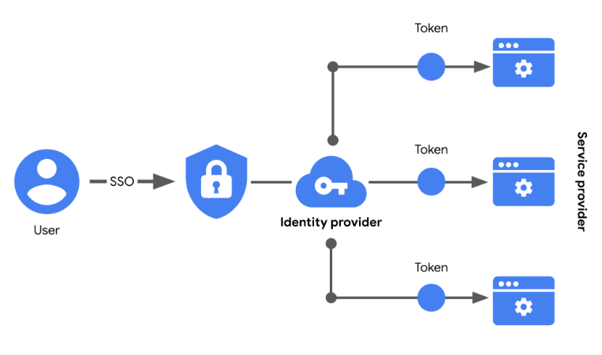

# Autenticación, autorización y contabilidad

## Controles de acceso y sistemas de autenticación
- ​Proteger los datos es una característica fundamental de los controles de seguridad.
- ​Cuando se trata de mantener la información a salvo y segura, el hash y el cifrado ​son herramientas poderosas, aunque limitadas.
- ​Gestionar quién o ​qué tiene acceso a la información también es clave para salvaguardar la información.
- ​La siguiente serie de controles que exploraremos son los Controles de acceso, ​los controles de seguridad que gestionan el acceso, la autorización y la ​rendición de cuentas de la información.
- ​Cuando se hacen bien, los Controles de acceso mantienen la confidencialidad de los datos, ​integridad y disponibilidad.
- ​También consiguen que los usuarios obtengan rápidamente la información que necesitan. 
- Estos sistemas suelen dividirse en tres funciones ​separadas, aunque relacionadas, conocidas como el marco de autenticación, autorización y contabilidad.
- ​Cada control tiene su propio protocolo y sistemas que los hacen funcionar.
- ​Los sistemas de autenticación son controles de acceso que sirven a un propósito muy básico.
- Le hacen a cualquier persona que intente acceder a la Información ​esta sencilla pregunta: ¿quién es usted?
- ​Las organizaciones recogen las respuestas a estas preguntas de forma diferente, ​dependiendo de los objetivos de su política de Seguridad.
- ​Algunas son más minuciosas que otras, pero en general, ​las respuestas a esta pregunta pueden basarse en tres factores de autenticación.
- ​El primero es el conocimiento.
   - La autenticación por conocimiento se refiere a algo que el usuario ​conoce, como una contraseña o ​la respuesta a una pregunta de seguridad que haya proporcionado previamente.
- ​Otro factor es la propiedad, que se refiere a algo que el usuario posee.
   - ​Un tipo de autenticación por propiedad muy utilizado es un código de acceso de un solo uso, u OTP.
   - ​Probablemente haya experimentado esto alguna vez.
   - ​Se trata de una secuencia de números aleatorios que una aplicación o sitio web ​le enviará por mensaje de texto o correo electrónico y le pedirá que proporcione.
- ​El último es la característica.
   - La autenticación mediante este factor es algo que el usuario es.
   - ​Los datos biométricos, como el escaneado de huellas dactilares en su smartphone, son un ejemplo de este tipo de ​autenticación.
   - ​Aunque no se utiliza en todas partes, esta forma de autenticación es cada vez más común ​porque es mucho más difícil para los delincuentes hacerse pasar por alguien ​si tienen que imitar una huella dactilar o un escaneado facial en lugar de una contraseña.
- ​La información proporcionada durante la autenticación tiene que coincidir ​con la información archivada para que estos Controles de acceso funcionen.
- ​Cuando las credenciales no coinciden, la autenticación falla y se deniega el acceso.
- Cuando coinciden, se concede el acceso.
- ​Denegar incorrectamente el acceso puede ser frustrante para cualquiera.
- ​Para que los sistemas de acceso sean más cómodos, ​muchas organizaciones confían hoy en día en el inicio de sesión único. 
- El inicio de sesión único, o ​SSO, es una tecnología que combina varios inicios de sesión diferentes en uno solo.
- ​¿Se imagina tener que volver a presentarse cada vez que queda con ​un amigo?
- ​Ese es exactamente el tipo de problema que resuelve el SSO.
- ​En lugar de exigir a los usuarios que se autentiquen una y otra vez, el SSO establece ​su identidad una vez, lo que les permite acceder a los Recursos de la empresa más rápidamente.
- ​Aunque los sistemas SSO son útiles cuando se trata de acelerar el proceso de autenticación, ​presentan una vulnerabilidad importante cuando se utilizan solos.
- ​Denegar el acceso a los usuarios autorizados puede ser frustrante, ​pero ¿sabe qué es aún peor?
- Conceder incorrectamente el acceso al usuario equivocado.
- ​La tecnología SSO es estupenda, pero no si se basa en un único factor de ​autenticación.
- Añadir más factores de autenticación refuerza estos sistemas.
- ​La autenticación de múltiples factores, o MFA, es una medida de seguridad que requiere que ​un usuario verifique su identidad de dos o más formas para acceder a un sistema o red.
- ​MFA combina dos o más credenciales independientes, como los conocimientos y la ​propiedad, para demostrar que alguien es quien dice ser.
- ​SSO y MFA se utilizan a menudo conjuntamente ​para aumentar las capacidades de defensa de los sistemas de autenticación.
- ​Cuando se utilizan ambos, las organizaciones pueden garantizar un acceso cómodo ​que también es seguro.

---

## El auge de SSO y MFA
- La mayoría de las empresas ayudan a mantener sus Datos a buen recaudo tras sistemas de autenticación.
- Los nombres de usuario y las contraseñas son las claves que desbloquean la Información para la mayoría de las organizaciones.
- Pero, ¿son suficientes esas credenciales?
- La Seguridad de la información a menudo se centra en gestionar el acceso y la autorización de un usuario a la información.
- Anteriormente, usted aprendió acerca de los tres factores de autenticación: Conocimientos, Responsabilidad y Característica.
- El inicio de sesión único (SSO) y la autenticación de múltiples factores (MFA) son dos tecnologías que se han hecho populares para implementar estos factores de autenticación.

- Un mejor enfoque de la autenticación
   - El inicio de sesión único (SSO) es una tecnología que combina varios inicios de sesión diferentes en uno solo.
   - Cada vez más empresas recurren al SSO como solución a sus necesidades de autenticación por tres razones:
      - El SSO mejora la experiencia del usuario al eliminar el número de nombres de usuario y contraseñas que la gente tiene que recordar.
      - Las empresas pueden reducir costes racionalizando la forma en que gestionan los servicios conectados.
      - El SSO mejora la Seguridad general al reducir el número de puntos de acceso a los que pueden dirigirse los atacantes.
   - Esta tecnología empezó a estar disponible a mediados de la década de 1990 como una forma de combatir la fatiga de contraseñas, que se refiere a la tendencia de la gente a reutilizar contraseñas en todos los servicios.
   - Recordar muchas contraseñas diferentes puede ser un reto, pero utilizar la misma contraseña repetidamente supone un importante riesgo para la Seguridad.
   - El SSO resuelve este dilema desplazando la carga de la autenticación lejos del usuario.

- Cómo funciona el SSO
   - El SSO funciona automatizando el modo en que se establece la confianza entre un usuario y un proveedor de servicios.
   - En lugar de hacer recaer la responsabilidad en un empleado o cliente, las soluciones SSO recurren a terceros de confianza para demostrar que un usuario es quien dice ser.
   - Esto se hace mediante el intercambio de tokens de acceso encriptados entre el proveedor de identidad y el proveedor de servicios.
   - Al igual que otros tipos de información digital, estos tokens de acceso se intercambian utilizando protocolos específicos.
   - Las implementaciones de SSO suelen basarse en dos protocolos de autenticación diferentes: LDAP y SAML.
   - LDAP, que significa Protocolo ligero de acceso a directorios, se utiliza sobre todo para transmitir información dentro de las instalaciones;
   - SAML, que significa Lenguaje de marcado de aserción de seguridad, se utiliza sobre todo para transmitir información fuera de las instalaciones, como en la nube.
   - Los protocolos LDAP y SAML suelen utilizarse juntos.
   - He aquí un ejemplo de cómo el SSO puede conectar a un usuario a varias aplicaciones con un token de acceso:

- Limitaciones del SSO
   - Los nombres de usuario y las contraseñas por sí solos no siempre son la forma más segura de proteger la información confidencial.
   - El SSO proporciona beneficios útiles, pero sigue existiendo el riesgo asociado al uso de una sola forma de autenticación.
   - Por ejemplo, una contraseña perdida o robada podría exponer información a través de múltiples servicios.
   - Afortunadamente, existe una solución a este problema.

- MFA al rescate
   - La autenticación de múltiples factores (MFA) requiere que un usuario verifique su identidad de dos o más formas para acceder a un sistema o red.
   - En cierto sentido, la MFA es similar a utilizar un cajero automático para retirar dinero de su cuenta bancaria.
   - En primer lugar, usted introduce una tarjeta de débito en la máquina como una forma de identificación.
   - Después, introduce su número PIN como segunda forma de identificación.
   - Combinados, ambos pasos, o factores, se utilizan para verificar su identidad antes de autorizarle a acceder a la cuenta.
   
- Refuerzo de la autenticación
   - La MFA se basa en los beneficios de la SSO.
   - Funciona haciendo que los usuarios demuestren que son quienes dicen ser.
   - El usuario debe proporcionar dos factores (2FA) o tres factores (3FA) para autenticar su identificación.
   - El proceso MFA pide a los usuarios que proporcionen estas pruebas, como por ejemplo:
      - Algo que un usuario sabe: normalmente un nombre de usuario y una contraseña
      - Algo que un usuario tiene: normalmente recibido de un proveedor de servicios, como un código de acceso de un solo uso (OTP) enviado por SMS
      - Algo que un usuario es: se refiere a las características físicas de un usuario, como sus huellas dactilares o escáneres faciales
   - Exigir múltiples formas de identificación es una medida de seguridad eficaz, especialmente en los entornos de nube.
   - Puede ser difícil para las empresas en la Nube asegurarse de que los usuarios que acceden remotamente a sus sistemas no son actores de amenazas.
   - La MFA puede reducir el riesgo de autenticar a los usuarios equivocados exigiendo formas de identificación difíciles de imitar o de someter a fuerza bruta.

---

## Los mecanismos de autorización
- El acceso tiene que ver tanto con la autorización ​como con la autenticación.
- ​Una de las funciones más importantes de ​los controles de acceso es la forma en que ​asignan la responsabilidad de ciertos sistemas y procesos.
- ​El siguiente paso en nuestra exploración de los ​sistemas de control de acceso son ​los mecanismos de autorización.
- ​De hecho, estos protocolos funcionan en estrecha colaboración con ​las tecnologías de autenticación.
- Mientras uno ​valida quién es el usuario, ​el otro determina lo que se le permite hacer.
- ​Veamos la siguiente parte del ​framework de autenticación, autorización y contabilización que protege la información privada.
- ​Anteriormente, aprendimos sobre ​el principio de privilegio mínimo.
- ​La autorización está vinculada a la idea de que el ​acceso a la información solo dura el tiempo que sea necesario.
- ​Los sistemas de autorización también están ​muy influenciados por esta idea​, además de otro importante principio de Seguridad, ​la separación de funciones.
- ​La separación de funciones es ​el principio según el cual los usuarios no deben recibir ​niveles de autorización que ​les permitan hacer un mal uso de un sistema.
- La ​separación de tareas reduce el riesgo de ​fallos del sistema y de comportamientos inapropiados por parte de los usuarios.
- ​Por ejemplo, una persona ​responsable de prestar el servicio de atención al cliente ​tampoco debería estar autorizada a evaluar ​su propio desempeño.
- En esta posición, ​podrían fácilmente descuidar sus deberes y ​continuar otorgándose ​altas calificaciones sin supervisión.
- ​Del mismo modo, si una persona fue ​autorizada a desarrollar y probar un sistema de Seguridad, es ​mucho más probable ​que desconozca sus puntos débiles.
- ​Tanto el principio de privilegio mínimo como el concepto de ​separación de funciones se aplican a algo más que a las personas.
- ​Se aplican a todos los sistemas, incluidas las redes, las ​bases de datos, los procesos y ​cualquier otro aspecto de una organización.
- ​En última instancia, la autorización ​depende del rol del usuario o del sistema.
- ​Cuando se trata de proteger los datos en una red, ​hay un par de ​controles de acceso de uso frecuente con los que debería estar familiarizado: ​HTTP basic auth y OAuth.
- ​¿Alguna vez te has preguntado qué ​significa HTTP en las direcciones web?
- ​Son las siglas de protocolo de transferencia de hipertexto, que ​es la forma en que se establecen las comunicaciones a través de la red.
- ​HTTP usa lo que se conoce como autenticación básica, ​la tecnología utilizada para establecer la ​solicitud de un usuario para acceder a un servidor.
- ​La autenticación básica funciona enviando ​un identificador cada vez que ​un usuario se comunica con una página web.
- ​Algunos sitios web siguen utilizando la autenticación básica para saber si ​alguien está autorizado o no a ​acceder a la información de ese sitio.
- ​Sin embargo, su protocolo ​se considera vulnerable a los ataques ​porque transmite nombres de usuario y ​contraseñas abiertamente a través de la red.
- ​La mayoría de los sitios web actuales utilizan HTTPS en su lugar, ​que significa protocolo seguro de transferencia de hipertexto.
- Este protocolo no expone información confidencial, ​como las credenciales de acceso, cuando se ​comunica a través de la red.
- ​Otra tecnología de autenticación segura que ​se utiliza hoy en día es OAuth.
- ​OAuth es un ​protocolo de autorización de estándar abierto que comparte el acceso designado entre aplicaciones.
- ​Por ejemplo, puedes decirle a Google que está ​bien que otro sitio web acceda a tu perfil ​para crear una cuenta.
- ​En lugar de solicitar y enviar ​nombres de usuario y contraseñas confidenciales a través de la red, ​OAuth usa tokens de API ​para verificar el acceso entre tú y un proveedor de servicios.
- ​Un Token de API es un pequeño bloque de ​código cifrado que contiene información sobre un usuario.
- ​Estos tokens contienen datos como tu identidad, los permisos del sitio y mucho más.
- ​OAuth envía y recibe solicitudes de acceso mediante ​tokens de API pasándolas de ​un servidor al dispositivo de un usuario.
- ​Exploremos lo que sucede entre bastidores.
- ​Cuando autorizas a un sitio a crear ​una cuenta con tu perfil de Google, ​todos los protocolos de inicio de sesión habituales de Google siguen activos.
- ​Si tienes ​habilitada la autenticación multifactor en tu cuenta, y deberías hacerlo, ​seguirás disfrutando de las ventajas de Seguridad que ofrece.
- ​Los tokens de API minimizan los riesgos de manera importante.
- ​Estos tokens de API sirven como ​una capa adicional de encriptación que ayuda ​a mantener segura tu contraseña de Google ​en caso de que se produzca una violación en otra plataforma.
- ​Autenticación básica y OAuth ​son solo un par de ejemplos de ​herramientas de autorización diseñadas teniendo en cuenta los principios ​de mínimo privilegio y separación de funciones.
- ​Hay muchos otros controles que ayudan a limitar ​el riesgo de acceso no autorizado a la información.
- ​Además de controlar el acceso, ​también es importante supervisarlo.
- ​En nuestro siguiente vídeo, nos centraremos en ​la tercera y última parte del ​framework de autenticación, autorización y contabilización. 

---

## Por qué auditamos la actividad de los usuarios
- ​¿Alguna vez se ha preguntado si su empleador lleva ​un registro de cuándo inicia sesión en los sistemas de la empresa?
- ​Bueno, lo son, si están implementando ​la tercera y última función del ​framework de autenticación, autorización y contabilización.
- La ​contabilidad es la práctica de ​supervisar los registros de acceso de un sistema.
- ​Estos registros contienen información como quién ​accedió al sistema, cuándo lo hizo ​y qué recursos utilizó.
- ​Los analistas de seguridad utilizan mucho los registros de acceso.
- ​Los datos que contienen son una forma útil de ​identificar tendencias, como los intentos fallidos de inicio de sesión.
- ​También se utilizan para descubrir a ​los piratas informáticos que han accedido a ​un sistema y para ​detectar un incidente, como una violación de datos.
- ​En este campo, los registros de acceso son esenciales.
- ​Con frecuencia, analizarlos es ​el primer procedimiento que ​se sigue al investigar un evento de Seguridad.
- ​Entonces, ¿cómo recopilan los registros de acceso toda esta información útil?
- ​​Cada vez que un usuario accede a un sistema, ​inicia lo que se denomina una sesión.
- ​Una sesión es una secuencia de ​solicitudes y ​respuestas de autenticación HTTP básica de red asociadas al mismo usuario, ​como cuando visita un sitio web.
- ​Los registros de acceso son esencialmente registros de sesiones que ​capturan el momento en que un usuario entra en ​un sistema hasta el momento en que lo abandona.
- ​Cuando comienza la sesión, se activan dos acciones.
- ​La primera es la creación de un identificador de sesión.
- ​Un identificador de sesión es un token único que identifica a ​un usuario y su dispositivo al acceder al sistema.
- ​Los ID de sesión se adjuntan al usuario hasta ​que cierre el navegador o se agote el tiempo de espera de la sesión.
- ​La segunda acción que tiene ​lugar al inicio de una sesión es el ​intercambio de cookies de sesión ​entre un servidor y el dispositivo del usuario.
- ​Una cookie de sesión es un token que los sitios web utilizan para ​validar una sesión y determinar ​cuánto tiempo debe durar esa sesión.
- ​Cuando se intercambian cookies ​entre su computadora y un servidor, ​se lee su ID de sesión para determinar ​qué información debe mostrarle el sitio web.
- ​Las cookies hacen que las sesiones web sean más seguras y eficientes.
- ​El intercambio de tokens significa que ​no se ​comparte información confidencial, como nombres de usuario y contraseñas.
- ​Las cookies de sesión evitan que ​los atacantes obtengan datos confidenciales.
- ​Sin embargo, hay otros daños que pueden causar.
- ​Con una cookie robada, ​un atacante puede hacerse pasar por un ​usuario utilizando su token de sesión.
- ​Este tipo de ataque se conoce como secuestro de sesión (session hijacking).
- ​El secuestro de sesión es un evento en el que los ​atacantes obtienen el ID de sesión de un usuario legítimo.
- ​Durante este tipo de ataques, los ​ciberdelincuentes se hacen pasar por el usuario y ​causan todo tipo de daños.
- ​Se puede robar dinero o datos privados.
- Si, por ejemplo, ​los secuestradores obtienen una ​credencial de inicio de sesión único a partir de cookies robadas, ​pueden incluso acceder a ​sistemas adicionales que, de otro modo, parecen seguros.
- ​Esta es una de las razones por las que la contabilización ​y la supervisión de los registros de sesión son tan importantes.
- ​La actividad inusual en los registros de acceso puede indicar que se ​ha accedido indebidamente a la información o que se la ha robado.
- ​Al fin y al cabo, la contabilización es la forma en que ​obtenemos estadísticas valiosas que hacen que la información sea más segura. 