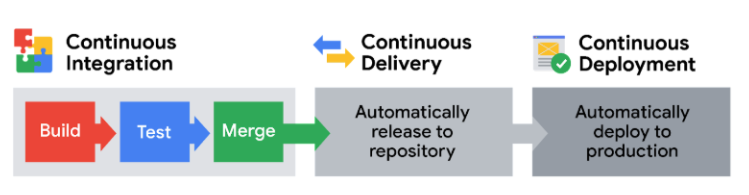

# Fallos en el sistema

## Bienvenido al Módulo 3
- ​Cuando comenzamos nuestro viaje juntos, conocimos los tres ​componentes básicos de cada programa de Seguridad: activos, amenazas y vulnerabilidades.
- ​Nos centramos mucho en los activos desde el principio ​y en la amplia gama de cosas que los profesionales de Seguridad trabajan para proteger.
- Luego, centramos nuestra atención en un componente central de la seguridad de los activos: la ​protección de los activos.
- ​Aprendió sobre la importancia de proteger la información confidencial.
- ​También se enteró de algunos controles de Seguridad que protegen la información contra la ​pérdida o el robo.
- ​En la siguiente parte de nuestro viaje, ​nos centraremos en las vulnerabilidades.
- ​Cada recurso que protegemos tiene una serie de vulnerabilidades o defectos ​que debemos conocer.
- ​Mantenerse informado de estas cosas es una parte fundamental para proteger a las personas y ​las organizaciones de cualquier daño.
- ​En la siguiente parte del curso, ​comprenderá el proceso de administración de vulnerabilidades.
- ​En primer lugar, explorará un enfoque común para la administración de vulnerabilidades: ​el Modelo de defensa y profundidad.
- ​Luego, aprenderá cómo se documentan las vulnerabilidades en las ​bibliotecas en línea, como la lista CVE.
- ​Analizaremos las superficies de ataque que protegen los equipos de Seguridad.
- ​Y, por último, ampliará su mentalidad de atacante al explorar los ​vectores de ataque más comunes que los ciberdelincuentes intentan explotar.
- ​Los analistas de seguridad desempeñan un papel importante a la hora de identificar y ​corregir las vulnerabilidades de los sistemas.

---

## Gestión de vulnerabilidades
- ​Por cada recurso que hay que proteger, existen docenas de vulnerabilidades.
- ​Encontrar esas vulnerabilidades y ​corregirlas antes de que se conviertan en un problema es la clave para mantener un recurso a salvo.
- ​Recordemos que una vulnerabilidad es una debilidad que puede ser explotada por una amenaza.
- ​Esa palabra, puede, es una parte importante de esta descripción. ​¿Por qué es así? ​Explorémoslo juntos para saber más. 
- ​Imagínese que le entrego un documento importante y le pido que lo mantenga a salvo.
- ​¿Cómo lo haría? ​Algunos de ustedes podrían pensar primero en guardarlo bajo llave en un lugar seguro.
- ​Detrás de esto está el entendimiento de que, dado que los documentos pueden moverse con facilidad, ​son vulnerables al robo.
- Cuando se le ocurran otras vulnerabilidades, como que el papel se quema con facilidad o ​no resiste el agua, podría añadir otras protecciones.
- ​De forma similar a este ejemplo, los Equipos de Seguridad planifican la protección de ​recursos en función de sus vulnerabilidades y de cómo pueden ser explotadas.
- ​En seguridad, un exploit es una forma de aprovecharse de una vulnerabilidad.
- ​Además de encontrar vulnerabilidades, la planificación de la seguridad se basa mucho en pensar en exploits.
- ​Por ejemplo, hay ladrones que quieren causar daño.
- ​Las casas tienen sistemas vulnerables que pueden ser explotados por un ladrón.
- Un ​ejemplo son las ventanas.
- El cristal es vulnerable a la rotura.
- ​Un ladrón puede explotar esta vulnerabilidad utilizando una piedra para romper la ventana.
- ​Pensar en esta vulnerabilidad y explotarla con antelación nos permite planificar con antelación.
- ​Podemos tener instalado un sistema de alarma para ahuyentar al ladrón y alertar a la policía.
- ​Los equipos de seguridad dedican mucho tiempo a encontrar vulnerabilidades y ​pensar en cómo pueden ser explotadas.
- ​Lo hacen con el proceso conocido como gestión de vulnerabilidades.
- ​La gestión de vulnerabilidades es el proceso de encontrar y parchear vulnerabilidades.
- ​La gestión de vulnerabilidades ayuda a mantener los activos a salvo.
- ​Es un método para detener amenazas antes de que puedan convertirse en un problema.
- La gestión de vulnerabilidades es un proceso de cuatro pasos.
   - ​El primer paso es identificar vulnerabilidades.
   - ​El siguiente paso es considerar potenciales exploits de esas vulnerabilidades.
   - ​El tercero es preparar defensas contra amenazas.
   - Y, por último, ​el cuarto paso es evaluar esas defensas.
- ​Cuando termina el último paso, el proceso vuelve a empezar.
- ​La gestión de vulnerabilidades se produce en un ciclo.
- ​Es una parte habitual de lo que hacen los equipos de seguridad ​porque siempre hay nuevas vulnerabilidades de las que preocuparse.
- ​Por eso precisamente es útil contar con un conjunto diverso de perspectivas.
- ​Contar con una amplia gama de antecedentes y ​experiencias no hace sino reforzar los equipos de seguridad y su capacidad para encontrar exploits.
- ​Sin embargo, ni siquiera los equipos de Seguridad grandes y diversos pueden estar al tanto de todo.
- ​Continuamente se descubren nuevas vulnerabilidades.
- ​Se conocen como exploits de Día cero.
- ​Un Día cero es un exploit que antes era desconocido.
- ​El término Día cero se refiere al hecho de que el exploit está ocurriendo en tiempo real ​con cero días para solucionarlo.
- ​Este tipo de exploits son peligrosos.
- ​Representan amenazas que aún no se han planificado.
- ​Por ejemplo, podemos anticiparnos a la posibilidad de que un ladrón entre en nuestra casa.
- ​Podemos planificar este tipo de amenaza teniendo defensas preparadas, ​como cerraduras en las puertas y ventanas.
- ​Un exploit de Día cero sería algo totalmente inesperado, ​como que la cerradura de la puerta se caiga por el intenso calor.
- ​Los exploits de Día cero son cosas que normalmente no se nos ocurren.
- ​Por ejemplo, podría tratarse de una nueva forma de software espía que infecta un sitio web popular.
- ​Cuando se producen los exploits de Día cero, ​pueden dejar los activos aún más vulnerables a las amenazas de lo que ya son.
- ​La gestión de vulnerabilidades es el proceso de encontrar vulnerabilidades y solucionar sus exploits.
- ​Por eso el proceso se lleva a cabo regularmente en la mayoría de las organizaciones.
- ​Quizás el paso más importante del proceso sea identificar las vulnerabilidades.

---

## Vulnerabilidades de CI/CD
- Proteja su canal de software: Seguridad CI/CD
   - Partiendo de su conocimiento de la gestión de vulnerabilidades, esta lectura se centra en un área crítica del desarrollo de software moderno: Las canalizaciones CI/CD.
   - Del mismo modo que las organizaciones evalúan regularmente sus sistemas en busca de debilidades, los conductos de CI/CD, que automatizan el proceso de publicación de software, también requieren una gestión rigurosa de las vulnerabilidades.
   - Esta lectura explorará las vulnerabilidades específicas dentro de las canalizaciones CI/CD y cómo aplicar los principios de gestión de vulnerabilidades para asegurarlas, garantizando un proceso de entrega de software robusto y seguro.
   - Las canalizaciones de integración continua, entrega continua y despliegue continuo (CI/CD) son esenciales para el desarrollo de software moderno.
   - Ayudan a los equipos a entregar software de forma más rápida y eficiente.
   - Pero, como cualquier herramienta potente, las canalizaciones CI/CD también pueden introducir riesgos de seguridad si no se gestionan adecuadamente.
   - En esta guía, explorará las vulnerabilidades más comunes en los procesos CI/CD.
   - Aprenderá por qué es crucial proteger estas canalizaciones y cómo integrar prácticas de seguridad para construir un proceso de desarrollo de software sólido y seguro.
   - Al comprender estas vulnerabilidades e implementar las mejores prácticas, puede transformar su canal de CI/CD en un componente clave de su estrategia de ciberseguridad.

- ¿Qué es CI/CD y por qué es importante?
   - CI/CD automatiza todo el proceso de publicación de software, desde la creación del código hasta su despliegue.
   - Esta automatización es lo que permite a los equipos de desarrollo modernos ser ágiles y responder rápidamente a las necesidades de los usuarios.
   - Desglosemos las partes clave:
      - Integración continua (IC): Construir una base sólida
         - La integración continua (IC) consiste en fusionar con frecuencia los cambios de código de distintos desarrolladores en una ubicación central.
         - Esto activa procesos automatizados como la creación de software y la ejecución de pruebas.
         - La integración continua detecta los problemas mediante un proceso automatizado: cada vez que se integra el código, el sistema lo construye y lo prueba automáticamente.
         - Este ciclo de retroalimentación inmediata revela los problemas de integración en cuanto se producen.
         - CI ayuda a detectar los problemas de integración en una fase temprana, lo que se traduce en un código de mayor calidad.
         - Considérelo la base del proceso.
      - Entrega continua (CD): Listo para Publicar
         - La entrega continua significa que el código está siempre listo para ser distribuido a los usuarios.
         - Una vez superadas las pruebas automatizadas, el código se despliega automáticamente en un entorno de pruebas (un entorno de práctica) o se prepara para su publicación final.
         - Normalmente, sigue siendo necesario un paso de aprobación manual antes de pasar a producción, lo que proporciona un punto de control.
      - Despliegue continuo (CD): Lanzamientos totalmente automatizados
         - La implantación continua automatiza todo el proceso de publicación.
         - Los cambios que superan todas las comprobaciones automatizadas se despliegan automáticamente en el entorno de producción, sin aprobación manual.
         - Se trata de velocidad y eficacia.

- Ventajas de seguridad de la entrega e implantación continuas
   - Quizá se pregunte cómo encaja la seguridad en toda esta automatización.
   - La buena noticia es que la entrega y el despliegue continuos pueden mejorar la seguridad.
   - La entrega y el despliegue continuos le permiten incorporar comprobaciones de seguridad directamente en el proceso de despliegue.
   - De este modo se garantiza que sólo se publiquen versiones de software que hayan pasado un examen exhaustivo.
   - Estas comprobaciones de seguridad automatizadas pueden incluir
      - Pruebas dinámicas de seguridad de aplicaciones (DAST): Pruebas automatizadas que detectan vulnerabilidades en la ejecución de aplicaciones en entornos realistas.
      - Comprobaciones de cumplimiento de seguridad: Comprobaciones automatizadas que garantizan que el software cumple las normas y políticas de seguridad de su organización.
      - Validaciones de seguridad de la infraestructura: Comprobaciones que aseguran que los sistemas que alojan su software son seguros.

- Por qué es innegociable contar con canalizaciones de CI/CD seguras
   - La protección de los conductos de CI/CD no es opcional; es esencial.
   - Considere estos puntos:
      - Automatización segura:
         - CI/CD automatiza las tareas repetitivas: construcción, pruebas, despliegue.
         - Cuando la automatización se implementa de forma segura, se reducen los errores del trabajo manual, se agilizan los procesos y, lo que es más importante, se reducen los errores humanos que crean vulnerabilidades.
         - Sin embargo, la automatización insegura automatiza la introducción de vulnerabilidades a escala.
      - Mejora de la calidad del código mediante comprobaciones de seguridad:
         - Las pruebas automatizadas en CI/CD comprueban rigurosamente el código antes de su publicación.
         - Esto incluye pruebas de seguridad automatizadas.
         - Esto conduce a menos errores y debilidades de seguridad en el software final, pero sólo si las pruebas de seguridad se integran eficazmente en el proceso.
      - Menor tiempo de comercialización de las actualizaciones de seguridad:
         - CI/CD acelera las versiones.
         - Esto permite una entrega más rápida de nuevas funciones, correcciones de errores y actualizaciones de seguridad, mejorando el tiempo de respuesta tanto a las necesidades de los usuarios como a las amenazas de seguridad.
         - Este rápido despliegue de actualizaciones de seguridad es una importante ventaja de seguridad de un canal de CI/CD bien protegido.
      - Colaboración y retroalimentación mejoradas con enfoque de seguridad:
         - CI/CD fomenta la colaboración entre los equipos de desarrollo, seguridad, pruebas y operaciones.
         - Los rápidos ciclos de retroalimentación ayudan a identificar y resolver las vulnerabilidades en una fase temprana del desarrollo.
         - Este entorno de colaboración es esencial para integrar la seguridad en el proceso y abordar las vulnerabilidades de forma proactiva.
      - Riesgo reducido:
         - las versiones frecuentes y más pequeñas, resultado de CI/CD, son menos arriesgadas que las versiones grandes y poco frecuentes.
         - Si surgen problemas (incluidos los de seguridad), es más fácil localizarlos y solucionarlos.
         - Esto también se aplica a las vulnerabilidades de seguridad;
         - las versiones más pequeñas y frecuentes limitan el impacto potencial de un fallo de seguridad introducido en una sola versión, siempre que la supervisión y las pruebas de seguridad sigan siendo continuas.
   - En esencia, CI/CD es el motor del desarrollo ágil de software moderno.
   - Permite una entrega de software fiable, eficiente y con capacidad de respuesta.
   - Sin embargo, un proceso CI/CD inseguro puede convertirse en un importante punto de entrada para las vulnerabilidades.

- Vulnerabilidades comunes de las canalizaciones CI/CD: De qué hay que cuidarse
   - Conocer los beneficios de CI/CD es sólo la mitad de la batalla.
   - También es necesario comprender las posibles debilidades de seguridad.
   - He aquí algunas vulnerabilidades comunes a tener en cuenta:
      - Dependencias inseguras: Riesgos del código de terceros
         - Los procesos de CI/CD suelen utilizar muchas bibliotecas y componentes de terceros.
         - Si estos componentes tienen vulnerabilidades conocidas (Vulnerabilidades y exposiciones comunes, o CVE), esas vulnerabilidades pueden añadirse sin saberlo a su aplicación durante el proceso de compilación automatizado.
         - Paso a seguir: Analice y actualice regularmente sus dependencias.
         - Asegúrese de que utiliza versiones seguras de todos los componentes externos.
      - Permisos mal configurados: Control de acceso
         - Controles de acceso débiles en herramientas CI/CD, repositorios de código y sistemas relacionados son una vulnerabilidad significativa.
         - Acceso no autorizado puede permitir a los atacantes modificar código, configuraciones de canalización, o inyectar contenido malicioso.
         - Paso a seguir: Implantar una sólida gestión de accesos mediante el control de acceso basado en roles (RBAC).
         - Asegúrese de que sólo las personas autorizadas pueden acceder a los elementos críticos de las canalizaciones y modificarlos.
      - Falta de pruebas de seguridad automatizadas: Omisión de comprobaciones críticas
         - No incluir pruebas de seguridad automatizadas en su proceso CI/CD es un grave error.
         - Sin herramientas como SAST y DAST, está casi garantizado que publicará software lleno de vulnerabilidades que pasarán desapercibidas hasta después de que se publique, lo que conllevará costes y esfuerzos significativamente mayores para solucionarlo...
         - Paso a seguir: Integre las pruebas de seguridad automatizadas (SAST y DAST) en su proceso CI/CD.
         - Esto debería ser una parte esencial de su estrategia segura de CI/CD.
      - Secretos expuestos: Proteger la información sensible
         - La codificación de datos sensibles como claves de API, contraseñas y tokens directamente en el código o en la configuración del canal es un grave error de seguridad.
         - Si se exponen, estos secretos pueden dar lugar a importantes brechas de seguridad.
         - Paso a seguir: Nunca codifique secretos.
         - Utilice bóvedas seguras o herramientas de gestión de secretos específicas para almacenar y gestionar la información confidencial.
         - Aplique esta práctica en todo su equipo.
      - Entornos de compilación inseguros: Protección de la infraestructura de canalización
         - El propio entorno de CI/CD (los servidores y sistemas que ejecutan su canalización) debe ser seguro.
         - Si este entorno es vulnerable, los atacantes pueden comprometerlo para alterar las compilaciones, inyectar código malicioso o robar datos confidenciales.
         - Medida: Refuerce sus entornos de compilación.
         - Utilice contenedores o máquinas virtuales seguros para minimizar el riesgo de que el proceso se vea comprometido.

- Creación de un canal de CI/CD seguro: Defensa en profundidad
   - Para abordar estas vulnerabilidades de forma proactiva, es fundamental adoptar un enfoque de seguridad por capas.
   - Estas son las mejores prácticas esenciales para su estrategia de seguridad CI/CD:
      - Integrar la seguridad desde el principio:
         - Adopte DevSecOps: Adopte una mentalidad DevSecOps.
         - Esto significa integrar la seguridad en todas las fases del desarrollo, desde la planificación hasta la implantación y más allá.
         - Esto incluye, naturalmente, la integración de controles de seguridad en su proceso CI/CD.
      - Controles de acceso estrictos:
         - Utilice políticas de permisos estrictas basadas en el principio de privilegio mínimo.
         - Conceda únicamente el acceso necesario al código, los ajustes de la canalización y las configuraciones de implantación.
         - Utilice herramientas como la Autenticación de múltiples factores (MFA) y el Control de acceso basado en roles (RBAC) para proteger su entorno de CI/CD.
      - Automatice las pruebas de seguridad en todas partes:
         - Convierta los análisis y pruebas de seguridad automatizados en una parte fundamental de su proceso de creación y despliegue.
         - Herramientas como SAST, Software Composition Analysis (SCA) y DAST no son extras opcionales, sino que son esenciales para un proceso de CI/CD seguro que le permita detectar las vulnerabilidades en una fase temprana.
      - Mantenga actualizadas las dependencias:
         - Mantenga un inventario actualizado de todas las dependencias, bibliotecas y complementos de CI/CD de terceros.
         - Actualice periódicamente estos componentes para corregir las vulnerabilidades de seguridad (CVE).
         - Herramientas como Dependabot y Snyk pueden automatizar la gestión de dependencias.
      - Gestión segura de secretos:
         - Nunca codifique información confidencial en su código o configuraciones de canalización.
         - Exija el uso de herramientas dedicadas de gestión de secretos como HashiCorp Vault o AWS Secrets Manager.
         - Almacene, acceda y rote los secretos de forma segura durante todo el proceso de CI/CD.

- Conclusión: CI/CD seguro - Software seguro
   - Al abordar proactivamente estas vulnerabilidades comunes e implementar las mejores prácticas de seguridad en su canal de CI/CD, sus equipos de software pueden crear y publicar aplicaciones con una postura de seguridad significativamente más fuerte.
   - Una base segura de CI/CD es crucial para minimizar los riesgos de seguridad y crear una estrategia de seguridad general más resistente para sus aplicaciones e infraestructura.
- Recursos
   - [DevSecOps usando acciones de GitHub: Building Secure CI/CD Pipelines](https://medium.com/@rahulsharan512/devsecops-using-github-actions-building-secure-ci-cd-pipelines-5b6d59acab32)
   - [6 pasos para tener éxito con CI/CD Securing Hardening](https://spectralops.io/blog/ci-cd-security-hardening/)
   - [GitLab CI/CD - Laboratorio práctico: Securing Scanning](https://handbook.gitlab.com/handbook/customer-success/professional-services-engineering/education-services/gitlabcicdhandsonlab9/)
   - [¿Cómo puede mantenerse al día con las últimas técnicas de resolución de problemas en la computación en la nube como gerente](https://www.linkedin.com/advice/1/how-can-you-stay-current-latest-problem-solving-msk5e)

---

## Estrategia de defensa en profundidad
- ​Una defensa en capas es difícil de penetrar.
- ​Cuando una barrera falla, ​otra ocupa su lugar para detener un ataque. 
- La defensa en profundidad es ​un Modelo de Seguridad que hace uso de este concepto.
- ​Es un enfoque en capas de la ​gestión de vulnerabilidades que reduce el riesgo.
- ​La defensa en profundidad se conoce comúnmente como ​el enfoque del castillo porque ​se asemeja a las defensas en capas de un castillo.
- ​En la Edad Media, ​estas estructuras eran muy difíciles de penetrar.
- ​Presentaban diferentes defensas, ​cada una única en su diseño, que ​ponían diferentes retos a los atacantes.
- ​Por ejemplo, una barrera llena de agua ​llamada foso solía formar ​un círculo alrededor del castillo, impidiendo que amenazas como ​grandes grupos de atacantes alcanzaran los muros del castillo.
- ​Los pocos soldados que lograban pasar la primera capa de ​defensa se enfrentaban entonces a ​un nuevo reto, unos gigantescos muros de piedra.
- ​Una vulnerabilidad de estas estructuras ​era que se podían escalar.
- ​Si los atacantes intentaban explotar esa debilidad, ¿adivinen qué? ​¡Se encontraban con otra capa de defensa, ​torres de vigilancia, repletas de defensores ​listos para disparar flechas e impedir que escalaran!
- ​Cada nivel de defensa de ​estas estructuras medievales minimizaba el riesgo de ​ataques identificando vulnerabilidades e ​implementando un control de seguridad en caso de que un sistema fallara.
- ​La defensa en profundidad funciona de forma similar. 
- ​El concepto de defensa en profundidad ​puede utilizarse para proteger cualquier recurso.
- ​Se utiliza principalmente en ciberseguridad para proteger ​información utilizando un diseño de cinco capas. 
- Cada capa incluye una serie de controles de seguridad que ​protegen la información a medida que ​entra y sale del Modelo.
- ​La primera capa de defensa en ​profundidad es la capa perimetral.
   - ​Esta capa incluye algunas tecnologías ​que ya hemos explorado, ​como nombres de usuario y contraseñas.
   - ​Principalmente, se trata de ​una capa de autenticación de usuarios que filtra el acceso externo.
   - ​Su función es sólo permitir el acceso a ​socios de confianza para llegar a la siguiente capa de defensa.
- ​En segundo lugar, la capa de red está más ​estrechamente alineada con la autorización.
   - ​La capa de red está formada por ​otras tecnologías como los firewalls de red y otras.
- ​A continuación, está la capa de punto final (endpoint).
   - ​Los puntos finales se refieren a los dispositivos ​que tienen acceso en una red.
   - ​Pueden ser dispositivos como un portátil, ​un ordenador de sobremesa o un servidor.
   - ​Algunos ejemplos de tecnologías que protegen ​estos dispositivos son el software antivirus.
- ​Después, llegamos a la capa de aplicación.
   - ​Esta incluye todas las interfaces ​que se utilizan para interactuar con la tecnología.
   - ​En esta capa, las medidas de seguridad se ​programan como parte de una aplicación.
   - ​Un ejemplo común es la autenticación de múltiples factores.
   - ​Puede que le resulte familiar tener que introducir ​tanto su contraseña como un código enviado por SMS.
   - ​Esto forma parte de la capa de aplicación de defensa.
- ​Y, por último, la quinta capa de defensa es la capa de datos.
   - ​En esta capa, hemos llegado a ​los datos críticos que deben protegerse, ​como la información de identificación personal.
   - ​Un control de seguridad que es importante aquí en ​esta capa final de defensa es la clasificación de los activos.
- Como he mencionado antes, ​la información entra y sale de cada una de ​estas cinco capas siempre que se intercambia a través de una red.
- ​Hay muchos más Controles de seguridad aparte de los pocos ​que he mencionado que forman parte ​del modelo de defensa en profundidad.
- ​Muchas empresas diseñan ​sus sistemas de Seguridad utilizando el Modelo de defensa en profundidad.
- ​Es de esperar que la comprensión de este framework ​le dé una mejor idea de cómo ​funcionan ​conjuntamente los Controles de seguridad de una organización para proteger los recursos importantes. 