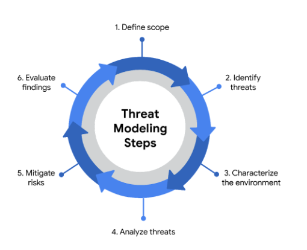

# Modelado de amenazas

## Un enfoque proactivo de la seguridad
- ​Prepararse para ​los ataques es una tarea importante de la que es responsable todo el equipo de Seguridad.
- ​Los actores de Amenazas tienen muchas herramientas que pueden utilizar en función de su objetivo.
- ​Por ejemplo, ​atacar a una pequeña empresa puede ser diferente de atacar a una empresa de servicios públicos.
- ​Cada uno tiene diferentes activos y defensas específicas para mantenerlos a salvo.
- ​En todos los casos, anticiparse a los ataques es la clave para prepararse para ellos.
- ​En Seguridad, lo hacemos realizando una actividad conocida como modelado de amenazas.
- ​El modelado de amenazas es un proceso de identificación de los activos, ​sus vulnerabilidades y la forma en que cada uno está expuesto a las amenazas.
- ​Aplicamos modelos de amenazas a todo lo ​que protegemos.
- ​Todos los sistemas, aplicaciones o procesos empresariales completos se examinan desde esta perspectiva relacionada con la seguridad.
- ​La creación de modelos de amenazas es una actividad larga y detallada.
- Por ​lo general, son realizados por un grupo de personas con años de experiencia en ​el campo.
- ​Por eso, se considera una habilidad avanzada en Seguridad.
- ​Sin embargo, eso no significa que no vayas a participar.
- ​Hay varios marcos de modelado de amenazas que se utilizan en el campo.
- ​Algunas son más adecuadas para la Seguridad de la red.
- Otras son mejores para ​cosas como la Seguridad de la información o el desarrollo de aplicaciones.
- ​En general, hay seis pasos en un modelo de amenazas.
- ​La primera consiste en definir el alcance del modelo.
   - ​En esta etapa, el equipo determina lo que está creando creando ​un inventario de activos y clasificándolos.
- ​El segundo paso es identificar las amenazas.
   - ​Aquí, el equipo define a todos los posibles actores de amenazas.
   - ​Un actor de amenazas es cualquier persona o grupo que presenta un riesgo de Seguridad.
   - ​Los actores de amenazas se caracterizan por ser internos o externos.
   - ​Por ejemplo, un actor de amenazas internas podría ser un empleado ​que expone intencionalmente un recurso a daños.
   - ​Un ejemplo de un actor de amenazas externo podría ser un hacker malintencionado o ​una empresa competidora.
   - ​Una vez identificados los actores de la amenaza, ​el equipo crea lo que se conoce como un árbol de ataques.
   - ​Un árbol de ataques es un diagrama que mapea las amenazas a los activos.
   - ​El equipo trata de ser lo más detallado posible al construir ​este diagrama antes de continuar.
- El ​tercer paso del proceso de modelado de amenazas consiste en caracterizar el entorno.
   - ​Aquí, el equipo aplica una mentalidad de atacante a la empresa.
   - ​Consideran la forma en que los clientes y los empleados interactúan con el entorno.
   - ​Otros factores que tienen en cuenta son los socios externos y los proveedores de terceros.
- ​En el paso cuatro, su objetivo es analizar las amenazas.
   - ​Aquí, el equipo trabaja en conjunto para examinar las protecciones existentes e identificar las brechas.
   - ​Luego clasifican las amenazas según la puntuación de riesgo que asignan.
- ​Durante el paso cinco, el equipo decide cómo mitigar el riesgo.
   - ​En este punto, el grupo crea su plan para defenderse de las amenazas.
   - ​Las opciones aquí son evitar el riesgo, transferirlo, reducirlo o aceptarlo.
- ​El sexto y último paso es evaluar los hallazgos.
   - ​En esta etapa, se documenta todo lo que se hizo durante el ejercicio ​, se aplican las correcciones y el equipo toma nota de los éxitos obtenidos.
   - ​También registran las lecciones aprendidas para ​poder informar sobre cómo abordan los modelos de amenazas futuros.
- ​Esta es una descripción general del proceso general de modelado de amenazas.

---

## Identificar: Pasos del proceso del modelo de amenaza
- Apply your knowledge of the threat modeling process by putting the six steps of the process in the correct

1. Step 1: Define the scope
2. Step 2: Identify threats
3. Step 3: Characterize the environment
4. Step 4: Analyze threats
5. Step 5: Mitigate risk
6. Step 6: Evaluate findings

---

## Chantelle: El valor de la diversidad en la ciberseguridad
- ​Protegemos y supervisamos ​los sistemas que contienen información confidencial.
- ​Mi interés por la ciberseguridad ​proviene de un programa de televisión llamado Mr ​. Robot.
- Se trata de un hacker vigilante ​que intenta salvar el mundo.
- ​Y a partir de ahí, eso despertó mi interés por la Seguridad, ​y esa es una gran base.
- ​Valorar la diversidad en Seguridad es importante ​porque estamos expuestos a una amplia gama de ideas.
- ​Eso ayuda a inspirar muchas ideas creativas y ​diferentes perspectivas y diferentes formas ​de abordar un problema y, en ​cierto modo, nos lleva a ​convertirnos en mejores ingenieros de Seguridad.
- ​Nuestra gerente, Laureen, siempre interviene para decirnos ​: «No se apresure a encontrar una solución. ​No se apresure a resolver los problemas por sí mismos».
- ​Tenemos una amplia gama de ​ingenieros de Seguridad y contactos a nuestra disposición, ​y ella nos anima a salir a buscarlos y, ​luego, a volver y, luego, a hacer que nos adaptemos e ​intercambiemos ideas sobre todas estas ideas que hemos ​recopilado después de salir e intentar encontrarlas.
- ​En última instancia, casi siempre hemos ​obtenido el mejor resultado posible ​que se nos ocurre.
- ​Mi consejo para que las personas ingresen a ​la industria es que salgan y sean proactivas.
- ​Definitivamente recomiendo unirse ​a la comunidad de Seguridad en Twitter.
- ​Hay una enorme comunidad de Seguridad en Twitter ahora mismo.
- ​Eso comparte un montón de recursos ​, oportunidades y puestos de trabajo ​y, definitivamente, está abierto a hablar con ​cualquier persona que esté interesada en entrar en el campo ​pero que no sepa cómo hacerlo.
- Recomiendo la Seguridad como profesión.
- ​Definitivamente, creo que, personalmente, ​pude aprovechar mucho mi bando rebelde en materia de Seguridad.
- ​Descubrí que podía ​expresarme un poco más en Seguridad. 

---

## PASTA: Proceso de simulación de ataques y análisis de amenazas
- ​Terminemos de explorar el modelado de amenazas echando un vistazo a los escenarios del mundo real.
- ​Esta vez, utilizaremos un proceso de modelado de amenazas estándar llamado PASTA.
- ​Imagina que una empresa de acondicionamiento físico se prepara para lanzar su primera aplicación para dispositivos móviles: aplicación para dispositivos móviles.
- ​Antes de que podamos ponerla en marcha, ​la empresa pide a su equipo de Seguridad que se asegure de que la aplicación proteja los datos de los clientes.
- ​El equipo decide realizar un Modelo de amenazas utilizando el marco PASTA.
- ​PASTA es un framework popular de modelado de amenazas que se utiliza en muchos ​sectores.
- ​PASTA es la abreviatura de Proceso para la Simulación de Ataques y el Análisis de Amenazas.
- El ​marco PASTA framework consta de siete etapas.
- La ​primera etapa del marco del Modelo de amenazas PASTA consiste en definir ​los objetivos empresariales y de Seguridad.
   - ​Antes de iniciar el modelo de amenazas, el equipo debe decidir cuáles son sus objetivos.
   - ​El objetivo principal de nuestro ejemplo con la aplicación de una empresa de acondicionamiento físico es ​proteger los datos de los clientes.
   - ​El equipo comienza haciendo muchas preguntas en esta etapa.
   - ​Deberán entender cosas como la forma en que ​se maneja la información de identificación personal.
   - ​Responder a estas preguntas es clave para evaluar el impacto ​de las amenazas que encontrarán en el camino.
- La ​segunda etapa del marco PASTA consiste en definir el alcance técnico.
   - ​En este caso, el objetivo del equipo es identificar los componentes de la aplicación que deben ​evaluarse.
   - ​Esto es lo que mencionamos anteriormente como la superficie de ataque.
   - En el caso de ​una aplicación móvil: aplicación para dispositivos móviles, ​esto incluirá la tecnología que interviene mientras los datos están en reposo y en uso.
   - ​Esto incluye protocolos de red, controles de Seguridad y otras interacciones de datos.
- ​En la tercera fase de PASTA, el trabajo del equipo consiste en descomponer la aplicación. 
   - En otras palabras, ​necesitamos identificar los controles existentes que protegerán los datos de los usuarios de las amenazas.
   - ​Esto normalmente significa trabajar con los desarrolladores de la aplicación para producir un ​diagrama de flujo de datos.
   - ​Un diagrama como este mostrará cómo los datos pasan del dispositivo de un usuario a la ​base de datos de la empresa.
   - ​También identificaría los controles establecidos para proteger estos datos a lo largo del camino.
- ​La cuarta etapa de PASTA es Next.
   - ​El objetivo aquí es realizar un análisis de amenazas.
   - ​Aquí es donde el equipo adquiere su mentalidad de atacante.
   - ​Aquí, se realizan investigaciones para recopilar la información más actualizada sobre el tipo de ​ataques que se utilizan.
   - ​Al igual que otras tecnologías, las aplicaciones móviles tienen muchos vectores de ataque.
   - ​Estos cambian con regularidad, por lo que el equipo consultaría los recursos para mantenerse actualizado.
- ​La quinta etapa de PASTA consiste en realizar un análisis de vulnerabilidad.
   - ​En esta etapa, el equipo investiga más a fondo ​las posibles vulnerabilidades teniendo en cuenta la raíz del problema.
- ​La siguiente es la sexta etapa de PASTA, en la que el equipo lleva a cabo modelos de ataque.
   - Aquí es donde el equipo prueba las vulnerabilidades que se analizaron ​en la etapa cinco simulando ataques.
   - ​Para ello, el equipo crea un árbol de ataque, que parece un diagrama de flujo.
   - ​Por ejemplo, un árbol de ataques para nuestra app para dispositivos móviles podría tener este aspecto.
   - ​La información de los clientes, como los nombres de usuario y las contraseñas, es un objetivo.
   - ​Estos datos normalmente se almacenan en una base de datos.
   - ​Hemos aprendido que las bases de datos son vulnerables a ataques como la inyección de SQL.
   - ​Así que agregaremos este vector de ataque a nuestro árbol de ataque.
   - ​Un actor de amenazas podría explotar las vulnerabilidades causadas por ​entradas no desinfectadas para atacar este vector.
   - ​El equipo de Seguridad usa árboles de ataque como este para identificar los vectores de ataque ​que deben probarse para validar las amenazas.
   - ​Esta es solo una rama de este árbol de ataque.
   - ​Una aplicación, como una aplicación de acondicionamiento físico, suele tener muchas ramas con ​otros vectores de ataque.
- ​La etapa siete de PASTA consiste en analizar el riesgo y el impacto.
   - ​Aquí, el equipo reúne toda la información que ha recopilado en ​las etapas uno a seis.
   - En ​esta etapa, el equipo está en condiciones de hacer ​recomendaciones informadas de gestión de riesgos a la parte interesada de la empresa que se alineen con sus objetivos.

---

## Características de un modelo de amenaza eficaz
- El modelado de amenazas es el proceso de identificación de los recursos, sus vulnerabilidades y el modo en que cada uno de ellos está expuesto a las amenazas.
- Es un enfoque estratégico que combina varias actividades de Seguridad, como la gestión de vulnerabilidades, el análisis de amenazas y la Respuesta ante incidentes.
- Los Equipos de Seguridad suelen realizar estos ejercicios para asegurarse de que sus sistemas están adecuadamente protegidos.
- Otro uso del modelado de amenazas es encontrar proactivamente formas de reducir los riesgos de cualquier sistema o proceso empresarial.
- Tradicionalmente, el Modelado de amenazas se asocia al Campo del desarrollo de aplicaciones.
- En esta lectura, aprenderá sobre los marcos comunes de Modelado de amenazas que se utilizan para diseñar software que pueda resistir ataques.
- También aprenderá sobre la creciente necesidad de Seguridad de las aplicaciones y las formas en las que puede participar.

- Por qué es importante la Seguridad de las aplicaciones
   - Las aplicaciones se han convertido en una parte esencial del éxito de muchas organizaciones.
   - Por ejemplo, las aplicaciones basadas en la web permiten a los clientes de cualquier parte del mundo conectar con las empresas, sus socios y otros clientes.
   - Las aplicaciones móviles también han cambiado la forma en que las personas acceden al mundo digital.
   - Los teléfonos inteligentes son a menudo la principal vía de intercambio de Datos entre los usuarios y una empresa.
   - El volumen de datos que procesan las aplicaciones hace que su seguridad sea clave para reducir el riesgo para todos los que están conectados.
   - Por ejemplo, supongamos que una aplicación utiliza bibliotecas de registro basadas en Java con la vulnerabilidad [Log4Shell (CVE-2021-44228)](https://nvd.nist.gov/vuln/detail/CVE-2021-44228).
   - Si no se parchea, esta vulnerabilidad puede permitir la ejecución remota de código que un atacante puede utilizar para obtener acceso completo a su sistema desde cualquier parte del mundo.
   - Si se explota, una vulnerabilidad crítica como ésta puede afectar a millones de dispositivos.

- Defensa de la capa de aplicación
   - La defensa de la capa de aplicación requiere pruebas adecuadas para descubrir los puntos débiles que pueden provocar riesgos.
   - El Modelado de amenazas es una de las principales formas de garantizar que una aplicación cumple los requisitos de Seguridad.
   - Un Equipo DevSecOps, siglas de desarrollo, seguridad y operaciones, suele realizar estos análisis.
   - Un proceso típico de Modelado de amenazas se realiza en un ciclo:
      - Definir el Alcance
      - Identificar las amenazas
      - Caracterizar el entorno
      - Analizar las amenazas
      - Mitigar riesgos
      - Evaluar los resultados

- Idealmente, el Modelado de amenazas debería realizarse antes, durante y después del desarrollo de una aplicación.
- Sin embargo, llevar a cabo un análisis exhaustivo del software requiere tiempo y Recursos.
- Debe evaluarse todo, desde la arquitectura de la aplicación hasta sus fines empresariales.
- Por ello, a lo largo de los años se han desarrollado varios marcos de Modelado de amenazas para facilitar el proceso.
- El Modelado de amenazas debe incorporarse en cada etapa del ciclo de vida de desarrollo del software, o SDLC.

- Marcos comunes
   - A la hora de realizar el Modelado de amenazas, existen múltiples métodos que se pueden utilizar, como:
      - STRIDE
      - PASTA
      - Trike
      - VAST
   - Las organizaciones pueden utilizar cualquiera de ellos para recopilar información y tomar decisiones para mejorar su postura de Seguridad.
   - En última instancia, el Modelo "correcto" depende de la situación y de los tipos de riesgos a los que pueda enfrentarse una aplicación.

- STRIDE
   - STRIDE es un framework de Modelado de amenazas desarrollado por Microsoft.
   - Se utiliza habitualmente para identificar vulnerabilidades en seis vectores de ataque específicos.
   - El acrónimo representa cada uno de estos vectores: suplantación de identidad, manipulación, repudio, revelación de información, denegación de servicio y elevación de privilegios.

- PASTA
   - El Proceso de Simulación de Ataques y Análisis de Amenazas (PASTA) es un proceso de Modelado de Amenazas centrado en el Riesgo desarrollado por dos líderes de OWASP y apoyado por una empresa de ciberseguridad llamada VerSprite.
   - Su principal objetivo es descubrir pruebas de amenazas viables y representar esta información como un Modelo.
   - El diseño basado en pruebas de PASTA puede aplicarse al modelado de amenazas de una aplicación o del entorno que soporta dicha aplicación.
   - Su proceso de siete etapas consta de varias actividades que incorporan artefactos de seguridad relevantes del entorno, como los informes de evaluación de vulnerabilidades.

- Trike
   - Trike es una metodología y una herramienta de código abierto que adopta un enfoque centrado en la Seguridad para el modelado de amenazas.
   - Se suele utilizar para centrarse en los permisos de seguridad, los casos de uso de las aplicaciones, los modelos de privilegios y otros elementos que sustentan un entorno seguro.

- VAST
   - El framework de Modelado de Amenazas Visual, Ágil y Sencillo (VAST) forma parte de una plataforma automatizada de modelado de amenazas llamada ThreatModeler®.
   - Muchos equipos de Seguridad optan por utilizar VAST como forma de automatizar y agilizar sus evaluaciones de modelado de amenazas.

- Participar en el Modelado de amenazas
   - El Modelado de amenazas suele ser realizado por profesionales de la Seguridad experimentados, pero casi nunca se hace en solitario.
   - Esto es especialmente cierto cuando se trata de la seguridad de las aplicaciones.
   - Los Programas son sistemas complejos responsables de manejar muchos Datos y procesar una gran variedad de órdenes de usuarios y otros sistemas.
   - Una de las claves del Modelado de amenazas es formular las preguntas adecuadas:
      - ¿En qué estamos trabajando?
      - ¿Qué tipo de cosas pueden salir mal?
      - ¿Qué estamos haciendo al respecto?
      - ¿Lo hemos abordado todo?
      - ¿Hemos hecho un buen trabajo?
- Lleva tiempo y práctica aprender a trabajar con cosas como diagramas de flujo de datos y árboles de ataque.
- Sin embargo, cualquiera puede aprender a ser un modelador de amenazas eficaz.
- Independientemente de su nivel de experiencia, participar en uno de estos ejercicios siempre empieza simplemente por hacerse las preguntas adecuadas.

---

## Explorar: Aplicar PASTA al modelo de amenazas de una aplicación
- A designer clothing store has a new shopping app to drive sales. Improve the security of the app by performing a threat analysis using the PASTA framework.

- Remaining: 7 - The team creates an attack tree and maps vulnerabilities to attack vectors.
> Stage 6: Conduct attack modeling. The team creates an attack tree and maps vulnerabilities to attack vectors.

- Remaining: 6 - The team more deeply investigates potential vulnerabilities related to the app.
> Stage 5: Perform a vulnerability analysis. The team more deeply investigates potential vulnerabilities related to the app.

- Remaining: 5 - The team determines the retailer wants their app to protect customer data.
> Stage 1: Define business and security objectives. The team determines the retailer wants their app to protect customer data.

- Remaining: 4 - The team analyzes all collected data and makes risk management recommendations.
> Stage 7: Analyze risk and impact. The team analyzes all collected data and makes risk management recommendations.