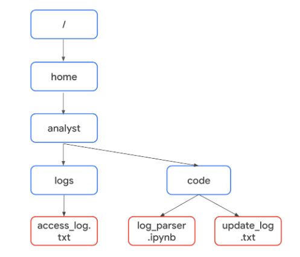

# Trabajar con archivos en Python

## Acceder a un archivo de texto en Python
- Los profesionales de la Seguridad a menudo tienen la tarea de revisar archivos de registro.
- ​Estos archivos pueden tener miles de entradas, ​por lo que puede ser útil automatizar este proceso, y ahí es donde Python entra en juego.
- ​Vamos a empezar importando un simple archivo de texto que sólo contenga unas pocas palabras y ​luego restaurarlo como una cadena en Python.
- ​Todo lo que necesitamos es el archivo de texto, su ubicación y las palabras clave Python adecuadas.
- ​Vamos a empezar escribiendo una sentencia "with".
- ​La palabra clave with maneja errores y gestiona recursos externos.
- ​Al usar with, Python sabe que debe liberar automáticamente recursos que ​de otro modo mantendrían nuestro sistema ocupado hasta que el programa termine de ejecutarse.
- ​Suele usarse en el manejo de archivos para ​cerrar automáticamente un archivo después de leerlo.
- ​Para abrir archivos y luego leerlos, escribimos una sentencia que ​comienza con la palabra clave with.
- A continuación, utilizamos la función open(). ​Open() es una función que abre un archivo en Python.
- ​El primer parámetro es el nombre del archivo de texto en su computadora o ​un enlace a él en Internet.
- ​Dependiendo del entorno de Python, ​puede que también necesite incluir una ruta a este archivo.
- ​Recuerde incluir la extensión .txt en el nombre del archivo.
- ​Ahora hablemos del segundo parámetro.
- ​Este parámetro de la función open() indica a Python lo que queremos hacer con el archivo.
- ​En nuestro caso, queremos leer un archivo, por lo que utilizamos la letra "r" entre comillas.
- ​Si quisiéramos escribir en un archivo, sustituiríamos esta "r" por una "w".
- ​Pero aquí, nos estamos centrando en la lectura.
- ​Por último, file es una variable que contiene ​la información del archivo siempre que estemos dentro de la sentencia with.
- ​Al igual que con otros tipos de sentencias, terminamos nuestra sentencia with con dos puntos.
- ​El código que viene después de los dos puntos le dirá a Python qué hacer con ​el contenido del archivo.
- ​Vayamos a Python y utilicemos lo que hemos aprendido.
- ​Estamos listos para abrir un archivo de texto en Python.
- ​Ahora escribiremos nuestra sentencia with.
- ​A continuación, utilizaremos el método de lectura incorporado de Python.
- ​El método de lectura convierte los archivos en cadenas.
- ​Ahora volvamos a nuestra sentencia with.
- ​Similar a un bucle for, las sentencias with comienzan una sangría en la línea siguiente.
- ​Esto le dice a Python que este código está ocurriendo dentro de la sentencia with.
- ​Dentro de la sentencia, vamos a usar la función read() para convertir ​nuestro archivo en una cadena y almacenarla dentro de una nueva variable.
- ​Esta nueva variable puede usarse fuera de la sentencia with.
- ​Así que salgamos de la sentencia with eliminando la indentación e ​imprimamos la variable.
- ​¡Perfecto! La cadena del texto se imprime.

---

## Importar archivos a Python
- Trabajar con archivos en ciberseguridad
   - Los analistas de Seguridad pueden necesitar acceder a una variedad de archivos cuando trabajan en Python.
   - Muchos de estos archivos serán registros.
   - Un registro A es un registro de los eventos que ocurren dentro de los sistemas de una organización.
   - Por ejemplo, puede haber un registro que contenga información sobre los intentos de inicio de sesión.
   - Esto podría utilizarse para identificar una actividad inusual que señale los intentos realizados por un actor malicioso para acceder al sistema.
   - Como otro ejemplo, los actores maliciosos que hayan accedido al sistema podrían ser capaces de atacar aplicaciones de software.
   - Un analista puede necesitar acceder a un registro que contenga información sobre aplicaciones de software que estén experimentando problemas.

- Abrir archivos en Python
   - Para abrir un archivo llamado "update_log.txt" en Python con el fin de leerlo, puede incorporar la siguiente línea de código:
      - `with open("update_log.txt", "r") as file:`
   - Esta línea consta de la palabra clave with, la función open() con sus dos parámetros, y la palabra clave as seguida de un nombre de variable.
   - Debe colocar dos puntos (:) al final de la línea.

- with
   - La palabra clave with maneja errores y gestiona recursos externos cuando se utiliza con otras funciones.
   - En este caso, se utiliza con la función open() para abrir un archivo.
   - A continuación, gestionará los recursos cerrando el archivo tras salir de la sentencia with.
   - También puede utilizar la función open() sin la palabra clave with.
   - Sin embargo, debe cerrar el archivo que abrió para garantizar un manejo adecuado del mismo.

- open
   - La función open() abre un archivo en Python.
   - El primer parámetro identifica el archivo que desea abrir.
   - En la siguiente estructura de archivos, "update_log.txt" se encuentra en el mismo directorio que el archivo Python que accederá a él, "log_parser.ipynb":

   - Como están en el mismo directorio, sólo se requiere el nombre del archivo.
   - El código puede escribirse como with open("update_log.txt", "r") as file:.
   - Sin embargo, "access_log.txt" no está en el mismo directorio que el archivo Python "log_parser.ipynb".
   - Por lo tanto, es necesario especificar su ruta de archivo absoluta.
   - Una ruta de archivo es la ubicación de un archivo o directorio.
   - Una ruta de archivo absoluta comienza en el directorio de nivel más alto, el raíz.
   - En el código siguiente, el primer parámetro de la función open() incluye la ruta de acceso absoluta a "access_log.txt":
   - `with open("/home/analyst/logs/access_log.txt", "r") as file:`
   - En Python, los nombres de archivos o sus rutas de acceso pueden manejarse como datos de cadena, y como todos los datos de cadena, debe colocarlos entre comillas.
   - El segundo parámetro de la función open() indica lo que desea hacer con el archivo.
   - En estos dos ejemplos, el segundo parámetro es "r", que indica que desea leer el archivo.
   - Alternativamente, puede utilizar "w" si desea escribir en un archivo o "a" si desea anexar a un archivo.

- how
   - Cuando abra un archivo utilizando with open(), debe proporcionar una variable que pueda almacenar el archivo mientras se encuentra dentro de la sentencia with.
   - Puede hacerlo mediante la palabra clave as seguida de este nombre de variable.
   - La palabra clave as asigna una variable que hace referencia a otro objeto.
   - El código with open("update_log.txt", "r") as file: asigna file para referenciar la salida de la función open() dentro del bloque de código con sangría que le sigue.

- Lectura de archivos en Python
   - Después de utilizar el código with open("update_log.txt", "r") as file: para importar "update_log.txt" a la variable file, debe indicar qué hacer con el archivo en las líneas con sangría que le siguen.
   - Por ejemplo, este código utiliza el método .read() para leer el contenido del archivo:
   - [file](./resources/code/modulo-04_02-002.py)
   - El método .read() convierte los archivos en cadenas.
   - Esto es necesario para poder utilizar y mostrar el contenido del archivo que se ha leído.
   - En este ejemplo, la variable file se utiliza para generar una cadena del contenido del archivo a través de .read().
   - A continuación, esta cadena se almacena en otra variable llamada updates.
   - A continuación, print(updates) muestra la cadena.
   - Una vez leído el archivo en la cadena updates, puede realizar sobre ella las mismas operaciones que podría realizar con cualquier otra cadena.
   - Por ejemplo, podría utilizar el método .index() para devolver el índice donde aparece un determinado carácter o subcadena.
   - O bien, podría utilizar len() para devolver la longitud de esta cadena.

- Escribir archivos en Python
   - Los analistas de Seguridad también pueden necesitar escribir en archivos.
   - Esto podría ocurrir por una variedad de razones.
   - Por ejemplo, podrían necesitar crear un archivo que contenga los nombres de usuario aprobados en una nueva lista de permitidos.
   - O puede que necesiten editar archivos existentes para añadir datos o adherirse a políticas de normalización.
   - Para escribir en un archivo, deberá abrirlo con "w" o "a" como segundo argumento de open().
   - Deberá utilizar el argumento "w" cuando desee sustituir el contenido de un archivo existente.
   - Cuando trabaje con el archivo existente update_log.txt, el código with open("update_log.txt", "w") as file: lo abre para poder reemplazar su contenido.
   - Además, puede utilizar el argumento "w" para crear un nuevo archivo.
   - Por ejemplo, with open("update_log2.txt", "w") as file: crea y abre un nuevo archivo llamado "update_log2.txt".
   - Debe utilizar el argumento "a" si desea añadir nueva información al final de un archivo existente en lugar de escribir sobre él.
   - El código with open("update_log.txt", "a") as file: abre "update_log.txt" para poder añadir nueva información al final.
   - La información existente no se borrará.
   - Al igual que cuando se abre un archivo para leer de él, se debe indicar qué hacer con el archivo en las líneas con sangría que siguen cuando se abre un archivo para escribir en él.
   - Tanto con "w" como con "a", puede utilizar el método .write().
   - El método .write() escribe datos de cadena en un archivo especificado.
   - El siguiente ejemplo utiliza el método .write() para añadir el contenido de la variable line al archivo "access_log.txt".
   - [file](./resources/code/modulo-04_02-003.py)
   - Si llama al método .write() sin utilizar la palabra clave with al importar el archivo, es posible que sus argumentos no se escriban completamente en el archivo si éste no se cierra correctamente de otra forma.