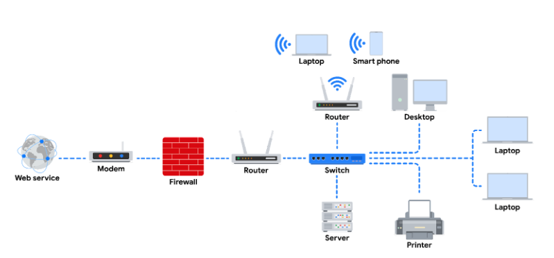
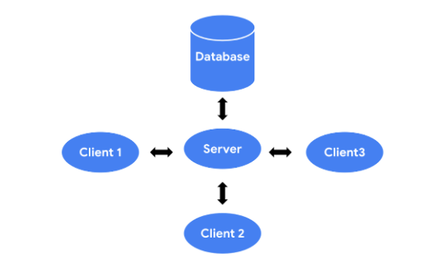
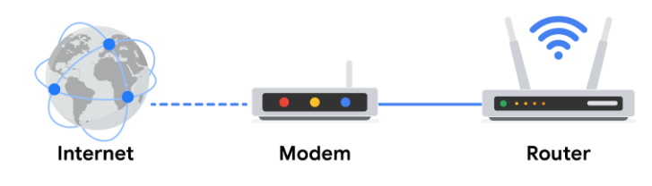
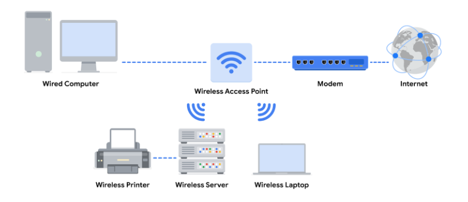
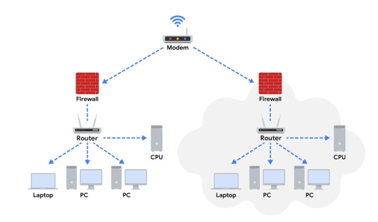
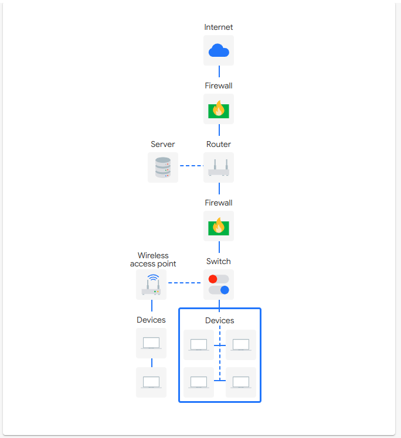

# Introducción a las redes

## Bienvenido al Módulo 1
- ​Antes de proteger una red, ​es necesario comprender el diseño básico de una red y cómo funciona
- En esta sección del curso, aprenderá sobre:
   - la estructura de una red
   - ​herramientas de red estándar
   - redes en la nube
   - marco básico para ​organizar las comunicaciones a través de una red denominado Modelo TCP/IP
- Asegurar las redes es una parte importante de las responsabilidades de un analista de seguridad, ​así que me complace ayudarle a comprender cómo proteger la red de su organización ​de amenazas, riesgos y vulnerabilidades.

---

## Chris: Mi ruta de acceso a la ciberseguridad
- Me metí en la ciberseguridad ​porque tenía que defender las cosas que estaba construyendo. ​Me di cuenta de que era divertido
- Me di cuenta de que era una gran oportunidad profesional. 
- A pesar de ser un campo bastante técnico, lo ​más importante que vas a ​aprender son las conexiones ​que vas a establecer con otras personas
- Debido a que la industria de la ciberseguridad ​es tan variada, puede parecer ​que hay mucho que aprender y que hay un ​gran paso que hay que ​dar para entrar en la industria. 
- ​Eso puede resultar abrumador.
- ​Pero lo que hay que recordar es que, ​una vez que tienes ese ​nivel fundamental de habilidades y experiencia, ​hay muchas direcciones diferentes a las que puedes ​ir y hay muchas oportunidades disponibles
- Hay este ​aspecto de educación continua y curiosidad del trabajo que es muy divertido
- Significa que siempre tienes ​la oportunidad de aprender algo nuevo, ​cambiar de dirección e ir por nuevos caminos, porque la ​ciberseguridad va a ​cambiar constantemente

---

## ¿Qué son las redes?
- Una red es un grupo de dispositivos conectados
- ​En casa, los dispositivos conectados a su red pueden ser su ordenador portátil, ​teléfonos móviles y dispositivos inteligentes, como su frigorífico o aire acondicionado
- En una oficina, dispositivos como estaciones de trabajo, impresoras y ​servidores se conectan a la red. 
- Los dispositivos de una red pueden comunicarse entre sí a través de cables de red o conexiones ​inalámbricas
- ​Las redes de su casa y oficina pueden comunicarse con redes de otras ubicaciones, ​y con los dispositivos de éstas
- ​Los dispositivos necesitan encontrarse en una red para establecer comunicaciones. 
- ​Estos dispositivos utilizarán direcciones únicas, o identificadores, para localizarse entre sí
- Las direcciones garantizarán que las comunicaciones se produzcan con ​el dispositivo correcto
- ​Se denominan direcciones IP y MAC
- ​Los dispositivos pueden comunicarse en dos tipos de redes: ​una red de área local, también conocida como LAN, ​y una red de área extensa, también conocida como WAN
- Una red de área local, o LAN, ​abarca un área pequeña como un edificio de oficinas, una escuela o un hogar
   - Por ejemplo, cuando un dispositivo personal como su teléfono móvil o su tableta ​se conectan a la WIFI de su casa, forman una LAN.
   - ​La LAN se conecta entonces a Internet. 
- ​Una red de área extensa o WAN abarca un área geográfica grande como una ciudad, un estado, ​o un país
   - Puede pensar en Internet como una gran WAN
   - Un empleado de una empresa en San Francisco puede comunicarse y ​compartir recursos con otro empleado en Dublín, Irlanda, a través de la WAN

---

## Tina: Trabajar en la Seguridad de redes
- La seguridad de red es importante porque ​queremos asegurarnos de que nuestros sistemas de red sean ​seguros y resistentes ​para poder defendernos de los piratas informáticos malintencionados, ​y de que tenemos la capacidad de proteger los datos de nuestros usuarios
- Trabajar con la seguridad de ​la red permite ver una visión general de los sistemas de red de toda la empresa, ​lo cual es genial
- Mi parte favorita de mi trabajo es el impacto que puedo ​tener en la comunidad a la que sirvo en Google
- Diría que la mayor parte del día me dedico a programar, diseñar, ​hablar con los equipos de Seguridad y los equipos de red sobre ​sus prioridades ​y sus obstáculos y poder encontrar una solución
- ​Un consejo que le daría ​a alguien que quiera emprender el ​viaje de la ciberseguridad es que ​siempre pueda seguir aprendiendo y ​sentir curiosidad por saber cómo funcionan las cosas
- ​Debido a que la seguridad es un campo en constante cambio, la ​ciberseguridad es definitivamente un deporte de equipo
- Todo el mundo tiene algo que aportar ​y, especialmente en lo que respecta a los problemas ​de ciberseguridad, puede haber ​muchas posibilidades y muchas soluciones diferentes para un problema

---

## Red: Habilidades útiles para la Seguridad de redes
- En lo que respecta a la ​seguridad ofensiva, ​mi trabajo consiste en simular a los adversarios y las amenazas ​que se dirigen a varias empresas y me dedico ​a defender la forma en ​que podemos proteger la infraestructura de Google
- Hago que sea más difícil hackear ​Google hackeando Google
- Las habilidades técnicas que utilizo son mucha programación, ​además de aprender sobre la ​seguridad operativa y de la plataforma
- ​Saber cómo funcionan estas computadoras, ​qué hay debajo del capó ​y comprender los componentes ​que crean esta infraestructura.
- ​Un analista de ciberseguridad ​principiante estudiaría el uso de líneas de comando, análisis de registros y ​análisis de tráfico de red en su ámbito de trabajo diario
- La línea de comandos le permite interactuar ​con varios niveles de su sistema operativo, ​ya sean los de bajo nivel, ​como la memoria y el kernel, ​o los de alto nivel, como ​las aplicaciones y los programas ​que ejecuta en su computadora. 
- Con el análisis de registros, habrá ​ocasiones en las que necesitará ​averiguar y depurar lo que está sucediendo en su programa o ​aplicación, y estos registros están ​ahí para ayudarlo y ayudarlo a ​encontrar el problema raíz y luego resolverlo desde allí
- Con este análisis del tráfico de red, ​puede haber ocasiones en las que necesite ​averiguar por qué mi Internet va lento
- ¿Por qué el tráfico no ​se dirige al destino apropiado? ​¿Qué puedo hacer para ​asegurarme de que mi red esté en funcionamiento?
- El análisis del tráfico de red consiste en analizar la ​red en varias capas de red ​y aplicaciones y ver qué hace ​ese tráfico, cómo podemos ​protegerlo e identificar cualquier vulnerabilidad o problema
- En mi caso, por motivos de Seguridad, ​analizo: ¿se ​filtran contraseñas en el tráfico que ​se envía a través de la red? ​¿Se protegen las infraestructuras? ¿Los firewalls se ​configuran fácilmente y de forma segura?
- Una habilidad que no ha dejado de ​crecer en mi puesto actual ​ha sido ​comunicarme eficazmente con los equipos de productos ​y los ingenieros, identificar un problema que influya o ​afecte a la empresa y ​comunicarme con esos equipos de forma eficaz para solucionarl
- Ser capaz de asumir todas estas funciones ​y explicar las cosas con el enfoque empresarial adecuado ​para garantizar que los problemas ​que encuentro en mi trabajo se ​identifiquen, pero también se solucionen
- ​Mi consejo para ​las personas que están cursando este certificado es que se deshagan, se sientan incómodas, ​aprendan y crezcan y encuentren ​oportunidades para aprender y comprender cómo ​funcionan las cosas, y ese conjunto de habilidades ​les beneficiará durante el resto de su viaje. 

---

## Herramientas de red
- Hub (Concentrador)
   - Es un dispositivo de red que ​emite información a todos los dispositivos de la red
   - Piense en un Hub como en una torre de radio que emite ​una señal a cualquier radio sintonizada en la frecuencia correcta 
- Switch (Conmutador)
   - Un Switch establece conexiones entre ​dispositivos específicos de una red enviando ​y recibiendo datos entre ellos
   - Un Switch es más inteligente que un Hub.
   - ​Sólo transmite datos al destino previsto
   - Esto hace que los Switch sean más seguros que los Hub, ​y les permite controlar el flujo de tráfico ​y mejorar el rendimiento de la red
- Router (Enrutador)
   - Un router es un dispositivo de red que ​conecta varias redes entre sí. 
   - Por ejemplo, si una computadora de una red ​desea enviar información a una tableta de otra red, ​entonces la información se transferirá de la siguiente manera: ​Primero, la información viaja ​desde la computadora hasta el router
   - A continuación, el router lee la dirección de destino, ​y reenvía los datos al router de la red de destino. ​Por último, el router receptor ​dirige esa información a la tableta. 
- Modem (Módem)
   - Un módem es un dispositivo que conecta ​el router a Internet, ​y lleva el acceso a Internet a la LAN. 
   - Por ejemplo, si una computadora de una red quiere enviar ​información a un dispositivo de una red ​en una ubicación geográfica diferente, ​se transferiría de la siguiente manera: ​La computadora enviaría la información al router, ​y el router transferiría entonces ​la información a través del módem a Internet
   - El Módem del destinatario recibe la información, ​y la transfiere al router.
   - Finalmente, el router del destinatario reenvía ​esa información al dispositivo de destino
- muchas funciones realizadas por ​estos dispositivos físicos pueden ser ​completadas por herramientas de virtualización. 
- ​Las herramientas de virtualización son piezas de ​software que realizan operaciones de red. 
- Las herramientas de virtualización llevan a cabo operaciones ​que normalmente realizaría un hub, un switch, ​un router o un módem, ​y que ofrecen los proveedores de servicios en la Nube
- Estas herramientas ofrecen oportunidades de ​ahorro de costes y escalabilidad

---

## Componentes, dispositivos y diagramas de red
- Una comprensión básica de la arquitectura de red, a veces denominada diseño de red, le ayudará a conocer las vulnerabilidades de seguridad inherentes a todas las redes y cómo los actores maliciosos intentan explotarlas.
- Dispositivos de red
   - Los dispositivos de red mantienen información y servicios para los usuarios de una red
   - Estos dispositivos se conectan a través de conexiones cableadas e inalámbricas
   - Tras establecer una conexión con la red, los dispositivos envían paquetes de datos
   - Los paquetes de datos proporcionan información sobre el origen y el destino de los datos
   - Así es como se envía y recibe la información a través de los distintos dispositivos de una red.
   - La red es la infraestructura general que permite a los dispositivos comunicarse entre sí
   - Los dispositivos de red son vehículos especializados, como enrutadores y conmutadores, que gestionan lo que se envía y recibe a través de la red
   - Además, dispositivos como ordenadores y teléfonos se conectan a la red a través de dispositivos de red. 

- En este diagrama, un router se conecta a Internet a través de un módem, que le proporciona su proveedor de servicios de Internet (ISP)
- El cortafuegos es un dispositivo de seguridad que supervisa el tráfico entrante y saliente de la red
- A continuación, el router dirige el tráfico a los dispositivos de tu red doméstica, que pueden incluir ordenadores, portátiles, smartphones, tabletas, impresoras y otros aparatos
- Aquí puedes imaginar que el servidor es un servidor de archivos
- Todos los dispositivos de esta red pueden acceder a los archivos de este servidor
- Este diagrama también incluye un switch, que es un dispositivo opcional que se puede utilizar para conectar más dispositivos a la red proporcionando puertos adicionales y conexiones Ethernet
- Además, hay 2 routers conectados al switch para equilibrar la carga y mejorar el rendimiento de la red.

- Dispositivos y ordenadores de sobremesa
   - Cada dispositivo y ordenador de sobremesa tiene una dirección MAC y una dirección IP únicas, que lo identifican en la red
   - También tienen una interfaz de red que envía y recibe paquetes de datos.
   - Estos dispositivos pueden conectarse a la red mediante un cable fijo o una conexión inalámbrica.
- Cortafuegos (Firewall)
   - Un cortafuegos es un dispositivo de seguridad de red que supervisa el tráfico hacia o desde su red
   - Es como la primera línea de defensa
   - Los cortafuegos también pueden restringir el tráfico de red específico entrante y saliente.
   - La organización configura las reglas de seguridad del cortafuegos.
   - Los cortafuegos suelen situarse entre la red interna segura y controlada y los recursos de red no fiables fuera de la organización, como Internet
   - Recuerda, sin embargo, que los cortafuegos son sólo una línea de defensa en el panorama de la ciberseguridad.
- Servidores
   - Los servidores proporcionan información y servicios para dispositivos como ordenadores, dispositivos domésticos inteligentes y teléfonos inteligentes en la red
   - Los dispositivos que se conectan a un servidor se denominan clientes. 
   - El siguiente gráfico esboza este modelo, que se denomina modelo cliente-servidor
   - En este modelo, los clientes envían peticiones de información y servicios al servidor.
   - El servidor realiza las peticiones para los clientes
   - Algunos ejemplos comunes son los servidores DNS, que realizan búsquedas de nombres de dominio para sitios de Internet, los servidores de archivos, que almacenan y recuperan archivos de una base de datos, y los servidores de correo corporativo, que organizan el correo de una empresa.

- Hub
   - Junto a los switches dirigen el tráfico de una red local
   - Un hub es un dispositivo que proporciona un punto común de conexión para todos los dispositivos conectados directamente a él
   - Además, repiten toda la información a todos los puertos
   - Desde el punto de vista de la seguridad, esto hace que los hub sean vulnerables a las escuchas
   - Por este motivo, los hubs no se utilizan con tanta frecuencia en las redes modernas; la mayoría de las organizaciones utilizan switches en su lugar.
   - Los hubs suelen utilizarse en redes limitadas, como las oficinas domésticas.
- Switch
   - son la opción preferida en la mayoría de las redes
   - reenvía paquetes entre dispositivos conectados directamente a él
   - Analizan la dirección de destino de cada paquete de datos y lo envían al dispositivo previsto
   - mantienen una tabla de direcciones MAC que coteja las direcciones MAC de los dispositivos de la red con los números de puerto del conmutador y reenvía los paquetes de datos entrantes según la dirección MAC de destino
   - forman parte de la capa de vínculo de datos en el Modelo TCP/IP
   - mejoran el rendimiento y la seguridad
- Routers
   - conectan redes y dirigen el tráfico, basándose en la dirección IP de la red de destino
   - Los routers permiten que los dispositivos de diferentes redes se comuniquen entre sí
   - En el Modelo TCP/IP, los routers forman parte de la capa de red
   - La dirección IP de la red de destino está contenida en la cabecera IP
   - El router lee la información de la cabecera IP y reenvía el paquete al siguiente router en la ruta hacia el destino
   - Esto continúa hasta que el paquete llega a la red de destino
   - Los routers también pueden incluir una función de cortafuegos que permite o bloquea el tráfico entrante basándose en la información de la transmisión
   - Esto impide que el tráfico malicioso entre en la red privada y dañe la red de área local.
- Módems y puntos de acceso inalámbricos
   - Los módems suelen conectar su casa u oficina con un proveedor de servicios de Internet (ISP)
   - Los ISP proporcionan conexión a Internet a través de líneas telefónicas, cables coaxiales o cables de fibra óptica
   - Los módems reciben transmisiones o señales digitales de Internet y las convierten en un formato digital compatible con la conexión física que le proporciona su ISP
   - Normalmente, los módems se conectan a un router que toma las transmisiones descodificadas y las envía a la red local.
   - las redes empresariales que utilizan las grandes organizaciones para conectar a sus usuarios y dispositivos suelen emplear otras tecnologías de banda ancha para gestionar el tráfico de gran volumen, en lugar de utilizar un módem.
   

- Punto de acceso inalámbrico
   - Un punto de acceso inalámbrico envía y recibe señales digitales a través de ondas de radio creando una red inalámbrica
   - Los dispositivos con adaptadores inalámbricos se conectan al punto de acceso mediante Wi-Fi
   - Wi-Fi hace referencia a un conjunto de estándares que utilizan los dispositivos de red para comunicarse de forma inalámbrica
   - Los puntos de acceso inalámbricos y los dispositivos conectados a ellos utilizan protocolos Wi-Fi para enviar datos a través de ondas de radio, donde se envían a enrutadores y conmutadores y se dirigen a lo largo de la ruta hasta su destino final.
   

- Uso de diagramas de red como analista de seguridad
   - Los diagramas de red permiten a los administradores de red y al personal de seguridad imaginar la arquitectura y el diseño de la red privada de su organización.
   - Los diagramas de red son mapas que muestran los dispositivos de la red y cómo se conectan
   - Los diagramas de red utilizan pequeños gráficos representativos para representar cada dispositivo de la red y líneas de puntos para mostrar cómo se conecta cada dispositivo entre sí
   - Mediante el estudio de los diagramas de red, los analistas de seguridad desarrollan y perfeccionan sus estrategias para proteger las arquitecturas de red.

---

## Práctica: Diseñar una red de área local
- Complete a network diagram to create a secure Local Area Network.

1. Review the network diagram and identify what’s missing by selecting the appropriate option from the list.
- A router connects the internet, firewall, and server to the rest of the network.
- A switch connects the network to devices like phones, tablets, workstations, and desktops.
- A wireless access point can connect other devices behind a firewall.
- A device connects to the network via a switch.

---

## Redes en la nube
- Tradicionalmente, las empresas han sido propietarias de sus dispositivos de red y ​los han mantenido en sus propios edificios de oficinas
- Pero ahora, muchas empresas recurren a proveedores externos para gestionar sus redes
- ¿Por qué? ​Bueno, este Modelo ayuda a las empresas a ahorrar dinero a la vez que les da acceso a más recursos ​de red
- El crecimiento de la computación en la nube está ayudando a muchas empresas a reducir costes y ​adaptar sus operaciones de red
- La computación en la nube es la práctica de utilizar servidores, aplicaciones y servicios de red ​remotos que se alojan en Internet en lugar de en dispositivos físicos locales
- Hoy en día, el número de empresas que utilizan la computación en la nube aumenta cada año, ​por lo que es importante entender cómo funcionan las redes en la nube y cómo asegurarlas. 
- ​Los proveedores de servicios en la nube ofrecen una alternativa a las redes tradicionales locales y ​permiten a las organizaciones tener los beneficios de la red tradicional sin almacenar ​los dispositivos y gestionar la red por su cuenta
- Una red en la nube es un conjunto de servidores u ordenadores que almacenan recursos y ​datos en un centro de datos remoto al que se puede acceder a través de Internet
- Debido a que las empresas no alojan los servidores en su ubicación física, ​se dice que estos servidores están "en la nube"
- Las redes tradicionales alojan los servidores web de una empresa en su ubicación física
- Sin embargo, las redes en la nube se diferencian de las redes tradicionales porque utilizan servidores remotos, ​que permiten utilizar servicios en línea y aplicaciones web ​desde cualquier ubicación geográfica
- La seguridad en la nube será cada vez más relevante para muchos profesionales de la seguridad a medida que ​más organizaciones migren a los servicios en la nube
- Los proveedores de servicios en la nube ofrecen computación en la nube para mantener las aplicaciones. 
- Por ejemplo, proporcionan almacenamiento a la carta y ​potencia de procesamiento que sus clientes sólo pagan cuando lo necesitan. 
- También proporcionan análisis empresariales y ​web que las organizaciones pueden utilizar para supervisar su tráfico web y sus ventas. 
- Con la transición a las redes en la nube, he sido testigo de una superposición de la seguridad basada en la identidad ​sobre las soluciones más tradicionales basadas en la red
- Esto significaba que mi atención debía centrarse en verificar tanto de dónde procede el tráfico ​como la identidad que lo acompaña. 
- Cada vez son más las organizaciones que trasladan sus servicios de red a la nube para ahorrar dinero y simplificar ​sus operaciones
- A medida que esta tendencia ha ido creciendo, ​la seguridad en la nube se ha convertido en un aspecto importante de la seguridad de las redes. 