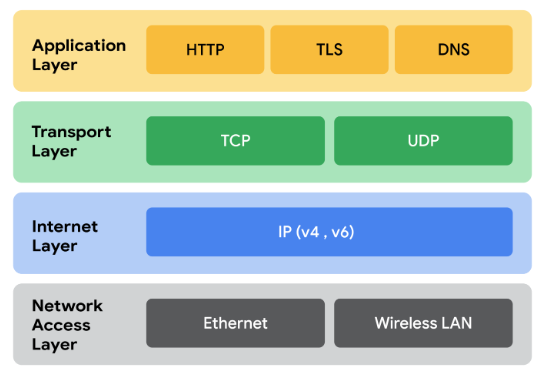
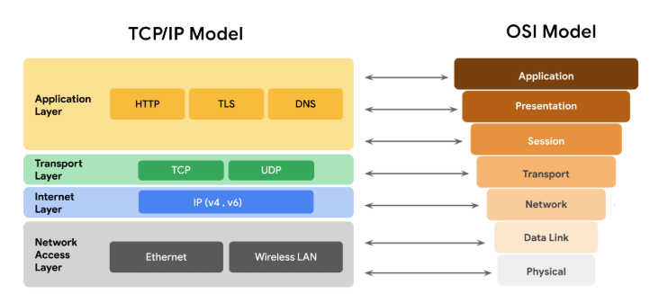

# Comunicación en red

## Introducción a la comunicación en red
- ​Las redes ayudan a las organizaciones a comunicarse y conectarse.
- ​Pero la comunicación hace que los ataques a la red sean más probables porque da a un ​actor malicioso la oportunidad de aprovecharse de dispositivos vulnerables y ​redes desprotegidas
- La comunicación a través de una red se produce cuando los datos se transfieren de un punto a ​otro
- Los fragmentos de datos suelen denominarse paquetes de datos
- Un paquete de datos es una unidad básica de información que viaja de un ​dispositivo a otro dentro de una red
- Cuando los datos se envían de un dispositivo a otro a través de una red, se envían como ​un paquete que contiene información sobre a dónde va el paquete, de dónde ​viene y el contenido del mensaje
- Piense en los paquetes de datos como si fueran un trozo de correo físico. 
- Imagínese que quiere enviar una carta a un amigo
- ​En el sobre tendrá que figurar la dirección a la que quiere que llegue la carta ​y su dirección de remitente
- Dentro del sobre hay una carta que contiene ​el mensaje que quiere que su amigo lea
- Un paquete de datos es muy similar a una carta física. ​Contiene un encabezado que incluye la dirección del protocolo de Internet, la dirección IP ​y la dirección MAC (Media Access Control) del dispositivo de destino
- También incluye un número de protocolo que indica al dispositivo receptor qué hacer con ​la información del paquete
- ​Luego está el cuerpo del paquete, que contiene el mensaje que debe ​transmitirse al dispositivo receptor. 
- Por último, al final del paquete, hay un pie de página, ​similar a la firma de una carta, ​el pie de página indica al dispositivo receptor que el paquete ha finalizado
- El movimiento de los paquetes de datos a través de una red puede proporcionar una indicación de lo ​bien que funciona la red
- El rendimiento de la red puede medirse por el ancho de banda
- ​El ancho de banda se refiere a la cantidad de datos que recibe un dispositivo cada segundo.
- ​Puede calcular el ancho de banda dividiendo la cantidad de datos por el tiempo en ​segundos
- La Velocidad se refiere a la velocidad a la que se reciben o descargan los paquetes de datos. 
- El personal de seguridad está interesado en el ancho de banda y la Velocidad de la red ​porque si cualquiera de ellos es irregular, podría ser un indicio de un ataque. 
- ​El sniffing de paquetes es la práctica de capturar e ​inspeccionar paquetes de datos a través de la red
- La comunicación en la red es importante para compartir recursos y ​datos porque permite que las organizaciones funcionen con eficacia

---

## Modelo TCP/IP
- ​TCP/IP son las siglas de ​Protocolo de control de transmisión y Protocolo de Internet
- TCP/IP es el modelo estándar ​utilizado para la comunicación en red
- En primer lugar, TCP, o Protocolo de Control de Transmisión, ​es un protocolo de comunicación de Internet que permite ​a dos dispositivos formar una conexión y transmitir datos
- El protocolo incluye un conjunto de instrucciones para ​organizar los datos, de forma que puedan enviarse a través de una red. 
- ​También establece una conexión entre dos dispositivos ​y se asegura de que los paquetes ​lleguen a su destino apropiado
- El IP en TCP/IP significa Protocolo de Internet.
- IP tiene un conjunto de Estándares utilizados para enrutar y direccionar ​paquetes de datos a medida que viajan ​entre dispositivos en una red
- Incluida en el Protocolo de Internet (IP) está la dirección IP ​que funciona como una dirección para cada red privada
- Cuando se envían y reciben paquetes de datos a través de una red, ​se les asigna un puerto. 
- Dentro del sistema operativo de un dispositivo de red, ​un puerto es una ubicación basada en software que organiza ​el envío y recepción de datos ​entre dispositivos de una red. 
- ​Los puertos dividen el Tráfico de red en segmentos ​basados en el servicio que realizarán ​entre dos dispositivos
- Las computadoras que envían y ​reciben estos segmentos de datos saben cómo ​priorizar y procesar estos segmentos ​basándose en su número de puerto
- Los paquetes de datos incluyen instrucciones que indican ​al dispositivo receptor qué hacer con la información
- Estas instrucciones vienen en forma de número de puerto
- Los números de puerto permiten a las computadoras ​dividir el Tráfico de red y ​priorizar las operaciones que ​realizarán con los datos. 
- Algunos números de puerto comunes son: ​el puerto 25, que se utiliza para el correo electrónico, ​el puerto 443, que se ​utiliza para la comunicación segura en Internet, ​y el puerto 20, para las transferencias de archivos de gran tamaño

---

## Las cuatro capas del Modelo TCP/IP
- El modelo TCP/IP es un marco que se utiliza para ​visualizar cómo se ​organizan y transmiten los datos a través de la red
- El modelo TCP/IP tiene cuatro capas
   - La capa de acceso a la red
      - La capa de acceso a la red se ocupa de la creación de ​paquetes de datos y su transmisión a través de una red
      - Esto incluye los dispositivos de hardware conectados a ​cables físicos y conmutadores ​que dirigen los datos a su destino
   - La capa de Internet
      - La capa de Internet es donde se adjuntan las direcciones IP a los ​paquetes de datos para indicar ​la ubicación del emisor y el receptor
      - La capa de Internet también se centra ​en cómo se conectan las redes entre sí
      - Por ejemplo, los paquetes de datos ​contienen información que determina si ​se quedarán en la LAN o se enviarán ​a una red remota, como Internet
   - La capa de transporte
      - La capa de transporte incluye protocolos para ​controlar el flujo de tráfico a través de una red. 
      - ​Estos protocolos permiten o deniegan la comunicación con ​otros dispositivos e incluyen ​información sobre el estado de la conexión
      - Las actividades de esta capa incluyen el control de errores, ​que garantiza que los datos fluyen ​sin problemas por la red
   - La capa de aplicación
      - los protocolos determinan cómo los paquetes de datos ​interactuarán con los dispositivos receptores
      - Las funciones que se organizan en la capa de aplicación ​incluyen la transferencia de archivos y los servicios de correo electrónico
- Saber cómo organiza el modelo TCP/IP la actividad de la red ​permite a los profesionales de la seguridad ​vigilar y protegerse contra los riesgos

---

## Más información sobre el Modelo TCP/IP
- Como profesional de la seguridad, es importante que entienda el Modelo TCP/IP porque describe las funciones de varios protocolos de red
- El Modelo TCP/IP se basa en el conjunto de protocolos TCP/IP que incluye todos los protocolos de red que soportan el protocolo principal TCP/IP
- Para reiterar lo dicho en lecciones anteriores, un protocolo de red, también conocido como protocolo de Internet, es un conjunto de normas utilizadas para enrutar y direccionar paquetes de datos cuando viajan entre dispositivos de una red

- El Modelo TCP/IP
   - El Modelo TCP/IP es un framework utilizado para visualizar cómo se organizan y transmiten los datos a través de una red
   - Este Modelo ayuda a los ingenieros de redes y a los analistas de seguridad de redes a conceptualizar los procesos en la red y a comunicar dónde se producen las interrupciones o las amenazas a la seguridad.
   - El Modelo TCP/IP tiene cuatro capas
      - La capa de acceso a la red
      - La capa de Internet
      - La capa de transporte
      - La capa de aplicación
   - Cuando se solucionan problemas en la red, los profesionales de la Seguridad pueden analizar qué capas se vieron afectadas por un ataque en función de los procesos implicados en un incidente. 

- Capa de acceso a la red
   - La capa de acceso a la red, a veces denominada capa de vínculo de datos, se ocupa de la creación de paquetes de datos y su transmisión a través de una red.
   - Esta capa corresponde al hardware físico implicado en la transmisión de la red.
   - Concentradores, módems, cables y cableado se consideran parte de esta capa.
   - El protocolo de resolución de direcciones (ARP) forma parte de la capa de accesibilidad a la red.
   - Dado que las direcciones MAC se utilizan para identificar hosts en la misma red física, ARP es necesario para asignar direcciones IP a direcciones MAC para la comunicación de red local.
- Capa de Internet
   - La capa de Internet, a veces denominada capa de red, es responsable de garantizar la entrega al host de destino, que potencialmente reside en una red diferente.
   - Garantiza que las direcciones IP se adjunten a los paquetes de datos para indicar la ubicación del remitente y el destinatario.
   - La capa de Internet también determina qué protocolo es responsable de entregar los paquetes de datos y garantiza la entrega al host de destino.
   - Estos son algunos de los protocolos comunes que operan en la capa de Internet:
      - Protocolo de Internet (IP):
         - IP envía los paquetes de datos al destino correcto y se basa en el Protocolo de control de transmisión/Protocolo de Datagramas de Usuario (TCP/UDP) para entregarlos al servicio correspondiente.
         - Los paquetes IP permiten la comunicación entre dos redes.
         - Se encaminan desde la red emisora hasta la red receptora.
         - El TCP, en particular, retransmite cualquier dato que se pierda o esté corrupto.
      - Protocolo de mensajes de control de Internet (ICMP):
         - El ICMP comparte información sobre errores y actualizaciones del estado de los paquetes de datos.
         - Esto resulta útil para detectar y solucionar errores de red.
         - El ICMP transmite información sobre paquetes que se han perdido o que han desaparecido en tránsito, problemas con la conectividad de la red y paquetes redirigidos a otros routers.
- Capa de transporte
   - La capa de transporte es responsable de la entrega de datos entre dos sistemas o redes e incluye protocolos para controlar el flujo de tráfico a través de una red.
   - TCP y UDP son los dos protocolos de transporte que se dan en esta capa.
   - Protocolo de control de transmisión
      - El Protocolo de control de transmisión (TCP ) es un protocolo de comunicación de Internet que permite que dos dispositivos formen una conexión y transmitan datos.
      - Garantiza que los Datos se transmitan de forma fiable al servicio de destino.
      - TCP contiene el número de puerto del servicio de destino previsto, que reside en el encabezado TCP de un paquete TCP/IP.
   - Protocolo de Datagramas de Usuario
      - El Protocolo de Datagramas de Usuario (UDP) es un protocolo no orientado a la conexión que no establece una conexión entre dispositivos antes de las transmisiones.
      - Lo utilizan aplicaciones a las que no les preocupa la fiabilidad de la transmisión.
      - Los Datos enviados a través de UDP no son objeto de un seguimiento tan exhaustivo como los enviados mediante TCP.
      - Dado que UDP no establece conexiones de red, se utiliza sobre todo para aplicaciones sensibles al rendimiento que funcionan en tiempo real, como la transmisión de vídeo.
- Capa de aplicación
   - La capa de aplicación en el Modelo TCP/IP es similar a las capas de aplicación, presentación y sesión del Modelo OSI.
   - La capa de aplicación es la responsable de realizar las solicitudes de red o de responder a las peticiones.
   - Esta capa define a qué servicios y aplicaciones de Internet puede acceder cualquier usuario.
   - Los protocolos de la capa de aplicación determinan cómo interactuarán los paquetes de datos con los dispositivos receptores.
   - Algunos protocolos comunes utilizados en esta capa son:
      - Protocolo de transferencia de hipertexto (HTTP)
      - Protocolo simple de transmisión de correo (SMTP)
      - Secure Shell (SSH)
      - Protocolo de transferencia de archivos (FTP)
      - Sistema de nombres de dominio (DNS)
   - Los protocolos de la capa de aplicación se basan en capas subyacentes para transferir los datos a través de la red.

- Modelo TCP/IP frente al modelo OSI

- El OSI organiza visualmente los protocolos de redes en diferentes capas.
- Los profesionales de las redes suelen utilizar este modelo para comunicarse entre sí sobre posibles fuentes de problemas o amenazas a la seguridad cuando se producen. 
- El Modelo TCP/IP combina varias capas del modelo OSI.
- Existen muchas similitudes entre ambos Modelos.
- Ambos Modelos definen Estándares para las redes y dividen el proceso de comunicación de la red en diferentes capas.
- El Modelo TCP/IP es una versión simplificada del modelo OSI.