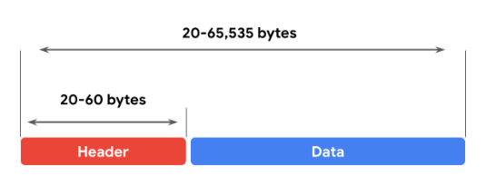
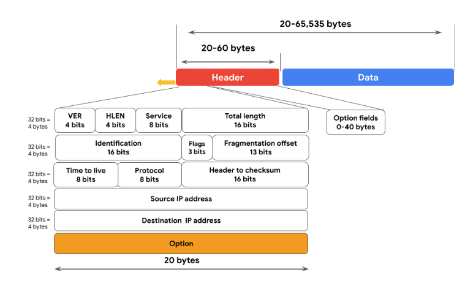
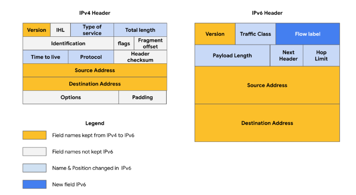

# Comunicación en red local y amplia

## Direcciones IP y comunicación en red
- Vamos a aprender cómo ​se utilizan las direcciones IP para comunicarse a través de una red
- IP son las siglas de protocolo de Internet.
- ​Una dirección de protocolo de Internet, o dirección IP, es ​una cadena única de caracteres que identifica ​la ubicación de un dispositivo en Internet
- ​Cada dispositivo en Internet tiene una dirección IP única, al ​igual que cada casa de una calle ​tiene su propia dirección postal
- Hay dos tipos de direcciones IP: ​IP versión 4, o IPv4, e ​IP versión 6, o IPv6. 
- Las direcciones IPv4 se escriben como ​números de cuatro, 1, 2 o 3 dígitos separados por un punto decimal. 
- Ejemplo IPV4: 19.117.63.126
- En los primeros días de Internet, ​todas las direcciones IP eran ​IPV4
- Pero a medida que crecía el uso de Internet, ​todas las direcciones IPv4 empezaron a agotarse ​, por lo que se desarrolló IPv6
- Las direcciones IPv6 se componen de 32 caracteres
- Ejemplo IPV6: 684D:1111:222:3333:4444:5555:6:77
- La longitud de la dirección IPv6 ​permitirá que más dispositivos se conecten ​a Internet sin quedarse sin ​direcciones tan rápido como en IPv4
- ​Las direcciones IP pueden ser públicas o privadas. 
- Su proveedor de servicios de Internet asigna ​una dirección IP pública que está ​conectada a su ubicación geográfica
- Cuando se interrumpe la comunicación de red ​desde tu dispositivo en Internet, ​todos tienen la misma dirección pública. 
- ​Al igual que todos los compañeros de habitación de ​una casa comparten la misma dirección postal, ​todos los dispositivos de una red comparten ​la misma dirección IP pública. 
- Las direcciones IP privadas solo ​las ven otros dispositivos de la misma red local
- Esto significa que todos los dispositivos de ​su red doméstica pueden comunicarse entre sí ​mediante direcciones IP únicas ​que el resto de Internet no puede ver
- Otro tipo de dirección utilizada en ​las comunicaciones de red se denomina dirección MAC
- Una dirección MAC es ​un identificador alfanumérico único que se ​asigna a cada dispositivo físico de una red. 
- Cuando un conmutador recibe un paquete de datos ​, lee la dirección MAC ​del dispositivo de destino y la asigna a un puerto
- A continuación, guarda esta información en una tabla de direcciones MAC. 
- ​Piense en la tabla de direcciones MAC ​como una libreta de direcciones que el switch ​usa para dirigir los paquetes de datos al dispositivo apropiado

---

## Componentes de la capa de red de comunicación
- Operaciones en la capa de red
   - Las funciones en la capa de red organizan el direccionamiento y la entrega de paquetes de datos a través de la red desde el dispositivo anfitrión hasta el dispositivo de destino.
   - Esto incluye dirigir los paquetes de un router a otro a través de Internet, hasta que llega a la dirección IP (protocolo de Internet) de la red de destino.
   - La dirección IP de destino está contenida en el encabezamiento de cada paquete de datos.
   - Esta dirección se almacenará con fines de enrutamiento futuro en las tablas de enrutamiento a lo largo de la ruta de acceso del paquete hasta su destino.
   - Todos los paquetes de datos incluyen una dirección IP.
   - Un paquete de datos también se denomina paquete IP para las conexiones TCP o datagrama para las conexiones UDP.
   - Un router utiliza la dirección IP para encaminar los paquetes de una red a otra basándose en la información contenida en el encabezado IP de un paquete de datos.
   - La Información del Encabezado comunica algo más que la dirección del destino.
   - También incluye información como la dirección IP de origen, el tamaño del paquete y qué protocolo se utilizará para la parte de datos del paquete.
- Formato de un paquete IPv4
   - A continuación, puede repasar el formato de un paquete IP versión 4 (IPv4) y revisar un gráfico detallado del encabezado del paquete.
   - Un paquete IPv4 se compone de dos secciones, la cabecera y los datos:
      - El formato del Encabezado IPv4 viene determinado por el protocolo IPv4 e incluye la información de enrutamiento IP que los dispositivos utilizan para dirigir el Paquete.
      - El tamaño del encabezado IPv4 oscila entre 20 y 60 bytes.
      - Los primeros 20 bytes son un conjunto fijo de información que contiene datos como la dirección IP de origen y destino, la longitud de la cabecera y la longitud total del paquete.
      - El último conjunto de bytes puede oscilar entre 0 y 40 y está formado por el campo de opciones.
      - La longitud de la sección de Datos de un paquete IPv4 puede variar mucho en tamaño.
      - Sin embargo, el tamaño máximo posible de un paquete IPv4 es de 65.535 bytes.
      - Contiene el mensaje que se transfiere por Internet, como la información de un sitio web o el texto de un correo electrónico. 

- Hay 13 campos dentro del Encabezado de un paquete IPv4:
1. Versión (VER): Este componente de 4 bits indica a los dispositivos receptores qué protocolo está utilizando el paquete. El paquete utilizado en la ilustración anterior es un paquete IPv4.
2. Longitud del Encabezado IP (HLEN o IHL): HLEN es la longitud del encabezado del paquete. Este valor indica dónde termina el encabezado del paquete y dónde comienza el segmento de datos.
3. Tipo de servicio (ToS): Los routers priorizan la entrega de paquetes para mantener la calidad del servicio en la red. El Campo ToS proporciona al router esta Información.
4. Longitud total: Este campo comunica la longitud total de todo el paquete IP, incluyendo la cabecera y los datos. El tamaño máximo de un paquete IPv4 es de 65.535 bytes.
5. Identificación: Los paquetes IPv4 pueden tener hasta 65, 535 bytes, pero la mayoría de las redes tienen un límite menor. En estos casos, los paquetes se dividen, o fragmentan, en paquetes IP más pequeños. El campo de identificación proporciona un identificador Único para todos los fragmentos del paquete IP original, de forma que puedan ser reensamblados una vez que lleguen a su destino.
6. Banderas: Este Campo proporciona al dispositivo de enrutamiento más información sobre si el paquete original ha sido fragmentado y si hay más fragmentos en tránsito.
7. Desplazamiento de fragmentación: El campo de offset de fragmentación indica a los dispositivos de encaminamiento a qué parte del paquete original pertenece el fragmento.
8. Tiempo de vida (TTL ): El TTL impide que los paquetes de datos sean reenviados por los routers indefinidamente. Contiene un contador que establece la fuente. El contador se decrementa en uno a medida que pasa por cada router a lo largo de su ruta de acceso. Cuando el contador TTL llega a cero, el router que tiene el paquete en ese momento lo descarta y devuelve al remitente un mensaje de error ICMP Time Exceeded.
9. Protocolo: El campo de protocolo indica al dispositivo receptor qué protocolo se utilizará para la parte de datos del paquete.
10. Suma de comprobación del encabezado: El campo de suma de comprobación de encabezado contiene una suma de comprobación que puede utilizarse para detectar la corrupción del encabezado IP en tránsito. Los paquetes corruptos se descartan.
11. Dirección IP de origen: La dirección IP de origen es la dirección IPv4 del dispositivo emisor.
12. Dirección IP de destino: La dirección IP de destino es la dirección IPv4 del dispositivo de destino.
13. Opciones: El campo de opciones permite aplicar opciones de Seguridad al Paquete si el valor HLEN es superior a cinco. El Campo comunica estas opciones a los dispositivos de enrutamiento.

- Diferencia entre IPv4 e IPv6
   - A medida que Internet crecía, se hizo evidente que todas las direcciones IPv4 acabarían agotándose; es lo que se denomina agotamiento de las direcciones IPv4.
   - En aquel momento, nadie había previsto cuántos dispositivos informáticos necesitarían una dirección IP.
   - IPv6 se desarrolló para mitigar el agotamiento de las direcciones IPv4 y otras preocupaciones relacionadas.
   - Algunas de las principales diferencias entre IPv4 e IPv6 son la longitud y el formato de las direcciones.
   - Las direcciones IPv4 se componen de cuatro números decimales separados por puntos, cada número va de 0 a 255.
   - Juntos, los números abarcan 4 bytes y permiten hasta 4.300 millones de direcciones posibles.
   - Un ejemplo de dirección IPv4 sería: 198.51.100.0.
   - Las direcciones IPv6 están formadas por ocho números hexadecimales separados por dos puntos, cada número consta de hasta cuatro dígitos hexadecimales.
   - Juntos, todos los números abarcan 16 bytes y permiten hasta 340 undecilillones de direcciones (340 seguidos de 36 ceros).
   - Un ejemplo de dirección IPv6 sería: 2002:0db8:0000:0000:0000:ff21:0023:1234.
   - Para representar uno o más conjuntos consecutivos de todos ceros, puede sustituir los ceros por dos puntos dobles "::", por lo que la dirección IPv6 anterior sería "2002:0db8::ff21:0023:1234"
   - También existen algunas diferencias en el diseño del Encabezado de un Paquete IPv6.
   - El formato del Encabezado IPv6 es mucho más sencillo que el de IPv4.
   - Por ejemplo, el Encabezado IPv4 incluye los campos IHL, Identificación y Banderas, mientras que el IPv6 no.
   - El encabezado IPv6 sólo introduce el campo de etiqueta de flujo, donde la etiqueta de flujo identifica un paquete como que requiere un manejo especial por parte de otros routers IPv6.
   - Existen algunas diferencias de Seguridad importantes entre IPv4 e IPv6.
   - IPv6 ofrece un enrutamiento más eficaz y elimina las colisiones de direcciones privadas que pueden producirse en IPv4 cuando dos dispositivos de la misma red intentan utilizar la misma dirección.

