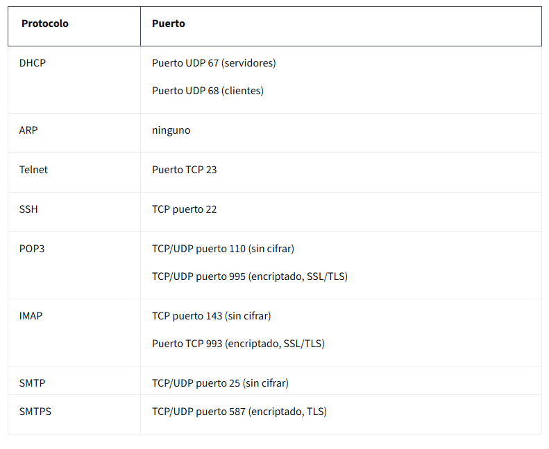

# Introducción a los protocolos de redes

## Bienvenido al módulo 2
- En esta sección, aprenderá cómo ​operan las redes utilizando herramientas y protocolos
- Las herramientas y protocolos que aprenderá en esta sección del ​programa le ayudarán a proteger ​la red de su organización de los ataques
- ¿Sabía que los actores maliciosos pueden aprovecharse de ​los datos que se mueven de un dispositivo a otro en una red?
- Afortunadamente, existen herramientas y ​protocolos para garantizar que la red ​permanezca protegida frente a este tipo de amenaza
- Primero, hablaremos de algunos protocolos de red comunes
- Después, hablaremos de las redes privadas virtuales o VPN
- Y, por último, aprenderemos sobre ​cortafuegos, zonas de seguridad y servidores proxy

---

## Protocolos de red
- ​Las redes se benefician de tener reglas.
- ​Las reglas garantizan que los datos enviados a través ​de la red lleguen al lugar correcto.
- ​Estas reglas se conocen como protocolos de red. ​Los protocolos de red son un conjunto de ​reglas que utilizan dos o más dispositivos de ​una red para describir el orden de ​entrega y la estructura de los datos
- Utilicemos un escenario para demostrar ​algunos tipos diferentes de protocolos de red ​y cómo funcionan juntos en una red
   - Supongamos que quieres acceder a tu sitio web de recetas favorito.
   - ​Ve a la barra de direcciones en la parte superior de ​tu navegador y escribe la dirección del sitio web. 
   - Por ejemplo: www.yummyrecipesforme.org. 
   - Antes de acceder al sitio web, ​su dispositivo establecerá ​comunicaciones con un servidor web
   - Esa comunicación utiliza un protocolo denominado ​Protocolo de control de transmisión o TCP
   - TCP es un protocolo de comunicación de Internet que permite que ​dos dispositivos establezcan una conexión y transmitan datos
   - Tenga en cuenta que el protocolo TCP no se limita a dos dispositivos.
   - Establece una conexión directa entre dos puntos finales, pero la infraestructura de red subyacente puede encargarse del enrutamiento de paquetes de datos a través de múltiples dispositivos. 
   - El TCP también verifica ambos dispositivos ​antes de permitir que se lleve a cabo cualquier otra comunicación. ​Esto a menudo se denomina protocolo de enlace
   - Una vez que se establece la comunicación mediante un protocolo de enlace TCP, ​se realiza una solicitud a la red. 
   - ​Utilizando nuestro ejemplo, hemos solicitado ​datos del servidor Yummy Recipes For Me
   - Sus servidores responderán a esa solicitud y enviarán ​paquetes de datos a ​su dispositivo para que pueda ver la página web
   - ​A medida que los paquetes de datos se mueven por la red, ​se mueven entre los dispositivos de red, como los enrutadores
   - El protocolo de resolución de direcciones, o ARP, se usa para ​determinar la dirección MAC del siguiente ​router o dispositivo de la ruta de acceso
   - Esto garantiza que los datos lleguen al lugar correcto
   - Ahora que se ha ​establecido la comunicación y se conoce el dispositivo de destino, ​es hora de acceder al sitio web Yummy Recipes For Me
   - ​El Protocolo seguro de transferencia de hipertexto, o HTTPS, es ​un protocolo de red que proporciona un método seguro de ​comunicación entre los servidores del cliente y del sitio web. 
   - Permite que su navegador web envíe de forma segura una solicitud de ​una página web al servidor Yummy Recipes For Me ​y reciba una página web como respuesta
   - ​Luego viene un protocolo llamado ​Sistema de nombres de dominio, o DNS, ​que es un protocolo de red que ​traduce los nombres de dominio de Internet en direcciones IP
   - El protocolo DNS envía ​el nombre de dominio y la dirección web a ​un servidor DNS que recupera ​la dirección IP del sitio web al que intentaba acceder, ​en este caso, Yummy Recipes For Me
   - ​La dirección IP se incluye como dirección de destino para ​los paquetes de datos que viajan ​al servidor web Yummy Recipes For Me
   - Por lo tanto, con solo visitar un sitio web, ​el dispositivo de sus redes ​utiliza cuatro protocolos diferentes: ​TCP, ARP, HTTPS y DNS
   - Estos son solo algunos de los protocolos que ​se utilizan en las comunicaciones de red
   - ​Pero, ¿cómo se relacionan estos protocolos con la Seguridad? ​Bueno, en el ejemplo del sitio web Yummy Recipes For Me, ​utilizamos HTTPS, que es ​un protocolo seguro que ​solicita una página web desde un servidor web
   - HTTPS cifra los datos mediante ​la Capa de sockets seguros y la capa de Seguridad de transporte, ​también conocidas como SSL/TLS. 

---

## Protocolos de red comunes
- Visión general de los protocolos de red
   - Un protocolo de red es un conjunto de reglas utilizadas por dos o más dispositivos de una red para describir el orden de entrega y la estructura de los datos
   - Los protocolos de red sirven como instrucciones que acompañan a la información del paquete de datos.
   - Estas instrucciones indican al dispositivo receptor qué debe hacer con los Datos. 
   - Los protocolos son como un lenguaje común que permite a los dispositivos de todo el mundo comunicarse y entenderse entre sí.
   - Aunque los protocolos de red desempeñan una función esencial en la comunicación de la red, los analistas de seguridad deben comprender sus implicaciones de seguridad asociadas.
   - Algunos protocolos tienen vulnerabilidades que los actores maliciosos explotan.
   - Por ejemplo, un actor nefasto podría utilizar el protocolo del sistema de nombres de dominio (DNS), que resuelve las direcciones web en direcciones IP, para desviar el tráfico de un sitio web legítimo a un sitio web malicioso que contenga software malicioso.
- Tres categorías de protocolos de red
   - Los protocolos de red pueden dividirse en tres categorías principales: protocolos de comunicación, protocolos de gestión y protocolos de seguridad.
   - Existen docenas de protocolos de red diferentes, pero no necesita memorizarlos todos para desempeñar un papel de analista de seguridad de nivel básico.
- Protocolos de comunicación
   - Los protocolos de comunicación rigen el intercambio de información en la transmisión por red.
   - Dictan cómo se transmiten los Datos entre dispositivos y el momento de la comunicación.
   - También incluyen métodos para recuperar Datos perdidos en tránsito.
      - El Protocolo de control de transmisión (TCP)
         - Es un protocolo de comunicación de Internet que permite que dos dispositivos formen una conexión y transmitan datos.
         - TCP utiliza un proceso de protocolo de enlace de tres vías.
         - En primer lugar, el dispositivo envía una solicitud de sincronización (SYN) a un servidor.
         - A continuación, el servidor responde con un paquete SYN/ACK para acusar recibo de la solicitud del dispositivo.
         - Una vez que el servidor recibe el último paquete ACK del dispositivo, se establece una conexión TCP.
         - En el Modelo TCP/IP, TCP se produce en la capa de transporte.
      - El Protocolo de Datagramas de Usuario (UDP)
         - Es un protocolo no orientado a la conexión que no establece una conexión entre dispositivos antes de una transmisión.
         - Esto hace que sea menos fiable que TCP.
         - Pero también significa que funciona bien para transmisiones que necesitan llegar a su destino rápidamente.
         - Por ejemplo, un uso de UDP es para enviar solicitudes DNS a servidores DNS locales.
         - En el Modelo TCP/IP, UDP se produce en la capa de transporte.
      - El Protocolo de transferencia de hipertexto (HTTP)
         - Es un protocolo de capa de aplicación que proporciona un método de comunicación entre clientes y servidores de sitios web.
         - HTTP utiliza el puerto 80.
         - HTTP se considera inseguro, por lo que está siendo sustituido en la mayoría de los sitios web por una versión segura, denominada HTTPS que utiliza la encriptación de SSL/TLS para la comunicación.
         - Sin embargo, todavía hay muchos sitios web que utilizan el protocolo inseguro HTTP.
         - En el Modelo TCP/IP, HTTP se produce en la capa de aplicación.
      - El sistema de nombres de dominio (DNS)
         - Es un protocolo que traduce los nombres de dominio de Internet en direcciones IP.
         - Cuando una computadora de cliente desea acceder al dominio de un sitio web utilizando su navegador de Internet, se envía una consulta a un servidor DNS dedicado.
         - El servidor DNS busca entonces la dirección IP que corresponde al dominio del sitio web.
         - DNS utiliza normalmente UDP en el puerto 53.
         - Sin embargo, si la respuesta del DNS a una solicitud es grande, pasará a utilizar el protocolo TCP.
         - En el Modelo TCP/IP, el DNS se produce en la capa de aplicación.
- Protocolos de Gestion
   - La siguiente categoría de protocolos de red son los protocolos de gestión.
   - Los protocolos de gestión se utilizan para supervisar y gestionar la actividad en una red.
   - Incluyen protocolos para la notificación de errores y la optimización del rendimiento en la red.
      - El Protocolo simple de administración de red (SNMP)
         - Es un protocolo de red utilizado para supervisar y gestionar los dispositivos de una red.
         - SNMP puede restablecer una contraseña en un dispositivo de red o cambiar su configuración base.
         - También puede enviar solicitudes a los dispositivos de red para obtener un informe sobre la cantidad de ancho de banda de la red que se está utilizando.
         - En el Modelo TCP/IP, SNMP se produce en la capa de aplicación.
      - El Protocolo de mensajes de control de Internet (ICMP):
         - Es un protocolo de Internet utilizado por los dispositivos para informarse mutuamente de los errores de transmisión de datos a través de la red.
         - El ICMP es utilizado por un dispositivo receptor para enviar un informe al dispositivo emisor sobre la transmisión de datos.
         - El ICMP se utiliza habitualmente como una forma rápida de solucionar problemas de conectividad y latencia de la red mediante la emisión del comando "ping" en un sistema operativo Linux.
         - En el Modelo TCP/IP, el ICMP se produce en la capa de Internet.
- Protocolos de Seguridad
   - Los protocolos de Seguridad son protocolos de red que garantizan que los datos se envían y reciben de forma segura a través de una red.
   - Los protocolos de Seguridad utilizan algoritmos de encriptación para proteger los datos en tránsito.
      - Protocolo seguro de transferencia de hipertexto (HTTPS)
         - Es un protocolo de red que proporciona un método seguro de comunicación entre clientes y servidores de sitios web.
         - HTTPS es una versión segura de HTTP que utiliza la encriptación secure sockets layer/transport layer security (SSL/TLS) en todas las transmisiones para que los actores maliciosos no puedan leer la información contenida.
         - HTTPS utiliza el puerto 443.
         - En el Modelo TCP/IP, HTTPS se produce en la capa de aplicación.
      - El Protocolo seguro de transferencia de archivos (SFTP)
         - Es un protocolo seguro utilizado para transferir archivos de un dispositivo a otro a través de una red.
         - SFTP utiliza Secure Shell (SSH), normalmente a través del puerto TCP 22.
         - SSH utiliza el Estándar de encriptación avanzada (AES) y otros tipos de encriptación para garantizar que los destinatarios no deseados no puedan interceptar las transmisiones.
         - En el Modelo TCP/IP, SFTP se produce en la capa de aplicación.
         - SFTP se utiliza a menudo con el almacenamiento en la nube.
         - Cada vez que un usuario sube o baja un archivo del almacenamiento en la nube, el archivo se transfiere utilizando el protocolo SFTP.

---

## Protocolos de red adicionales
- Traducción de direcciones de red
   - Los dispositivos de su red local doméstica o de oficina tienen cada uno una dirección IP privada que utilizan para comunicarse directamente entre sí.
   - Sin embargo, para que los dispositivos con direcciones IP privadas puedan comunicarse con la Internet pública, necesitan tener una única dirección IP pública que represente a todos los dispositivos de la LAN ante el público.
   - Para los mensajes salientes, el router puede sustituir una dirección IP de origen privada por su dirección IP pública y realizar la operación inversa para las respuestas. Este proceso se conoce como traducción de direcciones de red (NAT) y generalmente requiere que un router o firewall esté configurado específicamente para realizar NAT.
   - NAT forma parte de la capa 2 (capa de Internet) y de la capa 3 (capa de transporte) del Modelo TCP/IP.

| Direcciones IP privadas | Direcciones IP públicas |
|------------------------|------------------------|
| Asignadas por el router | Asignada por ISP e IANA |
| Únicas sólo dentro de la red privada | Dirección Única en Internet global |
| Sin coste de uso | Costos de arrendamiento de una dirección IP pública |
| Rangos de direcciones: 10.0.0.0-10.255.255.255, 172.16.0.0-172.31.255.255, 192.168.0.0-192.168.255.255 | Rangos de direcciones asignables: 1.0.0.0-9.255.255.255, 11.0.0.0-126.255.255.255, 128.0.0.0-172.15.255.255, 172.32.0.0-192.167.255.255, 192.169.0.0-233.255.255.255 | 

- Protocolo de configuración dinámica de host
   - El Protocolo de configuración dinámica de host (DHCP) pertenece a la familia de protocolos de red de gestión.
   - DHCP es un protocolo de capa de aplicación que se utiliza en una red para configurar dispositivos.
   - Funciona con el router para asignar una dirección IP Única a cada dispositivo y proporcionar las direcciones del servidor DNS y de la puerta de enlace predeterminada adecuados para cada dispositivo.
   - Los servidores DHCP operan en el puerto UDP 67 mientras que los clientes DHCP lo hacen en el puerto UDP 68.
- Protocolo de resolución de direcciones
   - A estas alturas, ya está familiarizado con las direcciones IP y MAC.
   - Ha aprendido que cada dispositivo de una red tiene una dirección IP pública, una dirección IP privada y una dirección MAC que lo identifican en la red.
   - La dirección IP de un dispositivo puede cambiar con el tiempo, pero su dirección MAC es permanente porque es Única para la tarjeta de interfaz de red de un dispositivo.
   - La dirección MAC se utiliza para comunicarse con dispositivos dentro de la misma red, pero a veces, la dirección MAC es desconocida.
   - Por eso es necesario el protocolo de resolución de direcciones (ARP).
   - ARP es principalmente un protocolo de la capa de acceso a la red en el Modelo TCP/IP que se utiliza para traducir las direcciones IP que se encuentran en los paquetes de datos a la dirección MAC del dispositivo de hardware.
   - Cada dispositivo de la red ejecuta ARP y mantiene un registro de las direcciones IP y MAC coincidentes en un caché ARP.
   - ARP no tiene un número de puerto específico ya que es un protocolo de capa 2 y los números de puerto están asociados a la capa de aplicación 7.
- Telnet
   - Telnet es un protocolo de capa de aplicación que se utiliza para conectar con un sistema remoto.
   - Telnet envía toda la Información en texto claro.
   - Utiliza la línea de comandos para controlar otro dispositivo de forma similar a secure shell (SSH), pero Telnet no es tan seguro como SSH.
   - Telnet puede utilizarse para conectarse a dispositivos locales o remotos y utiliza el puerto TCP 23.
- Secure Shell
   - El protocolo Secure Shell (SSH) se utiliza para crear una conexión segura con un sistema remoto.
   - Este protocolo de capa de aplicación proporciona una alternativa para la autenticación segura y la encriptación de la comunicación.
   - SSH funciona a través del puerto TCP 22 y es un sustituto de protocolos menos seguros, como Telnet.
- Protocolo de oficina de correos
   - El protocolo de oficina de correos (POP) es un protocolo de capa de aplicación (capa 4 del Modelo TCP/IP) utilizado para gestionar y recuperar correo electrónico de un servidor de correo.
   - POP3 es la versión más utilizada de POP.
   - Muchas organizaciones tienen un servidor de correo dedicado en la red que gestiona el correo entrante y saliente para los usuarios de la red.
   - Los dispositivos de los usuarios enviarán solicitudes al servidor de correo remoto y descargarán los mensajes de correo electrónico localmente.
   - Si alguna vez ha actualizado su aplicación de correo electrónico y ha visto aparecer nuevos mensajes en su bandeja de entrada, está experimentando el POP y el protocolo de acceso a mensajes de Internet (IMAP) en acción.
   - La autenticación en texto plano sin cifrar utiliza el puerto TCP/UDP 110 y los correos electrónicos cifrados utilizan la Capa de sockets seguros/Seguridad de la capa de transporte (SSL/TLS) a través del puerto TCP/UDP 995.
   - Cuando se utiliza POP, el correo tiene que terminar de descargarse en un dispositivo local antes de poder ser leído.
   - Después de descargarse, el correo puede o no borrarse del servidor de correo, por lo que no garantiza que un usuario pueda sincronizar el mismo correo electrónico en varios dispositivos.
- Protocolo de acceso a mensajes de Internet (IMAP)
   - IMAP se utiliza para el correo electrónico entrante.
   - Descarga las cabeceras de los correos electrónicos y el contenido del mensaje.
   - El contenido también permanece en el servidor de correo electrónico, lo que permite a los usuarios acceder a su correo electrónico desde múltiples dispositivos.
   - IMAP utiliza el puerto TCP 143 para el correo electrónico no cifrado y el puerto TCP 993 a través del protocolo TLS.
   - El uso de IMAP permite a los usuarios leer parcialmente el correo electrónico antes de que termine de descargarse.
   - Dado que el correo se guarda en el servidor de correo, permite al usuario sincronizar los correos electrónicos de varios dispositivos.
- Protocolo simple de transmisión de correo
   - El Protocolo simple de transmisión de correo (SMTP) se utiliza para transmitir y encaminar el correo electrónico del remitente a la dirección del destinatario.
   - SMTP funciona con el software del Agente de Transferencia de Mensajes (MTA), que busca en los servidores DNS para resolver las direcciones de correo electrónico en direcciones IP, con el fin de garantizar que los correos electrónicos lleguen a su destino previsto.
   - SMTP utiliza el puerto TCP/UDP 25 para los correos electrónicos no cifrados y el puerto TCP/UDP 587 que utiliza TLS para los correos electrónicos cifrados.
   - El puerto TCP 25 suele ser utilizado por el spam de gran volumen.
   - SMTP ayuda a filtrar el spam regulando cuántos correos electrónicos puede enviar una fuente a la vez.
- Protocolos y números de puerto
   - Recuerde que los números de puerto son utilizados por los dispositivos de red para determinar qué debe hacerse con la información contenida en cada paquete de datos una vez que llegan a su destino.
   - Los firewalls pueden filtrar el Tráfico no deseado basándose en los números de puerto.
   - Por ejemplo, una organización puede configurar un firewall para que sólo permita la accesibilidad al puerto TCP 995 (POP3) a las direcciones IP pertenecientes a la organización.
   - Como analista de Seguridad, necesitará conocer muchos de los protocolos y números de puerto mencionados en este curso.
   - Pueden ser utilizados para determinar sus conocimientos técnicos en las entrevistas, por lo que es una buena idea memorizarlos.
   - También aprenderá sobre nuevos protocolos en el trabajo en un puesto de Seguridad.

---

## Antara: Trabajar en seguridad de redes
- Un día normal en la vida de un ingeniero de Seguridad de redes de nivel básico ​comenzaría con la solución de un problema. 
- ​Tal vez esté intentando depurar, ¿por qué este punto final en particular está inundado de ​tanto tráfico? ​¿O por qué se está ralentizando realmente este punto final?
- Permítanme capturar parte del tráfico en el punto final y ​ver qué tipo de tráfico entra y sale por este punto final
- Por lo general, volvía y pensaba en el problema durante el almuerzo.
- ​A veces las cosas encajaban.
- ​Cuando piense que tal vez no haya pensado en un problema desde una ​perspectiva diferente, es posible que desee ver realmente cómo se ve. 
- Así que quizás harías una recreación en un laboratorio
- ​Permítanme conectar estos puntos finales e intentar reproducir el problema
- Es posible que veas recrear algunas cosas en el laboratorio en las que quizás no hayas ​pensado
- Y es posible que necesite consultar con expertos de diferentes dominios que ​puedan conocer mejor esta área
- Obtenga su opinión sobre cuál es el problema, analice y ​muéstreles todo lo que ha hecho.
- ​Puedes encontrar tu solución simplemente hablando con la gente.
- Algunas de las mejores prácticas de Seguridad de red que he aprendido son: ​no intentes siempre reinventar la rueda.
- ​Hay ciertos protocolos, ​hay ciertos algoritmos que han sido probados ​, analizados y se han considerado seguros para su uso en la seguridad de la red
- El tiempo que dediques a reinventar la rueda no te va a dar ​los beneficios que necesitas.
- ​Por lo tanto, siempre es bueno pensar en los desafíos sin resolver en lugar de ​intentar resolver el mismo problema de una manera diferente

---

## Protocolos inalámbricos
- IEEE802.11, conocido comúnmente como Wi-Fi, ​es un conjunto de estándares que definen ​las comunicaciones para las LAN inalámbricas.
- ​IEEE son las siglas de ​Instituto de Ingenieros Eléctricos y Electrónicos, ​que es una organización que mantiene los estándares Wi-Fi, ​y 802.11 es un conjunto de ​protocolos utilizados en las comunicaciones inalámbricas.
- ​Los protocolos Wi-Fi se han adaptado ​a lo largo de los años para ser más seguros y fiables ​para ofrecer el mismo nivel de ​seguridad que una conexión por cable. 
- En 2004, ​se introdujo un protocolo de seguridad llamado Acceso Wi-Fi Protegido, ​o WPA. ​WPA es un protocolo de seguridad inalámbrico ​para que los dispositivos se conecten a Internet. 
- ​Desde entonces, WPA ha evolucionado ​hacia versiones más recientes, como WPA2 y WPA3, ​que incluyen más mejoras de seguridad, ​como una encriptación más avanzada.
- ​Como analista de seguridad, ​puede que sea responsable de asegurarse de que ​las conexiones inalámbricas de su organización son seguras.