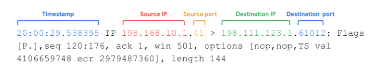
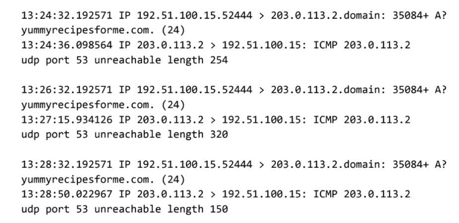

# Redes seguras contra ataques de denegación de servicio (DoS)

## Ataques de denegación de servicio (DoS)
- Un ataque de denegación de servicio es ​un ataque que tiene como objetivo una red o un servidor ​y lo inunda de tráfico de red.
   - ​El objetivo de un ataque de denegación de servicio, ​o un ataque DoS, es interrumpir ​las operaciones comerciales normales ​al sobrecargar la red de una organización.
   - ​El objetivo del ataque es enviar ​tanta información a un dispositivo de red ​que se bloquee o ​no pueda responder a los usuarios legítimos.
   - ​Esto significa que la organización no ​podrá llevar a cabo sus operaciones comerciales normales, ​lo que puede costarles tiempo y dinero.
   - ​Una caída de la red también puede dejarlos ​vulnerables a otras amenazas y ataques de Seguridad.
- ​Un ataque de denegación de servicio distribuido, o DDoS, ​es un tipo de ataque DoS que utiliza ​varios dispositivos o servidores en ​diferentes ubicaciones para inundar ​la red objetivo con tráfico no deseado.
   - El ​uso de numerosos dispositivos aumenta las probabilidades de que ​la cantidad total de tráfico ​enviado abrume al servidor de destino.
- ​Recuerde que DoS significa denegación de servicio.
- ​Por lo tanto, no importa qué parte ​de la red sobrecargue el atacante; ​si sobrecarga algo, gana.
- ​Un ejemplo desafortunado que he ​visto es el de un atacante que creó ​un paquete muy cuidadoso que provocó que ​un router dedicara más tiempo a procesar la solicitud.
- ​El volumen total de tráfico no sobrecargó el router; ​sí lo hicieron los detalles del paquete.
- ​Ahora analizaremos los ataques DoS a nivel de red ​que tienen como objetivo el ancho de banda de la red para reducir el tráfico. 
- ​Conozcamos tres ataques DoS comunes a nivel de red.
   - ​El primero se denomina Ataque de SYN flood.
      - ​Un ataque de inundación SYN es un tipo ​de ataque DoS que simula la ​conexión TCP e inunda el servidor con paquetes SYN.
      - ​Analicemos un poco ​más esta definición analizando más de cerca ​el proceso de protocolo de enlace que se utiliza para establecer ​una conexión TCP entre un dispositivo y un servidor.
      - ​El primer paso del protocolo de enlace es que el dispositivo envíe ​una solicitud SYN o sincronice al servidor.
      - ​A continuación, el servidor responde con ​un paquete SYN/ACK para ​confirmar la recepción de la solicitud del dispositivo ​y deja un puerto abierto para ​el paso final del protocolo de enlace.
      - ​Una vez que ​el servidor recibe el paquete ACK final del dispositivo, ​se establece una conexión TCP.
      - Los actores malintencionados pueden aprovechar el protocolo ​inundando un servidor con ​solicitudes de paquetes SYN para la primera parte del protocolo de enlace.
      - ​Sin embargo, si el número de solicitudes SYN es ​mayor que el número de puertos disponibles en el servidor, ​el servidor se saturará ​y no podrá funcionar.
   - Analicemos otros dos ataques DoS comunes ​que utilizan otro protocolo llamado ICMP. ​ICMP son las siglas de Protocolo de mensajes de control de Internet.
      - El ​ICMP es un protocolo de Internet que utilizan los dispositivos ​para informarse unos a otros sobre ​los errores de transmisión de datos en la red.
      - ​Piense en ICMP como una solicitud de ​actualización de estado desde un dispositivo.
      - ​El dispositivo devolverá ​mensajes de error si hay algún problema con la red. 
      - ​Puede pensar en esto como ​la solicitud ICMP que se registra en ​el dispositivo para asegurarse de que todo está bien.
      - ​Un ataque de Inundación ICMP ​es un tipo de ataque DoS realizado por un atacante que envía ​repetidamente paquetes ICMP a un servidor de red.
      - ​Esto obliga al servidor a enviar un paquete ICMP.
      - Con el ​tiempo, esto consume todo el ancho de banda para el ​tráfico entrante y saliente y hace que el servidor se bloquee.
- ​Los dos ataques de los que hemos hablado hasta ahora, la ​inundación SYN y la inundación ​ICMP, aprovechan ​los protocolos de comunicación al enviar una cantidad abrumadora de solicitudes.
- ​También hay ataques que pueden abrumar ​el servidor con una gran solicitud.
- Un ejemplo del que hablaremos ​es el llamado ping de la muerte. 
- Un ataque de ping of death es ​un tipo de ataque DoS que se produce cuando un hacker hace ​ping a un sistema enviándole ​un paquete ICMP sobredimensionado de ​más de 64 kilobytes, ​el tamaño máximo de un paquete ICMP formado correctamente.
- ​Hacer ping a un servidor de red vulnerable con ​un paquete ICMP sobredimensionado ​sobrecargará el sistema y provocará que se bloquee.
- ​Piensa en esto como dejar caer una piedra sobre un pequeño hormiguero.
- ​Cada hormiga individual puede cargar una cierta cantidad de ​peso mientras transporta comida hacia y desde el hormiguero.
- ​Pero si se deja caer una roca grande sobre el hormiguero, ​muchas hormigas serán aplastadas y la colonia no podrá ​funcionar hasta que reconstruya sus operaciones en otros lugares.

---

## Leer registros de tcpdump
- Un analizador de protocolos de red, a veces denominado sniffer de paquetes o analizador de paquetes, es una herramienta diseñada para capturar y analizar el tráfico de datos dentro de una red.
- Suelen utilizarse como herramientas de investigación para monitorizar redes e identificar actividades sospechosas.
- Existe una gran variedad de analizadores de protocolos de red, pero algunos de los más comunes son:
   - Analizador de Tráfico NetFlow de SolarWinds
   - ManageEngine OpManager
   - Observador de redes Azure
   - Wireshark
   - tcpdump
- tcpdump
   - tcpdump es un analizador de protocolos de red de línea de comandos.
   - Es popular, ligero -lo que significa que utiliza poca memoria y tiene un bajo uso de CPU- y utiliza la biblioteca de código abierto libpcap.
   - tcpdump está basado en texto, lo que significa que todos los comandos de tcpdump se ejecutan en el terminal.
   - También puede instalarse en otros sistemas operativos basados en Unix, como macOS.
   - Está preinstalado en muchas distribuciones de Linux.
   - tcpdump proporciona un breve análisis de paquetes y convierte la información clave sobre el tráfico de red en formatos fácilmente legibles por humanos.
   - Imprime información sobre cada paquete directamente en su terminal.
   - tcpdump también muestra la dirección IP de origen, las direcciones IP de destino y los números de puerto que se están utilizando en las comunicaciones. 
- Interpretar la salida
   - tcpdump imprime la salida del comando como los paquetes olfateados en la línea de comandos, y opcionalmente en un archivo de registro, después de ejecutar un comando.
   - La salida de una captura de paquetes contiene muchas piezas de información importante sobre el tráfico de la red.

- Alguna de la información que recibe de una captura de paquetes incluye:
   - Marca de tiempo: La salida comienza con la marca de tiempo, formateada como horas, minutos, segundos y fracciones de segundo.
   - IP de origen: El origen del paquete lo proporciona su dirección IP de origen.
   - Puerto de origen: Este número de puerto es donde se originó el paquete.
   - IP de destino: La dirección IP de destino es hacia dónde se está transmitiendo el paquete.
   - Puerto de destino: Este número de puerto es hacia donde se está transmitiendo el paquete.

- Por defecto, tcpdump intentará resolver las direcciones de host a nombres de host. También sustituirá los números de puerto por servicios comúnmente asociados que utilicen estos puertos.
- Usos comunes
   - tcpdump y otros analizadores de protocolos de red se utilizan habitualmente para capturar y visualizar las comunicaciones de red y para recopilar estadísticas sobre la red, como la solución de problemas de rendimiento de la red.
   - También pueden utilizarse para:
      - Establecer una línea de base para los patrones de tráfico de red y las métricas de utilización de la red.
      - Detectar e identificar el tráfico malicioso
      - Crear alertas personalizadas para enviar las notificaciones adecuadas cuando surjan problemas en la red o amenazas a la seguridad.
      - Localizar la mensajería instantánea (MI), el tráfico o los puntos de acceso inalámbricos no autorizados.
   - Sin embargo, los atacantes también pueden utilizar los analizadores de protocolos de red de forma maliciosa para obtener información sobre una red específica.
   - Por ejemplo, los atacantes pueden capturar paquetes de datos que contengan información confidencial, como nombres de usuario de cuentas y contraseñas.
   - Como analista de ciberseguridad, es importante comprender la finalidad y los usos de los analizadores de protocolos de red.

---

## Ataque DDoS en la vida real
- Los ataques DoS distribuidos volumétricamente (DDoS) saturan una red enviando paquetes de datos no deseados en cantidades tan grandes que los servidores se vuelven incapaces de dar servicio a los usuarios normales.
- Esto puede ser perjudicial para una organización.
- Cuando los sistemas fallan, las organizaciones no pueden satisfacer las necesidades de sus clientes.
- A menudo pierden dinero y, en algunos casos, incurren en otras pérdidas.
- La Reputación de una organización también puede sufrir si las noticias de un ataque DDoS exitoso llegan a los consumidores, que entonces cuestionan la Seguridad de la organización.

- Un DDoS dirigido a un servidor DNS muy utilizado
   - Los servidores DNS traducen los nombres de dominio de los sitios web en la dirección IP del sistema que contiene la información del sitio web.
   - Por ejemplo, si un usuario tecleara la URL de un sitio web, un servidor DNS la traduciría en una dirección IP numérica que dirige el tráfico de red a la ubicación del servidor del sitio web.
   - El día del ataque DDoS que estamos estudiando, muchas grandes empresas utilizaban un proveedor de servicios DNS.
   - El proveedor de servicios alojaba el sistema DNS para estas empresas.
   - Esto significaba que cuando los usuarios de Internet tecleaban la URL del sitio web al que querían acceder, sus dispositivos eran dirigidos al lugar correcto.
   - El 21 de octubre de 2016, el proveedor de servicios fue víctima de un ataque DDoS.
- Antes del ataque
   - Antes del ataque al proveedor de servicios, un grupo de estudiantes universitarios creó una botnet con la intención de atacar varios servidores y redes de juegos.
   - Una botnet es una colección de computadoras infectadas por software malicioso que están bajo el control de un único agente de amenaza, conocido como "bot-herder".
   - Cada computadora de la botnet puede ser controlada a distancia para enviar un paquete de datos a un sistema objetivo.
   - En un ataque de botnet, los ciberdelincuentes ordenan a todos los bots de la botnet que envíen paquetes de datos al sistema objetivo al mismo tiempo, lo que da lugar a un ataque DDoS.
   - El grupo de estudiantes universitarios publicó en línea el código de la botnet para que fuera accesible a miles de usuarios de Internet y las autoridades no pudieran rastrear la botnet hasta los estudiantes.
   - Al hacerlo, hicieron posible que otros actores maliciosos aprendieran el código de la botnet y la controlaran a distancia.
   - Esto incluyó a los ciberdelincuentes que atacaron al proveedor de servicios DNS.
- El día del ataque
   - A las 7 de la mañana del día del ataque, la botnet envió decenas de millones de peticiones DNS al proveedor de servicios.
   - Esto desbordó el sistema y el servicio DNS se desconectó.
   - Esto significaba que no se podía acceder a todos los sitios web que utilizaban el proveedor de servicios.
   - Cuando los usuarios intentaban acceder a los distintos sitios web que utilizaban el proveedor de servicios, no eran dirigidos al sitio web que habían tecleado en su navegador.
   - Las interrupciones de cada servicio web se produjeron en toda Norteamérica y Europa.
   - Los sistemas del proveedor de servicios se restablecieron tras sólo dos horas de inactividad.
   - Aunque los ciberdelincuentes enviaron oleadas posteriores de ataques de botnet, la empresa de DNS estaba preparada y fue capaz de mitigar el impacto. 

---

## Actividad: Analizar la comunicación en la capa de red
- Resumen de la actividad
   - En esta actividad, analizará el tráfico DNS e ICMP en tránsito utilizando los datos de una herramienta de análisis de protocolos de red. 
   - Identificará qué protocolo de red se utilizó en la evaluación del incidente de ciberseguridad.
   - En la capa de Internet del Modelo TCP/IP, la IP formatea los paquetes de datos en datagramas IP
   - La información proporcionada en el datagrama de un paquete IP puede ofrecer a los analistas de seguridad una visión de los paquetes de datos sospechosos en tránsito
   - Saber cómo identificar el tráfico potencialmente malicioso en una red puede ayudar a los analistas de ciberseguridad a evaluar los riesgos de seguridad en una red y a reforzar la seguridad de la misma
- Escenario
   - Usted es un analista de ciberseguridad que trabaja en una empresa especializada en la prestación de servicios informáticos para clientes
   - Varios clientes de clientes informaron de que no podían acceder al sitio web de la empresa cliente www.yummyrecipesforme.com, y vieron el error "puerto de destino inalcanzable" después de esperar a que se cargara la página
   - Usted tiene la tarea de analizar la situación y determinar qué protocolo de red se vio afectado durante este incidente
   - Para empezar, intenta visitar la página web y también recibe el error "puerto de destino inalcanzable"
   - Para solucionar el problema, carga su herramienta de análisis de red, tcpdump, e intenta cargar de nuevo la página web
   - Para cargar la página web, su navegador envía una consulta a un servidor DNS a través del protocolo UDP para recuperar la dirección IP del nombre de dominio del sitio web; esto forma parte del protocolo DNS
   - A continuación, su navegador utiliza esta dirección IP como IP de destino para enviar una solicitud HTTPS al servidor web para mostrar la página web
   - El analizador muestra que cuando envía paquetes UDP al servidor DNS, recibe paquetes ICMP que contienen el mensaje de error: "Puerto udp 53 inalcanzable".

- En el registro tcpdump, se encuentra la siguiente información:
1. Las dos primeras líneas del archivo de registro muestran la petición saliente inicial de su ordenador al servidor DNS solicitando la dirección IP de yummyrecipesforme.com. Esta solicitud se envía en un Paquete UDP.
2. La tercera y cuarta líneas del registro muestran la respuesta a su paquete UDP. En este caso, la línea ICMP 203.0.113.2 es el inicio del mensaje de error que indica que el paquete UDP no se pudo entregar en el puerto 53 del servidor DNS.
3. Delante de cada solicitud y respuesta, encontrará marcas de tiempo que indican cuándo se produjo el incidente. En el registro, ésta es la primera secuencia de números que aparece: 13:24:32.192571. Esto significa que la hora es 13:24, 32,192571 segundos.
4. Después de las marcas de tiempo, encontrará las direcciones IP de origen y destino. En la primera línea, donde el paquete UDP viaja desde su navegador hasta el servidor DNS, esta información se muestra como: 192.51.100.15 > 203.0.113.2.dominio. La dirección IP a la izquierda del símbolo mayor que (>) es la dirección de origen, que en este ejemplo es la dirección IP de su ordenador. La dirección IP a la derecha del símbolo mayor que (>) es la dirección IP de destino. En este caso, es la dirección IP del servidor DNS: 203.0.113.2.dominio. Para la respuesta de error ICMP, la dirección de origen es 203.0.113.2 y el destino es la dirección IP de su ordenador 192.51.100.15.
5. Después de las direcciones IP de origen y destino, puede haber una serie de detalles adicionales como el protocolo, el número de puerto de origen y las banderas. En la primera línea del registro de errores, el número de identificación de la consulta aparece como: 35084. El signo más después del número de identificación de la consulta indica que hay banderas asociadas al mensaje UDP. La "A?" indica una bandera asociada con la solicitud DNS de un registro A, donde un registro A mapea un nombre de dominio a una dirección IP. La tercera línea muestra el protocolo del mensaje de respuesta al navegador: "ICMP", al que sigue un mensaje de error ICMP.
6. El mensaje de error, "puerto udp 53 inalcanzable" se menciona en la última línea. Puerto 53 es un puerto para el servicio DNS. La palabra "inalcanzable" en el mensaje indica que el mensaje UDP que solicitaba una dirección IP para el dominio "www.yummyrecipesforme.com" no llegó al servidor DNS porque no había ningún servicio escuchando en el puerto DNS receptor.
7. Las líneas restantes del registro indican que se enviaron paquetes ICMP dos veces más, pero en ambas ocasiones se recibió el mismo error de entrega.

- Ahora que ha capturado los paquetes de datos utilizando una herramienta de análisis de red, su trabajo consiste en identificar qué protocolo de red y qué servicio se vieron afectados por este incidente. 
- A continuación, deberá redactar un informe de seguimiento.
- Como analista, puede inspeccionar el tráfico de red y los datos de red para determinar qué está causando los problemas relacionados con la red durante los incidentes de ciberseguridad.
- Más adelante en este curso, demostrará cómo gestionar y resolver incidentes. Por ahora, sólo necesita analizar la situación.
- Mientras tanto, este incidente está siendo gestionado por ingenieros de seguridad después de que usted y otros analistas hayan informado del problema a su supervisor directo.

- Instrucciones paso a paso
   - Siga las instrucciones y responda a la pregunta siguiente para completar la actividad.
   - A continuación, pase al siguiente punto del curso para comparar su trabajo con un ejemplar completado.

- Paso 1: Acceder a la plantilla
   - [Plantilla de informe sobre incidentes de ciberseguridad](./resources/Cybersecurity-incident-report-network-traffic-analysis.docx)
- Paso 2: Acceda a los materiales de apoyo  
   - [Ejemplo de Informe de Incidente de Ciberseguridad](./resources/Example-of-a-Cybersecurity-Incident-Report.docx)
- Paso 3: Proporcione un resumen del problema encontrado en el registro tcpdump
   - Tras analizar los datos que le presenta el registro tcpdump, identifique tendencias en los datos.
   - Evalúe qué protocolo está produciendo el mensaje de error del servidor DNS para el sitio web yummyrecipesforme.com.
   - Recuerde que uno de los puertos que se muestra repetidamente es el Puerto 53, comúnmente utilizado para DNS.
   - En su análisis  
      - Incluya un breve resumen del análisis del registro tcpdump e identifique qué protocolos se utilizaron para el Tráfico de red.
      - Proporcione algunos detalles sobre lo indicado en el registro.
      - Interprete los problemas encontrados en el registro.
      - Registre sus respuestas en la primera parte del informe sobre incidentes de ciberseguridad.
- Paso 4: Explique su análisis de los datos y proporcione una solución para aplicar 
   - Ahora que ha inspeccionado el registro de tráfico y ha identificado las tendencias en el tráfico, describa por qué aparecieron los mensajes de error en el registro.
   - Utilice su respuesta del paso anterior y el escenario para identificar la razón de los mensajes de error ICMP.
   - Los mensajes de error indican que hay un problema con un puerto específico.
   - ¿Qué revelan los diferentes protocolos implicados en el registro sobre la incidencia?
   - En su respuesta:
      - Indique cuándo se informó del problema por primera vez.
      - Proporcione el escenario, los eventos y los síntomas identificados cuando se informó del incidente por primera vez.
      - Explique el estado actual del problema.
      - Describa la información descubierta al investigar el problema hasta este momento.
      - Enumere los siguientes pasos para solucionar y resolver el problema.
      - Proporcione la presunta causa raíz del problema.
   - Registre sus respuestas en la segunda parte del informe sobre incidentes de ciberseguridad. 

- Informe:
1. Proporcione un resumen del problema encontrado en el registro de tráfico DNS e ICMP.
> El analisis del logs entregados por tcpdump indica que el puerto 53 está inaccesible al intentar ingresar a la web yummyrecipesforme.com. El puerto 53 es el puerto utilizado por el protocolo DNS, lo que podría indicar que el servidor DNS está caído o que el puerto está bloqueado por un firewall. Esto provoca que el navegador no pueda resolver la dirección IP del dominio y, por lo tanto, no puede acceder al sitio web.

2. Explique su análisis de los datos y proporcione al menos una causa del incidente.
> El incidente se reportó cerca de las 13:20 horas, cuando varios clientes informaron que no podían acceder al sitio web yummyrecipesforme.com y recibieron el error "puerto de destino inalcanzable". A las 13:24 horas, se realizó un análisis con tcpdump que mostró que las solicitudes DNS enviadas al servidor no recibieron respuesta (puerto 53 inalcanzable). Esto indica que el servidor DNS no estaba disponible o que el puerto estaba bloqueado por el firewall. Los siguientes pasos serían verificar la configuración y estado del servidor DNS, así como revisar las reglas del firewall para asegurarse de que el puerto 53 esté abierto y accesible.

---

## Ejemplar de actividad: Analizar la comunicación en la capa de red
- Aquí tiene un ejemplar completado junto con una explicación de cómo el ejemplar cumple las expectativas de la actividad.
- [Ejemplar de Informe de Incidente de Ciberseguridad](./resources/Cybersecurity-incident-report-exemplar-network-traffic-analysis.docx)
- [Ejemplar de Informe de Incidente de Ciberseguridad explicado](./resources/Cybersecurity-Incident-Report_-Network-Traffic-Analysis-.docx)

- Evaluación del ejemplar
   - Compare el ejemplar con su actividad finalizada. 
   - Revise su trabajo utilizando cada uno de los criterios del ejemplar. 
   - ¿Qué ha hecho bien? ¿En qué puede mejorar? Utilice sus respuestas a estas preguntas como guía a medida que siga avanzando en el curso.
- El ejemplar ofrece un posible enfoque para investigar y analizar un posible Evento de Seguridad. En su función de analista de seguridad, usted y su Equipo harían la mejor conjetura sobre lo ocurrido y luego investigarían más a fondo para solucionar el Problema y reforzar la seguridad general de su red.
- Redactar un Informe de análisis de ciberseguridad eficaz puede ayudarle a solucionar problemas y vulnerabilidades de la red con mayor rapidez y eficacia. Cuanta más práctica tenga analizando el Tráfico de red en busca de tendencias y actividades sospechosas, más eficaces serán usted y su Equipo a la hora de gestionar y responder a los riesgos presentes en su red.

> La gran diferencia entre el reporte propio y el ejemplo es la cantidad de detalle, ambos explican y usan los datos importantes, pero el ejemplo tiene más información sobre la información de logs que entregó tcpdump.