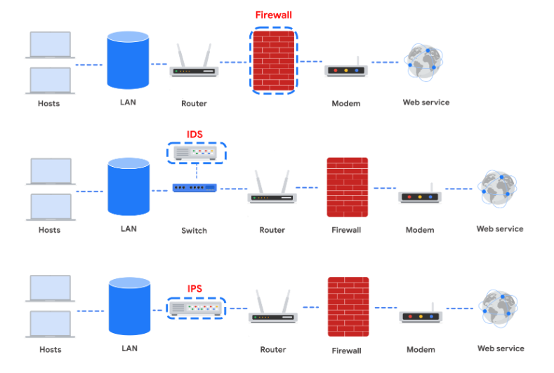
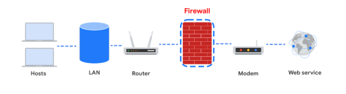
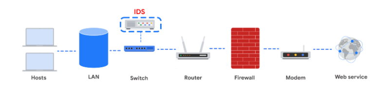
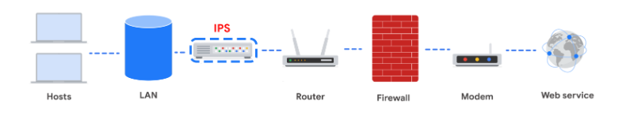
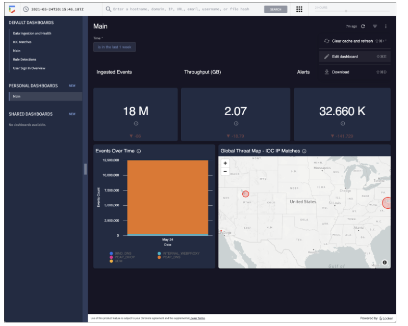

# Endurecimiento de la red

## Prácticas de endurecimiento de la red
- El endurecimiento de la red se centra ​en el endurecimiento de la seguridad relacionada con la red, ​como el filtrado de puertos, los privilegios de acceso a la red, ​y la encriptación a través de redes.
- ​Ciertas tareas de endurecimiento de la red se realizan regularmente, ​mientras que otras se realizan ​una vez y luego se actualizan según sea necesario.
- ​Algunas tareas que se ​realizan regularmente son el mantenimiento de las reglas del firewall, ​el análisis de registros de red, las actualizaciones de parches y las copias de seguridad de servidores. 
- Antes, aprendió que un registro es un registro de ​eventos que ocurren dentro de los sistemas de una organización.
- ​El análisis de registros de red es el proceso de ​examinar los registros de red para identificar eventos de interés.
- ​Los equipos de seguridad utilizan una herramienta de análisis de registros ​o una herramienta de gestión de eventos e información de seguridad, ​también conocida como SIEM, ​para llevar a cabo el análisis de registros de red.
- ​Una herramienta SIEM es una aplicación que recopila y analiza ​datos de registro para supervisar ​actividades críticas en una organización.
- ​Reúne datos de seguridad de una red y ​presenta esos datos en un único cuadro de mandos.
- ​La interfaz del cuadro de mandos se denomina a veces ​un único panel de cristal.
- ​Un SIEM ayuda a los analistas a inspeccionar, analizar, ​y reaccionar ante eventos de seguridad ​en toda la red en función de su prioridad.
- ​Los informes del SIEM proporcionan una lista de ​vulnerabilidades de red nuevas o en curso ​y las enumeran en una escala ​de prioridad de alta a ​baja, en la que las vulnerabilidades de alta prioridad ​tienen un plazo mucho más corto para su mitigación.
- ​Ahora que hemos cubierto las tareas ​que se realizan con regularidad, ​examinemos las tareas que se realizan una vez.
- ​Estas tareas incluyen el filtrado de puertos en cortafuegos, ​los privilegios de acceso a la red y ​la encriptación para la comunicación, entre otras muchas cosas.
- ​Comencemos con el filtrado de puertos.
   - ​El filtrado de puertos puede formarse a través de la Red.
   - ​El filtrado de puertos es una función del cortafuegos que bloquea o ​permite ciertos números de puerto ​para limitar la comunicación no deseada.
   - ​Un principio básico es que ​los únicos puertos que son ​necesarios son los que están permitidos.
   - ​Cualquier puerto que no esté siendo utilizado por ​las operaciones normales de la red debe ser desautorizado.
   - ​Esto protege contra las vulnerabilidades de los puertos.
- ​Las redes deberían configurarse con ​los protocolos inalámbricos más actualizados ​disponibles y ​los protocolos inalámbricos más antiguos deberían desactivarse.
- ​Los analistas de seguridad también utilizan ​la segmentación de red para crear ​subredes aisladas para ​diferentes departamentos de una organización.
- ​Por ejemplo, podrían hacer una para ​el departamento de marketing y ​una para el departamento financiero.
- ​Esto se hace para que los problemas de ​cada subred no se extiendan por toda la empresa y ​sólo los usuarios especificados tengan acceso a ​la parte de la red que necesitan para su función.
- ​La segmentación de red también puede utilizarse ​para separar diferentes zonas de seguridad.
- ​Cualquier zona restringida de una red que contenga ​datos altamente clasificados o confidenciales ​debería estar separada del resto de la red.
- ​Por último, todas las comunicaciones de red deberían ​cifrarse utilizando los últimos estándares de cifrado.
- ​Los Estándares de encriptación son reglas o métodos utilizados para ​ocultar los datos salientes y ​descubrir o desencriptar los datos entrantes.
- ​Los datos en zonas restringidas deben ​tener unos Estándares de encriptación mucho más altos, ​lo que hace que sea más difícil acceder a ellos.

---

## Aplicaciones de Seguridad de red
- Cada dispositivo, herramienta o estrategia de seguridad implementada por los analistas de seguridad protege -o refuerza- aún más la red hasta que el propietario de la red está satisfecho con el nivel de seguridad.
- Este enfoque de añadir capas de seguridad a una red se conoce como defensa en profundidad.
- Aprenderás sobre el papel de cuatro dispositivos utilizados para proteger una red: cortafuegos, sistemas de detección de intrusiones, sistemas de prevención de intrusiones y herramientas de gestión de eventos e información de seguridad.
- Los profesionales de la seguridad de redes tienen la opción de utilizar cualquiera o todos estos dispositivos y herramientas dependiendo del nivel de seguridad que esperan alcanzar. 
- Esta lectura discutirá los beneficios de la seguridad por capas.
- Cada herramienta mencionada es una capa adicional de defensa que puede reforzar gradualmente una red, empezando por el nivel mínimo de seguridad (proporcionado sólo por un cortafuegos), hasta el nivel más alto de seguridad (proporcionado por la combinación de un cortafuegos, un dispositivo de detección y prevención de intrusiones y la monitorización de eventos de seguridad).

- Cada herramienta tiene su propio lugar en la arquitectura de la red.
- Los analistas de seguridad deben comprender las topologías de red que se muestran en los diagramas.
- Cortafuegos
   - Hasta ahora en este curso, has aprendido sobre firewalls sin estado, firewalls con estado, y firewalls de próxima generación (NGFWs), y las ventajas de seguridad de cada uno de ellos.
   - La mayoría de los cortafuegos son similares en sus funciones básicas.
   - Los cortafuegos permiten o bloquean el tráfico basándose en un conjunto de reglas.
   - Cuando los paquetes de datos entran en una red, se inspecciona la cabecera del paquete y se permite o deniega en función de su número de puerto.
   - Los NGFW también pueden inspeccionar la carga útil de los paquetes.
   - Cada sistema debe tener su propio cortafuegos, independientemente del cortafuegos de red.

- Sistema de detección de intrusos 
   - Un sistema de detección de intrusiones (IDS) es una aplicación que supervisa la actividad del sistema y alerta sobre posibles intrusiones.
   - Un IDS alerta a los administradores basándose en la firma del tráfico malicioso.
   - El IDS está configurado para detectar ataques conocidos.
   - Los sistemas IDS suelen olfatear los paquetes de datos mientras se mueven por la red y los analizan en busca de las características de ataques conocidos.
   - Algunos sistemas IDS no sólo buscan firmas de ataques conocidos, sino también anomalías que podrían ser el signo de actividad maliciosa.
   - Cuando el IDS descubre una anomalía, envía una alerta al administrador de la red, que puede investigar más a fondo.
   - Las limitaciones de los sistemas IDS son que sólo pueden buscar ataques conocidos o anomalías obvias.
   - Los ataques nuevos y sofisticados pueden no ser detectados.
   - La otra limitación es que el IDS no detiene realmente el tráfico entrante si detecta algo raro.
   - Depende del administrador de la red detectar la actividad maliciosa antes de que cause algún daño a la red.
   - Cuando se combina con un cortafuegos, un IDS añade otra capa de defensa.
   - El IDS se coloca detrás del cortafuegos y antes de entrar en la LAN, lo que permite al IDS analizar flujos de datos después de que el tráfico de red no permitido por el cortafuegos haya sido filtrado.
   - Esto se hace para reducir el ruido en las alertas IDS, también conocidas como falsos positivos.

- Sistema de prevención de intrusiones 
   - Un sistema de prevención de intrusiones (IPS) es una aplicación que monitoriza la actividad del sistema en busca de actividades intrusivas y toma medidas para detener la actividad.
   - Ofrece incluso más protección que un IDS porque detiene activamente las anomalías cuando las detecta, a diferencia del IDS que simplemente informa de la anomalía a un administrador de red.
   - Un IPS busca firmas de ataques conocidos y anomalías en los datos.
   - Un IPS informa de la anomalía a los analistas de seguridad y bloquea un remitente específico o elimina paquetes de red que parecen sospechosos.
   - El IPS (como un IDS) se sitúa detrás del cortafuegos en la arquitectura de red.
   - Esto ofrece un alto nivel de seguridad porque los flujos de datos de riesgo se interrumpen incluso antes de que lleguen a las partes sensibles de la red.
   - Sin embargo, una limitación potencial es que está en línea: Si se rompe, se rompe la conexión entre la red privada e Internet.
   - Otra limitación de los IPS es la posibilidad de que se produzcan falsos positivos, lo que puede provocar que se elimine tráfico legítimo.

- Dispositivos de captura completa de paquetes
   - Los dispositivos de captura de paquetes completos pueden ser increíblemente útiles para los administradores de red y los profesionales de la seguridad.
   - Estos dispositivos permiten grabar y analizar todos los datos que se transmiten por la red.
   - También ayudan a investigar las alertas creadas por un IDS.

- Información de seguridad y gestión de eventos 
   - Un sistema de gestión de eventos e información de seguridad (SIEM ) es una aplicación que recopila y analiza datos de registro para supervisar actividades críticas en una organización.
   - Las herramientas SIEM trabajan en tiempo real para informar de actividades sospechosas en un panel centralizado.
   - Además, las herramientas SIEM analizan los datos de registro de red procedentes de IDS, IPS, cortafuegos, VPN, proxies y registros DNS.
   - Las herramientas SIEM son una forma de agregar datos de eventos de seguridad para que aparezcan en un solo lugar y puedan ser analizados por los analistas de seguridad.
   - Es lo que se conoce como un único panel de cristal. 
   - A continuación, puede ver un ejemplo de un panel de la herramienta SIEM de Google Cloud, Chronicle. Chronicle es una herramienta nativa de la nube diseñada para retener, analizar y buscar datos.

- Splunk es otra herramienta SIEM común.
   - Splunk ofrece diferentes opciones de herramientas SIEM: Splunk Enterprise y Splunk Cloud, ambas opciones incluyen paneles detallados que ayudan a los profesionales de la seguridad a revisar y analizar los datos de una organización.
- También hay otras herramientas SIEM similares disponibles, y es importante que los profesionales de la seguridad investiguen las diferentes herramientas para determinar cuál es la más beneficiosa para la organización.
- Una herramienta SIEM no sustituye a los conocimientos de los analistas de seguridad ni a las actividades de mantenimiento de redes y sistemas que se tratan en este curso, sino que se utilizan en combinación con otros métodos de seguridad.
- Los analistas de seguridad suelen trabajar en un Centro de Operaciones de Seguridad (SOC) donde pueden supervisar la actividad en toda la red.
- A continuación, pueden utilizar sus conocimientos y experiencia para determinar cómo responder a la información en el tablero de instrumentos y decidir cuándo los eventos cumplen los criterios para ser escalados a la supervisión.

| Dispositivos/herramientas | Ventajas | Desventajas |
| ---------------------------- | ------------------------- | ------------------------- |
| Cortafuegos | Un cortafuegos permite o bloquea el tráfico basándose en un conjunto de reglas. | Un cortafuegos sólo es capaz de filtrar paquetes basándose en la información proporcionada en la cabecera de los paquetes. |
| Sistema de detección de intrusiones (IDS) | Un IDS detecta y alerta a los administradores sobre posibles intrusiones, ataques y otro tráfico malicioso. | Un IDS sólo puede buscar ataques conocidos o anomalías obvias; es posible que no detecte ataques nuevos y sofisticados. En realidad, no detiene el tráfico entrante. |
| Sistema de prevención de intrusiones (IPS) | Un IPS supervisa la actividad del sistema en busca de intrusiones y anomalías y actúa para detenerlas. | Un IPS es un dispositivo en línea. Si falla, se interrumpe la conexión entre la red privada e Internet. Puede detectar falsos positivos y bloquear el tráfico legítimo. |
| Información de seguridad y gestión de eventos (SIEM) | Una herramienta SIEM recopila y analiza los datos de registro de varios equipos de la red. Agrega los eventos de seguridad para su supervisión en un panel central. | Una herramienta SIEM sólo informa sobre posibles problemas de seguridad. No realiza ninguna acción para detener o prevenir eventos sospechosos. |

- La compra, instalación y mantenimiento de cada uno de estos dispositivos o herramientas cuesta dinero.
- Una organización puede necesitar contratar personal adicional para supervisar las herramientas de seguridad, como en el caso de un SIEM.
- Los responsables de la toma de decisiones tienen la tarea de seleccionar el nivel apropiado de seguridad basándose en el coste y el riesgo para la organización.

---

## Actividad: Análisis del endurecimiento de la red
- Resumen de la actividad
   - En esta actividad, se le presentará un escenario sobre una organización de medios sociales que recientemente experimentó una importante violación de datos causada por vulnerabilidades no detectadas.
   - Para hacer frente a la violación, identificará algunas herramientas comunes de refuerzo de la red que se pueden implementar para proteger la seguridad general de la organización.
   - A continuación, seleccionará una vulnerabilidad específica que tenga la empresa y propondrá diferentes métodos de endurecimiento de la red.
   - Por último, explicará cómo los métodos y herramientas que haya elegido serán eficaces para gestionar la vulnerabilidad y cómo evitarán posibles brechas en el futuro.
   - Ha aprendido prácticas de endurecimiento de la red y prácticas de endurecimiento relacionadas con la seguridad de la red, como el filtrado de puertos, los privilegios de acceso a la red y el cifrado en las redes.
   - Las prácticas de endurecimiento de la red ayudan a las organizaciones a controlar las posibles amenazas y ataques a su red y a evitar que se produzcan algunos ataques.
   - Algunas prácticas de endurecimiento se aplican todos los días, mientras que otras se ejecutan de vez en cuando, como cada dos semanas o una vez al mes.
   - Comprender cómo utilizar las herramientas y los métodos de endurecimiento de la red le ayudará a supervisar mejor la actividad de la red y a proteger la red de su organización contra diversos ataques.
   
- Escenario
   - Usted es un analista de seguridad que trabaja para una organización de medios sociales.
   - La organización ha sufrido recientemente una importante violación de datos, que ha puesto en peligro la seguridad de la información personal de sus clientes, como nombres y direcciones.
   - Su organización quiere implantar prácticas sólidas de endurecimiento de la red que puedan llevarse a cabo de forma coherente para evitar ataques y violaciones en el futuro.
   - Tras inspeccionar la red de la organización, usted descubre cuatro vulnerabilidades importantes. Las cuatro vulnerabilidades son las siguientes
      - Los empleados de la organización comparten contraseñas.
      - La contraseña de administrador de la base de datos está configurada por defecto.
      - Los cortafuegos no tienen reglas establecidas para filtrar el tráfico que entra y sale de la red.
      - No se utiliza la autenticación multifactor (MFA).
      - Si no se toman medidas para solucionar estas vulnerabilidades, la organización corre el riesgo de sufrir otra violación de datos u otros ataques en el futuro.
   - En esta actividad, redactará una evaluación de riesgos de seguridad para analizar el incidente y explicar qué métodos se pueden utilizar para proteger aún más la red.

- Instrucciones paso a paso

1. Acceder a la plantilla
- [Informe de evaluación de riesgos de seguridad](./resources/Security-risk-assessment-report.docx)

2. Acceso a los materios de apoyo
- Los siguientes materiales de apoyo le ayudarán a completar esta actividad
- [Herramientas de endurecimiento de la red](./resources/Network-hardening-tools.xlsx)

3. Seleccionar hasta tres herramientas y métodos de endurecimiento para implementar
- Piense en todas las herramientas y métodos de endurecimiento de la red que ha conocido en este curso y que pueden proteger la red de la organización de futuros ataques.
- ¿Qué tareas de endurecimiento serían la forma más eficaz de responder a esta situación?
- Escriba su respuesta en la primera parte de la hoja de trabajo.

4. Proporcionar y explicar 1-2 recomendaciones
- Ha recomendado una o dos prácticas de Endurecimiento de seguridad para ayudar a evitar que esto vuelva a ocurrir en el futuro.
- Explique por qué la herramienta o método de endurecimiento de seguridad seleccionado es eficaz para abordar la vulnerabilidad.
- Aquí tiene un par de preguntas para empezar:
   - ¿Por qué es eficaz la técnica de Endurecimiento de seguridad recomendada?
   - ¿Con qué frecuencia debe implementarse la técnica de endurecimiento?
- Escriba su respuesta en la segunda parte de la hoja de trabajo.

- Security risk assessment report
1. Select up to three hardening tools and methods to implement
El primer acción a tomar es eliminar las contraseñas por defectos de los servidores, servicios y sistemas, es crítico que estas sean reemplazadas por contraseñas fuertes y únicas, adicionalmente deben ser reemplazadas con una peridiocidad de 3 a 6 meses.
La segunda acción a tomar es tener un firewall activo, configurado y actualizado, este debe tener reglas de filtrado de tráfico entrante y saliente, adicionalmente se recomienda el bloqueo de puertos no utilizados, permitiendo el mínimo dispensable para el funcionamiento de la red, esto debe ser revisado y actualizado cada 3 meses.
La tercera acción a tomar es implementar la autenticación multifactor (MFA) en todos los sistemas críticos y servicios en la nube, esto debe ser revisado y actualizado cada 6 meses. Todos los usuarios deben ser entrenados en el uso de MFA y en la importancia de mantener sus credenciales seguras.

2. Explain your recommendation
La eliminación de contraseñas por defecto y la implementación de contraseñas fuertes y únicas reduce significativamente el riesgo de acceso no autorizado a los sistemas. Las contraseñas por defecto son conocidas y fácilmente explotables por actores maliciosos, mientras que las contraseñas fuertes y únicas dificultan el acceso no autorizado.
La implemetanción del firewall con reglas de filtrado de tráfico y bloqueo de puertos no utilizados ayuda a proteger la red contra ataques externos, limitando el acceso solo a los servicios necesarios y reduciendo la superficie de ataque.
La implementación de la autenticación multifactor (MFA) añade una capa adicional de seguridad, ya que incluso si un actor malicioso obtiene la contraseña de un usuario, no podrá acceder a la cuenta sin el segundo factor de autenticación. Esto es especialmente importante para proteger los sistemas críticos y los servicios en la nube, donde la información sensible puede estar almacenada.

---

## Ejemplo de actividad: Análisis del endurecimiento de la red
- Aquí está un ejemplar completado junto a una explicación de cómo el ejemplar cumple las expectativas de la actividad.
- [Ejemplar de Informe de evaluación de riesgos para la Seguridad](./resources/Security-risk-assessment-report-exemplar.docx)
- Evaluación del ejemplar
   - Compare el ejemplar con su actividad finalizada. Revise su trabajo utilizando cada uno de los criterios del ejemplar. 
   - ¿Qué ha hecho bien? ¿En qué puede mejorar?
- Nota: El ejemplar representa una posible explicación de los problemas a los que se enfrenta la organización de redes sociales. Existen múltiples herramientas y métodos correctos de Endurecimiento de seguridad que puede utilizar. Lo importante es que haya identificado las medidas de endurecimiento de la red más eficaces para gestionar las vulnerabilidades seleccionadas. En su Función de analista de seguridad, usted y su Equipo explicarían a continuación sus decisiones y argumentarían por qué esas medidas serán eficaces para proteger la red.

- El ejemplo se centra en la vulnerabilidad de un software obsoleto para una base de datos local.
- Se identifica una posible solución a la vulnerabilidad y se incluye en el Informe para los supervisores directos.
- En el Informe se explica cómo la empresa podría verse comprometida en el futuro si la base de datos no se parchea y si los empleados siguen compartiendo contraseñas. 
- En la sección sobre la política de seguridad de la información de la organización, el Informe incluye información sobre la adición de prácticas generales de refuerzo de la seguridad, una recomendación sobre la frecuencia con la que deben realizarse las prácticas de refuerzo y una explicación de cuáles son las posibles consecuencias si no se sigue la política.
- Este es un ejemplo de cómo puede analizarse un informe de evaluación de riesgos para la seguridad y cómo podría redactarse una política de seguridad de la información. 

- Diferencias entre ejemplar y actividad propia
Ambas usan las 3 recomendaciones de endurecimiento de la red: Cambio de contraseñas por defecto, implementación de firewall y autenticación multifactor (MFA). La diferencia es que el ejemplar da mucho más detalle de cómo beneficia a la organización la implementación de estas medidas, mientras que la actividad propia es más concisa y directa. 

---

## Ponga a prueba sus Conocimientos: Endurecimiento de la red

1. Rellene el espacio en blanco: Los equipos de Seguridad pueden utilizar _____ para examinar los registros de red e identificar los eventos de interés
- [ ] filtrado de puertos
- [ ] línea base de configuración
- [ ] segmentación de red
- [x] herramientas de administración de información y eventos de seguridad (SIEM)
> Los Equipos de Seguridad pueden utilizar herramientas de administración de información y eventos de seguridad (SIEM) para examinar los registros de red e identificar los eventos de interés. Las herramientas SIEM recopilan y analizan los datos de registro para monitorizar las actividades críticas de una organización.

2. ¿Cuál es el principio básico del Filtrado de puertos?
- [ ] Deshabilite los puertos utilizados por las operaciones normales de la red.
- [ ] Permitir a los usuarios el acceso sólo a las áreas de la red necesarias para su función.
- [ ] Bloquee todos los puertos de una red.
- [x] Permitir puertos utilizados por las operaciones normales de la red.
> Un principio básico del filtrado de puertos es permitir los puertos que son utilizados por las operaciones normales de la red. Cualquier puerto que no esté siendo utilizado por las operaciones normales de la red debe ser desautorizado para protegerlo contra vulnerabilidades.

3. Un profesional de la Seguridad crea diferentes subredes para los distintos departamentos de su empresa, asegurándose de que los usuarios tengan un acceso adecuado a sus funciones particulares. ¿Qué describe este escenario?
- [x] Segmentación de red
- [ ] Mantenimiento del firewall
- [ ] Análisis de registros de red
- [ ] Actualización de parches
> Este escenario describe la segmentación de red, que implica la creación de subredes aisladas para diferentes departamentos de una organización. 

4. Los Datos en zonas restringidas deben tener los mismos Estándares de encriptación que los datos en otras zonas
- [ ] Verdadero
- [x] Falso
> Las zonas restringidas de una red, que contienen Datos altamente clasificados o confidenciales, deben tener unos Estándares de encriptación mucho más altos que los datos de otras zonas para dificultar su acceso.