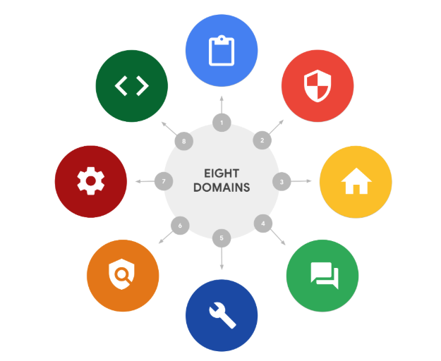

# Los ocho dominios de Seguridad CISSP

## Introducción a los ocho dominios de Seguridad CISSP, Parte 1
- Una forma de entender mejor estos conceptos básicos es ​organizarlos en categorías, denominadas dominios de Seguridad
- A partir de 2022, el CISSP ha definido ocho dominios ​para organizar el trabajo de los profesionales de la Seguridad
- Es importante entender que estos dominios están relacionados y que las brechas en un ​dominio pueden tener consecuencias negativas para toda la organización
- A medida que obtenga más información sobre los elementos de cada dominio, ​el trabajo que implica uno puede resultarle más atractivo que el de los demás. 
- ​Este dominio puede convertirse en una ruta de acceso profesional que puede explorar más a fondo
- En total hay ocho dominios de Seguridad CISSP, los primeros cuatros son los siguientes:
   - Seguridad y Gestión de Riesgos
   - Seguridad de los recursos
   - Arquitectura e ingeniería de seguridad
   - Seguridad de la red y las comunicaciones
- Seguridad y Gestión de Riesgos
   - La ​administración de seguridad y riesgos se centra en definir las metas y objetivos de seguridad, la ​mitigación de riesgos, el cumplimiento, la continuidad del negocio y la ley
   - Por ejemplo, es posible que los analistas de seguridad deban actualizar las políticas de la empresa ​relacionadas con la información médica privada ​si se realiza un cambio en una regulación de cumplimiento federal, como ​la Ley de Transferencia y Responsabilidad de los Seguros Médicos, también conocida como HIPAA. 
- Seguridad de los recursos. 
   - Este dominio se centra en proteger los activos digitales y físicos.
   - También está relacionado con el almacenamiento, el mantenimiento, la retención y ​la destrucción de datos
   - ​Al trabajar con este dominio, es posible que los analistas de Seguridad tengan la tarea de ​asegurarse de que el equipo antiguo se deseche y ​destruya adecuadamente, incluido cualquier tipo de información confidencial.
- Arquitectura e ingeniería de seguridad
   - Este dominio se centra en optimizar la Seguridad de los datos garantizando la existencia de herramientas ​, sistemas y procesos eficaces.
   - Como analista de seguridad, es posible que se le asigne la tarea de configurar un firewall.
   - Un firewall es un dispositivo que se usa para monitorear y filtrar el ​tráfico entrante y saliente de la red de computadoras. 
   - La configuración correcta de un firewall ayuda a prevenir los ataques que podrían afectar a ​la productividad
- Seguridad de la red y las comunicaciones
   - Este dominio se centra en administrar y proteger las redes físicas y las ​comunicaciones inalámbricas
   - Como analista de Seguridad, ​es posible que se le pida que analice el comportamiento de los usuarios dentro de su organización
   - ​Imagine descubrir que los usuarios se conectan a puntos de acceso inalámbricos no seguros
   - Esto podría dejar a la organización y a sus empleados vulnerables a los ataques
   - Para garantizar la seguridad de las comunicaciones, debe crear una política de red para ​prevenir y mitigar la exposición.
   - El ​mantenimiento de la seguridad de una organización es un esfuerzo de equipo y ​hay muchas partes móviles. 
- Como analista principiante, continuará desarrollando sus habilidades ​aprendiendo a mitigar los riesgos para mantener la seguridad de las personas y los datos
- No es necesario ser un experto en todos los dominios. Sin embargo, tener un conocimiento básico ​de ellos le ayudará en su viaje como profesional de Seguridad

---

## Introducción a los ocho dominios de Seguridad CISSP, Parte 2
- Los dominios describen y organizan la ​forma en que un equipo de profesionales de Seguridad trabaja en conjunto
- ​Según la organización, las ​funciones de los analistas pueden situarse en la intersección de ​varios dominios o centrarse en un dominio específico
- Saber dónde ​encaja un rol en particular dentro del panorama de la seguridad ​lo ayudará a prepararse para las entrevistas de trabajo ​y a trabajar como parte de un equipo de seguridad completo. 
- Los cuatro dominios restantes son los siguientes:
   - Administración de identidades y accesos
   - Evaluación y pruebas de seguridad
   - Operaciones de seguridad
   - Seguridad del desarrollo de software
- Administración de identidades y accesos
   - Se centra en mantener los datos seguros, ​garantizando que los usuarios sigan las políticas establecidas ​para controlar y administrar los activos físicos, ​como los espacios de oficina, y ​los activos lógicos, como las redes y las aplicaciones
   - La validación de las identidades de ​los empleados y la documentación de las funciones de acceso ​son esenciales para mantener ​la Seguridad física y digital de la organización
   - Por ejemplo, como analista de Seguridad, es ​posible que se te asigne la tarea de configurar el acceso de ​los empleados a los edificios con tarjeta de acceso
- Evaluación y pruebas de seguridad
   - ​Este dominio se centra en la ​realización de pruebas de control de seguridad, la ​recopilación y el análisis de datos y la realización de ​auditorías de seguridad para supervisar ​los riesgos, las amenazas y las vulnerabilidades
   - Los analistas de seguridad pueden realizar auditorías periódicas de ​los permisos de los usuarios para asegurarse de que ​los usuarios tengan el nivel de acceso correcto. 
   - ​Por ejemplo, el acceso a la ​información de nómina suele estar ​limitado a ciertos empleados, por lo que es ​posible que se pida a los analistas que auditen periódicamente los permisos para ​garantizar que ninguna persona no autorizada ​pueda ver los salarios de los empleados
- Operaciones de seguridad
   - Este dominio se centra en la realización de ​investigaciones y la implementación de medidas preventivas. 
   - Imagine que usted, como analista de Seguridad, ​recibe una alerta de que ​un dispositivo desconocido se ha ​conectado a su red interna
   - ​Deberá seguir las políticas ​y los procedimientos de la organización para detener rápidamente la posible amenaza
- Seguridad del desarrollo de software
   - Este dominio se centra en el uso de prácticas de programación seguras, ​que son un conjunto de directrices recomendadas que se utilizan ​para crear aplicaciones y servicios seguros. 
   - ​Un analista de seguridad puede trabajar con ​los equipos de desarrollo de software para garantizar que ​las prácticas de seguridad se ​incorporen al ciclo de vida del desarrollo de software
   - Si, por ejemplo, ​uno de sus equipos asociados está creando una nueva aplicación para dispositivos móviles: aplicación para dispositivos móviles, es ​posible que se le pida que informe ​sobre las políticas de contraseñas o que ​se asegure de que los datos de los usuarios ​estén protegidos y gestionados correctamente

---

## Determine el tipo de ataque
- Los dominios pueden ayudarle a comprender mejor cómo pueden organizarse en categorías las tareas de un analista de Seguridad
- Además, los dominios pueden ayudar a establecer una comprensión de cómo gestionar el riesgo

- Tipos de ataque
1. Ataque de descifrado de contraseña
   - Un ataque de descifrado de contraseña es un intento de acceder a dispositivos, sistemas, redes o datos protegidos por contraseña
   - Algunas formas de ataque de contraseña que conocerá más adelante en el programa de certificación son:
      - Fuerza bruta: Un ataque de fuerza bruta es un intento de descifrar una contraseña probando todas las combinaciones posibles hasta encontrar la correcta
      - Tabla rainbow: Una tabla rainbow es una lista de contraseñas precomputadas y sus valores hash correspondientes. Los atacantes pueden usar estas tablas para descifrar contraseñas más rápidamente que con un ataque de fuerza bruta
   - Los ataques de descifrado de contraseña entran dentro del **dominio de la Comunicación y la Seguridad de redes**.
2. Ataque de ingeniería social
   - La ingeniería social es una técnica de manipulación que explota el error humano para obtener información privada, accesibilidad u objetos de valor
   - Algunas formas de ataques de ingeniería social que seguirá conociendo a lo largo del Programa son: 
      - Phishing
      - Smishing
      - Vishing
      - Phishing dirigido
      - Whaling
      - Phishing en redes sociales
      - Compromiso de correo electrónico empresarial (BEC)
      - Ataque de "agujero de agua"
      - Cebo USB (bus universal en serie)
      - Ingeniería social física
   - Los ataques de ingeniería social están relacionados con el **dominio de la Seguridad y la Gestión de riesgos**.
3. Ataque físico
   - Un ataque físico es un incidente de Seguridad que afecta no sólo a los entornos digitales, sino también a los físicos donde se implementa
   - Algunas formas de ataques físicos son:
      - Cable USB malicioso
      - Unidad flash maliciosa
      - Clonación y robo de tarjetas
   - Los ataques físicos entran dentro del **dominio de la Seguridad de los recursos**.
4. Inteligencia artificial antagónica
   - La inteligencia artificial adversaria es una técnica que manipula la inteligencia artificial y la tecnología de aprendizaje automático para realizar ataques de forma más eficaz
   - La inteligencia artificial antagonista se encuadra tanto en el **dominio de la Seguridad de redes y comunicaciones** como en el **dominio de la Gestión de identidad y acceso**.
5. Ataque a la cadena de suministro
   - Ataque a la cadena de suministro dirigido a sistemas, aplicaciones, hardware y/o software para localizar una vulnerabilidad en la que se pueda implementar software malicioso
   - Dado que cada artículo vendido se somete a un proceso que implica a terceros, esto significa que la violación de la Seguridad puede producirse en cualquier punto de la cadena de suministro
   - Estos ataques son costosos porque pueden afectar a múltiples organizaciones y a las personas que trabajan para ellas
   - Los ataques a la Cadena de suministro pueden corresponder a varios dominios, incluidos, entre otros, los **dominios de Seguridad y Gestión de riesgos**, **Arquitectura de seguridad e ingeniería** y **Operaciones de seguridad**.
6. Ataque criptográfico
   - Ataque criptográfico que afecta a formas seguras de Comunicación entre un remitente y un destinatario.
   - Algunas formas de ataques criptográficos son:
      - Cumpleaños: ataque que busca encontrar dos mensajes diferentes que produzcan el mismo hash.
      - Colisión: ataque que encuentra dos entradas diferentes que generan el mismo valor hash.
      - Degradación: ataque que fuerza a un sistema a utilizar un nivel de seguridad más bajo.
   - Los ataques criptográficos pertenecen al **dominio de la Comunicación y la Seguridad de redes.**

>[!TIP] Si no puede encontrar un término en el glosario del NIST, introduzca el término de búsqueda apropiado (por ejemplo, "ataque de cumpleaños a la ciberseguridad") en su motor de búsqueda preferido para localizar la definición en otra fuente fiable, como un sitio .edu o .gov.

---

## Comprender a los atacantes
- Como recordatorio, un actor de amenaza es cualquier persona o grupo que presenta un riesgo para la Seguridad.
- En esta lectura, aprenderá sobre los diferentes tipos de actores de amenazas
- También aprenderá sobre sus motivaciones, intenciones y cómo han influido en la industria de la Seguridad.
- Tipos de agentes de amenaza
1. Amenaza persistente avanzada
   - Las amenazas persistentes avanzadas (APT) tienen una gran experiencia en acceder a la red de una organización sin autorización
   - Las APT tienden a investigar sus objetivos (por ejemplo, grandes empresas o entidades gubernamentales) con antelación y pueden permanecer sin ser detectadas durante un largo periodo de tiempo
   - Sus intenciones y motivaciones pueden incluir:
      - Dañar infraestructuras críticas, como la red eléctrica y los Recursos naturales
      - Obtener acceso a la propiedad intelectual, como secretos comerciales o patentes
2. Amenazas internas
   - Las amenazas internas abusan de su acceso autorizado para obtener Datos que pueden perjudicar a una organización
   - Sus intenciones y motivaciones pueden incluir
      - Sabotaje
      - Corrupción
      - Espionaje
      - Acceso no autorizado o filtración de Datos
3. Hacktivistas
   - Los Hacktivistas son Agentes de amenaza impulsados por una agenda política
   - Abusan de la tecnología digital para lograr sus objetivos, que pueden incluir:
      - Manifestaciones
      - Propaganda
      - Campañas de cambio social
      - Fama
- Tipos de hacker
   - Un hacker es cualquier persona que utiliza ordenadores para acceder a sistemas informáticos, redes o datos. 
   - Existen tres categorías principales de hackers:
      - Los hackers autorizados también se denominan hackers éticos. Siguen un Código Ético y se adhieren a la ley para llevar a cabo evaluaciones de riesgos organizativos. Están motivados para salvaguardar a las personas y a las organizaciones de los agentes de amenaza maliciosos.
      - Los hackers semiautorizados se consideran investigadores. Buscan vulnerabilidades pero no se aprovechan de las que encuentran.
      - Los hackers no autorizados también se denominan hackers no éticos. Son Agentes de amenaza maliciosos que no siguen ni respetan la ley. Su objetivo es recopilar y vender Datos confidenciales para obtener beneficios económicos.
   - Los Agentes de amenaza nuevos y no cualificados tienen varios objetivos, entre ellos:
      - Aprender y mejorar sus habilidades de pirateo
      - Buscar venganza
      - Explotar las debilidades de Seguridad mediante el uso de software malicioso, secuencias de comandos de programación y otras tácticas.
   - Otros tipos de hackers no están motivados por ninguna agenda en particular aparte de completar el trabajo para el que fueron contratados
   - Estos tipos de hackers pueden considerarse hackers no éticos o éticos
   - Se sabe que trabajan en tareas tanto ilegales como legales a cambio de una remuneración.
   - También hay hackers que se consideran vigilantes. Su principal objetivo es proteger al mundo de los hackers poco éticos.