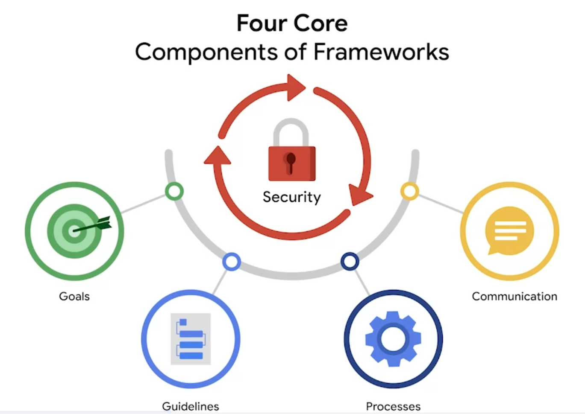
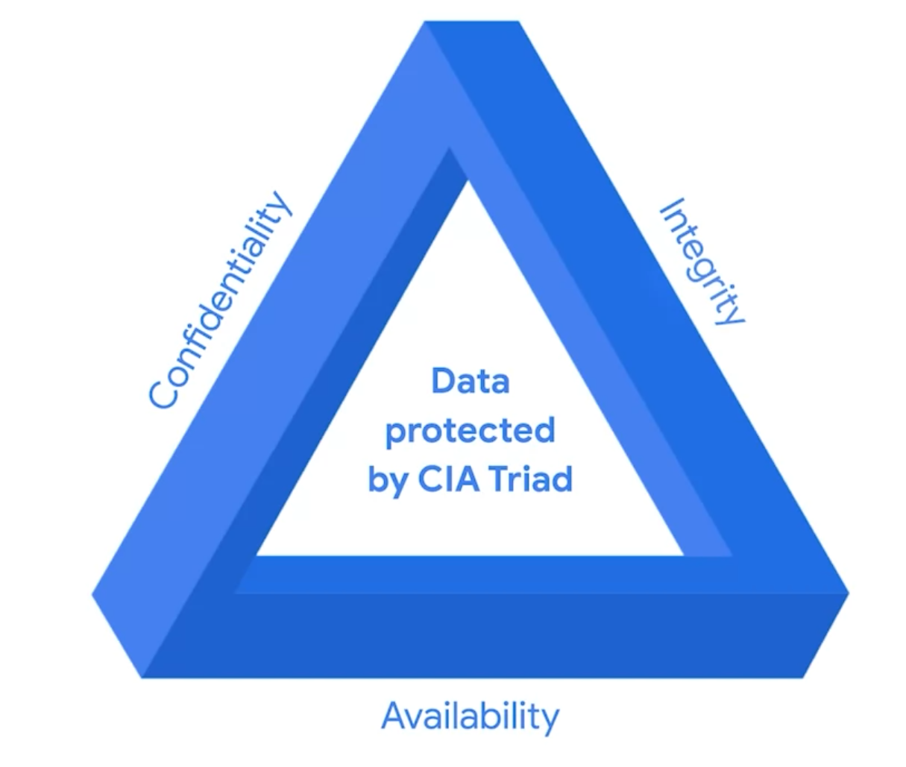

# Marcos y controles

## Bienvenido al módulo 3
- Discutiremos cómo las organizaciones se protegen a sí mismas de las amenazas, riesgos y ​vulnerabilidades cubriendo principios clave como: marcos, controles y ética
- Es una industria en evolución que le desafiará a introducir ​mejoras continuas en las políticas y procedimientos que le ayuden a proteger a su organización y ​a las personas a las que sirve
- ​También cubriremos los componentes básicos y ejemplos específicos de marcos y ​controles, incluida la Tríada de confidencialidad, integridad y ​disponibilidad, o CID
- Terminaremos con el debate sobre la Ética de la Seguridad y ​compartiremos algunas preocupaciones éticas notables en el campo de la Seguridad

---

## Introducción a los marcos y controles de Seguridad
- ​Imagine que trabaja como analista de Seguridad y recibe ​múltiples alertas sobre actividades sospechosas en la red.
- ​Se da cuenta de que necesitará implementar ​medidas de Seguridad adicionales para evitar que ​estas alertas se conviertan en ​incidentes graves
- Como analista, empezará por identificar los ​activos y riesgos críticos de su organización
- A continuación, implementará ​los marcos y controles necesarios
- veremos cómo usar los ​controles de Seguridad para gestionar o reducir riesgos específicos. 
- ​Los Marcos de seguridad son directrices que ​se utilizan para crear planes ​que ayuden a mitigar los riesgos y las amenazas a los datos y la privacidad
- Marcos de seguridad proporcionan un enfoque estructurado ​para implementar un ciclo de vida de seguridad
-  ​El ciclo de vida de la seguridad es ​un conjunto de políticas ​y normas en constante evolución que definen la ​forma en que una organización gestiona los riesgos, ​sigue las directrices establecidas ​y cumple con las leyes o el cumplimiento de las normativas
- El propósito de los marcos de seguridad incluye proteger
   - información de identificación personal (PII)
   - asegurar la información financiera
   - identificar ​las debilidades de seguridad
   - ​administrar los riesgos organizacionales
   - alinear la seguridad con los objetivos comerciales

- Los marcos tienen cuatro componentes principales y ​comprenderlos le permitirá ​gestionar mejor los riesgos potenciales.
- ​El primer componente principal es ​identificar y documentar los objetivos de Seguridad. 
   - ​Por ejemplo, una organización puede tener el objetivo de ​alinearse con la UE». s Reglamento General de Protección de Datos, ​también conocido como GDPR
   - El RGPD es una ley de protección de datos establecida para ​conceder a los ciudadanos europeos un mayor control ​sobre sus datos personales
   - Es posible que se le pida a un analista de seguridad que identifique y documente ​las áreas en las ​que una organización no cumple con el GDPR
- El segundo componente principal es establecer ​directrices para lograr los objetivos de Seguridad
   - Por ejemplo, al implementar ​directrices para cumplir con el RGPD, ​es posible que su organización necesite desarrollar ​nuevas políticas sobre cómo gestionar las ​solicitudes de datos de los usuarios individuales
- El tercer componente central de los marcos de seguridad es ​la implementación de procesos de seguridad sólidos
   - En el caso del RGPD, ​un analista de Seguridad que trabaje para ​una empresa de redes sociales puede ayudar a diseñar ​procedimientos para garantizar que la organización ​cumpla con las solicitudes de datos de usuario verificadas.
   - ​Un ejemplo de este tipo de solicitud es cuando un usuario ​intenta actualizar o eliminar la información de su perfil
- ​El último componente central de los ​marcos de Seguridad es el ​monitoreo y la comunicación de los resultados
   - Por ejemplo, puedes supervisar la ​red interna de tu organización e informar a ​tu gerente u oficial de cumplimiento normativo sobre un posible problema de Seguridad que afecte al RGPD.
- Los ​marcos permiten a los analistas trabajar junto con ​otros miembros del equipo de Seguridad para ​documentar, implementar y usar las políticas ​y los procedimientos que se han creado
- ​Los Controles de seguridad son medidas de seguridad ​diseñadas para reducir los riesgos de seguridad específicos
   - Por ejemplo, es ​posible que su empresa tenga una directriz que obligue a ​todos los empleados a completar ​una formación sobre privacidad para reducir el riesgo de violaciones de datos
   - Como analista de Seguridad, ​puede utilizar una herramienta de software para ​asignar automáticamente y hacer un seguimiento de ​los empleados que han completado esta formación
   - Los ​Marcos de seguridad y los controles son ​vitales para administrar la seguridad de todos los tipos de ​organizaciones y garantizar que todos ​hagan su parte para mantener un nivel de riesgo bajo
   - Comprender su propósito y cómo ​se utilizan permite a los analistas ​respaldar los objetivos de Seguridad de una organización ​y proteger a las personas a las que sirve

---

## Diseño seguro
- La tríada CID de la CIA es un ​modelo fundamental que ayuda a informar cómo ​las organizaciones consideran el riesgo al establecer sistemas y políticas de Seguridad

- CID es sinónimo de confidencialidad ​, integridad y disponibilidad
- La confidencialidad significa que solo los usuarios autorizados ​pueden acceder a activos o datos específicos. 
   - ​Por ejemplo, se deben ​establecer controles de acceso estrictos que definan quién debe y quién no debe tener acceso a los datos para garantizar que ​los datos confidenciales permanezcan seguros
- La integridad significa que los datos son ​correctos, auténticos y confiables
   - Para mantener la integridad, ​los profesionales de Seguridad pueden usar una forma de ​protección de datos, como la ​encriptación, para evitar que los datos sean manipulados
- ​Disponibilidad significa que los datos son ​accesibles para quienes están autorizados a acceder a ellos
- Definamos un término que surgió durante ​nuestra discusión sobre la tríada CID de la CIA: ​recurso.
   - ​Un recurso es un elemento que se percibe como valioso para una organización. ​Y el valor está determinado por el costo ​asociado con el recurso en cuestión. 
   - ​Por ejemplo, una aplicación que almacena datos confidenciales, ​como números de Seguridad Social o cuentas bancarias, ​es un recurso valioso para una organización. 
   - Conlleva más riesgos y, por lo tanto, requiere ​controles de Seguridad más estrictos en ​comparación con un sitio web que comparte contenido de noticias disponible públicamente
- Marco específico desarrollado por ​el ​Instituto Nacional de Estándares y Tecnología, con sede en EE. UU.: ​el Marco de Ciberseguridad, también ​conocido como NIST CSF
   - ​El marco de ciberseguridad del NIST es ​un marco voluntario que consiste en estándares ​, directrices y mejores prácticas ​para gestionar el riesgo de ciberseguridad
   - Es importante familiarizarse con este framework ​porque los equipos de Seguridad lo utilizan como ​base para gestionar los riesgos a corto y largo plazo. 
- Es ​importante comprender los diferentes motivos que puede tener un actor de amenazas, además de identificar los activos más valiosos de su organización
- Algunos de los actores de amenazas más peligrosos ​a tener en cuenta son los empleados descontentos. ​Son los más peligrosos porque a menudo tienen ​acceso a información confidencial ​y saben dónde encontrarla
- Para reducir este tipo de riesgo, los ​profesionales de Seguridad utilizarían ​el principio de disponibilidad, ​así como las directrices organizativas ​basadas en marcos para garantizar que ​los miembros del personal solo puedan acceder a ​los datos que necesitan para realizar su trabajo

---

## Controles, marcos y cumplimiento normativo
- Como recordatorio, un ciclo de vida de seguridad es un conjunto de políticas y normas en constante evolución.
- Cómo se relacionan los controles, los marcos y el cumplimiento de la normativa
   - La Tríada de confidencialidad, integridad y disponibilidad (CID ) es un modelo que ayuda a las organizaciones a tener en cuenta los riesgos a la hora de establecer sistemas y políticas de seguridad.
   - CID son los tres principios fundamentales utilizados por los profesionales de la ciberseguridad para establecer controles adecuados que mitiguen las amenazas, los riesgos y las vulnerabilidades.
   - Como se recordará, los Controles de seguridad son salvaguardas diseñadas para reducir riesgos de seguridad específicos
   - Por lo tanto, se utilizan junto con los marcos para garantizar que los objetivos y procesos de seguridad se implementan correctamente y que las organizaciones cumplen con los requisitos normativos
   - Los marcos de seguridad son directrices utilizadas para elaborar planes que ayuden a mitigar los riesgos y amenazas para los datos y la privacidad. Tienen cuatro componentes básicos:
      1. Identificar y documentar los objetivos de seguridad
      2. Establecer directrices para alcanzar los objetivos de seguridad
      3. Implantación de procesos de seguridad sólidos
      4. Supervisar y comunicar los resultados
   - El cumplimiento es el proceso de adhesión a normas internas y reglamentos externos.
- Controles específicos, marcos y cumplimiento
   - El Instituto Nacional de Estándares y Tecnología (NIST) es una agencia con sede en EE.UU
   - desarrolla múltiples marcos de cumplimiento voluntario que las organizaciones de todo el mundo pueden utilizar para ayudar a gestionar el riesgo
   - Cuanto más alineada esté una organización con el cumplimiento, menor será el riesgo
   - Algunos ejemplos de marcos son el Marco de Ciberseguridad del NIST (CSF) y el Marco de Gestión de Riesgos del NIST (RMF).
   - Otros controles, marcos y normativas
      - La Comisión Federal Reguladora de la Energía - Corporación Norteamericana de Fiabilidad Eléctrica (FERC-NERC)
         - La FERC-NERC es una normativa que se aplica a las organizaciones que trabajan con electricidad o que están relacionadas con la red eléctrica de Estados Unidos y Norteamérica
         - Este tipo de organizaciones tienen la obligación de prepararse, mitigar y notificar cualquier posible incidente de seguridad que pueda afectar negativamente a la red eléctrica
         - También tienen la obligación legal de adherirse a las Normas de Fiabilidad para la Protección de Infraestructuras Críticas (CIP) definidas por la FERC.
      - El Programa Federal de Gestión de Riesgos y Autorizaciones (FedRAMP®)
         - FedRAMP es un programa del gobierno federal de EE.UU. que estandariza la evaluación de la seguridad, la autorización, la supervisión y la gestión de los servicios en la nube y las ofertas de productos
         - Su objetivo es proporcionar coherencia entre el sector gubernamental y los proveedores de nube de terceros.
      - Centro para la Seguridad en Internet (CIS®)
         - Proporciona un conjunto de controles que pueden utilizarse para salvaguardar sistemas y redes contra ataques
         - Su objetivo es ayudar a las organizaciones a establecer un mejor plan de defensa
         - CIS también proporciona controles procesables que los profesionales de la seguridad pueden seguir si se produce un incidente de seguridad.
      - Reglamento General de Protección de Datos (RGPD)
         - El GDPR es un reglamento general de datos de la Unión Europea (UE) que protege el tratamiento de los datos de los residentes en la UE y su derecho a la privacidad dentro y fuera del territorio de la UE
         - Por ejemplo, si una organización no es transparente sobre los datos que tiene sobre un ciudadano de la UE y por qué los tiene, se trata de una infracción que puede acarrear una multa a la organización
         - Además, si se produce una violación y los datos de un ciudadano de la UE se ven comprometidos, éste debe ser informado
         - La organización afectada tiene 72 horas para notificar la violación al ciudadano de la UE.
      - Estándar de seguridad de los datos para la industria de tarjetas de pago (PCI DSS)
         - PCI DSS es una norma de seguridad internacional destinada a garantizar que las organizaciones que almacenan, aceptan, procesan y transmiten información de tarjetas de crédito lo hacen en un entorno seguro
         - El objetivo de esta norma de cumplimiento es reducir el fraude con tarjetas de crédito.
      - Ley de Transferencia y Responsabilidad de los Seguros Médicos (HIPAA)
         - La HIPAA es una ley federal estadounidense establecida en 1996 para proteger la información sanitaria de los pacientes
         - Esta ley prohíbe que la información de los pacientes se comparta sin su consentimiento. Se rige por tres normas:
            1. Privacidad
            2. Seguridad
            3. Notificación de infracciones
         - Las organizaciones que almacenan datos de pacientes tienen la obligación legal de informar a los pacientes de una violación, porque si la Información médica protegida (PHI) de los pacientes queda expuesta, puede conducir al robo de identidad y al fraude al seguro
         - La PHI se refiere a la salud física o mental pasada, presente o futura o al estado de salud de una persona, ya se trate de un plan de atención o de pagos por la atención
         - Además de conocer la ley HIPAA, los profesionales de la seguridad deben estar familiarizados con la Health Information Trust Alliance (HITRUST®), que es un marco de seguridad y un programa de garantía que ayuda a las instituciones a cumplir la ley HIPAA.
      - Organización Internacional de Normalización (ISO)
         - La ISO se creó para establecer normas internacionales relacionadas con la tecnología, la fabricación y la gestión transfronterizas.
         - Ayuda a las organizaciones a mejorar sus procesos y procedimientos de retención de personal, planificación, residuos y servicios.
      - Controles de Sistemas y Organizaciones (SOC tipo 1, SOC tipo 2)
         - El consejo de normas de auditoría del American Institute of Certified Public Accountants® (AICPA) desarrolló esta norma
         - Los SOC1 y SOC2 son una serie de informes que se centran en las políticas de acceso de los usuarios de una organización a diferentes niveles organizativos como:
            - Asociado
            - Supervisor
            - Gerente
            - Ejecutivo
            - Proveedor 
            - Otros
         - Se utilizan para evaluar el cumplimiento financiero y los niveles de riesgo de una organización
         - También abarcan la confidencialidad, privacidad, integridad, disponibilidad, seguridad y protección general de los datos.
         - Los fallos de control en estas áreas pueden conducir al fraude.

---

## Brezo: Proteger los Datos sensibles y la Información
- La PII ha sido un tema importante en Internet ​desde el principio de Internet
- Cuando pensamos en recopilar PII en nombre de otra persona, ​deberíamos asegurarnos de que somos muy deliberados sobre cómo se maneja y ​dónde se almacena, y que entendemos dónde se almacena todo el tiempo
- Dependiendo del tipo de función que desempeñe, ​puede que también necesite proteger esos datos para cumplir con la regulación o la ley
- Si una organización no cumple con sus obligaciones, ​pueden ocurrir varias cosas. 
   - ​En primer lugar, es posible que un regulador gubernamental se interese más por ​entender las prácticas en torno a la forma en que una empresa maneja los datos
   - En segundo lugar, es posible que los consumidores, clientes y empresas empiecen a ​preguntar directamente a la empresa cómo maneja los datos
   - ​Y en tercer lugar, la última consecuencia son las acciones legales. Y no es raro que ahora veamos a víctimas de incidentes de ​ciberseguridad demandando a empresas por manejar mal sus datos
- ​Puede mantenerse al día sobre el cumplimiento, la regulación y las leyes en torno a la PII ​consultando el sitio web pertinente en la jurisdicción para la que tenga una duda.
- Muchos sitios web gubernamentales publican ahora las leyes, regulaciones y ​requisitos de cumplimiento para los datos que se manejan. 
- ​Las normativas y leyes que rigen el tratamiento de la PII son muy complejas, ​en todo el mundo, países, estados, ​condados la están regulando a diferentes niveles
- Es importante entender y ser consciente de que estas leyes existen.
- Sin embargo, si necesita hacer una pregunta sobre una ley específica, ​es importante buscar el consejo de un asesor legal para esa jurisdicción en particular