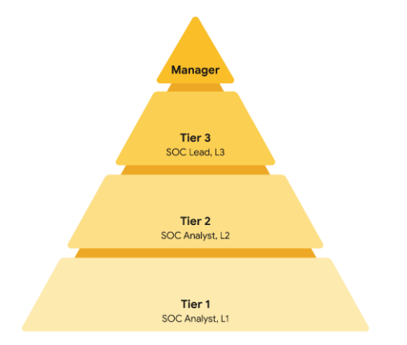

# Operaciones de respuesta ante incidentes

## Equipos de Respuesta ante incidentes
- ​​En esta sección, analizaremos cómo los equipos de respuesta a incidentes gestionan los incidentes.
- ​Una respuesta exitosa a los incidentes de Seguridad no ocurre de forma aislada. 
- Requiere un equipo de ​profesionales de Seguridad y no relacionados con la seguridad que trabajen en conjunto con funciones definidas.
- ​Los Equipos de respuesta a incidentes de seguridad informática, o CSIRT, son un grupo especializado de ​profesionales de seguridad que están capacitados en la gestión y respuesta a incidentes.
- ​El objetivo de los CSIRT es gestionar los incidentes de manera eficaz y eficiente, ​proporcionar servicios y recursos para la respuesta y la recuperación, y ​evitar que se produzcan futuros incidentes.
- ​La seguridad es una responsabilidad compartida, por lo que los CSIRT deben trabajar de manera interfuncional ​con otros departamentos para compartir la información relevante.
- ​Por ejemplo, si un incidente provocó la violación de datos confidenciales, ​como documentos financieros o PII, se debe consultar al equipo legal.
- ​Algunas medidas de cumplimiento normativo pueden requerir que las organizaciones divulguen públicamente ​un incidente de Seguridad dentro de un plazo determinado.
- ​Esto significa que los CSIRT deben colaborar con el ​equipo de relaciones públicas de la organización para coordinar los esfuerzos de divulgación pública.
- ​Entonces, ¿cómo funciona exactamente un CSIRT?
- ​En primer lugar, está el analista de Seguridad.
- ​El trabajo del analista es investigar las alertas de Seguridad para determinar si ​se ha producido un incidente.
- Si se ha detectado un incidente, ​el analista determinará la calificación de criticidad del incidente.
- El ​analista de Seguridad puede corregir fácilmente algunos incidentes y ​no es necesario escalarlos.
- ​Sin embargo, si el incidente es muy crítico, ​pasa a manos del jefe técnico, quien proporciona liderazgo técnico al ​guiar los incidentes de Seguridad a lo largo de su ciclo de vida.
- ​Durante este tiempo, el coordinador de incidentes rastrea y gestiona las actividades ​del CSIRT y otros equipos involucrados en el esfuerzo de respuesta.
- ​Su trabajo consiste en garantizar que se sigan los procesos de respuesta a los incidentes y ​que los equipos estén actualizados periódicamente sobre el estado del incidente.
- ​No todos los CSIRT son iguales.
- ​Según la organización, un CSIRT también puede denominarse Equipo de ​Gestión de Incidentes (IHT) o Equipo de Respuesta a Incidentes de Seguridad (SIRT).
- ​Según la estructura de la organización, algunos equipos también pueden tener un ​enfoque más amplio o especializado.
- ​Por ejemplo, algunos equipos pueden dedicarse exclusivamente a la gestión de crisis y ​otros pueden estar incorporados a un SOC.
- ​Los roles también pueden tener nombres diferentes.
- Por ejemplo, ​un líder técnico también puede denominarse líder de operaciones.
- ​Independientemente del cargo o el enfoque del equipo, todos comparten el mismo objetivo: la ​gestión de incidentes y la respuesta.
- ​Ahora que sabe un poco sobre los equipos de respuesta a incidentes, seguiremos aprendiendo ​cómo los equipos de respuesta a incidentes planifican, organizan y responden a los incidentes.

---

## Fátima: La importancia de la Comunicación durante la Respuesta ante incidentes
- ​Mi nombre es Fátima ​y soy directora técnica del ​Equipo de Detección y Respuesta de Google
- Si hay un hacker en la red, ​nuestro trabajo es encontrarlo. ​Trabajar en la detección es ​como si un artista se preparara para un espectáculo.
- ​Dedicamos todo este tiempo a desarrollar todas ​estas firmas para detectar a los piratas ​informáticos y, un día, ​llega la hora del espectáculo.
- ​Sientes la misma energía nerviosa ​y te preguntas si estás ​preparado para la actuación o no, ​pero realmente no tienes otra opción.
- ​Los hackers van a venir y ​tienes que estar preparado para ellos.
- ​Yo diría que la ciberseguridad es muy emocionante.
- ​Nunca se sabe cuándo ​se lanzará la próxima vulnerabilidad.
- ​Nunca se sabe cuándo va a ocurrir el próximo incidente.
- ​Un buen ejemplo de incidente sería ​la vulnerabilidad Log4j que ocurrió en 2021.
- ​Toda la empresa se unió para ​investigar si ​esta vulnerabilidad nos afectaba o no.
- El ​trabajo de mi equipo era tomar esa determinación. 
- Ingerimos cientos de millones de líneas ​de registros por segundo.
- ​Una vez que tengamos estos registros, ​es necesario buscarlos y analizarlos, ​creando diferentes firmas para que ​coincidan con estos registros en ​busca de señales de compromiso.
- ​Pudimos decir que todo está claro: ​esto no nos afecta y estamos a salvo.
- ​Esos son los momentos.
- Estos son los aspectos más destacados.
- ​Ahí es donde todo se junta.
- ​El trabajo en equipo en un escenario de respuesta a un incidente es clave.
- ​No se puede gestionar una respuesta a un incidente ​sin un equipo realmente sólido, ​un equipo que trabaje muy bien en conjunto, ​un equipo que realmente confíe el uno en el otro.
- ​La manera de mantener ​una comunicación clara y efectiva ​es comunicando mucho.
- ​Durante un incidente, es un poco contradictorio, ​pero las personas que son los ingenieros más experimentados, ​estas personas, se convierten en los líderes operativos.
- ​Son las personas ​responsables de asegurarse de que ​la comunicación no se ​interrumpa dentro de su función.
- ​Por lo tanto, pasamos de ser muy ​técnicos a centrarnos realmente en la comunicación​, agregar los datos y hacer llegar los datos ​a las personas adecuadas que necesitan conocerlos.
- ​Definitivamente recomiendo la ciberseguridad ​como campo profesional porque, en realidad, los atacantes ​no van a dejar que te ​aburras porque son muy creativos, ​así que tenemos que ser creativos en ​la forma en que los buscamos.
- ​Ser una persona a la que le gusta aprender, ​saber que siempre habrá ​algo en lo que aprender y en lo ​que seré bueno, es emocionante y me mantiene motivado. 

---

## Funciones en la respuesta
- Hasta ahora, se le ha presentado el Ciclo de vida de respuesta ante incidentes del Instituto Nacional de Estándares y Tecnología (NIST), que es un framework para la respuesta ante incidentes que consta de cuatro fases:
   - Preparación
   - Detección y Análisis
   - Contención, Erradicación y Recuperación
   - Actividad posterior al incidente
- Como profesional de la Seguridad, trabajará en un Equipo para Monitorear, Detectar y Responder a Incidentes. Anteriormente, aprendió sobre un Equipo de respuesta ante incidentes de seguridad informática (CSIRT) y un Centro de operaciones de seguridad (SOC).
- Esta lectura explica las diferentes funciones, roles y responsabilidades que componen los CSIRT y los SOC.
- Comprender la composición de los Equipos de respuesta a incidentes le ayudará a navegar por la jerarquía de una organización, a colaborar y comunicarse abiertamente con los demás y a trabajar de forma cohesionada para responder a los incidentes.
- Puede que incluso descubra funciones específicas que le interese desempeñar al comenzar su carrera en el ámbito de la Seguridad.

- Comando, control y comunicación
   - Un Equipo de respuesta ante incidentes de seguridad informática (CSIRT ) es un grupo especializado de profesionales de la seguridad que están formados en la gestión y respuesta ante incidentes.
   - Durante la respuesta ante incidentes, los equipos pueden encontrarse con una gran variedad de retos diferentes.
   - Para que la respuesta ante incidentes sea eficaz y eficiente, debe haber un mando, un control y una comunicación claros de la situación para lograr el objetivo deseado.
   - Comando se refiere a tener el liderazgo y la dirección apropiados para supervisar la respuesta.
   - Control se refiere a la capacidad de gestionar aspectos técnicos durante la respuesta a incidentes, como la coordinación de recursos y la asignación de tareas.
   - Comunicación se refiere a la capacidad de mantener informadas a las partes interesadas.
   - Establecer una estructura organizativa de CSIRT con funciones claras y distintivas ayuda a lograr una respuesta eficaz y eficiente.

- Funciones en los CSIRT
   - Los CSIRT dependen de la organización, por lo que pueden variar en su estructura y funcionamiento.
   - Estructuralmente, pueden existir como un Equipo separado y dedicado o como un grupo de trabajo que se reúne cuando es necesario.
   - En los CSIRT participan tanto profesionales que no se dedican a la Seguridad como profesionales que sí lo hacen.
   - A menudo se consulta a profesionales ajenos a la seguridad para que ofrezcan su experiencia sobre el Incidente.
   - Estos profesionales pueden ser de departamentos externos, como recursos humanos, relaciones públicas, gestión, TI, jurídico y otros.
   - Los profesionales de la Seguridad que participan en un CSIRT suelen incluir tres funciones clave relacionadas con la Seguridad:
      - Analista de seguridad
      - Lead técnico
      - Coordinador de incidentes

- Analista de seguridad
   - El trabajo del analista de seguridad consiste en monitorizar continuamente un entorno para detectar cualquier amenaza a la Seguridad.
   - Esto incluye
      - Analizar y triar las alertas
      - Realizar investigaciones de la causa raíz
      - Elevación o resolución de alertas
   - Si se identifica una amenaza crítica, entonces los analistas la escalan al Lead del Equipo apropiado, como el Lead Técnico.

- Líder técnico
   - El trabajo del jefe técnico consiste en gestionar todos los aspectos técnicos del proceso de respuesta ante incidentes, como la aplicación de parches o actualizaciones de software.
   - Para ello, primero determinan la causa raíz del Incidente.
   - Después, crean e Implementan las estrategias para contener, erradicar y recuperarse del Incidente.
   - Los líderes técnicos suelen colaborar con otros Equipos para garantizar que sus prioridades de respuesta ante incidentes se ajustan a las prioridades empresariales, como reducir las interrupciones para los clientes o volver a la normalidad en las operaciones.

- Coordinador de incidentes
   - La respuesta a un incidente también requiere la colaboración cruzada con profesionales no relacionados con la seguridad.
   - Los CSIRT consultarán a menudo con miembros de departamentos externos y aprovecharán su experiencia.
   - El trabajo del coordinador de incidentes consiste en coordinarse con los departamentos pertinentes durante un incidente de Seguridad.
   - Al hacerlo, las líneas de comunicación están abiertas y claras, y todo el personal está al corriente del estado del incidente.
   - También puede haber coordinadores de incidentes en otros Equipos, como el SOC.

- Otras funciones
   - Dependiendo de la organización, en un CSIRT puede haber muchas otras funciones, como un responsable de comunicaciones, un responsable jurídico, un responsable de planificación, etc.
   - Los equipos, funciones, responsabilidades y estructuras organizativas pueden diferir en cada empresa.
   - Por ejemplo, algunos títulos de trabajo diferentes para coordinador de incidentes incluyen comandante de incidentes y gerente de incidentes.

- Centro de operaciones de seguridad
   - Un centro de operaciones de seguridad (SOC) es una unidad organizativa dedicada a supervisar redes, sistemas y dispositivos en busca de amenazas o ataques a la seguridad.
   - Estructuralmente, un SOC (que suele pronunciarse "calcetín") suele existir como unidad independiente o dentro de un CSIRT.
   - Puede que le resulte familiar el término Equipo Azul, que se refiere a los profesionales de la Seguridad que son responsables de la defensa contra todas las amenazas y ataques a la Seguridad en una organización.
   - Un SOC participa en varios tipos de actividades del equipo azul, como el Monitoreo de redes, el análisis y la respuesta a incidentes. 

- Organización del SOC
   - Un SOC está compuesto por analistas del SOC, líderes del SOC y directores del SOC.
   - Cada función tiene sus respectivas responsabilidades.
   - Los analistas del SOC se agrupan en tres niveles diferentes.

- Analista SOC de primer nivel
   - El primer nivel está compuesto por los analistas del SOC menos experimentados, a los que se conoce como analistas de nivel 1 (L1).
   - Son responsables de:
      - Monitorear, revisar y priorizar las alertas en función de su criticidad o gravedad
      - Crear y cerrar alertas utilizando sistemas de tickets
      - Elevación de los tickets de alerta a los niveles 2 o 3

- Analista SOC de nivel 2
   - El segundo nivel comprende a los analistas SOC más experimentados, o de nivel 2 (L2).
   - Son responsables de:
      - Recibir tickets escalados de L1 y realizar investigaciones más profundas
      - Configurar y perfeccionar las herramientas de Seguridad
      - Informar al SOC Lead

- Líder del SOC de nivel 3
   - El tercer nivel de un SOC está compuesto por los SOC Lead, o nivel 3 (L3).
   - Estos profesionales altamente experimentados son responsables de:
      - Gestionar las operaciones de su equipo
      - Explorar métodos de detección mediante la realización de técnicas avanzadas de detección, como el análisis de software malicioso y forense
      - Informar al responsable del SOC

- Gestor del SOC
   - El director del SOC se encuentra en la cúspide de la pirámide y es responsable de:
      - Contratar, entrenar y evaluar a los Miembros del equipo SOC
      - Crear Métricas de rendimiento y Gestionar el rendimiento del equipo SOC
      - Elaborar informes relacionados con los incidentes, el cumplimiento y la auditoría
      - Comunicar los resultados a las partes interesadas, como la dirección ejecutiva

- Otras funciones
   - Los SOC también pueden contener otras funciones especializadas como:
      - Investigadores forenses:
         - Los investigadores forenses suelen ser L2 y L3 que recopilan, conservan y analizan pruebas digitales relacionadas con incidentes de Seguridad para determinar qué ha ocurrido.
      - Cazadores de amenazas:
         - Los cazadores de amenazas suelen ser L3 que trabajan para detectar, analizar y defenderse contra amenazas de ciberseguridad nuevas y avanzadas utilizando Inteligencia sobre amenazas.
   - Al igual que los CSIRT, la estructura organizativa de un SOC puede variar en función de la organización.

- Recursos
   - [El ecosistema de operaciones de Seguridad](https://chronicle.security/blog/posts/soc-ecosystem-infographic/)
   - [Herramienta de trayectorias profesionales cibernéticas](https://niccs.cisa.gov/workforce-development/cyber-career-pathways-tool)
   - [Detección y respuesta en Google: Episodio 2 de la serie de vídeos Hacking Google](https://www.youtube.com/watch?v=QZ0cpBocl3c)
      - [serie de vídeos Hacking Google](https://www.youtube.com/playlist?list=PL590L5WQmH8dsxxz7ooJAgmijwOz0lh2H)

---

## Planes de respuesta ante incidentes
- ​Cuando se produce un incidente, los Equipos de respuesta ante incidentes deben estar preparados para responder de forma rápida, ​eficiente y eficaz.
- ​Ya se trate de una filtración de datos, un ataque DDoS o ransomware, ​los incidentes tienen el potencial de causar daños significativos a una organización.
- ​Como hemos mencionado anteriormente, las regulaciones pueden requerir que las organizaciones informen de ​incidentes dentro de un plazo determinado.
- ​Por lo tanto, es crucial que las organizaciones cuenten con un plan formal de respuesta a incidentes, ​de modo que exista un proceso preparado y ​consistente para responder rápidamente a los incidentes una vez que se produzcan.
- ​Tal vez recuerde haber aprendido que los planes de seguridad constan de tres elementos básicos: ​políticas, Estándares y Procedimientos.
- ​Un Plan de respuesta ante incidentes es un documento que describe los procedimientos a seguir en ​cada paso de la respuesta ante incidentes.
- ​Los planes de respuesta, al igual que los Equipos de respuesta, no son todos iguales.
- ​Las organizaciones adaptan sus planes para satisfacer sus requisitos únicos ​como su misión, tamaño, cultura, industria y estructura.
- ​Por ejemplo, ​las organizaciones más pequeñas pueden optar por incluir su plan de respuesta a incidentes en ​su plan de seguridad, mientras que otras pueden optar por tenerlos como documentos separados.
- ​Aunque no todos los planes de incidentes son iguales, ​hay elementos comunes que comparten.
   - ​Los planes de incidentes tienen:
      - Procedimientos de respuesta ante incidentes.
      - ​Son instrucciones paso a paso sobre cómo responder ante incidentes.
   - ​Información sobre el sistema.
      - Se trata de elementos como diagramas de red, ​diagramas de flujo de datos, registros e información sobre el inventario de activos.
      - ​Y otros documentos como listas de contactos, formularios y plantillas.
- ​Los planes no son perfectos y siempre hay margen para ajustarlos y ​mejorarlos a medida que se producen los incidentes.
- ​Los procesos y procedimientos de incidentes deben revisarse y probarse con regularidad.
- ​Esto puede hacerse mediante ejercicios como los de mesa o los simulacros.
- Estos ejercicios garantizan que todos los miembros del equipo están familiarizados ​con el plan de respuesta.
- ​También permiten a las organizaciones identificar cualquier laguna que falte en un proceso para mejorar ​su plan de respuesta ante incidentes.
- ​Además, es posible que se exija a las organizaciones que realicen tipos específicos de ejercicios por ​razones normativas.