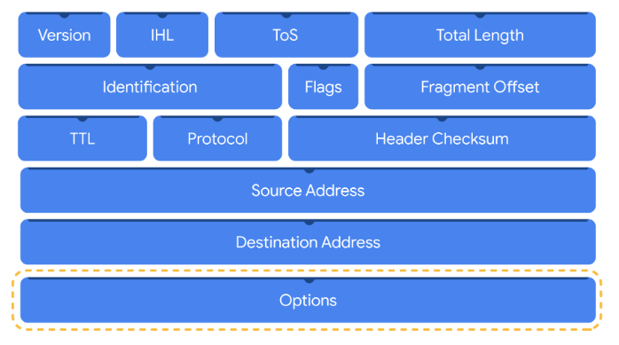
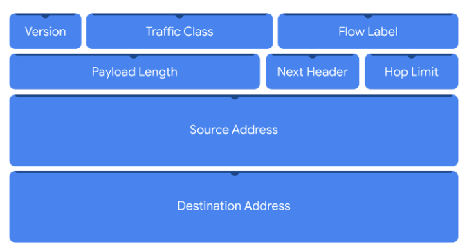
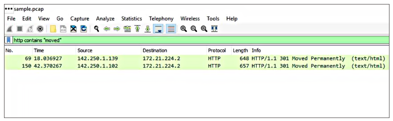
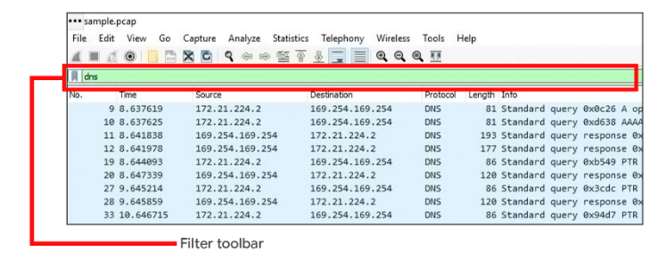

# Captura y visualización del tráfico de red

## Paquetes y capturas de paquetes
- ​Ya sea que se trate de un empleado que envía un correo electrónico o de ​un actor malintencionado que ​intenta filtrar datos confidenciales, ​las acciones que se realizan en una red se pueden ​identificar mediante el examen de los flujos de tráfico de la red.
- La ​comprensión de estas comunicaciones de red proporciona ​una valiosa información estadística sobre las actividades ​que tienen lugar en una red.
- ​De esta manera, puede comprender mejor lo que sucede en ​un entorno y defenderse de posibles amenazas.
- ​Con esto en mente, examinemos cómo ​registrar el tráfico de red a través de capturas de paquetes.
- ​Anteriormente, en el programa, ​aprendiste que cuando se envían datos, ​se dividen en paquetes.
- ​Al igual que un sobre con dirección en el correo, ​los paquetes contienen información de entrega que ​se utiliza para dirigirlo a su destino.
- ​Esta información incluye la ​dirección IP del remitente y del destinatario, ​el tipo de paquete que se envía y más.
- ​Los paquetes pueden proporcionar mucha información sobre ​las comunicaciones que se producen entre ​los dispositivos a través de una red.
- ​También puede recordar que ​un paquete tiene varios componentes.
- ​Está el encabezado, que incluye información como ​el tipo de protocolo de red y el puerto que se está utilizando.
- ​Imagínese que es el nombre y la ​dirección postal que se encuentran en un sobre.
- ​Los Protocolos de red son un conjunto de reglas que determinan ​la transmisión de datos entre los dispositivos de una red.
- ​Los puertos son ubicaciones no físicas de una computadora ​que organizan la transmisión de datos ​entre los dispositivos de una red.
- ​El encabezado también contiene ​la dirección IP de origen y destino del paquete.
- ​Exploraremos más información ​incluida en el encabezado en una sección posterior.
- ​A continuación, está la carga útil, que ​contiene los datos reales que se están entregando.
- ​Es como el contenido de ​una carta dentro de un sobre.
- ​Y está el pie de página, ​que significa el final del paquete.
- ​Entonces, ¿cómo se puede observar exactamente un paquete de red?
- ​Al igual que los aromas son invisibles pero se pueden oler, ​los paquetes son invisibles pero se pueden ​capturar con herramientas llamadas rastreadores de paquetes.
- ​Es posible que recuerde los rastreadores de paquetes de una sección anterior.
- ​Un analizador de protocolos de red, o rastreador de paquetes, ​es una herramienta diseñada para capturar y ​analizar el tráfico de datos dentro de una red.
- ​Como analista de seguridad, ​utilizará rastreadores de paquetes para inspeccionar los ​paquetes en busca de indicadores de riesgo.
- ​Mediante el sniffing de paquetes, podemos obtener una ​instantánea detallada de los paquetes que ​viajan por una red en forma de captura de paquetes.
- ​Una captura de paquetes, o P-cap, es un archivo ​que contiene paquetes de datos interceptados desde ​una interfaz o red.
- ​Es como interceptar un sobre en el correo.
- ​Las capturas de paquetes son increíblemente útiles ​durante la investigación de incidentes.
- ​Al tener acceso a las comunicaciones ​que se producen entre los dispositivos a través de una red, ​puede observar las interacciones de la red y empezar a crear ​una historia para determinar qué sucedió exactamente.

---

## Más información sobre la captura de paquetes
- La función de los analistas de seguridad consiste en supervisar y analizar los flujos de tráfico de la red.
- Una forma de hacerlo es generando capturas de paquetes y luego analizando el tráfico capturado para identificar actividad inusual en una red.

- Paquetes
   - La detección de intrusiones en la red comienza a nivel de paquetes.
   - Esto se debe a que los paquetes forman la base del intercambio de información a través de una red.
   - Cada vez que usted realiza una actividad en Internet -como visitar un sitio web- se envían y reciben paquetes entre su ordenador y el servidor del sitio web.
   - Estos paquetes son los que ayudan a transmitir información a través de una red.
   - Por ejemplo, al subir una imagen a un sitio web, los datos se dividen en varios paquetes, que luego se envían al destino previsto y se vuelven a ensamblar en el momento de la entrega.
   - En ciberseguridad, los paquetes proporcionan información valiosa que ayuda a contextualizar los sucesos durante las investigaciones.
   - Comprender la transferencia de información a través de paquetes no sólo le ayudará a desarrollar una visión de la actividad de la red, sino que también le ayudará a identificar anomalías y a defender mejor las redes de los ataques.
   - Los paquetes contienen tres componentes: la cabecera, la carga útil y el pie de página.
   
- Cabecera
   - Los paquetes comienzan con el componente más esencial: la cabecera.
   - Los paquetes pueden tener varias cabeceras en función de los protocolos utilizados, como una cabecera Ethernet, una cabecera IP, una cabecera TCP y más.
   - Las cabeceras proporcionan información que se utiliza para encaminar los paquetes a su destino.
   - Esto incluye información sobre las direcciones IP de origen y destino, la longitud del paquete, el protocolo, los números de identificación del paquete, etc. 
   - A continuación se muestra una cabecera IPv4 con la información que proporciona:



- Carga útil
   - El componente de carga útil de sigue directamente a la cabecera y contiene los datos reales que se entregan.
   - Piensa en el ejemplo de subir una imagen a un sitio web; la carga útil de este paquete sería la propia imagen.

- Pie de página
   - El pie de página, también conocido como trailer, se encuentra al final del paquete.
   - El protocolo Ethernet utiliza los pies de página para proporcionar información de comprobación de errores para determinar si los datos se han corrompido.
   - Además, es posible que los paquetes de red Ethernet que se analizan no muestren información de pie de página debido a las configuraciones de red.
   - La mayoría de los protocolos, como el Protocolo de Internet (IP), no utilizan pies de página. 
   
- Analizadores de protocolos de red
   - Los analizadores de protocolos de red (packet sniffers) son herramientas diseñadas para capturar y analizar el tráfico de datos dentro de una red.
   - Algunos ejemplos de analizadores de protocolos de red son tcpdump, Wireshark y TShark.
   - Más allá de su uso en seguridad como herramienta de investigación utilizada para supervisar redes e identificar actividades sospechosas, los analizadores de protocolos de red pueden utilizarse para recopilar estadísticas de red, como el ancho de banda o la velocidad, y solucionar problemas de rendimiento de la red, como ralentizaciones.
   - Los analizadores de protocolos de red también pueden utilizarse con fines maliciosos.
   - Por ejemplo, los actores maliciosos pueden utilizar los analizadores de protocolos de red para capturar paquetes que contengan datos confidenciales, como la información de inicio de sesión de una cuenta.
   
- Funcionamiento de los analizadores de protocolos de red
   - Los analizadores de protocolos de red utilizan capacidades tanto de software como de hardware para capturar el tráfico de red y mostrarlo para que los analistas de seguridad puedan examinarlo y analizarlo.
      1. Los paquetes deben recogerse de la red a través de la tarjeta de interfaz de red (NIC), que es el hardware que conecta los ordenadores a una red, como un enrutador.
         - Las NIC reciben y transmiten tráfico de red, pero por defecto sólo escuchan el tráfico de red dirigido a ellas.
         - Para capturar todo el tráfico de red que se envía a través de la red, una NIC debe cambiarse a un modo que tenga acceso a todos los paquetes de datos de red visibles.
         - En las interfaces inalámbricas, esto suele denominarse modo de monitorización, y en otros sistemas puede llamarse modo promiscuo.
         - Este modo permite que la NIC tenga acceso a todos los paquetes de datos de red visibles, pero no ayudará a los analistas a acceder a todos los paquetes de una red.
         - Un analizador de protocolos de red debe situarse en un segmento de red adecuado para acceder a todo el tráfico entre distintos hosts.
      2. El analizador de protocolos de red recoge el tráfico de red en formato binario sin procesar.
         - El formato binario se compone de 0s y 1s y no es tan fácil de interpretar para los humanos.
         - El analizador de protocolos de red toma el formato binario y lo convierte para que se muestre en un formato legible para el ser humano, de modo que los analistas puedan leer y comprender fácilmente la información.
   - Activar promiscuo puede exponer su dispositivo a posibles ataques porque permite capturar información sensible como contraseñas y otros datos confidenciales.
   - Es importante utilizar las herramientas que funcionan en modo promiscuo de forma responsable y con precaución.

- Captura de paquetes
   - El sniffing de paquetes es la práctica de capturar e inspeccionar paquetes de datos a través de una red.
   - Una captura de paquetes (p-cap) es un archivo que contiene paquetes de datos interceptados desde una interfaz o red.
   - Las capturas de paquetes pueden visualizarse y analizarse posteriormente mediante analizadores de protocolos de red.
   - Por ejemplo, puede filtrar las capturas de paquetes para mostrar sólo la información más relevante para su investigación, como los paquetes enviados desde una dirección IP específica.
   - El uso de analizadores de protocolo de red para interceptar y examinar comunicaciones de red privadas sin permiso se considera ilegal en muchos lugares.
   - Los archivos P-cap pueden tener muchos formatos dependiendo de la biblioteca de captura de paquetes que se utilice.
   - Cada formato tiene diferentes usos y las herramientas de red pueden usar o soportar formatos específicos de archivos de captura de paquetes por defecto.
   - Deberías estar familiarizado con las siguientes librerías y formatos:
      - Libpcap es una librería de captura de paquetes diseñada para ser utilizada por sistemas tipo Unix, como Linux y MacOS®. Herramientas como tcpdump utilizan Libpcap como formato de archivo de captura de paquetes por defecto.
      - WinPcap es una librería de captura de paquetes de código abierto diseñada para dispositivos con sistemas operativos Windows. Se considera un formato de archivo antiguo y no se utiliza predominantemente.
      - Npcap es una biblioteca diseñada por la herramienta de escaneo de puertos Nmap que se utiliza habitualmente en sistemas operativos Windows.
      - PCAPng es un formato de archivo moderno que puede capturar paquetes y almacenar datos simultáneamente. Su capacidad para hacer ambas cosas explica la "ng", que significa "próxima generación"
   - Analizar tu red doméstica puede ser una buena forma de practicar el uso de estas herramientas.

- Recursos
   - [Packet Crafting](https://www.infosecinstitute.com/resources/hacking/packet-crafting-a-serious-crime/)

---

## Interpretar las comunicaciones de red con paquetes
- ​Si la captura de paquetes es como interceptar un sobre en el correo, el ​análisis del paquete es como leer la carta que hay dentro del sobre.
- ​Analicemos cómo el análisis de paquetes puede ayudarnos a interpretar y ​comprender las comunicaciones de red.
- ​Como ya sabrá, las redes son ruidosas.
- ​Hay un enorme volumen de comunicaciones entre los dispositivos ​en un momento dado.
- ​Por este motivo, las capturas de paquetes pueden contener grandes cantidades de ​comunicaciones de red, lo que dificulta el análisis y lleva mucho tiempo.
- ​Como profesional de Seguridad, trabajará contrarreloj para proteger ​las redes y los sistemas informáticos de posibles ataques.
- ​Puede analizar la evidencia de la red en forma de capturas de paquetes para identificar ​los indicadores de compromiso.
- ​Tener la capacidad de filtrar el tráfico de la red mediante rastreadores de paquetes para recopilar ​información relevante es una habilidad esencial.
- ​Por ejemplo, supongamos que se le asignó la tarea de analizar una captura de paquetes ​para encontrar cualquier indicio de robo de datos.
- ​¿Cómo harías esto?
- ​Con una herramienta de análisis de red, puede filtrar la captura de paquetes para clasificarlos.
- ​Esto puede ayudarlo a identificar rápidamente un evento asociado con el robo de datos, ​como la salida de grandes cantidades de datos de una base de datos.
- ​Hay muchos otros filtros que puede aplicar a las capturas de paquetes para encontrar la información ​que necesita para respaldar una investigación de manera eficiente.
- ​Entre los ejemplos de herramientas de análisis de red se incluyen tcpdump y Wireshark.
- ​Se ​accede a tcpdump a través de una línea de comandos mientras Wireshark tiene una interfaz gráfica de usuario o GUI.
- ​Ambas herramientas son útiles para los analistas de Seguridad, y ​pronto tendrá la oportunidad de explorar ambas.

---

## Reexaminar los campos de un Encabezado de Paquete
- ​Si bien hay muchas herramientas diferentes disponibles, ​como analista de Seguridad es importante que ​aprenda a leer y analizar los paquetes manualmente.
- ​Para hacerlo, examinemos ​un componente importante del paquete: los encabezados IP.
- ​Anteriormente, aprendió acerca de ​las cuatro capas del modelo TCP/IP.
- ​Recuerde que el modelo TCP/IP es un framework que se usa para ​visualizar cómo se ​organizan y transmiten los datos a través de una red.
- ​La capa de Internet acepta y ​entrega paquetes para la red.
- ​También es la capa en la que el Protocolo de Internet funciona ​como base para todas las comunicaciones en Internet.
- ​Es responsable de ​garantizar que los paquetes lleguen a su destino.
- ​El Protocolo de Internet funciona como ​un mensajero que entrega un sobre.
- ​En lugar de utilizar la información de entrega ​que se encuentra en el sobre, ​el Protocolo de Internet utiliza la información ​que se encuentra en el encabezado del paquete, como las direcciones IP.
- ​A continuación, determina la mejor ruta disponible que pueden ​tomar los paquetes, de ​modo que los datos se puedan enviar y recibir entre los hosts.
- ​Como ya sabrá, ​los paquetes IP contienen encabezados.
- ​Los encabezados contienen los campos de datos esenciales para ​la transferencia de datos a su destino previsto.
- ​Los distintos protocolos utilizan encabezados diferentes.
- ​Hay dos versiones diferentes ​del Protocolo de Internet: IPv4, ​que se considera ​la base de las comunicaciones de Internet, e ​IPv6, que es la ​versión más reciente del Protocolo de Internet.
- ​Recuerde que los distintos protocolos utilizan encabezados diferentes.
- ​Por lo tanto, los encabezados IPv4 e IPv6 son diferentes, ​pero contienen campos similares con nombres diferentes.
- ​IPv4 sigue siendo el más utilizado, ​por lo que nos centraremos en examinar los campos de un encabezado IPv4.
- ​Empecemos por el campo de versión, que ​especifica qué versión de IP se está utilizando, ​ya sea IPv4 o IPv6.
- ​Volviendo a nuestra analogía con ​el correo, el campo de versión es como las diferentes clases de correo, ​como el correo prioritario, urgente o regular.
- ​A continuación, IHL significa Longitud del Encabezado de Internet.
- ​Este campo especifica la longitud ​del encabezado IP más las opciones.
- ​El siguiente campo, ToS, significa Tipo de servicio.
- ​Este campo nos indica si ​ciertos paquetes deben tratarse con cuidado diferente.
- ​Por ejemplo, piense en los ToS como ​una pegatina frágil en un paquete enviado por correo.
- El ​siguiente es el campo de longitud total, ​que identifica la longitud de todo el paquete, ​incluidos los encabezados y los datos.
- ​Esto se puede comparar con las dimensiones ​y el peso de un sobre.
- ​Los tres campos siguientes, ​Identificación, Indicadores ​y Desfase de fragmentos, ​tratan de la información relacionada con la fragmentación.
- ​La fragmentación se produce cuando un paquete IP ​se divide en fragmentos, ​que luego se transmiten por cable y se vuelven a ​ensamblar cuando llegan a su destino.
- ​Estos tres campos especifican si ​se ha utilizado la fragmentación y cómo volver a ​ensamblar los paquetes rotos en el orden correcto.
- ​Esto es similar a la forma en que el correo puede viajar ​por múltiples rutas, como buzones, ​instalaciones de procesamiento, aviones y ​camiones de correo antes de llegar a su destino.
- ​El campo TTL significa Time to Live.
- ​Como sugiere su nombre, ​este campo determina cuánto tiempo ​puede durar un paquete antes de que se descarte.
- ​Sin este campo, los paquetes podrían ​circular a través de los enrutadores sin fin.
- El ​TTL es similar a la forma en que la información de seguimiento ​proporciona detalles sobre la fecha de ​entrega prevista de un sobre.
- ​El campo Protocolo especifica el protocolo utilizado ​al proporcionar un valor que corresponde a un protocolo.
- ​Por ejemplo, TCP está representado por 6.
- ​Esto es similar a incluir el número ​de una casa en una dirección postal.
- ​La suma de comprobación del encabezado almacena un valor denominado suma de comprobación, ​que se utiliza para determinar si se ​ha producido algún error en el encabezado.
- ​La dirección de origen especifica la dirección IP de origen y ​la dirección de destino especifica ​la dirección IP de destino.
- ​Es igual que la ​información de contacto del remitente y el destinatario que se encuentra en un sobre.
- ​El campo de opciones no es obligatorio y se suele ​utilizar para la solución de problemas de red ​en lugar de para el tráfico común.
- ​Si se usa, la longitud del encabezado aumenta.
- ​Es como comprar un seguro postal para un sobre.
- ​Por último, al final del encabezado del paquete ​es donde residen los datos del paquete, ​como el texto de un mensaje de correo electrónico.
- ​¿Quién sabía que los paquetes de datos que enviamos ​a través de las redes contienen tanta información?

---

## Investigar los detalles del Paquete
- Hasta ahora, ha aprendido cómo los Analizadores de protocolos de red (packet sniffers) interceptan las comunicaciones de red.
- También ha aprendido cómo puede analizar las capturas de paquetes (p-caps) para obtener una visión de la actividad que tiene lugar en una red.
- Como analista de seguridad, utilizará sus habilidades de análisis de paquetes para inspeccionar los paquetes de red e identificar actividades sospechosas durante las investigaciones. 
- En esta lectura, volverá a examinar los encabezados IPv4 e IPv6.
- A continuación, explorará cómo puede utilizar Wireshark para investigar los detalles de los archivos de captura de paquetes. 

- Protocolo de Internet (IP)
   - Los paquetes constituyen la base del intercambio de datos a través de una red, lo que significa que la detección comienza a nivel de paquete.
   - El Protocolo de Internet (IP) incluye un conjunto de estándares utilizados para enrutar y direccionar los paquetes de datos a medida que viajan entre los dispositivos de una red.
   - IP funciona como la base de todas las comunicaciones a través de Internet.
   - IP garantiza que los paquetes lleguen a su destino.
   - Existen dos versiones de IP que encontrará en uso hoy en día: IPv4 e IPv6.
   - Ambas versiones utilizan diferentes cabeceras para estructurar la información de los Paquetes. 

- IPv4
   - IPv4 es la versión de IP más utilizada.
   - Hay trece campos en el encabezado:
      - Versión: Campo que indica la versión de IP. Para un encabezado IPv4, se utiliza IPv4.
      - Longitud del Encabezado de Internet (IHL): Este campo especifica la longitud del Encabezado IPv4 incluyendo cualquier Opción.
      - Tipo de Servicio (ToS): Este Campo proporciona Información sobre la prioridad de entrega del Paquete.
      - Longitud Total: Este campo especifica la longitud total de todo el paquete IP incluyendo el Encabezado y los Datos.
      - Identificación: Los Paquetes que son demasiado grandes para enviarlos se fragmentan en trozos más pequeños. Este Campo especifica un identificador Único para los fragmentos de un Paquete IP original para que puedan ser reensamblados una vez que alcancen su destino.
      - Banderas: Este Campo proporciona Información sobre la fragmentación del Paquete incluyendo si el Paquete original ha sido fragmentado y si hay más fragmentos en tránsito.
      - Desplazamiento de fragmentación: Este Campo se utiliza para identificar la secuencia correcta de los fragmentos.
      - Tiempo de vida (TTL): Este campo limita el tiempo que un paquete puede circular por una red, evitando que los routers reenvíen los paquetes indefinidamente.
      - Protocolo: Este campo especifica el protocolo utilizado para la parte de datos del paquete.
      - Suma de comprobación del Encabezado: Este campo especifica un valor de suma de comprobación que se utiliza para la comprobación de errores del Encabezado.
      - Dirección de origen: Este Campo especifica la dirección de origen del remitente.
      - Dirección de destino: Este Campo especifica la dirección de destino del receptor.
      - Opciones: Este Campo es opcional y puede utilizarse para aplicar opciones de Seguridad a un Paquete.


- IPv6
   - La Adopción de IPv6 ha ido en aumento debido a su gran espacio de direcciones.
   - Hay ocho campos en el Encabezado:
      - Versión: Campo que indica la versión de IP. Para un encabezado IPv6, se utiliza IPv6.
      - Clase de Tráfico: Este Campo es similar al Campo de Tipo de Servicio IPv4. El Campo de clase de tráfico proporciona información sobre la prioridad o clase del Paquete para ayudar en la entrega del mismo.
      - Etiqueta de Flujo: Este Campo identifica los paquetes de un Flujo. Un flujo es la secuencia de paquetes enviados desde una fuente específica.
      - Longitud de la carga útil: Este campo especifica la Longitud de la porción de Datos del paquete.
      - Encabezado siguiente: Este Campo indica el tipo de Encabezado que sigue al Encabezado IPv6 como TCP.
      - Límite de salto: Este campo es similar al campo de tiempo de actividad de IPv4. El Límite de Salto limita cuánto tiempo puede viajar un paquete en una red antes de ser descartado.
      - Dirección de origen: Este Campo especifica la dirección de origen del remitente.
      - Dirección de destino: Este Campo especifica la dirección de destino del receptor.



- Wireshark
   - Wireshark es un analizador de protocolos de red de código abierto.
   - Utiliza una interfaz gráfica de usuario (GUI) que facilita la visualización de las comunicaciones de red con fines de análisis de paquetes.
   - Wireshark tiene muchas características que explorar que están fuera del alcance de este curso
   - Se centrará en cómo utilizar el filtrado básico para aislar los paquetes de red y poder encontrar lo que necesita.

   - Filtros de visualización
      - Los filtros de visualización de Wireshark le permiten aplicar filtros a los archivos de captura de paquetes.
      - Esto es útil cuando está inspeccionando capturas de paquetes con grandes volúmenes de información.
      - Los filtros de visualización le ayudarán a encontrar la información específica más relevante para su investigación.
      - Puede filtrar paquetes basándose en información como protocolos, direcciones IP, puertos y prácticamente cualquier otra propiedad que se encuentre en un paquete.
      - Aquí se centrará en la sintaxis de los filtros de visualización y en el filtrado por protocolos, direcciones IP y puertos.
   - Operadores de comparación
      - Puede utilizar diferentes operadores de comparación para localizar campos de cabecera y valores específicos.
      - Los operadores de comparación pueden expresarse utilizando abreviaturas o símbolos.
      - Por ejemplo, este filtro utilizando el símbolo == igual en este filtro ip.src == 8.8.8.8 es idéntico a utilizar la abreviatura eq en este filtro ip.src eq 8.8.8.8.
      - Puede combinar operadores de comparación con operadores lógicos booleanos como and y or para crear filtros de visualización complejos.
      - Los paréntesis también pueden utilizarse para agrupar expresiones y dar prioridad a los términos de búsqueda.
      - Esta tabla resume los distintos tipos de operadores de comparación que puede utilizar para el filtrado de visualización.

| Tipo de Operador | Símbolo | Abreviatura |
| ----------------- | ------- | ----------- |
| Igual | == | eq |
| No igual | != | ne |
| Mayor que | > | gt |
| Menor que | < | lt |
| Mayor o igual que | >= | ge |
| Menor o igual que | <= | le |


   - Operador de contención
      - El operador contains se utiliza para filtrar los paquetes que contienen una coincidencia exacta de una cadena de texto.
      - He aquí un ejemplo de filtro que muestra todos los flujos HTTP que coinciden con la palabra clave "moved".



   - Operador de coincidencias
      - El operador matches se utiliza para filtrar paquetes basándose en la expresión regular (regex) especificada.
      - Una expresión regular es una secuencia de caracteres que forma un patrón.
   - Barra de herramientas de filtrado
      - Puede aplicar filtros a una captura de paquetes utilizando la barra de herramientas de filtrado de Wireshark.
      - Wireshark utiliza diferentes colores para representar los protocolos.
      - Puede personalizar los colores y crear sus propios filtros
      - En este ejemplo, dns es el filtro aplicado, lo que significa que Wireshark sólo mostrará los paquetes que contengan el protocolo DNS.



   - Filtrado de protocolos
      - El filtrado por protocolos es una de las formas más sencillas de utilizar los filtros de visualización.
      - Sólo tiene que introducir el nombre del protocolo que desea filtrar.
      - Por ejemplo, para filtrar por paquetes DNS basta con escribir dns en la barra de herramientas de filtrado.
      - Aquí tiene una Lista de algunos protocolos por los que puede filtrar:
         - dns
         - http
         - ftp
         - ssh
         - arp
         - telnet
         - icmp
   - Filtrado de una dirección IP
      - Puede utilizar filtros de visualización para localizar paquetes con una dirección IP específica.
      - Por ejemplo, si desea filtrar paquetes que contengan una dirección IP específica utilice ip.addr, seguido de un espacio, el operador de comparación igual a == y la dirección IP.
      - He aquí un ejemplo de filtro de pantalla que filtra por la dirección IP 172.21.224.2:
         - ip.addr == 172.21.224.2
      - Para filtrar los paquetes procedentes de una dirección IP de origen específica, puede utilizar el filtro ip.src.
      - Aquí tiene un ejemplo que busca la dirección IP de origen 10.10.10.10:
         - ip.src == 10.10.10.10
      - Para filtrar los paquetes enviados a una dirección IP de destino específica, puede utilizar el filtro ip.dst.
      - He aquí un ejemplo que busca la dirección IP de destino 4.4.4.4:
         - ip.dst == 4.4.4.4
   - Filtrado para una dirección MAC
      - También puede filtrar paquetes según la dirección MAC (Control de acceso a medios).
      - Para refrescar la memoria, una dirección MAC es un identificador alfanumérico único que se asigna a cada dispositivo físico de una red.
      - He aquí un ejemplo:
         - eth.addr == 00:70:f4:23:18:c4
   - Filtrado de puertos
      - El Filtrado de puertos se utiliza para filtrar paquetes basándose en los números de puerto.
      - Esto resulta útil cuando se desea aislar tipos específicos de Tráfico. El Tráfico DNS utiliza el puerto 53 TCP o UDP por lo que esto listará el tráfico relacionado con las consultas y respuestas DNS solamente.
      - Por ejemplo, si desea filtrar por un puerto UDP:
         - udp.port == 53
      - Del mismo modo, también puede filtrar por puertos TCP:
         - tcp.port == 25
   
- Seguir flujos
   - Wireshark proporciona una Característica que le permite filtrar por paquetes específicos de un protocolo y ver flujos.
   - Un flujo o conversación es el intercambio de Datos entre dispositivos que utilizan un protocolo.
   - Wireshark reensambla los Datos que se transfirieron en el flujo de una forma sencilla de leer.
   - Seguir un flujo de protocolo es útil cuando se intenta comprender los detalles de una conversación.
   - Por ejemplo, puede examinar los detalles de una conversación HTTP para ver el contenido de los mensajes de solicitud y respuesta intercambiados.

- Recursos
   - [Guía oficial del usuario de Wireshark](https://www.wireshark.org/docs/wsug_html/)

---

## Recursos para completar los laboratorios
- Iniciar Qwiklabs
- Botón Start Lab
- El temporizador
- Botón Abrir Consola Linux
- Comprobar el progreso

---

## Consejos de laboratorio y pasos para la solución de problemas
- Requisito de edad de 18+ para utilizar la plataforma
- Compatibilidad del navegador: última versión de Google Chrome, Firefox o Microsoft Edge
- Conexión a Internet

---

## Actividad: Analice su primer paquete
- Introducción
   - En esta actividad de laboratorio, aprenderá a abrir y analizar un archivo de captura de paquetes utilizando Wireshark.

- Lo que hará
   - Abrir un archivo de captura de paquetes utilizando Wireshark
   - Examinar la información de los paquetes
   - Aplicar filtros de visualización

- Resumen de la actividad
   - Como analista de seguridad, deberás examinar el tráfico de red para saber qué tipo de tráfico se envía hacia y desde los sistemas de las redes con las que trabajes.
   - Anteriormente, aprendiste sobre la captura y el análisis de paquetes.
   - El análisis de paquetes puede ayudar a los equipos de seguridad a interpretar y comprender las comunicaciones de red.
   - Los analizadores de protocolos de red como Wireshark, que tiene una interfaz gráfica de usuario o GUI, pueden ayudarte a examinar los datos de paquetes durante tus investigaciones.
   - Dado que los datos de paquetes de red son complejos, los analizadores de protocolos de red (detectores de paquetes) como Wireshark están diseñados para ayudarte a encontrar patrones y filtrar los datos a fin de concentrarse en el tráfico de red más relevante para tus investigaciones de seguridad.
   - Ahora, usarás Wireshark para inspeccionar datos de paquetes y aplicar filtros con el objetivo de ordenar la información de paquetes de manera eficiente.
   - En este lab, usarás Wireshark para analizar un archivo de captura de paquetes de muestra y filtrar los datos de tráfico de red.

- Situación
   - En esta situación, tu trabajo es investigar el tráfico a un sitio web como analista de seguridad.
   - Analizarás un archivo de captura de paquetes de red que contiene datos de tráfico relacionados con un usuario que se conecta a un sitio de Internet.
   - La capacidad de filtrar el tráfico de red con detectores de paquetes para recopilar información pertinente es una habilidad esencial para un analista de seguridad.
   - Debes filtrar los datos para hacer lo siguiente:
      - identificar las direcciones IP de origen y de destino involucradas en esta sesión de navegación web
      - examinar los protocolos que se utilizan cuando el usuario se conecta al sitio web
      - analizar algunos de los paquetes de datos para identificar el tipo de información enviada y recibida por los sistemas que se conectan entre sí cuando se capturan los datos de red
   - Estos son los pasos que seguirás: 
      1. Abrirás el archivo de captura de paquetes y explorarás la interfaz gráfica de usuario básica de Wireshark.
      2. Abrirás una vista detallada de un paquete individual y explorarás cómo examinar las diferentes capas de protocolos y datos dentro de un paquete de red.
      3. Aplicarás filtros para seleccionar e inspeccionar paquetes según criterios específicos.
      4. Filtrarás e inspeccionarás el tráfico de DNS por UDP para examinar los datos de protocolo.
      5. Aplicarás filtros a los datos de un paquete de TCP para buscar datos de texto específicos de la carga útil.

- Comienza el lab

1. Explora datos con Wireshark
- En esta tarea, debes abrir un archivo de captura de paquetes de red que contiene datos capturados de un sistema que realizó solicitudes web a un sitio.
- Abrirás estos datos con Wireshark para obtener un panorama de cómo se muestran los datos en la aplicación.
- Para abrir el archivo de captura de paquetes, haz doble clic en el archivo de ejemplo que se encuentra en el escritorio de Windows.
- Esta acción iniciará Wireshark.
- El archivo de captura de paquetes tiene el ícono de archivo de captura de paquetes de Wireshark, que muestra la aleta de un tiburón que nada sobre tres filas de dígitos binarios.
- Este archivo tiene una extensión .pcap que está oculta de forma predeterminada en Windows Explorer y en la vista para computadoras de escritorio.
- Haz doble clic en la barra de título de Wireshark junto al nombre de archivo sample.pcap para maximizar la ventana de la aplicación Wireshark.
- Se mostrará una lista con una gran cantidad de tráfico de paquetes de red, por lo que aplicarás filtros para encontrar la información necesaria en un próximo paso.
- Por ahora, te mostramos una descripción general de las columnas de propiedades clave que se muestran para cada paquete:
   - No.: el número de índice del paquete en este archivo de captura de paquetes
   - Time: la marca de tiempo del paquete
   - Source: la dirección IP de origen
   - Destination: la dirección IP de destino
   - Protocol: el protocolo contenido en el paquete
   - Length: la longitud total del paquete
   - Info: cierta información sobre los datos en el paquete (la carga útil) según la interpretación de Wireshark
- No todos los paquetes de datos tienen el mismo color.
- Se utilizan reglas de colores para proporcionar indicaciones visuales de alto nivel que te ayudarán a clasificar rápidamente los diferentes tipos de datos.
- Dado que los archivos de captura de paquetes de red pueden contener grandes cantidades de datos, puedes usar reglas de colores para identificar rápidamente los datos que consideras relevantes.
- El paquete de ejemplo muestra una lista de un grupo de paquetes de color azul claro que contienen tráfico de DNS, seguido de paquetes verdes que contienen una mezcla de tráfico de protocolo TCP y HTTP.
- Desplázate hacia abajo en la lista de paquetes hasta que aparezca un paquete donde la columna de información comience con las palabras "Echo (ping) request"
- ¿Cuál es el protocolo del primer paquete de la lista donde la columna de información comienza con las palabras 'Echo (ping) request'?
   - [ ] SSH
   - [ ] HTTP
   - [ ] TCP
   - [x] ICMP

2. Aplica un filtro de Wireshark básico e inspecciona un paquete
- En esta tarea, abrirás un paquete en Wireshark para realizar una exploración más detallada y filtrarás los datos para inspeccionar las capas de red y los protocolos contenidos en el paquete.
- Ingresa el siguiente filtro para el tráfico asociado con una dirección IP específica.
- Ingresa esta información en el cuadro de texto Apply a display filter… justo encima de la lista de paquetes:
```
ip.addr == 142.250.1.139
```
- Presiona Intro o haz clic en el ícono Apply display filter del cuadro de texto del filtro.
- La lista de paquetes que se muestra ahora se redujo significativamente y contiene solo aquellos paquetes en los que la dirección IP de origen o de destino coincide con la dirección que ingresaste.
- Ahora se utilizan solo dos colores de paquetes: rosa claro para los paquetes de protocolo ICMP y verde claro para los paquetes de TCP (y HTTP, que es un subconjunto de TCP).
- Haz doble clic en el primer paquete de la lista que tenga TCP como protocolo.
- La sección superior de esta ventana contiene subárboles en los que Wireshark te brinda un análisis de las diferentes partes del paquete de red.
- La sección inferior de la ventana contiene los datos del paquete sin procesar que se muestran en formato de texto hexadecimal y ASCII.
- También verás texto de marcadores de posición en los campos donde los datos de caracteres no aplican, como se indica con el punto (".").
- Haz doble clic en el primer subárbol de la sección superior, que comienza con la palabra Frame.
- Esta sección te proporciona detalles sobre el paquete o marco de red general, incluida la longitud del marco y la hora de llegada del paquete.
- En este nivel, verás información sobre todo el paquete de datos.
- Vuelve a hacer doble clic en Frame para contraer el subárbol y haz doble clic en el subárbol Ethernet II
- Este elemento contiene detalles sobre el paquete a nivel de Ethernet, incluidas las direcciones MAC de origen y de destino, y el tipo de protocolo interno que el paquete Ethernet contiene.
- Vuelve a hacer doble clic en Ethernet II para contraer el subárbol y, luego, haz doble clic en el subárbol Internet Protocol Version 4.
- Este elemento proporciona datos de paquetes relacionados con los datos del Protocolo de Internet (IP) contenidos en el paquete Ethernet.
- Contiene información como las direcciones IP de origen y de destino, y el protocolo interno (por ejemplo, TCP o UDP), que se transporta dentro del paquete IP.
- Las direcciones IP de origen y de destino que se muestran aquí coinciden con las direcciones IP de origen y de destino de la pantalla de resumen de este paquete en la ventana principal de Wireshark.
- Haz doble clic en Internet Protocol Version 4 nuevamente para contraer ese subárbol y, luego, haz doble clic en el subárbol Transmission Control Protocol.
- Este subárbol brinda información detallada sobre el paquete de TCP, incluidos los puertos TCP de origen y de destino, los números de secuencia de TCP y las marcas de TCP.
- Los puertos de origen y destino enumerados aquí coinciden con los de la columna de información de la pantalla del resumen correspondiente a este paquete en la lista de todos los paquetes de la ventana principal de Wireshark.
- ¿Cuál es el puerto de destino TCP de este paquete TCP?
   - [ ] 53
   - [ ] 66
   - [x] 80
   - [ ] 200
- En el subárbol Transmission Control Protocol, desplázate hacia abajo y haz doble clic en Flags.
- Verás una vista detallada de las marcas de TCP establecidas en este paquete.
- Haz clic en el ícono X para cerrar la ventana de inspección de paquetes detallada.
- Haz clic en el ícono X Clear display filter de la barra de filtros de Wireshark para quitar el filtro de direcciones IP.

3. Usa filtros para seleccionar paquetes
- En esta tarea, usarás filtros para analizar paquetes de red específicos según su origen o destino.
- Explorarás formas de seleccionar paquetes según la dirección de control de acceso a medios (MAC) física de Ethernet o la dirección de protocolo de Internet (IP).
- Ingresa el siguiente filtro para seleccionar el tráfico de solo una dirección IP de origen específica.
- Ingresa esta información en el cuadro de texto Apply a display filter… justo encima de la lista de paquetes:
```
ip.src == 142.250.1.139
```
- Presiona Intro o haz clic en el ícono Apply display filter del cuadro de texto del filtro.
- Se devuelve una lista filtrada con menos entradas que antes.
- Solo contiene paquetes que provienen de 142.250.1.139.
- Haz clic en el ícono X Clear display filter de la barra de filtros de Wireshark para quitar el filtro de direcciones IP.
- Ingresa el siguiente filtro para seleccionar el tráfico de solo una dirección IP de destino específica:
```
ip.dst == 142.250.1.139
```
- Presiona Intro o haz clic en el ícono Apply display filter del cuadro de texto del filtro.
- Se devuelve una lista filtrada que contiene solo los paquetes que se enviaron a 142.250.1.139.
- Haz clic en el ícono X Clear display filter de la barra de filtros de Wireshark para quitar el filtro de direcciones IP.
- Ingresa el siguiente filtro para seleccionar el tráfico hacia o desde una dirección MAC de Ethernet específica.
- Se filtrará el tráfico relacionado con una dirección MAC, independientemente de los otros protocolos involucrados:
```
eth.addr == 42:01:ac:15:e0:02
```
- Presiona Intro o haz clic en el ícono Apply display filter del cuadro de texto del filtro.
- Haz doble clic en el primer paquete de la lista.
- Es posible que debas desplazarte hacia atrás para ver el primer paquete de la lista filtrada.
- Haz doble clic en el subárbol Ethernet II si aún no está abierto.
- La dirección MAC que especificaste en el filtro aparece como la dirección de origen o de destino en el subárbol Ethernet II expandido.
- Haz doble clic en el subárbol Ethernet II para cerrarlo.
- Haz doble clic en el subárbol Internet Protocol Version 4 para expandirlo y desplázate hacia abajo hasta que aparezcan los campos Time to Live y Protocol.
- El campo Protocol del subárbol Internet Protocol Version 4 indica qué protocolo interno de IP está contenido en el paquete
- ¿Cuál es el protocolo contenido en el subárbol Internet Protocol Version 4 del primer paquete relacionado con la dirección MAC 42:01:ac:15:e0:02?
   - [ ] UDP
   - [ ] ESP
   - [ ] ICMP
   - [x] TCP
- Haz clic en el ícono X para cerrar la ventana de inspección de paquetes detallada.
- Haz clic en el ícono X Clear display filter de la barra de filtros de Wireshark para quitar el filtro de direcciones MAC.

4.  Usa filtros para explorar paquetes de DNS
- En esta tarea, usarás filtros para seleccionar y examinar el tráfico de DNS.
- Una vez que hayas seleccionado el tráfico de DNS de muestra, desglosarás el protocolo para examinar cómo los datos del paquete de DNS contienen tanto consultas (nombres de sitios de Internet que se buscan) como respuestas (direcciones IP que un servidor DNS devuelve cuando un nombre se resuelve con éxito).
- Ingresa el siguiente filtro para seleccionar el tráfico del puerto UDP 53.
- El tráfico de DNS usa el puerto UDP 53, por lo que solo mostrará el tráfico relacionado con consultas y respuestas de DNS.
- Ingresa esta información en el cuadro de texto Apply a display filter… justo encima de la lista de paquetes:
```
udp.port == 53
```
- Presiona Intro o haz clic en el ícono Apply display filter del cuadro de texto del filtro.
- Haz doble clic en el primer paquete de la lista para abrir la ventana detallada del paquete.
- Desplázate hacia abajo y haz doble clic en el subárbol Domain Name System (query) para expandirlo.
- Desplázate hacia abajo y haz doble clic en Queries.
- Verás que el nombre del sitio web que se consultó es opensource.google.com.
- Haz clic en el ícono X para cerrar la ventana de inspección de paquetes detallada.
- Haz doble clic en el cuarto paquete de la lista para abrir la ventana detallada del paquete.
- Desplázate hacia abajo y haz doble clic en el subárbol Domain Name System (query) para expandirlo.
- Desplázate hacia abajo y haz doble clic en Answers, que se encuentra en el subárbol Domain Name System (query).
- Los datos de la sección Answers incluyen el nombre que se consultó (opensource.google.com) y las direcciones asociadas con ese nombre.
- ¿Cuál de estas direcciones IP se muestra en la sección Answers expandida de la consulta de DNS correspondiente a opensource.google.com?
   - [ ] 169.254.169.254
   - [ ] 172.21.224.1
   - [x] 142.250.1.139
   - [ ] 139.1.250.142
- Haz clic en el ícono X para cerrar la ventana de inspección de paquetes detallada.
- Haz clic en el ícono X Clear display filter de la barra de filtros de Wireshark para quitar el filtro.


5. Usa filtros para explorar paquetes de TCP
- En esta tarea, usarás filtros adicionales para seleccionar y examinar paquetes de TCP.
- Aprenderás a buscar texto que se encuentre en los datos de carga útil de los paquetes de red.
- De esta forma, podrás localizar los paquetes en función de aspectos como un nombre o algún otro texto que te interese.
- Ingresa el siguiente filtro para seleccionar el tráfico del puerto TCP 80.
- El puerto TCP 80 es el puerto predeterminado que está asociado con el tráfico web:
```
tcp.port == 80
```
- Presiona Intro o haz clic en el ícono Apply display filter del cuadro de texto del filtro.
- Se crearon bastantes paquetes cuando el usuario accedió a la página web http://opensource.google.com.
- Haz doble clic en el primer paquete de la lista.
- La dirección IP de destino de este paquete es 169.254.169.254.
- ¿Cuál es el valor de Time to Live del paquete como se especifica en el subárbol Internet Protocol Version 4?
   - [ ] 16
   - [ ] 128
   - [x] 64
   - [ ] 32
- ¿Cuál es el valor de Frame Length del paquete como se especifica en el subárbol Frame?
   - [ ] 60 bytes
   - [ ] 74 bytes
   - [x] 54 bytes
   - [ ] 40 bytes
- ¿Cuál es el valor de Header Length del paquete como se especifica en el subárbol Internet Protocol Version 4?
   - [x] 20 bytes
   - [ ] 74 bytes
   - [ ] 54 bytes
   - [ ] 60 bytes
- ¿Cuál es el valor de Destination Address como se especifica en el subárbol Internet Protocol Version 4?
   - [ ] 172.21.224.2
   - [ ] 142.250.1.139
   - [ ] 239.1.250.142
   - [x] 169.254.169.254
- Haz clic en el ícono X para cerrar la ventana de inspección de paquetes detallada.
- Haz clic en el ícono X Clear display filter de la barra de filtros de Wireshark para quitar el filtro.
- Ingresa el siguiente filtro para seleccionar datos de paquetes de TCP que contengan datos de texto específicos.
```
tcp contains "curl"
```
- Presiona Intro o haz clic en el ícono Apply display filter del cuadro de texto del filtro.
- Esta acción filtra los paquetes que contienen solicitudes web realizadas con el comando curl en este archivo de captura de paquetes de muestra.

---

## Ejemplar opcional: Analice su primer paquete
- Mismo laboratorio que el anterior

---

## Ejemplar: Analice su primer paquete
- Analisis del laboratorio de Wireshark
- Se reviso una captura de paquetes de red que contenía datos capturados de un sistema que realizó solicitudes web a un sitio.
- Se aplican varios filtros para examinar los paquetes de red y se inspeccionan las capas de red y los protocolos contenidos en los paquetes.
- Por cada paquete revisado se revisa el detalles de: frame, Ethernet II, Internet Protocol Version 4 y Transmission Control Protocol.
- En ellos encontramos datos como la longitud del marco, la hora de llegada del paquete, las direcciones MAC de origen y destino, el tipo de protocolo interno, las direcciones IP de origen y destino, los puertos TCP de origen y destino, los números de secuencia de TCP y las marcas de TCP.
- En mi opinión el último es de los más importantes ya que nos permite filtrar el contenido por peticiones de CURL, lo que nos permite ver el tráfico web que se realizó con este comando.
- Este comando no suele ser utilizado por usuarios finales, sino que es más común en scripts y automatizaciones, lo que podría indicar actividad sospechosa si se encuentra en un entorno donde no debería estar presente.

- Conclusión
   - abrir archivos de captura de paquetes guardados,
   - ver datos de paquetes de alto nivel, y
   - usar filtros para inspeccionar datos detallados de paquetes.