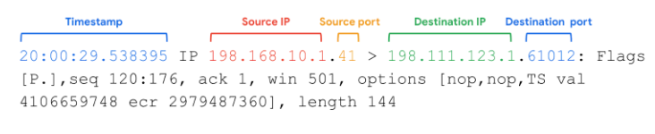

# Inspección de paquetes

## Captura de paquetes con tcpdump
- ​Tcpdump es un popular analizador de redes.
- ​Está preinstalado en muchas distribuciones de Linux y puede ​instalarse en la mayoría de sistemas operativos tipo Unix, como macOS.
- ​Puede capturar y monitorizar fácilmente ​tráfico de redes como TCP, ​IP, ICMP y muchos más.
- ​Tcpdump es una herramienta de línea de comandos.
- ​Esto significa que no tiene ​una interfaz gráfica de usuario.
- ​Con tcpdump, puede aplicar ​opciones y flags a sus comandos para ​filtrar fácilmente el tráfico de red de modo que ​pueda encontrar exactamente lo que busca.
- ​Puede filtrar por una dirección IP específica, ​protocolo o número de puerto.
- ​Examinemos un sencillo comando tcpdump ​utilizado para capturar paquetes.
- ​Tenga en cuenta que el Tráfico de su computadora ​puede aparecer diferente cuando utilice este comando.
- ​A primera vista, esto parece mucha Información.
- ​Examinémoslo línea por línea.
- ​El comando que ejecutamos es: `sudo tcpdump -i any ​-v -c 1.`
- ​Usamos sudo porque la cuenta de Linux en la que hemos iniciado sesión ​no tiene permiso para ejecutar tcpdump.
- ​A continuación, especificamos tcpdump para iniciar tcpdump ​y -i para especificar en qué ​interfaz queremos olfatear el tráfico.
- ​La -v significa verbose, ​que muestra información detallada de los paquetes.
- ​La -c significa count, ​que especifica cuántos paquetes capturará tcpdump.
- ​Aquí hemos especificado uno.
- ​Ahora examinemos la salida.
- ​Tcpdump nos ha dicho que está escuchando en ​cualquier interfaz de red disponible, y también ​nos ha dado información adicional, como el tamaño de captura.
```bash
tcpdump: listening on any, link-type LINUX_SLL (Linux cooked v1), capture size 262144 bytes
```
- ​El primer Campo es la marca de tiempo del Paquete, ​que detalla el tiempo específico del viaje del paquete.
- ​Comienza con horas, minutos, ​segundos y fracciones de segundo.
- Las marcas de tiempo son especialmente útiles durante ​una investigación de incidentes cuando se quiere ​determinar líneas de tiempo y correlacionar el tráfico.
- ​A continuación, IP aparece como el campo de versión.
- ​Está listado como IP, ​lo que significa que es IPv4.
- ​La opción verbose nos ha dado ​más detalles sobre los campos de paquetes IP, ​como el tipo de protocolo y ​la longitud del paquete.
- ​El primer Campo, ToS significa Tipo de Servicio.
- ​Recordemos que esto nos indica si ​ciertos paquetes deben tratarse con diferente cuidado.
- ​Esto se representa mediante un valor en hexadecimal.
- ​El campo TTL es Tiempo de vida, ​que nos dice cuánto tiempo puede ​viajar un Paquete a través de una Red antes de que sea descartado.
- ​Los tres campos siguientes son ​Identificación, Offset y Banderas, ​que proporcionan tres campos con ​información relativa a la fragmentación.
- ​Estos campos proporcionan instrucciones sobre cómo ​ensamblar los paquetes en el orden correcto.
- ​Por ejemplo, el DF, ​junto a las banderas significa Don't Fragment.
- ​A continuación, el proto es el campo de protocolo
- Especifica el protocolo en uso y también ​nos proporciona el valor que ​corresponde al protocolo.
- ​Aquí el protocolo es tcp, ​que se representa con el número 6.
- ​El último campo, length, es la Longitud total del paquete, ​incluida la cabecera IP.
```bash
20:00:29.538395 IP (tos 0x10, ttl 64, id 32645, offset 0, flags [DF], proto TCP (6) length 196)
```
- ​A continuación, podemos observar ​las direcciones IP que se están comunicando entre sí.
- ​La dirección de la flecha ​indica la dirección del flujo de tráfico.
- ​El último trozo de la dirección IP ​indica el número o nombre del puerto.
- ​A continuación, el campo cksum o suma de comprobación corresponde a ​la suma de comprobación de encabezado, que almacena un valor que se ​utiliza para determinar si ​se ha producido algún error en el encabezado.
- ​Aquí nos está diciendo que es correcto sin errores.
- ​Los campos restantes están relacionados con TCP.
- ​Por ejemplo, Flags indica las banderas de TCP.
- ​La P es la bandera de empuje, y ​el punto indica que es una bandera ACK.
- ​Esto significa que el paquete está empujando datos.
- ​Éste es sólo uno de los muchos comandos que puede utilizar ​en tcpdump para capturar el Tráfico de red.
```bash
198.122.123.1.731843718:731843862, ack 2435699383, win 501, options [nop, nop, TS val 4106659748 ecr 2979487360], length 144
1 packet captured
21 packet received by filter
13 packets dropped by kernel
```

---

## Visión general de tcpdump
- Como analista de seguridad, utilizará analizadores de protocolos de red para ayudar a defenderse de cualquier intrusión en la red.
- Anteriormente, aprendió los siguientes términos relacionados con el Monitoreo y Análisis de redes:
   - Un analizador de protocolos de red (packet sniffer) es una herramienta diseñada para capturar y analizar el tráfico de datos dentro de una red.
   - El sniffing de paquetes es la práctica de capturar e inspeccionar paquetes de datos a través de una red.

- ¿Qué es tcpdump?
   - Tcpdump es un analizador de protocolos de red de línea de comandos.
   - Recordemos que una interfaz de línea de comandos (CLI ) es una interfaz de usuario basada en texto que utiliza comandos para interactuar con la computadora.
   - Tcpdump se utiliza para capturar el tráfico de red.
   - Este tráfico puede guardarse en una captura de paquetes (p-cap), que es un archivo que contiene paquetes de datos interceptados desde una interfaz o red.
   - Se puede acceder al archivo p-cap, analizarlo o compartirlo posteriormente.
   - Los analistas utilizan tcpdump por una gran variedad de razones, desde la solución de problemas de redes hasta la identificación de actividades maliciosas.
   - Tcpdump viene preinstalado en muchas distribuciones de Linux y también puede instalarse en otros sistemas operativos basados en Unix, como macOS®.
   - Es habitual que el tráfico de red esté encriptado, lo que significa que los datos están codificados y son ilegibles.
   - Inspeccionar los paquetes de red puede requerir desencriptar los datos utilizando las claves privadas adecuadas.

- Captura de paquetes con tcpdump
   - Anteriormente en este programa, usted aprendió que un usuario raíz de Linux (o superusuario) tiene privilegios elevados para modificar el sistema.
   - También aprendió que el comando sudo otorga temporalmente permisos elevados a usuarios específicos en Linux.
   - Como muchas otras herramientas de sniffing de paquetes, necesitará tener privilegios de administrador para capturar tráfico de redes utilizando tcpdump.
   - Esto significa que necesitará estar registrado como usuario raíz o tener la capacidad de utilizar el comando sudo.
   - He aquí un desglose de la sintaxis de tcpdump para capturar paquetes:
   - sudo tcpdump [-i interface] [option(s)] [expression(s)]
      - El comando sudo tcpdump inicia la ejecución de tcpdump utilizando permisos elevados como sudo.
      - El parámetro -i especifica la interfaz de red para capturar el tráfico de red.
         - Debe especificar una interfaz de red desde la que capturar para comenzar a capturar paquetes.
         - Por ejemplo, si especifica -i any olfateará el tráfico de todas las interfaces de red del sistema.
      - Los option(s) son opcionales y le ofrecen la posibilidad de alterar la ejecución del comando.
      - Los expression(s) son una forma de filtrar aún más los paquetes de tráfico de red para que pueda aislar el tráfico de red.
   - Antes de empezar a capturar el tráfico de red, debe identificar qué interfaz de red desea utilizar para capturar los paquetes.
   - Puede utilizar la bandera -D para listar las interfaces de red disponibles en un sistema.

- Opciones
   - Con tcpdump, puede aplicar opciones, también conocidas como banderas, al final de las órdenes para filtrar el tráfico de red.
   - Las opciones cortas se abrevian y se representan mediante un guión y un único carácter como -i.
   - Las opciones largas se deletrean utilizando un guión doble como --interface.
   - Tcpdump tiene más de cincuenta opciones que puede explorar utilizando [la página del manual](https://www.tcpdump.org/manpages/tcpdump.1.html).
   - Las opciones distinguen entre mayúsculas y minúsculas.
   - Por ejemplo, un -w en minúsculas es una opción independiente con un uso diferente que la opción con mayúsculas -W.
   - Las opciones de tcpdump que se escriben utilizando opciones cortas pueden escribirse con o sin un espacio entre la opción y su valor
   - Por ejemplo, sudo tcpdump -i any -c 3 y sudo tcpdump -iany -c3 son comandos equivalentes
   - Aquí, examinará un par de opciones esenciales de tcpdump incluyendo cómo escribir y leer archivos de captura de paquetes. 
   
- `-w`
   - Utilizando la bandera -w, puede escribir o guardar los paquetes de red olfateados en un archivo de captura de paquetes en lugar de simplemente imprimirlos en el terminal.
   - Esto es muy útil porque puede consultar este archivo guardado para su posterior análisis.
   - En este comando, tcpdump está capturando el tráfico de red de todas las interfaces de red y guardándolo en un archivo de captura de paquetes llamado packetcapture.pcap:
   - sudo tcpdump -i any -w packetcapture.pcap
- `-r`
   - Utilizando la bandera -r, puede leer un archivo de captura de paquetes especificando el nombre del archivo como parámetro.
   - He aquí un ejemplo de un comando tcpdump que lee un archivo llamado packetcapture.pcap:
   - sudo tcpdump -r packetcapture.pcap
- `-v`
   - Como ha aprendido, los paquetes contienen mucha información.
   - Por defecto, tcpdump no imprimirá toda la información de un Paquete.
   - Esta opción, que significa verborrea, le permite controlar cuánta información de los paquetes desea que imprima tcpdump.
   - Hay tres niveles de verbosidad que puede utilizar dependiendo de cuánta información de paquetes quiere que imprima tcpdump.
   - Los niveles son -v, -vv, y -vvv.
   - El nivel de verbosidad aumenta con cada v añadida.
   - La opción verbosa puede ser útil si está buscando información de paquetes como los detalles de los campos de cabecera IP de un paquete.
   - He aquí un ejemplo de un comando tcpdump que lee el archivo packetcapture.pcap con verbosidad:
   - sudo tcpdump -r packetcapture.pcap -v
- `-c`
   - La opción -c significa recuento.
   - Esta opción le permite controlar cuántos paquetes capturará tcpdump.
   - Por ejemplo, si especifica -c 1 sólo imprimirá un único paquete, mientras que -c 10 imprime 10 paquetes.
   - Este ejemplo le está diciendo a tcpdump que sólo capture los tres primeros paquetes que olfatea de la interfaz de red any:
   - sudo tcpdump -i any -c 3
- `-n`
   - Por defecto, tcpdump realizará la resolución de nombres.
   - Esto significa que tcpdump convierte automáticamente las direcciones IP en nombres.
   - También resolverá puertos a servicios comúnmente asociados que utilicen estos puertos.
   - Esto puede ser problemático porque tcpdump no siempre es preciso en la resolución de nombres.
   - Por ejemplo, tcpdump puede capturar Tráfico desde el puerto 80 y automáticamente traduce el puerto 80 a HTTP en la salida.
   - Sin embargo, esto es engañoso porque el puerto 80 no siempre va a estar utilizando HTTP; podría estar utilizando un protocolo diferente.
   - Además, la resolución de nombres utiliza lo que se conoce como una búsqueda DNS inversa.
   - Una búsqueda DNS inversa es una consulta que busca el nombre de dominio asociado a una dirección IP.
   - Si realiza una búsqueda DNS inversa en el sistema de un atacante, éste podría ser alertado de que lo está investigando a través de sus registros DNS.
   - El uso de la bandera -n desactiva esta asignación automática de números a nombres y se considera la mejor práctica a la hora de husmear o analizar el tráfico.
   - El uso de -n no resolverá nombres de host, mientras que -nn no resolverá ni nombres de host ni puertos.
   - He aquí un ejemplo de un comando tcpdump que lee el archivo packetcapture.pcap con verbosidad y desactiva la resolución de nombres:
   - sudo tcpdump -r packetcapture.pcap -v -n
- Puede combinar opciones entre sí.
- Por ejemplo, -v y -n pueden combinarse como -vn.
- Pero, si una opción acepta un parámetro justo después de ella como -c 1 o -r capture.pcap entonces no puede combinar otras opciones a ella.

- Expresividad
   - El uso de expresiones de filtrado en los comandos tcpdump también es opcional, pero saber cómo y cuándo utilizar expresiones de filtrado puede ser útil durante el análisis de paquetes.
   - Hay muchas formas de utilizar expresiones de filtrado.
   - Si desea buscar específicamente tráfico de red por protocolo, puede utilizar expresiones de filtrado para aislar paquetes de red.
   - Por ejemplo, puede filtrar para encontrar sólo tráfico IPv6 utilizando la expresión de filtrado ip6.
   - También puede utilizar operadores booleanos como and, or, o not para filtrar aún más el tráfico de red para direcciones IP, puertos y más específicos.
   - El ejemplo siguiente lee el archivo packetcapture.pcap y combina dos expresiones ip and port 80 utilizando el operador booleano and:
   - sudo tcpdump -r packetcapture.pcap -n 'ip and port 80'
   - Puede utilizar comillas simples o dobles para asegurarse de que tcpdump ejecuta todas las expresiones.
   - También puede utilizar paréntesis para agrupar y priorizar diferentes expresiones.
   - Agrupar expresiones es útil para comandos complejos o largos.
   - Por ejemplo, el comando ip and (port 80 or port 443) indica a tcpdump que priorice la ejecución de los filtros encerrados entre los paréntesis antes de filtrar para IPv4.

- Interpretar la salida
   - Una vez que ejecute un comando para capturar paquetes, tcpdump imprimirá la salida del comando como los paquetes olfateados.
   - En la salida, tcpdump imprime una línea de texto por cada paquete con cada línea comenzando con una marca de tiempo.
   - He aquí un ejemplo de un comando y la salida para un solo paquete TCP:
   - sudo tcpdump -i any -v -c 1
   - Este comando indica a tcpdump que capture paquetes en la interfaz de red -i any.
   - La opción -v imprime el paquete con información detallada y la opción -c 1 imprime sólo un paquete.
   - A continuación se muestra la salida de este Comando:



   - Timestamp: La salida comienza con la marca de tiempo, que empieza con horas, minutos, segundos y fracciones de segundo.
   - IP de origen: El origen del paquete lo proporciona su dirección IP de origen.
   - Puerto de origen: Este número de puerto es donde se originó el paquete.
   - IP de destino: La dirección IP de destino es hacia dónde se está transmitiendo el paquete.
   - Puerto de destino: Este número de puerto es hacia donde se está transmitiendo el paquete.
   - El resto de la salida contiene detalles de la conexión TCP, incluidas las banderas y el número de secuencia.
   - La información de options es información adicional del paquete que ha proporcionado la opción -v.

- Recursos
   - [Aprenda más con los tutoriales y guías de tcpdump, que incluye recursos educativos adicionales.](https://www.tcpdump.org/)
   - [Aprenda más sobre el uso de expresiones para filtrar el Tráfico con este tutorial de tcpdump por Daniel Miessler.](https://danielmiessler.com/p/tcpdump/)