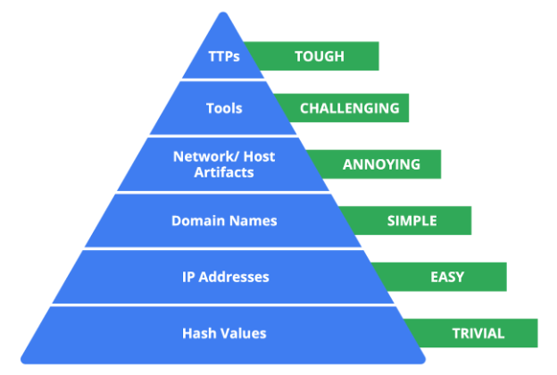

# Detección y verificación de incidentes

## Bienvenido al Módulo 3
- Las habilidades que está aprendiendo crearán una base sólida a medida que comience su ​carrera en seguridad.
- ​En la sección anterior, aplicó sus conocimientos sobre redes para profundizar ​en su comprensión del tráfico de red.
- ​Practicó algunas habilidades que los analistas de seguridad utilizan en el trabajo como ​captar el tráfico de red y diseccionar paquetes.
- ​A continuación, examinaremos el ciclo de vida de un incidente de seguridad de principio a fin.
- ​Se centrará en cómo detectar, responder y recuperarse de un incidente.
- ​A continuación, aprenderá a investigar y ​verificar un incidente una vez detectado.
- ​Explorará los planes y procesos que hay detrás de la respuesta ante incidentes.
- ​Por último, aprenderá sobre las acciones posteriores al incidente que las organizaciones ​toman para aprender y mejorar de la experiencia.
- ​Al final de esta sección, ​obtendrá una comprensión global del ciclo de vida de un incidente.

---

## La fase de detección y análisis del ciclo de vida
- ​Los incidentes ocurren y, como analista de seguridad, es probable que en algún momento de su carrera se le encargue ​investigar y responder a incidentes de seguridad.
- ​Examinemos la fase de Detección y Análisis del ciclo de vida de la respuesta ante incidentes.
- ​Aquí es donde los equipos de respuesta ante incidentes verifican y analizan los incidentes.
- ​La Detección permite el rápido descubrimiento de incidentes de Seguridad.
- ​Recuerde que no todos los incidentes son incidentes, pero todos los incidentes son eventos.
- ​Los eventos son sucesos regulares en las operaciones de negocio, como las visitas a un sitio web o ​las solicitudes de restablecimiento de contraseña.
- ​Las herramientas IDS y SIEM recopilan y ​analizan datos de incidentes de distintas fuentes para identificar posibles actividades inusuales.
- ​Si se detecta un incidente, como que un actor malicioso haya conseguido ​acceder sin autorización a una cuenta, entonces se envía una alerta.
- ​Los equipos de seguridad comienzan entonces la fase de Análisis.
- ​El análisis implica la investigación y validación de alertas.
- ​Durante el proceso de análisis, los analistas deben aplicar su pensamiento crítico y ​sus habilidades de análisis de incidentes para investigar y validar las alertas.
- ​Examinarán los indicadores de compromiso para determinar si se ha producido un incidente.
- ​Esto puede suponer un reto por un par de razones.
- ​El reto de la Detección es que es imposible detectarlo todo.
- ​Incluso las grandes herramientas de detección tienen limitaciones en su funcionamiento, y las herramientas automatizadas ​pueden no estar totalmente implementadas en toda una organización debido a la limitación de recursos.
- ​Algunos incidentes son inevitables, por lo que es importante que las ​organizaciones cuenten con un Plan de respuesta a incidentes.
- ​Los analistas suelen recibir un alto volumen de alertas por turno, ​a veces incluso miles.
- ​La mayoría de las veces, los altos volúmenes de alertas están causados por una configuración de alertas incorrecta.
- ​Por ejemplo, las reglas de alerta que son demasiado amplias y ​no están ajustadas al entorno de una organización crean falsos positivos.
- ​Otras veces, los altos volúmenes de alertas pueden ser alertas legítimas causadas ​por actores maliciosos que se aprovechan de una vulnerabilidad recién descubierta.
- ​Como analista de Seguridad, es importante que esté equipado para analizar ​alertas de forma eficaz.

---

## Métodos de detección de incidentes de ciberseguridad
- Los analistas de Seguridad utilizan herramientas de Detección para ayudarles a descubrir amenazas, pero existen métodos adicionales de Detección que también pueden ser utilizados.

- Métodos de Detección
   - Durante la fase de Detección y Análisis del ciclo de vida de la respuesta a incidentes, los Equipos de Seguridad reciben la notificación de un posible incidente y trabajan para investigarlo y verificarlo mediante la recopilación y el análisis de datos.
   - Como recordatorio, la Detección se refiere al descubrimiento prompt de los Eventos de Seguridad y el Análisis implica la investigación y validación de las alertas.
   - Como ha aprendido, un Sistema de detección de intrusiones (IDS) puede detectar posibles intrusiones y enviar alertas a los analistas de seguridad para que investiguen la actividad sospechosa.
   - Los analistas de seguridad también pueden utilizar herramientas de administración de información y eventos de seguridad (SIEM) para detectar, recopilar y analizar los datos de seguridad.
   - También ha aprendido que la Detección plantea retos.
   - Incluso los mejores Equipos de Seguridad pueden fallar en la detección de amenazas reales por una gran variedad de razones.
   - Por ejemplo, las herramientas de Detección sólo pueden detectar lo que los Equipos de Seguridad configuran para Monitorear.
   - Si no están bien configuradas, pueden no detectar actividades sospechosas, dejando los sistemas vulnerables a los ataques.
   - Es importante que los equipos de Seguridad utilicen métodos adicionales de Detección para aumentar su cobertura y precisión.

- Caza de amenazas
   - Las amenazas evolucionan y los atacantes avanzan en sus tácticas y técnicas.
   - La Detección automatizada e impulsada por la tecnología puede ser limitada a la hora de mantenerse al día con el panorama cambiante de las amenazas.
   - La detección impulsada por el hombre, como la caza de amenazas, combina el poder de la tecnología con un elemento humano para descubrir amenazas ocultas que las herramientas de detección no detectan.
   - La caza de amenazas es la búsqueda proactiva de amenazas en una red.
   - Los profesionales de la Seguridad utilizan la caza de amenazas para descubrir actividades maliciosas que no fueron identificadas por las herramientas de Detección y como una forma de realizar análisis adicionales sobre las detecciones.
   - La caza de amenazas también se utiliza para detectar amenazas antes de que causen daños.
   - Por ejemplo, el software malicioso sin archivos es difícil de identificar para las herramientas de Detección.
   - Es una forma de software malicioso que utiliza sofisticadas técnicas de evasión, como ocultarse en la memoria en lugar de utilizar archivos o aplicaciones, lo que le permite eludir los métodos tradicionales de Detección, como el Análisis de firmas.
   - Con la caza de amenazas, se utiliza la combinación del análisis humano activo y la tecnología para identificar amenazas como el software malicioso sin archivos.
   - Los especialistas en caza de amenazas se conocen como cazadores de amenazas.
   - Los cazadores de amenazas realizan investigaciones sobre amenazas y ataques emergentes y luego determinan la probabilidad de que una organización sea vulnerable a un ataque concreto.
   - Los cazadores de amenazas utilizan una combinación de Inteligencia sobre amenazas, Indicadores de compromiso, Indicadores de ataque y Aprendizaje automático para buscar amenazas en una organización.

- Inteligencia sobre amenazas
   - Las organizaciones pueden mejorar su capacidad de Detección manteniéndose al día sobre la evolución del panorama de las amenazas y comprendiendo la relación entre su entorno y los actores maliciosos.
   - Una forma de comprender las amenazas es utilizar la inteligencia sobre amenazas, que es información sobre amenazas basada en pruebas que proporciona contexto sobre las amenazas existentes o emergentes.
   - La inteligencia sobre amenazas puede proceder de fuentes privadas o públicas como:
      - Informes de la industria:
         - A menudo incluyen detalles sobre las Tácticas, Técnicas y Procedimientos (TTP) de los atacantes.
      - Avisos del Gobierno:
         - Al igual que los informes de la industria, los avisos gubernamentales incluyen detalles sobre la TTP de los atacantes.
      - Fuentes de datos sobre amenazas:
         - Los feeds de datos sobre amenazas proporcionan un flujo de datos relacionados con las amenazas que pueden utilizarse para ayudar a protegerse contra atacantes sofisticados como las amenazas persistentes avanzadas (APT).
         - Las APT son instancias en las que un actor de amenaza mantiene un acceso no autorizado a un sistema durante un largo periodo de tiempo.
         - Los Datos suelen ser una lista de indicadores como direcciones IP, dominios y hashes de archivos.
   - Puede resultar difícil para las organizaciones gestionar eficazmente grandes volúmenes de inteligencia sobre amenazas.
   - Las organizaciones pueden aprovechar una plataforma de inteligencia sobre amenazas (TIP), que es una aplicación que recopila, centraliza y analiza la inteligencia sobre amenazas procedente de distintas fuentes.
   - Las TIP proporcionan una plataforma centralizada para que las organizaciones identifiquen y prioricen las amenazas relevantes y mejoren su postura de Seguridad.
   - Las fuentes de datos de Inteligencia sobre amenazas se utilizan mejor para añadir contexto a las detecciones.
   - No deben dirigir las detecciones por completo y deben evaluarse antes de aplicarse a una organización.

- Ciberengaño
   - El engaño cibernético implica técnicas que engañan deliberadamente a los actores maliciosos con el objetivo de aumentar la Detección y mejorar las estrategias defensivas.
   - Los Honeypots son un ejemplo de mecanismo activo de ciberdefensa que utiliza la tecnología del engaño.
   - Los Honeypots son sistemas o Recursos que se crean como señuelos vulnerables a los ataques con el propósito de atraer a posibles intrusos.
   - Por ejemplo, tener un archivo falso con la etiqueta Información de la tarjeta de crédito del cliente - 2022 puede utilizarse para captar la actividad de actores maliciosos engañándoles para que accedan al archivo porque parece legítimo.
   - Una vez que un actor malicioso intenta acceder a este archivo, se alerta a los equipos de Seguridad.

- Recursos
   - [Un repositorio de información sobre la caza de amenazas de The ThreatHunting Project](https://www.threathunting.net/)
   - [Investigación sobre hackers patrocinados por el estado del Grupo de Análisis de Amenazas (TAG)](https://blog.google/threat-analysis-group/)

---

## Supervisión continua de CI/CD
- Monitorización continua de CI/CD: encontrar amenazas automáticamente
   - La supervisión de su canalización CI/CD ayuda a proteger su cadena de suministro de software y existen herramientas especiales que pueden encontrar automáticamente actividades inusuales y ayudarle a identificar Indicadores de Compromiso (IoC).

- Automatización para encontrar amenazas
   - Los procesos CI/CD le ayudan a liberar software más rápidamente, pero también pueden abrir nuevas vulnerabilidades para los atacantes.
   - Si alguien irrumpe en su canalización, podría añadir código, robar información privada o impedir que su software funcione.
   - Por lo tanto, la supervisión continua que detecta automáticamente la actividad inusual de la canalización es fundamental.
   - La supervisión eficaz de CI/CD utiliza la automatización para hacer algo más que recopilar registros.
   - Utiliza herramientas de supervisión para encontrar automáticamente cosas inusuales que ocurren en los procesos de construcción, código o pasos de despliegue que pueden indicar posibles amenazas a la seguridad.
   - Cuando se detectan estas amenazas, los equipos de seguridad pueden responder rápidamente y limitar los daños.
   - Esta detección automática de amenazas es uno de los principales objetivos de una seguridad CI/CD sólida.

- Indicadores comunes de compromiso (IoC) en los conductos de CI/CD
   - Comprender los IoC comunes de CI/CD le ayuda a supervisar de forma eficaz y a encontrar rápidamente incidentes de seguridad.
   - He aquí algunos ejemplos:
      - Cambios de código no autorizados:
         - Cambios de código realizados por personas que no deberían realizarlos.
         - Cambios de código realizados en momentos inusuales o desde lugares inesperados.
         - Cambios de código que parecen sospechosos, como código confuso, eliminaciones muy grandes sin una buena razón, o código que no sigue las reglas de codificación.
      - Patrones de despliegue sospechosos:
         - Despliegues en sistemas inusuales o no aprobados (por ejemplo, despliegues de producción iniciados directamente desde ramas de desarrollador).
         - Despliegues que se producen en momentos inesperados o con demasiada frecuencia (despliegues fuera de los plazos de lanzamiento previstos).
         - Despliegues iniciados por cuentas de usuario inusuales o cuentas automatizadas que no deberían estar liberando a producción.
      - Dependencias comprometidas:
         - Encontrar vulnerabilidades conocidas (CVEs) en dependencias durante comprobaciones automatizadas en la canalización CI/CD.
         - Adición repentina de dependencias nuevas e inesperadas a las configuraciones de compilación.
         - Intentos de descargar dependencias de fuentes no oficiales o no fiables.
      - Ejecución inusual de la canalización:
         - Pasos del pipeline que normalmente funcionan bien y de repente fallan.
         - Los pipelines tardan mucho más en ejecutarse sin una razón clara.
         - Cambios en el orden o la forma en que se ejecutan los pasos del pipeline sin que se hayan realizado cambios aprobados.
      - Intentos de exposición de secretos:
         - Registros que muestran intentos de acceder a secretos desde lugares no aprobados en el pipeline.
         - Descubrimiento de secretos privados codificados en cambios de código (lo ideal sería evitarlo antes, pero la supervisión puede detectar errores).

- Seguridad proactiva mediante la supervisión de IoC
   - La supervisión continua de los procesos CI/CD, centrada en la detección automatizada de anomalías y la búsqueda de IoC, refuerza la seguridad y la hace más proactiva.
   - Mediante el uso de herramientas de supervisión para comprobar continuamente la actividad de las canalizaciones en busca de estos indicadores antes de que se produzcan daños graves, puede:
      - Responder rápidamente a los incidentes:
         - Encontrar los IoC en una fase temprana ayuda a los equipos de seguridad a responder rápidamente a posibles ataques, deteniendo los problemas antes de que los atacantes alcancen sus objetivos.
         - Limitar los daños:
            - Responder rápidamente basándose en la detección de IoCs reduce el posible impacto de un problema de seguridad al limitar el tiempo que los atacantes están en la tubería.
      - Mejorar el conocimiento de las amenazas:
         - Comprobar los IoC proporciona información valiosa sobre cómo los atacantes están apuntando a su CI/CD, lo que ayuda a mejorar la seguridad y la caza de amenazas en el futuro.

- Uso de la automatización para encontrar anomalías e IoCs
   - Para supervisar las canalizaciones de CI/CD y encontrar amenazas automáticamente, puede utilizar estos métodos:
   - Registro y auditoría exhaustivos:
      - Los registros detallados son la base de la supervisión.
      - Los registros proporcionan los datos en bruto que las herramientas de supervisión comprueban en busca de actividad inusual y posibles indicadores de compromiso (IoC).
      - Los registros más comunes para encontrar anomalías incluyen:
         - Registros de ejecución de canalizaciones:
            - Para aprovechar eficazmente los registros de ejecución de canalizaciones para la supervisión de la seguridad, las herramientas especializadas emplean técnicas automatizadas de línea de base.
            - Estas herramientas analizan los registros de ejecuciones típicas y satisfactorias de canalizaciones CI/CD para establecer un perfil de funcionamiento normal.
            - Esta línea de base engloba indicadores clave de rendimiento, como la duración estándar de cada etapa del proceso y las tasas de éxito y fracaso esperadas.
            - Al supervisar continuamente los registros de ejecución y compararlos con esta línea de base establecida, las herramientas pueden detectar automáticamente actividades anómalas.
            - Las desviaciones de la norma, incluidos los pasos de la canalización que superan los tiempos de ejecución típicos, los errores inesperados o las alteraciones en el orden habitual de los pasos, se marcan como posibles indicadores de compromiso (IoC), lo que justifica un mayor escrutinio de seguridad.
         - Registros de confirmación de código:
            - Realiza un seguimiento de los cambios en el código de cada proceso.
            - Los cambios de código inusuales, como los cambios realizados por personas que no deberían estar realizando cambios, los cambios realizados a altas horas de la noche o los cambios con contenido sospechoso (como eliminaciones muy grandes o código confuso), son IoC importantes de supervisar.
         - Registros de acceso:
            - Las herramientas de monitorización pueden saber quién accede habitualmente a CI/CD.
            - Los inicios de sesión inusuales, como inicios de sesión desde diferentes países, intentos fallidos de inicio de sesión seguidos de un inicio de sesión exitoso, o intentos de inicio de sesión para cambiar configuraciones importantes de canalización, son fuertes indicadores de compromiso.
         - Registros de despliegue:
            - Las herramientas pueden saber con qué frecuencia se producen los despliegues y qué aspecto tienen.
            - Los despliegues inusuales, como los que se producen en momentos extraños o en lugares inesperados, pueden ser IoC.

- Integración de información de seguridad y gestión de eventos (SIEM)
   - Conectar sus registros de CI/CD a una herramienta SIEM puede ayudar a encontrar automáticamente anomalías a gran escala.
   - Las plataformas SIEM están hechas para:
      - Encontrar anomalías automáticamente:
         - Los SIEM utilizan el aprendizaje automático y el análisis para encontrar automáticamente patrones inusuales en los registros de CI/CD, que son posibles IoC para investigar.
      - Utilizar reglas para alertar sobre IoC conocidos:
         - Puede configurar reglas específicas en el SIEM para encontrar IoC de CI/CD conocidos.
         - Por ejemplo, las reglas pueden enviar alertas cuando:
            - Se detectan hashes de archivos maliciosos específicos (relacionados con ataques de CI/CD conocidos) en los resultados de la compilación.
            - Los servidores CI/CD se conectan a servidores de comando y control (C2) maliciosos conocidos (utilizando datos de inteligencia de amenazas).
            - Alguien intenta descargar o acceder a secretos privados fuera de los pasos aprobados del pipeline.

- Alertas y notificaciones en tiempo real
   - Las alertas automatizadas garantizan que los equipos de seguridad reciban notificaciones inmediatas sobre actividades inusuales y posibles IoC, para que puedan responder rápidamente.
   - Las alertas deben configurarse para:
      - Fallos de compilación inusuales:
         - Fallos repetidos en los pasos del proceso, especialmente después de cambios de código que no deberían causar fallos.
      - Cambios de código sospechosos (basados en anomalías):
         - Alertas enviadas por herramientas de análisis de código que encuentran cambios de código muy inusuales basados en el tamaño, autor o contenido confuso.
      - Intentos de exponer secretos:
         - Alertas enviadas por herramientas de seguridad cuando alguien intenta acceder o robar secretos de partes no aprobadas del pipeline.
      - Tráfico de red inusual:
         - Alertas de tráfico de red inusual desde servidores CI/CD, especialmente el tráfico que sale a ubicaciones desconocidas o sospechosas.

- Monitorización del rendimiento para encontrar IoAs y descubrir IoCs
   - La monitorización del rendimiento, aunque se utiliza principalmente para asegurarse de que las cosas están funcionando sin problemas, también puede ayudar indirectamente a encontrar IoCs.
   - Los problemas de rendimiento (Indicadores de Ataque - IoAs) como ralentizaciones repentinas o servidores CI/CD que se quedan sin recursos pueden llevar a comprobaciones más profundas que pueden descubrir IoCs.

- Exploración continua de vulnerabilidades
   - La comprobación periódica de la infraestructura de CI/CD en busca de puntos débiles puede detectar proactivamente partes vulnerables.
   - Esto incluye Vulnerabilidades y Exposiciones Comunes (CVEs) en herramientas CI/CD, plugins y contenedores.
   - Estos puntos débiles son IoC potenciales.
   - Destacan las áreas que necesitan ser parcheadas de inmediato para evitar ataques y un posible compromiso de la tubería.

- Recursos
   - [Optimización de registros para una canalización CI/CD más eficaz - Mejores prácticas](https://coralogix.com/blog/optimizing-logs-for-a-more-effective-ci-cd-pipeline/)
   - [Implementación de la IA en los procesos CI/CD: Una guía práctica](https://blog.axiomio.com/implementing-ai-in-ci-cd-pipelines-a-practical-guide-83466035e3c7)
   - [¿Qué es CI/CD? - Integración, entrega y despliegue continuos](https://www.threatintelligence.com/blog/continuous-integration-continuous-delivery)
   - [Canalizaciones CI/CD y DevOps: Una introducción](https://www.splunk.com/en_us/blog/learn/ci-cd-devops-pipeline.html)

---

## MK: Cambios en el sector de la ciberseguridad
- Hola, soy MK, Director de la Oficina del CISO para Google Nube.
- ​La función del Director de Seguridad de la Información es proteger Google Nube ​desde el punto de vista de la seguridad.
- ​Pero también garantizar que estamos proporcionando todas las herramientas y productos necesarios para ​que nuestros clientes puedan lograr sus resultados de seguridad también.
- ​Así que pasé varios años en el Gobierno de los EE.UU., 32 años de hecho, ​22 de los cuales los pasé como agente especial en la Oficina Federal de Investigación.
- ​Aproximadamente a mitad de mi carrera, ​tuve la oportunidad de cambiar a los carriles de la ciberseguridad, lo que inició, o ​debería decir, reinició mi interés por todo lo relacionado con las computadoras y la informática.
- ​Una de las cosas que le falta a la industria es un sentido de la agilidad, ​que el adversario tiene a raudales.
- ​Cuando identifican algo que les funciona, ​continúan machacándolo hasta que y a menos que haya un obstáculo.
- ​Y entonces, una vez que ese obstáculo se interpone en su camino, ​han demostrado una habilidad para pivotar fácilmente sus tácticas y técnicas de modo que ​puedan sortear el obstáculo en futuros intentos de acceder a entornos.
- ​Así que ninguno de nosotros puede predecir el futuro.
- ​No estamos en ningún tipo de fase final.
- ​Esta es una industria en continua evolución.
- ​Lo que sí se puede afirmar es que necesitamos estar preparados de diversas maneras ​para combatir lo que sin duda será un ataque persistente del adversario.
- ​Lo que eso requiere es un cierto sentido de la agilidad, ​hay que sentirse cómodo existiendo en lo desconocido.
- ​Pero también hay que tener la aptitud intelectual para poder digerir y ​formular nuevas soluciones sobre la marcha.
- ​Cero Confianza es una tendencia enorme en estos momentos porque ha sido tanto un deseo de ​la industria avanzar hacia la Cero Confianza, pero ​también un requisito en algunas zonas de todo el mundo.
- ​Confianza Cero es un movimiento que se aleja de la forma histórica en que hemos hecho la seguridad en ​el pasado.
- ​En términos de Layman, así que usted es un viajero de negocios, viaja ​con su portátil de negocios y se registra en su hotel al otro lado del mundo, ​y necesita prepararse y estar listo para una reunión de negocios que está a punto de ocurrir.
- ​Históricamente, usted querría ser capaz de atestiguar el hecho de que ese es ​un usuario previsto o cualificado dentro de la empresa que intenta acceder ​a esta información.
- ​Y sí, basándose en la información que usted tiene, la identidad y ​acoplando eso con la información del dispositivo, ese usuario y ese dispositivo deberían tener acceso a ​esta información y ser capaces de tomar una determinación al respecto.
- ​Creo que cuanto más invirtamos en el enfoque o ​arquitectura de Confianza Cero, llegaremos a un buen punto desde el que pivotar.
- ​Pero creo que mucho de lo que está por venir es desconocido, y ​eso significa aprendizaje continuo.
- ​Significa, exponerse continuamente a diferentes partes de la industria para ​que estemos preparados para lo que pueda ocurrir en el futuro. 

---

## Indicadores de compromiso
- Indicadores de compromiso
   - Los Indicadores de compromiso (IoC) son pruebas observables que sugieren indicios de un posible incidente de Seguridad.
   - Los IoC grafican piezas específicas de evidencia que están asociadas con un ataque, como un nombre de archivo asociado con un tipo de software malicioso.
   - Puede pensar en un IoC como una prueba que apunta a algo que ya ha sucedido, como darse cuenta de que han robado algo valioso del interior de un coche.
   - Los Indicadores de ataque (IoA) son la serie de sucesos observados que indican un incidente en tiempo real.
   - Los IoA se centran en identificar las pruebas de comportamiento de un atacante, incluidos sus métodos e intenciones.
   - Esencialmente, los IoC ayudan a identificar el quién y el qué de un ataque después de que haya tenido lugar, mientras que los IoA se centran en encontrar el por qué y el cómo de un ataque en curso o desconocido.
   - Por ejemplo, observar un proceso que realiza una conexión de red es un ejemplo de IoA.
   - El nombre de archivo del proceso y la dirección IP con la que contactó el proceso son ejemplos de IoC relacionados.
   - Los Indicadores de compromiso no siempre son una confirmación de que se ha producido un Incidente de Seguridad.
   - Los IoC pueden ser el resultado de un error humano, un mal funcionamiento del sistema y otras razones no relacionadas con la Seguridad.

- Pirámide del dolor
   - No todos los Indicadores de compromiso son iguales en cuanto al valor que aportan a los equipos de Seguridad.
   - Es importante que los profesionales de la Seguridad comprendan los distintos tipos de Indicadores de compromiso para que puedan detectarlos y responder a ellos con rapidez y eficacia.
   - Esta es la razón por la que el investigador de Seguridad David J. Bianco creó el concepto de la [Pirámide del Dolor](http://detect-respond.blogspot.com/2013/03/the-pyramid-of-pain.html), con el objetivo de mejorar la forma en que se utilizan los Indicadores de compromiso en la Detección de Incidentes.

   

   - La Pirámide del Dolor capta la relación entre los indicadores de compromiso y el nivel de dificultad que experimentan los actores maliciosos cuando los indicadores de compromiso son bloqueados por los Equipos de Seguridad.
   - Enumera los distintos tipos de indicadores de compromiso que los profesionales de la Seguridad utilizan para identificar actividades maliciosas.
   - Cada tipo de indicador de compromiso se separa en niveles de dificultad.
   - Estos niveles representan los niveles de "dolor" a los que se enfrenta un atacante cuando los equipos de Seguridad bloquean la actividad asociada al indicador de compromiso.
   - Por ejemplo, el bloqueo de una dirección IP asociada a un actor malicioso se etiqueta como fácil porque los actores maliciosos pueden utilizar fácilmente diferentes direcciones IP para sortear esto y continuar con sus esfuerzos maliciosos.
   - Si los Equipos de Seguridad son capaces de bloquear los IoC situados en la parte superior de la pirámide, más difícil les resultará a los atacantes continuar con sus ataques.
   - He aquí un desglose de los diferentes tipos de Indicadores de compromiso que se encuentran en la Pirámide del Dolor.
      - Valores hash:
         - Hashes que corresponden a archivos maliciosos conocidos.
         - Suelen utilizarse para proporcionar referencias únicas a muestras específicas de software malicioso o a archivos implicados en una intrusión.
      - Direcciones IP:
         - Una Dirección de Protocolo de Internet como 192.168.1.1
      - Nombres de dominio:
         - Una dirección web como www.google.com
      - Artefactos de red:
         - Pruebas observables creadas por actores maliciosos en una red.
         - Por ejemplo, información encontrada en protocolos de redes como las cadenas User-Agent.
      - Artefactos de host:
         - Pruebas observables creadas por actores maliciosos en un host.
         - Un host es cualquier dispositivo que esté conectado en una red.
         - Por ejemplo, el nombre de un archivo creado por software malicioso.
      - Herramientas:
         - Software que utiliza un actor malicioso para lograr su objetivo.
         - Por ejemplo, los atacantes pueden utilizar herramientas de descifrado de contraseñas como John the Ripper para realizar ataques de contraseña con el fin de obtener acceso a una cuenta.
      - Tácticas, Técnicas y Procedimientos (TTP):
         - Se trata del comportamiento de un actor malicioso.
         - Las Tácticas se refieren a la descripción general de alto nivel del comportamiento.
         - Las técnicas proporcionan descripciones detalladas del comportamiento relacionado con la táctica.
         - Los Procedimientos son descripciones muy detalladas de la técnica.
         - Las TTP son las más difíciles de detectar.

---

## Identificar: Indicadores de compromiso
- Review each scenario and identify whether it is a normal event or an indicator of compromise.

- Everyday Ocurrence
   - You observe a user install a verified software program.
   - You observe an authorized administrator adjust user permissions during working hours.
   - You observe a known user successfully authenticate a new device using two-factor
- Indicator of Compromise
   - You observe the creation of new administrative users outside of working hours.
   - You observe users logging in from an unknown geographical location.
   - You find a USB drive plugged into an unsupervised , unlocked laptop.
   - You discover a randsomware note on your screen and your files are encrypted.

---

## Analizar los indicadores de compromiso con herramientas de investigación
- Añadir contexto a las investigaciones
   - Ha aprendido sobre la Pirámide del Dolor, que describe la relación entre los indicadores de compromiso y el nivel de dificultad que experimentan los actores maliciosos cuando los indicadores de compromiso son bloqueados por los Equipos de Seguridad.
   - También ha aprendido sobre los diferentes tipos de IoC, pero como ya sabe, no todos los IoC son iguales.
   - Los actores maliciosos pueden ingeniárselas para eludir la detección y seguir comprometiendo los sistemas a pesar de tener bloqueada o limitada su actividad relacionada con los IoC. 
   - Por ejemplo, identificar y bloquear una única dirección IP asociada a una actividad maliciosa no proporciona una estadística más amplia sobre un ataque, ni impide que un actor malicioso continúe con su actividad.
   - Centrarse en una sola prueba es como fijarse en una sola sección de un cuadro: Se pierde la visión de conjunto.
   - Los analistas de Seguridad necesitan una forma de ampliar el uso de los IoC para que puedan añadir contexto a las alertas.
   - La Inteligencia sobre amenazas es información basada en pruebas que proporciona contexto sobre las amenazas existentes o emergentes.
   - Al acceder a información adicional relacionada con los IoC, los analistas de seguridad pueden ampliar su punto de vista para observar el panorama general y construir una narrativa que ayude a informar sus acciones de respuesta.
   - Al añadir contexto a un IoC -por ejemplo, identificando otros artefactos relacionados con la dirección IP sospechosa, como comunicaciones de red sospechosas o procesos inusuales- los equipos de seguridad pueden empezar a desarrollar una imagen detallada de un incidente de seguridad.
   - Este contexto puede ayudar a los Equipos de Seguridad a detectar más rápidamente los Incidentes de Seguridad y a adoptar un enfoque más informado en su respuesta.
   
- El poder del Crowdsourcing
   - El crowdsourcing es la práctica de recopilar información utilizando las aportaciones y la colaboración del público.
   - Las plataformas de Inteligencia sobre amenazas utilizan el crowdsourcing para recopilar información de la comunidad mundial de ciberseguridad.
   - Tradicionalmente, la respuesta de una organización a los incidentes se realizaba de forma aislada.
   - Un Equipo de Seguridad recibía y analizaba una alerta, y luego trabajaba para remediarla sin estadísticas adicionales sobre cómo abordarla.
   - Sin crowdsourcing, los atacantes pueden realizar los mismos ataques contra varias organizaciones. 
   - Con el crowdsourcing, las organizaciones aprovechan los conocimientos de millones de otros profesionales de la ciberseguridad, incluidos proveedores de productos de ciberseguridad, agencias gubernamentales, proveedores de la nube, etc.
   - El crowdsourcing permite a las personas y organizaciones de la comunidad mundial de ciberseguridad compartir abiertamente y acceder a una colección de datos de inteligencia sobre amenazas, lo que ayuda a mejorar continuamente las tecnologías y metodologías de detección.
   - Entre los ejemplos de organizaciones que comparten información se incluyen los Centros de Análisis e Intercambio de Información (ISAC), que se centran en recopilar y compartir inteligencia sobre amenazas específica del sector con empresas de sectores concretos como la energía, la sanidad y otros.
   - La Inteligencia de fuentes abiertas (OSINT) es la recopilación y el análisis de información procedente de fuentes de acceso público para generar inteligencia utilizable.
   - La OSINT también puede utilizarse como método para recopilar información relacionada con los actores de las amenazas, las amenazas, las vulnerabilidades y mucho más.
   - Estos datos de inteligencia sobre amenazas se utilizan para mejorar los métodos y técnicas de detección de los productos de seguridad, como las herramientas de detección o el software antivirus.
   - Por ejemplo, los atacantes suelen realizar los mismos ataques contra varios objetivos con la esperanza de que uno de ellos tenga éxito.
   - Una vez que una organización detecta un ataque, puede publicar inmediatamente los detalles del mismo, como archivos maliciosos, direcciones IP o URL, en herramientas como VirusTotal.
   - Esta Inteligencia sobre amenazas puede entonces ayudar a otras organizaciones a defenderse contra el mismo ataque.

- VirusTotal
   - [VirusTotal](https://www.virustotal.com/gui/home) es un servicio que permite a cualquiera analizar archivos, dominios, URL y direcciones IP sospechosos en busca de contenido malicioso.
   - VirusTotal también ofrece servicios y herramientas adicionales para uso empresarial.
   - Esta lectura se centra en el sitio web de VirusTotal, que está disponible para uso gratuito y no comercial.
   - Puede utilizarse para analizar archivos sospechosos, direcciones IP, dominios y URL para detectar amenazas de ciberseguridad como software malicioso.
   - Los usuarios pueden enviar y comprobar artefactos, como hashes de archivos o direcciones IP, para obtener informes de VirusTotal, que proporcionan información adicional sobre si un IoC se considera malicioso o no, cómo está conectado o relacionado ese IoC con otros IoC del conjunto de datos, y mucho más.
   - He aquí un desglose del resumen de los informes:
      - Detección:
         - La pestaña Detección proporciona una Lista de Proveedores de Seguridad de terceros y sus veredictos de detección sobre un IoC.
         - Por ejemplo, los Proveedores pueden listar su veredicto de detección como malicioso, sospechoso, inseguro y más.
      - Detalles:
         - La pestaña Detalles proporciona información adicional extraída de un análisis estático del IoC.
         - Información como diferentes hashes, tipos de archivo, tamaños de archivo, cabeceras, hora de creación e información sobre el primer y último envío pueden encontrarse en esta pestaña.
      - Relaciones:
         - La pestaña Relaciones proporciona IoCs relacionados que están de alguna manera conectados a un artefacto, como URLs contactadas, dominios, direcciones IP y archivos descartados si el artefacto es un ejecutable.
      - Comportamiento:
         - La pestaña Comportamiento contiene información relacionada con la actividad y los comportamientos observados de un artefacto tras ejecutarlo en un entorno controlado o sandboxed.
         - Esta información incluye tácticas y técnicas detectadas, comunicaciones de red, acciones de registro y sistemas de archivos, procesos y mucho más.
      - Comunidad:
         - La pestaña Comunidad es donde los miembros de la comunidad de VirusTotal, como profesionales de la Seguridad o investigadores, pueden dejar comentarios y estadísticas sobre el IoC. 
      - Proporción de Proveedores y puntuación de la comunidad:
         - La puntuación que aparece en la parte superior del Informe es la proporción de Proveedores.
         - El ratio de proveedores muestra cuántos proveedores de Seguridad han marcado el IoC como malicioso en general.
         - Debajo de esta puntuación, se encuentra también la puntuación de la comunidad, basada en las aportaciones de la comunidad de VirusTotal.
         - Cuantas más detecciones tenga un archivo y mayor sea su puntuación de la comunidad, más probable es que el archivo sea malicioso.
   - Los Datos subidos a VirusTotal serán compartidos públicamente con toda la comunidad de VirusTotal.
   - Tenga cuidado con lo que envía y asegúrese de no subir información personal. 

- Otras herramientas
   - Existen otras herramientas de investigación que pueden utilizarse para analizar IoC.
   - Estas herramientas también pueden compartir los datos que se les cargan con la comunidad de seguridad.
   - Escaneo de software malicioso de Jotti
      - El [análisis de software malicioso de Jotti](https://virusscan.jotti.org/) es un servicio gratuito que le permite analizar archivos sospechosos con varios programas antivirus.
      - Existen algunas limitaciones en cuanto al número de archivos que puede enviar.
   - Urlscan.io
      - [Urlscan.io](https://urlscan.io/) es un servicio gratuito que escanea y analiza las URL y proporciona un informe detallado que resume la información de la URL.
   - MalwareBazaar
      - [MalwareBazaar](https://bazaar.abuse.ch/) es un repositorio gratuito de muestras de software malicioso.
      - Las muestras de software malicioso son una gran fuente de Inteligencia sobre amenazas que puede utilizarse con fines de investigación.