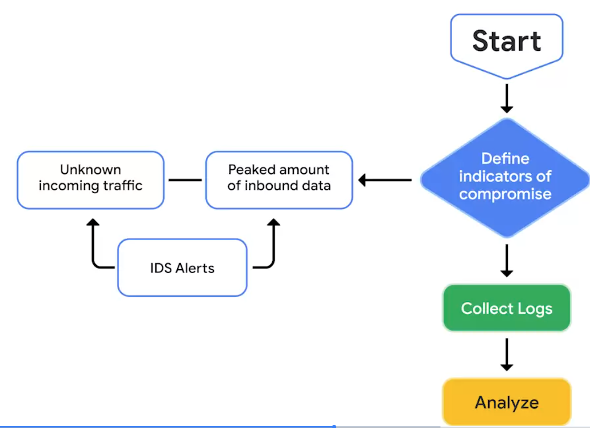

# Crear y utilizar documentación

## Ventajas de la documentación
- ​Puede que recuerde nuestro debate sobre las diferentes herramientas y tipos de documentación ​utilizados por los equipos de seguridad cuando responden a incidentes.
- ​Como ingeniero de seguridad que ha desarrollado una gran cantidad de reglas de detección, ​para mí era fundamental documentar lo que significa que esas reglas se activen, ​qué gravedad asignar, qué puede dar lugar a falsos positivos y ​cómo pueden confirmar los analistas que la alerta es legítima.
- ​Sin esta documentación, ​un equipo de operaciones de seguridad nunca podrá escalar más allá de uno o dos analistas.
- ​Si algo se documentó, entonces hay un registro de que sucedió.
- ​Esto significa que se puede acceder a la información relevante.
- ​Esto se conoce como transparencia
- La documentación transparente es útil como fuente de pruebas para reclamaciones de seguros de seguridad, ​investigaciones reguladoras y procedimientos legales.
- ​Aprenderá más sobre los procesos de documentación que ​ayudan a conseguirlo en una próxima sección.
- ​La documentación también proporciona estandarización.
- ​Esto significa que existe un conjunto establecido de directrices o ​estándares que los miembros de una organización pueden seguir para completar una tarea o flujo de trabajo.
- ​Un ejemplo de creación de estandarización a través de la documentación es el establecimiento de ​una política de seguridad, procesos y procedimientos de la organización.
- ​Esto ayuda a mantener la calidad del trabajo ya que existen reglas establecidas que seguir.
- ​La documentación también mejora la claridad.
- Una documentación eficaz no sólo proporciona a ​los miembros del equipo una comprensión clara de sus funciones y obligaciones, sino que ​también proporciona información sobre cómo realizar el trabajo.
- ​Por ejemplo, los manuales de estrategias que proporcionan instrucciones detalladas evitan la incertidumbre ​y la confusión durante la respuesta ante incidentes.
- ​El campo de la Seguridad está en constante cambio, los ataques evolucionan, ​y los requisitos normativos pueden cambiar.
- ​Por eso es importante mantener, revisar y ​actualizar la documentación con regularidad para estar al día de cualquier cambio.
- ​Como profesional de la seguridad, es probable que compagine las responsabilidades de documentación ​con sus otras tareas.
- ​Al tomarse el tiempo de anotar sus acciones, recordará hechos e ​información.
- ​Incluso puede que note algunas lagunas en las acciones anteriores que llevó a cabo.
- ​El tiempo que dedica a documentar es valioso no sólo para usted, sino ​para toda su organización.

---

## Documentar las pruebas con formularios de cadena de custodia
- ​Continuemos nuestro debate sobre cómo la documentación proporciona transparencia ​a través de documentos como la cadena de custodia.
- ​Durante la respuesta a incidentes, las pruebas deben contabilizarse ​durante todo el ciclo de vida del incidente.
- ​El seguimiento de las pruebas es importante si éstas se solicitan como parte de cualquier procedimiento ​legal.
- ​¿Cómo pueden los equipos de seguridad asegurarse de que esto se hace?
- ​Utilizan un formulario llamado cadena de custodia.
- ​La cadena de custodia es el proceso de documentar la posesión y ​el control de las pruebas durante el ciclo de vida de un incidente.
- ​Tan pronto como se recogen las pruebas, se introducen los formularios de cadena de custodia.
- ​Los formularios deben rellenarse con detalles a medida que se manejan las pruebas.
- ​Examinemos un ejemplo muy sencillo de cómo se utiliza la cadena de custodia durante ​el análisis forense digital.
- ​Previamente, usted aprendió que el análisis forense digital es la práctica de recopilar ​y analizar datos para determinar lo que ha ocurrido tras un ataque.
- ​Durante la respuesta a un incidente, Aisha verificó que un disco duro ​comprometido requiere ser examinado por el equipo forense.
- ​En primer lugar, se asegura de que el disco duro está protegido contra escritura, de modo que ​los datos del disco no puedan ser editados ni borrados.
- ​A continuación, calcula y ​registra una función hash criptográfica de una imagen del disco duro.
- ​Recuerda que una función hash es un algoritmo que produce un código que ​no puede desencriptarse.
- ​Aisha recibe entonces instrucciones de transferirlo a Colin, en el departamento forense.
- ​Colin lo examina y lo envía a Nav, otra analista.
- ​Nav recibe el disco duro comprometido y lo envía a su responsable, Arman.
- ​Cada vez que el disco duro se transfiere a otra persona, ésta debe registrarlo en ​el formulario de la cadena de custodia, ​para que el movimiento de las pruebas sea transparente.
- ​La manipulación de los datos del disco duro puede detectarse utilizando el hash original ​que Aisha documentó al principio del proceso.
- ​Esto garantiza que haya un rastro de papel que describa quién manipuló las pruebas y ​por qué, cuándo y dónde las manipuló.
- ​Al igual que otros tipos de documentación, ​no existe una plantilla estándar de cómo debe ser el formulario de la cadena de custodia, pero ​sí contienen elementos comunes.
- ​Esto es lo que podría examinar en un formulario de registro de la cadena de custodia.
- ​En primer lugar, debe haber una descripción de las pruebas, que incluya cualquier ​información identificativa, como la ubicación, el nombre de host, la dirección MAC o la dirección IP.

| Item # | Quantity | Description of item | 
| --- | --- | --- |

- ​Luego está el registro de custodia, que detalla el nombre de las personas que transfirieron y ​recibieron las pruebas.
- ​También incluye la fecha y la hora en que se recogieron o transfirieron las pruebas y ​el propósito de la transferencia.

| Item # | Date/Time | Release by (Name & signature) | Purpose of transfer | 
| --- | --- | --- | --- |

- ​Tal vez se pregunte: ¿qué ocurre si las pruebas se registran incorrectamente?
- ​¿O si falta una entrada?
- ​Esto es lo que se conoce como ruptura de la cadena de custodia, que se produce cuando ​hay incoherencias en la recogida y ​registro de las pruebas en la cadena de custodia.
- En los tribunales, los documentos de la cadena de custodia ​ayudan a establecer la prueba de la integridad, fiabilidad y exactitud de las pruebas.
- ​Para las pruebas relacionadas con incidentes de Seguridad, los formularios de la cadena de custodia se utilizan para ayudar ​a cumplir los Estándares legales ​para que estas pruebas puedan utilizarse en los procedimientos legales.
- Si un actor malintencionado ​comprometió un sistema, las pruebas deben estar disponibles para determinar sus acciones ​de modo que puedan emprenderse las acciones legales oportunas.
- ​Sin embargo, en algunos casos, las rupturas importantes en la cadena de custodia pueden ​impactar en la integridad, Confiabilidad y exactitud de las pruebas.
- ​Esto afecta a si las pruebas pueden o no ser una fuente fiable de información y ​utilizarse ante un tribunal.
- ​Los formularios de la cadena de custodia nos proporcionan un método para mantener las pruebas, de modo ​que los actores malintencionados puedan ser considerados responsables de sus acciones. 

---

## Buenas prácticas para una documentación eficaz
- Documentación es cualquier forma de contenido registrado que se utiliza para un fin específico, y es esencial en el Campo de la Seguridad.
- Los Equipos de Seguridad utilizan la documentación para apoyar las investigaciones, completar las tareas y comunicar los resultados.
- Esta lectura explora los Beneficios de la Documentación y le proporciona una Lista de Prácticas Comunes para ayudarle a crear una documentación eficaz en su carrera de Seguridad.

- Beneficios de la documentación
   - Ya ha aprendido acerca de muchos tipos de documentación de Seguridad, incluyendo manuales de estrategias, informes finales y más.
   - Como también ha aprendido, la documentación eficaz tiene tres beneficios:
      - Transparencia
      - Estandarización
      - Claridad

- Transparencia
   - En Seguridad, la Transparencia es fundamental para demostrar el cumplimiento de las Regulaciones y los procesos internos, para satisfacer los requisitos de los seguros y para los procedimientos legales.
   - Cadena de custodia es el proceso de documentar la posesión y el control de pruebas durante el ciclo de vida de un incidente.
   - Cadena de custodia es un ejemplo de cómo la documentación produce transparencia y una pista de auditoría.

- Estandarización
   - La estandarización a través de procesos y Procedimientos repetibles apoya los esfuerzos de mejora continua, ayuda a la transferencia de conocimientos y facilita la incorporación de nuevos miembros al Equipo.
   - Estándares son referencias que informan sobre cómo establecer políticas.
   - Usted ha aprendido cómo el NIST proporciona diversos frameworks de Seguridad que se utilizan para mejorar las medidas de Seguridad.
   - Del mismo modo, las organizaciones establecen sus propios Estándares para satisfacer sus necesidades empresariales.
   - Un ejemplo de documentación que establece una estandarización es un plan de respuesta a incidentes, que es un documento que describe los Procedimientos a seguir en cada paso de la respuesta a incidentes.
   - Los planes de respuesta a incidentes estandarizan el proceso de respuesta de una organización esbozando los procedimientos antes de un incidente.
   - Al documentar el plan de respuesta a incidentes de una organización, se crea una norma que la gente sigue, manteniendo la coherencia con procesos y procedimientos repetibles. 

- Claridad
   - Idealmente, toda documentación proporciona claridad a su audiencia.
   - Una documentación clara ayuda a las personas a acceder rápidamente a la Información que necesitan para poder tomar las medidas necesarias.
   - Los analistas de Seguridad están obligados a documentar el razonamiento detrás de cualquier acción que tomen para que esté claro para su equipo por qué una alerta fue escalada o cerrada.

- Mejores prácticas
   - Como profesional de la Seguridad, tendrá que aplicar las mejores prácticas de Documentación en su carrera.
   - He aquí algunas directrices generales que debe recordar:
      - Conozca a su público
         - Antes de empezar a crear documentación, tenga en cuenta a su público y sus necesidades.
         - Por ejemplo, un resumen de incidentes redactado para un responsable de un centro de operaciones de seguridad (SOC) se escribirá de forma diferente a uno redactado para un director general (CEO).
         - El gestor del SOC puede entender el lenguaje técnico de la Seguridad, pero puede que un consejero delegado no.
         - Adapte su documento a las necesidades de su público.
      - Sea conciso
         - Puede que le encarguen la creación de documentación larga, como un Informe.
         - Pero cuando la Documentación es demasiado larga, puede disuadir a la gente de utilizarla.
         - Para asegurarse de que su documentación es útil, establezca el propósito inmediatamente.
         - Esto ayuda a la gente a identificar rápidamente el objetivo del documento.
         - Por ejemplo, los resúmenes ejecutivos resumen los principales hechos de un incidente al principio de un informe final.
         - Este resumen debe ser breve para que pueda hojearse fácilmente e identificar las conclusiones clave.
      - Actualización periódica
         - En materia de Seguridad, se descubren y explotan nuevas vulnerabilidades constantemente.
         - La Documentación debe revisarse y actualizarse con regularidad para mantenerse al día de la evolución del panorama de las amenazas.
         - Por ejemplo, una vez resuelto un Incidente, una revisión exhaustiva del mismo puede identificar lagunas en los procesos y procedimientos que requieran cambios y actualizaciones.
         - Al actualizar periódicamente la documentación, los equipos de seguridad se mantienen bien informados y los planes de respuesta a incidentes permanecen al día.

---

## El valor de los manuales de ciberseguridad
- ​¿Alguna vez has hecho un viaje a ​un lugar que no has visitado antes?
- ​Es posible que haya utilizado un itinerario de viaje ​para planificar las actividades de su viaje.
- Los ​itinerarios de viaje son documentos esenciales, ​especialmente para viajar a un lugar nuevo.
- Te ​ayudan a mantenerte organizado y ​te dan una idea clara de tus planes de viaje.
- ​Detallan las actividades que realizarás, ​los lugares que visitarás ​y el tiempo de viaje entre destinos.
- ​Los libros de estrategias son similares a los itinerarios de viaje.
- ​Como recordará de nuestras discusiones anteriores, ​un manual de estrategias es un manual que proporciona ​detalles sobre cualquier acción operativa.
- ​Proporcionan a los analistas de Seguridad instrucciones ​sobre qué hacer exactamente cuando ocurre un incidente.
- ​Los manuales proporcionan a los profesionales de Seguridad ​una visión clara de ​sus tareas durante ​todo el ciclo de vida de la respuesta a los incidentes.
- ​Responder a un incidente puede ser ​impredecible y caótico en ocasiones.
- ​Se espera que los equipos de seguridad ​actúen con rapidez y eficacia.
- ​Los manuales ofrecen estructura y ​orden durante este tiempo al ​describir claramente las acciones que se deben tomar ​al responder a un incidente específico.
- ​Al seguir un manual de estrategias, ​los equipos de Seguridad pueden reducir las conjeturas ​y la incertidumbre durante los tiempos de respuesta.
- ​Esto permite a los equipos de Seguridad actuar ​con rapidez y sin ninguna duda.
- ​Sin guías prácticas, ​es casi imposible dar una respuesta eficaz y rápida a un incidente.
- ​En los manuales de estrategias, es posible que haya listas de verificación ​que también pueden ayudar a los equipos de Seguridad a desempeñarse de ​manera eficaz ​en momentos de estrés, ya que les ayudan a recordar que deben completar cada paso del ciclo de ​vida de la respuesta a los incidentes.
- ​Los manuales describen los pasos necesarios para ​responder a un ataque como el ransomware, la ​violación de datos, el software malicioso o los DDoS.
- ​Este es un ejemplo de un manual que ​utiliza un diagrama de flujo ​con los pasos a seguir durante ​la detección de un ataque DDoS.

- ​Describe el proceso de detección de un DDoS ​y comienza con la determinación de los indicadores de riesgo, ​como el tráfico entrante desconocido.
- ​Una vez que se determinan los indicadores de compromiso, ​el siguiente paso es recopilar ​los registros y, finalmente, analizar la evidencia.
- ​Hay tres tipos diferentes de guías: ​no automatizadas, automatizadas o semiautomatizadas.
- ​El manual de estrategias de DDoS que acabamos de explorar es ​un ejemplo de manual no automatizado, ​que requiere que un analista lleve a cabo acciones paso a paso.
- ​Los manuales automatizados automatizan las tareas de ​los procesos de respuesta a incidentes.
- Por ejemplo, ​tareas como la categorización de la gravedad del ​incidente o la recopilación de pruebas ​se pueden realizar mediante un manual de estrategias automatizado.
- ​Los manuales automatizados pueden ayudar a reducir ​el tiempo de resolución durante un incidente.
- ​Las herramientas SOAR y SIEM se pueden ​configurar para automatizar las guías.
- ​Por último, los manuales semiautomáticos ​combinan la acción de una persona con la automatización.
- Las tareas ​tediosas, propensas a errores o que ​consumen mucho tiempo se pueden automatizar, ​mientras que los analistas pueden priorizar ​su tiempo con otras tareas.
- ​Los manuales semiautomatizados pueden ayudar a ​aumentar la productividad y reducir el tiempo de resolución.
- ​A medida que un equipo de seguridad responde a los incidentes, es ​posible que descubra que un manual ​necesita actualizaciones o cambios.
- ​Las amenazas evolucionan constantemente ​y, para que los manuales de estrategias sean eficaces, ​deben mantenerse y actualizarse con regularidad.
- ​Un buen momento para introducir cambios en los manuales de estrategias ​es durante la fase de actividad posterior al incidente.