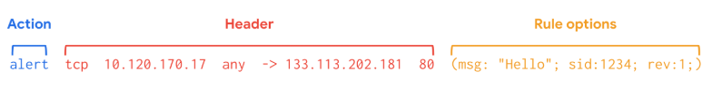

# Visión general de los sistemas de detección de intrusos (IDS)

## Vigilancia de la seguridad con herramientas de detección
- ​La detección requiere datos, y ​estos datos pueden provenir de varias fuentes de datos.
- ​Ya ha explorado cómo ​diferentes dispositivos producen registros.
- ​Ahora examinaremos cómo diferentes tecnologías de detección ​vigilan dispositivos y ​registran diferentes tipos de actividad del sistema, ​como la telemetría de red y de punto final.
- ​La telemetría es la recopilación y ​transmisión de datos para su análisis.
- ​Mientras que los registros registran los eventos que ocurren en los sistemas, ​la telemetría describe los datos en sí.
- ​Por ejemplo, las capturas de paquetes ​se consideran telemetría de red.
- ​Para los profesionales de la Seguridad, ​los registros y la telemetría son fuentes de ​evidencias que pueden utilizarse para ​responder preguntas durante las investigaciones.
- ​Previamente, usted aprendió sobre ​un sistema de detección de intrusiones, o IDS.
- ​Recuerde que IDS es una aplicación que ​monitorea la actividad y alerta sobre posibles intrusiones.
- ​Esto incluye monitorear diferentes partes de ​un sistema o red como un punto final.
- ​Un punto final es cualquier dispositivo ​conectado a una red, como un ordenador portátil, ​una tableta, un ordenador de sobremesa o un smartphone.
- ​Los puntos finales son puntos de entrada a ​una red, lo que los convierte en objetivos ​clave para los actores maliciosos que buscan obtener ​acceso no autorizado a un sistema.
- ​Para monitorizar los puntos finales en busca de amenazas o ataques, ​se puede utilizar un sistema de detección de intrusiones basado en el anfitrión.
- ​Se trata de una aplicación que monitoriza ​la actividad del anfitrión en el que está instalada.
- ​Para aclarar, un host es cualquier dispositivo que ​se comunica con otros dispositivos de una red, ​similar a un punto final.
- ​Los sistemas de detección de intrusiones basados en host ​se instalan como un agente en un único host, ​como un ordenador portátil o un servidor.
- ​Dependiendo de su configuración, ​los sistemas de detección de intrusiones basados en host ​monitorearán el host ​en el que está instalado para detectar actividades sospechosas.
- ​Una vez que se ha detectado algo, ​registra la salida en forma de registros y se genera una alerta.
- ​¿Y si quisiéramos supervisar una red?
- ​Un sistema de detección de intrusiones basado en red recopila ​y analiza el tráfico y los datos de red.
- ​Los sistemas de detección de intrusiones basados en red ​funcionan de forma similar a los rastreadores de paquetes ​porque analizan el tráfico de red y ​los datos de red en un punto específico de la red.
- ​Es habitual implementar varios sensores IDS en ​diferentes puntos de la red ​para lograr una visibilidad adecuada.
- ​Cuando se detecta actividad sospechosa o inusual en la red, ​el Sistema de detección de intrusiones basado en la red ​la registra y genera una alerta.
- ​En este ejemplo, el ​sistema de detección de intrusiones basado en redes está ​vigilando el tráfico que proviene ​de Internet y que se dirige a Internet.
- ​Los sistemas de detección de intrusiones utilizan ​diferentes tipos de métodos de detección.
- ​Uno de los métodos más comunes es el Análisis de firmas.
- ​El Análisis de firmas es un Método de detección ​utilizado para encontrar Eventos de Interés.
- ​Una firma especifica un conjunto de reglas a las que un ​IDS hace referencia cuando monitorea la actividad.
- ​Si la actividad coincide con las reglas de la firma, ​el IDS la registra y envía una alerta.
- ​Por ejemplo, una firma puede ​escribirse para generar una alerta si ​un inicio de sesión fallido en un sistema se produce tres veces seguidas, ​lo que sugiere un posible ataque de descifrado de contraseña.
- ​Antes de que se generen las alertas, ​la actividad debe registrarse.
- ​Las tecnologías IDS registran la información de los dispositivos, ​sistemas y redes que monitorizan como registros IDS.
- ​Los registros IDS pueden enviarse, almacenarse, ​y analizarse en un repositorio de registros centralizado como un SIEM.

---

## Herramientas y técnicas de detección
- También explorará las dos técnicas de Detección más comunes utilizadas por los sistemas de detección.
- Comprender las capacidades y limitaciones de las tecnologías IDS y sus técnicas de detección le ayudará a interpretar la información de seguridad para identificar, analizar y responder a los eventos de seguridad.
- Un Sistema de detección de intrusiones (IDS) es una aplicación que monitoriza la actividad del sistema y alerta sobre posibles intrusiones.
- Las tecnologías IDS ayudan a las organizaciones a supervisar la actividad que se produce en sus sistemas y redes para identificar indicios de actividad maliciosa.
- Dependiendo del lugar que elija para instalar un IDS, éste puede estar basado en el host o en la red.

- Sistema de detección de intrusiones basado en el anfitrión
   - Un Sistema de detección de intrusiones basado en el anfitrión (HIDS) es una aplicación que monitoriza la actividad del anfitrión en el que está instalado.
   - Un HIDS se instala como un agente en un host.
   - Un host también se conoce como punto final, que es cualquier dispositivo conectado a una red como una computadora o un servidor.
   - Normalmente, los agentes HIDS se instalan en todos los puntos finales y se utilizan para Monitorear y Detectar Amenazas a la Seguridad.
   - Un HIDS monitoriza la actividad interna que tiene lugar en el host para identificar cualquier comportamiento no autorizado o anómalo.
   - Si se detecta algo inusual, como la instalación de una aplicación no autorizada, el HIDS lo registra y envía una alerta.
   - Además de monitorizar los flujos de tráfico entrante y saliente, HIDS puede tener capacidades adicionales, como monitorizar los sistemas de archivos, el uso de recursos del sistema, la actividad de los usuarios, etc.
   
- Sistema de detección de intrusiones basado en la red
   - Un Sistema de detección de intrusiones basado en la red (NIDS) es una aplicación que recoge y monitoriza el Tráfico de red y los Datos de red.
   - El software NIDS se instala en dispositivos situados en partes específicas de la red que se desea supervisar.
   - La aplicación NIDS inspecciona el tráfico de red procedente de distintos dispositivos de la red.
   - Si se detecta algún tráfico de red malicioso, el NIDS lo registra y genera una alerta.
   - El uso de una combinación de HIDS y NIDS para monitorizar un entorno puede proporcionar un enfoque multicapa para la detección de intrusiones y la respuesta a las mismas.
   - Las herramientas HIDS y NIDS proporcionan una perspectiva diferente de la actividad que se produce en una red y en los hosts individuales que están conectados a ella.
   - Esto ayuda a proporcionar una visión completa de la actividad que se produce en un entorno.

- Técnicas de Detección
   - Los sistemas de Detección pueden utilizar diferentes técnicas para detectar amenazas y ataques.
   - Los dos tipos de técnicas de detección que suelen utilizar las tecnologías IDS son el Análisis basado en firmas y el Análisis basado en anomalías.
 
- Análisis basado en firmas
   - El análisis de firmas, o Análisis basado en firmas, es un Método de Detección que se utiliza para encontrar Eventos de Interés.
   - Una Firma es un Patrón que se asocia con una actividad maliciosa.
   - Las Firmas pueden contener patrones específicos como una secuencia de números binarios, bytes, o incluso datos específicos como una dirección IP.
   - Anteriormente, usted exploró la Pirámide del Dolor, que es un concepto que prioriza los diferentes tipos de Indicadores de compromiso (IoC) asociados con un ataque o amenaza, como direcciones IP, Herramientas, Tácticas, Técnicas y más.
   - Los IoC y otros Indicadores de ataque pueden ser útiles para crear firmas específicas para detectar y bloquear ataques.
   - Se pueden utilizar distintos tipos de firmas en función del tipo de amenaza o ataque que se desee detectar.
   - Por ejemplo, una firma antimalware contiene patrones asociados al software malicioso.
   - Esto puede incluir secuencias de comandos maliciosas que utiliza el software malicioso.
   - Las Herramientas IDS monitorizarán un entorno en busca de eventos que coincidan con los patrones definidos en esta Firma de software malicioso.
   - Si un evento coincide con la firma, el evento se registra y se genera una alerta.

- Ventajas
   - Baja tasa de falsos positivos:
      - El análisis basado en firmas es muy eficaz a la hora de detectar amenazas conocidas, ya que se limita a comparar la actividad con las firmas.
      - Esto conduce a un menor número de falsos positivos.
      - Recuerde que un falso positivo es una alerta que detecta incorrectamente la presencia de una amenaza.
- Desventajas
   - Las Firmas pueden ser evadidas:
      - Las firmas son únicas y los atacantes pueden modificar sus comportamientos de ataque para eludirlas.
      - Por ejemplo, los atacantes pueden realizar ligeras modificaciones en el código del software malicioso para alterar su firma y evitar la Detección.
   - Las firmas requieren actualizaciones:
      - El Análisis basado en firmas se basa en una Base de datos de firmas para Detectar amenazas.
      - Cada vez que se descubre un nuevo exploit o ataque, deben crearse nuevas firmas y añadirse a la base de datos de firmas.
   - Incapacidad para detectar amenazas desconocidas:
      - El análisis basado en firmas se basa en la detección de amenazas conocidas mediante firmas.
      - No se pueden detectar las amenazas desconocidas, como las nuevas familias de software malicioso o los ataques de Día cero, que son exploits hasta ahora desconocidos. 

- Análisis basado en anomalías
   - El análisis basado en anomalías es un Método de Detección que identifica comportamientos anómalos.
   - El Análisis basado en anomalías consta de dos fases: una fase de Entrenamiento y una fase de Detección.
   - En la fase de Entrenamiento, debe establecerse una línea de base del comportamiento normal o esperado.
   - Las líneas de base se desarrollan recopilando datos que corresponden al comportamiento normal del sistema.
   - En la fase de Detección, la actividad actual del sistema se compara con esta línea de base.
   - La actividad que se produce fuera de la línea de base se registra y se genera una alerta.
      - Ventajas
         - Capacidad para detectar amenazas nuevas y en evolución:
            - A diferencia del análisis basado en firmas, que utiliza patrones conocidos para detectar amenazas, el análisis basado en anomalías puede detectar amenazas desconocidas.
      - Desventajas
         - Alto índice de falsos positivos:
            - Cualquier comportamiento que se desvíe de la línea de base puede ser marcado como anómalo, incluidos los comportamientos no maliciosos.
            - Esto conduce a una alta tasa de falsos positivos.
         - Compromiso pre existente:
            - La existencia de un atacante durante la fase de Entrenamiento incluirá comportamientos maliciosos en la línea de base.
            - Esto puede llevar a pasar por alto a un atacante preexistente.

---

## Gracia: Mentalidad de seguridad en la detección y respuesta
- Hola, soy Grace, y trabajo en Detección y Respuesta en Google.
- ​Cuando le cuento a la gente lo que hago, piensan que es increíble, ​Me encanta poder decir, mi trabajo es detectar hackers que intentan hackear Google.
- ​Hay gente que nos confía sus datos y que desempeña funciones críticas en la sociedad, ​como periodistas y activistas, por ejemplo.
- ​Así que necesitan poder tener sus datos con nosotros y ​confiar en que van a estar seguros.
- ​La mentalidad de seguridad tiene que ver con la curiosidad.
- ​Hay un solapamiento realmente agradable entre la ciberseguridad y la informática y ​tener esa salida creativa y lógica y un interés por los grandes asuntos del mundo.
- ​Lo que piensan los hackers, lo que piensan los defensores.
- ​Siento empatía por la gente que busca cómo se puede ​obtener información, quizás a veces de fuentes inusuales.
- ​Un ejemplo de una de las cosas más locas de las que me he enterado sería cómo ​la gente puede obtener información de una CPU.
- ​Algunas tareas para una CPU son más difíciles que otras, ​requieren más energía para hacer multiplicar números como ejemplo de ello, ​lo que significa que la CPU va a trabajar más, ​se va a calentar más, va a estar ejecutando más funciones.
- ​Así que puedes usar esa información para saber cosas sobre lo que está haciendo esa CPU.
- ​A partir de ahí, puedes empezar a deducir lo que está pasando en un momento dado.
- ​Lo que recomiendo a la gente que esté interesada en desarrollar una ​mentalidad de seguridad es escuchar historias.
- ​Hay Pódcast que tienen grandes entrevistas con hackers.
- ​Recomiendo seguir las noticias y leer artículos sobre las distintas ​amenazas cibernéticas que están sucediendo en el mundo.
- ​Recomiendo ir a conferencias, ir a meetups, ​encontrar gente con la que puedas estudiar y practicar.
- ​Incluso los hackers se enseñan unos a otros cómo hackear cosas en foros y salas de chat.
- ​No es hacer trampas pedir ayuda.
- ​Otro consejo que tengo para ​la gente sería que no se rindan cuando se encuentren con obstáculos.
- ​Estudiar el certificado es una muy buena idea, y ​realmente merece la pena perseverar hasta el final.
- ​Incluso cuando se ponga difícil y empiece a sentirse abrumado, no pasa nada, ​son términos nuevos.
- ​Puedo garantizarle que si vuelve a retomarlo más adelante, le resultará más familiar.
- ​Le resultará más fácil.
- ​Ser realmente amable consigo mismo y comprensivo y ​paciente le ayudará mucho cuando se enfrente a estos retos.

---

## Componentes de una firma de detección
- Como analista de Seguridad, ​puede que se le encargue escribir, ​personalizar o probar firmas.
- ​Para ello, utilizará herramientas de IDS.
- ​Una firma especifica las reglas de detección.
- ​Estas reglas describen los tipos de ​intrusiones en la red que desea que detecte un IDS.
- ​Por ejemplo, una firma puede ​escribirse para detectar y alertar ​sobre el tráfico sospechoso que intenta conectarse a un puerto.
- ​El lenguaje de las reglas difiere según los ​diferentes sistemas de detección de intrusiones en la red.
- ​El término Sistema de detección de intrusiones en la red ​se abrevia a menudo ​como el acrónimo N-I-D-S y se pronuncia NIDS.
- ​Generalmente, las reglas NIDS constan de tres componentes: ​una acción, un encabezado y las opciones de la regla.
- ​Ahora, examinemos cada uno de ​estos tres componentes con más detalle.
- ​Típicamente, la acción es ​el primer elemento especificado en una Firma.
- ​Determina la acción que se llevará a cabo si se cumplen ​los criterios de la regla.
- ​Las acciones difieren según el lenguaje de las reglas NIDS, ​pero algunas acciones comunes son: alertar, pasar o rechazar.
- ​Usando nuestro ejemplo, si una regla especifica alertar sobre ​tráfico de red sospechoso que ​establece una conexión inusual a un puerto, ​el IDS inspeccionará ​los paquetes de tráfico y enviará una alerta.
- ​El Encabezado define el Tráfico de red de la firma.
- ​Incluye información como ​direcciones IP de origen y destino, ​puertos de origen y destino, ​protocolos y dirección del tráfico.
- ​Si queremos detectar una alerta sobre ​tráfico sospechoso que se conecta a un puerto, ​tenemos que definir primero el origen ​del tráfico sospechoso en la cabecera.
- ​El tráfico sospechoso puede originarse desde ​direcciones IP externas a la red local.
- ​También puede utilizar protocolos específicos o inusuales.
- ​Podemos especificar direcciones IP externas ​y estos protocolos en la cabecera.
- ​Aquí tiene un ejemplo de cómo ​puede aparecer la información de la cabecera en una regla básica.
```snort
tcp 10.120.170.17 any -> 133.113.202.181 80
```
- ​En primer lugar, podemos observar que el protocolo, ​TCP, es el primer elemento de la lista de la Firma.
- ​A continuación, se especifica que la dirección IP de origen ​10.120.170.17 y el número de puerto de origen ​son cualquiera.
- ​La flecha en el centro de la firma ​indica la dirección del Tráfico de red.
- ​Así que sabemos que se origina en la IP de origen ​10.120.170.17 desde cualquier puerto ​y va al siguiente destino ​Dirección IP 133.113.202.181 y puerto de destino 80.
- ​Las opciones de la regla le permiten personalizar ​las firmas con parámetros adicionales.
- ​Hay muchas opciones diferentes disponibles para utilizar.
- ​Por ejemplo, puede establecer opciones para que coincidan ​con el contenido de un paquete de red ​para detectar cargas útiles maliciosas.
- ​Las cargas útiles maliciosas residen en los datos de un paquete y realizan ​actividades maliciosas como borrar o encriptar datos.
- ​Configurar las opciones de las reglas ayuda ​a delimitar el tráfico de red, ​para que pueda encontrar exactamente lo que busca.
- ​Típicamente, las opciones de regla están separadas por ​semicolones y encerradas entre paréntesis.
- ​En este ejemplo, podemos examinar ​que las opciones de regla están encerradas entre ​un par de paréntesis y están ​también separadas con semicolones.
- ​La primera opción de regla, msg, ​que significa mensaje, ​proporciona el texto de la alerta.
- ​En este caso, la alerta imprimirá el texto: ​"Esto es un mensaje."
- ​También está la opción sid, ​que significa ID de firma.
- ​Así se asigna un identificador único a cada Firma.
- ​La opción rev significa revisión.
- ​Cada vez que se actualiza o cambia una Firma, ​el número de revisión cambia.
- ​Aquí, el número 1 significa ​que es la primera versión de la Firma.

---

## Examinar firmas con Suricata
- ​​Muchas tecnologías NIDS vienen con firmas pre-escritas.
- ​Puede pensar en estas firmas como plantillas personalizables.
- ​Es algo así como las diferentes plantillas disponibles en un procesador de textos.
- ​Estas plantillas de firmas le proporcionan un punto de partida para escribir y ​definir sus reglas.
- También puede escribir y añadir sus propias reglas.
- ​Examinemos una firma preescrita a través de Suricata.
- ​En este equipo Linux con Ubuntu, Suricata ya está instalado.
- ​Examinemos algunos de sus archivos cambiando de directorio al directorio etc ​y al directorio suricata.
- ​Aquí es donde se encuentran todos los archivos de configuración de Suricata.
- ​A continuación, utilizaremos el comando ls para listar el contenido del directorio suricata.
- ​Aquí hay un par de archivos diferentes, pero nos centraremos en la carpeta rules.
- ​Aquí es donde están las firmas preescritas.
- ​También puede añadir firmas personalizadas aquí.
- ​Utilizaremos el comando cd seguido del nombre de la carpeta para navegar hasta esa ​carpeta.
- ​Usando el comando ls, podemos observar que la carpeta contiene algunas plantillas de reglas ​para diferentes protocolos y servicios.
- ​Examinemos las personalizadas.rules utilizando el comando less.
- ​A modo de recordatorio rápido, el comando less devuelve el contenido de un archivo ​una página cada vez, lo que facilita avanzar y retroceder por el contenido.
- ​Utilizaremos la clave de flecha para desplazarnos hacia arriba.
- ​Las líneas que comienzan con un signo de almohadilla (#) son comentarios destinados a proporcionar contexto a ​quienes los lean y son ignorados por Suricata.
- ​La primera línea dice Ejemplo de reglas personalizadas para conexión HTTP.
- ​Esto nos indica que este archivo contiene reglas personalizadas para conexiones HTTP.
- ​Podemos observar que hay una firma.
- ​La primera palabra especifica la ACCIÓN de la firma.
- ​Para esta firma, la acción es alerta.
- ​Esto significa que la firma genera una alerta cuando se cumplen todas las condiciones.
- ​La siguiente parte de la firma es el ENCABEZADO.
- ​Especifica el protocolo http. La dirección IP de origen es HOME_NET y ​el puerto de origen se define como ANY.
- ​La flecha indica la dirección del tráfico que procede de la red doméstica y ​se dirige a la dirección IP de destino EXTERNAL_NET y al puerto de destino ANY.
- ​Hasta ahora, sabemos que esta firma activa una alerta cuando detecta cualquier tráfico HTTP ​que salga de la red doméstica y se dirija a la red externa.
- ​Examinemos el resto de la firma para identificar si hay alguna ​condición adicional que la firma busque.
- ​La última parte de la firma incluye las OPCIONES DE LA REGLA.
- ​Están encerradas entre paréntesis y separadas por punto y coma.
- ​Hay muchas opciones enumeradas aquí, pero nos centraremos en las opciones de mensaje, flujo y ​contenido.
- ​La opción de mensaje mostrará el mensaje "GET on wire" una vez que se active la alerta.
- ​La opción de flujo se utiliza para coincidir en la dirección del flujo de tráfico de red.
- ​Aquí se establece.
- ​Esto significa que se ha establecido con éxito una conexión.
- ​La opción de contenido inspecciona el contenido de un paquete.
- ​Aquí, entre las comillas, se especifica el texto GET.
- ​GET es una petición HTTP que se utiliza para recuperar y solicitar datos a un servidor.
- ​Esto significa que la Firma coincidirá si un paquete de red contiene el texto GET, ​indicando una petición.
- ​En resumen, esta Firma alerta cada vez que Suricata observa el texto GET en ​una conexión HTTP desde la red doméstica, que va a la red externa.
- ​Cada entorno es diferente y para que ​un IDS sea eficaz, las firmas deben probarse y adaptarse.
- ​Como analista de Seguridad, puede probar, modificar o ​crear firmas IDS para mejorar la detección de amenazas en un entorno y ​reducir la probabilidad de falsos positivos.

---

## Examinar los registros de Suricata
- ​Examinemos ahora algunos registros generados por Suricata.
- ​En Suricata, las alertas y los eventos se generan en un formato conocido como EVE JSON.
- ​EVE son las siglas de Extensible Event Format (Formato de Evento Extensible) y JSON es la abreviatura de ​JavaScript Object Notation.
- ​Como ha aprendido anteriormente, JSON utiliza vinculaciones clave-valor, lo que simplifica tanto ​la búsqueda como la extracción de texto de los archivos de registro.
- ​Suricata genera dos tipos de datos de registro: registros de alerta y registros de telemetría de red.
- ​Los registros de alerta contienen información relevante para las investigaciones de seguridad.
- ​Por lo general, se trata de la salida de firmas que han activado una alerta.
- ​Por ejemplo, una firma que detecta tráfico sospechoso a través de la red ​genera un registro de alerta que captura los detalles de ese tráfico.
- ​Mientras que los registros de Telemetría de red contienen información sobre los flujos de tráfico de red, ​la telemetría de red no siempre es relevante para la seguridad, simplemente registra lo que ​está ocurriendo en una red, como una conexión que se está realizando a un puerto específico.
- ​Ambos tipos de registro proporcionan información para construir una historia durante ​una investigación.
- ​Examinemos un ejemplo de ambos tipos de registro.
- ​Este es un ejemplo de un registro de eventos.
- ​Podemos decir que este evento es una alerta porque el campo de tipo de evento dice alerta.
- ​También hay detalles sobre la actividad que se registró, incluyendo direcciones IP y ​el protocolo.
- ​También hay detalles sobre la propia firma, como el mensaje y el id. ​Del mensaje de la firma, ​parece que esta alerta está relacionada con la detección de software malicioso.
- ​A continuación, tenemos un ejemplo de un registro de telemetría de redes, que nos muestra ​los detalles de una solicitud http a un sitio web.
- ​El campo de tipo de evento nos dice que es un registro http.
- ​Hay detalles sobre la solicitud. ​Debajo de nombre de host, está el sitio web al que se accedió.
- ​El agente de usuario es el nombre de software que le conecta al sitio web.
- ​En este caso, es el navegador web Mozilla 5.0.
- ​Y el tipo de contenido, que son los datos que devolvió la solicitud http.
- ​Aquí se especifica como texto HTML.

---

## Panorama de Suricata
- Introducción a Suricata
   - Suricata es un Sistema de detección de intrusiones, un Sistema de prevención de intrusiones y una herramienta de análisis de redes de código abierto.

- Características de Suricata
   - Existen tres formas principales de utilizar Suricata:
      - Sistema de detección de intrusiones(IDS):
         - Como IDS basado en la red, Suricata puede monitorizar el Tráfico de red y alertar sobre actividades sospechosas e intrusiones.
         - Suricata también puede configurarse como un IDS basado en host para supervisar las actividades del sistema y de la red de un único host, como una computadora.
      - Sistema de prevención de intrusiones(IPS):
         - Suricata también puede funcionar como un sistema de prevención de intrusiones (IPS) para detectar y bloquear actividades y tráfico maliciosos.
         - Ejecutar Suricata en modo IPS requiere una configuración adicional, como habilitar el modo IPS. 
      - Monitoreo de Seguridad de  red (NSM):
         - En este modo, Suricata ayuda a mantener las redes seguras produciendo y guardando registros de red relevantes.
         - Suricata puede analizar el tráfico de red en directo, los archivos de captura de paquetes existentes y crear y guardar capturas de paquetes completas o condicionales.
         - Esto puede ser útil para análisis forenses, respuesta ante incidentes y para probar firmas.
         - Por ejemplo, puede activar una alerta y capturar el tráfico de red en directo para generar registros de tráfico, que luego podrá analizar para refinar las firmas de detección.

- Reglas
   - Las reglas o firmas se utilizan para identificar patrones, comportamientos y condiciones específicos del tráfico de red que podrían indicar una actividad maliciosa.
   - Los términos regla y firma se utilizan a menudo indistintamente en Suricata.
   - Los analistas de Seguridad utilizan firmas, o patrones asociados con actividad maliciosa, para detectar y alertar sobre actividad maliciosa específica.
   - Las reglas también pueden utilizarse para proporcionar un contexto y una visibilidad adicionales de los sistemas y redes, ayudando a identificar posibles amenazas a la seguridad o vulnerabilidades.
   - Suricata utiliza el Análisis de firmas, que es un Método de Detección utilizado para encontrar Eventos de Interés.
   - Las Firmas constan de tres componentes:
      -  Acción:
         - El primer componente de una firma.
         - Describe la acción a tomar si la actividad de la red o del sistema coincide con la firma.
         - Algunos ejemplos son: alertar, pasar, descartar o rechazar.
      - Encabezado:
         - El Encabezado incluye información sobre el Tráfico de red como direcciones IP de origen y destino, puertos de origen y destino, protocolo y dirección del tráfico.
      - Opciones de regla:
         - Las opciones de regla le proporcionan diferentes opciones para personalizar las firmas.
   - He aquí un ejemplo de una firma Suricata:
   


   - Las opciones de regla tienen un orden específico y cambiar su orden cambiaría el significado de la regla.
   - Los términos regla y Firma son sinónimos.
   - El orden de las reglas se refiere al orden en que éstas son evaluadas por Suricata.
   - Las reglas se procesan en el orden en que están definidas en el archivo de configuración.
   - Sin embargo, Suricata procesa las reglas en un orden diferente por defecto: pasar, descartar, rechazar y alerta.
   - El orden de las reglas afecta al veredicto final de un paquete, especialmente cuando se producen acciones contradictorias, como cuando una regla de abandono y una de alerta coinciden en el mismo paquete.

- Reglas personalizadas
   - Aunque Suricata viene con reglas preescritas, es muy recomendable que modifique o personalice las reglas existentes para satisfacer sus Requisitos de Seguridad específicos. 
   - No existe un enfoque único para la creación y modificación de reglas.
   - Esto se debe a que la infraestructura de TI de cada organización es diferente.
   - Los Equipos de Seguridad deben probar y modificar exhaustivamente las firmas de Detección en función de sus necesidades.
   - La creación de reglas personalizadas ayuda a adaptar la Detección y el Monitoreo.
   - Las reglas personalizadas ayudan a minimizar la cantidad de falsas alertas positivas que reciben los equipos de Seguridad.
   - Es importante desarrollar la capacidad de escribir firmas eficaces y personalizadas para poder aprovechar al máximo la potencia de las tecnologías de Detección.

- Archivo de configuración
   - Antes de que las herramientas de detección se implementen y puedan empezar a monitorizar sistemas y redes, debe configurar adecuadamente sus ajustes para que sepan qué hacer.
   - Un archivo de configuración es un archivo utilizado para configurar los ajustes de una aplicación.
   - Los archivos de configuración le permiten personalizar exactamente cómo desea que su IDS interactúe con el resto de su entorno.
   - El archivo de configuración de Suricata es suricata.yaml, que utiliza el formato de archivo YAML para la sintaxis y la estructura.

- Archivos de registro
   - Hay dos archivos de registro que Suricata genera cuando se activan las alertas:
      - eve.json:
         - El archivo eve.json es el archivo de registro estándar de Suricata.
         - Este archivo contiene información detallada y metadatos sobre los eventos y alertas generados por Suricata almacenados en formato JSON.
         - Por ejemplo, los eventos de este archivo contienen un identificador único llamado flow_id que se utiliza para correlacionar los registros o alertas relacionados con un único flujo de red, lo que facilita el análisis del tráfico de red.
         - El archivo eve.json se utiliza para análisis más detallados y se considera un formato de archivo mejor para el análisis sintáctico de registros y la ingestión de registros SIEM.
      - fast.log:
         - El archivo fast.log se utiliza para registrar información mínima sobre alertas, incluyendo detalles básicos sobre la dirección IP y el puerto del tráfico de red.
         - El archivo fast.log se utiliza para el registro y las alertas básicas y se considera un formato de archivo heredado y no es adecuado para tareas de respuesta ante incidentes o de caza de amenazas.
   - La principal diferencia entre el archivo eve.json y el archivo fast.log es el nivel de detalle que se registra en cada uno.
   - El archivo fast.log registra información básica, mientras que el archivo eve.json contiene información detallada adicional.

- Recursos para más Información
   - [Guía del usuario de Suricata](https://suricata.readthedocs.io/en/latest/index.html#)
   - [Características de Suricata](https://suricata.io/features/)
   - [Gestión de reglas](https://suricata.readthedocs.io/en/latest/rule-management/suricata-update.html)
   - [Análisis del rendimiento de las reglas](https://suricata.readthedocs.io/en/latest/configuration/suricata-yaml.html#engine-analysis-and-profiling)
   - [Webinar sobre la Caza de amenazas de Suricata](https://youtu.be/kaDGolhTu94)
   - [Introducción a la redacción de reglas de Suricata](https://youtu.be/tvoqFBVSShA)
   - [Ejemplos jq de Eve.json](https://suricata.readthedocs.io/en/latest/output/eve/eve-json-examplesjq.html)

---

## Actividad: Explorar firmas y registros con Suricata
- Introducción
   - En esta actividad de laboratorio, explorará los componentes de una regla utilizando Suricata.
   - También tendrá la oportunidad de activar una regla y examinar la salida en Suricata.
   - Utilizará el Shell Bash para completar estos pasos.

- Lo que hará
   - Examinar una regla en Suricata
   - Activar una regla y revisar los registros de alerta
   - Examinar las salidas de eve.json

- Resumen de la actividad
   - Anteriormente, aprendiste acerca del análisis de paquetes y la sintaxis y componentes básicos de firmas y reglas de los sistemas de detección de intrusiones (IDS).
   - También aprendiste a examinar una firma preestablecida y su resultado del registro en Suricata, una herramienta de código abierto para el análisis de redes y la detección y prevención de intrusiones.
   - En este lab, aprenderás más sobre las alertas y los registros de Suricata, incluido el proceso general de creación de reglas.
   - La herramienta Suricata supervisa las interfaces de red y aplica reglas a los paquetes que pasan por ellas.
   - Suricata determina si cada paquete debería generar una alerta y si debe descartarlo, rechazarlo o permitir que pase por la interfaz.
   - Las redes de origen y destino se deben especificar en la configuración de Suricata.
   - Se pueden incluir reglas personalizadas para especificar el tráfico que se debe procesar.
   - Examinarás una regla y practicarás con Suricata para activar alertas de tráfico de red.
   - También analizarás resultados del registro, como los archivos fast.log y eve.json.
   - Esto te ayudará a comprender algunas de las alertas y los registros que Suricata genera.

- Situación
   - En esta situación, trabajas como analista de seguridad y debes supervisar el tráfico en la red de tu empleador.
   - Tu objetivo es configurar Suricata y usar esta herramienta para activar alertas.
   - Estos son los pasos que seguirás:
      1. Explorarás reglas personalizadas en Suricata.
      2. Ejecutarás Suricata con una regla personalizada para activarla y examinarás los resultados de los registros del archivo fast.log.
      3. Analizarás el resultado adicional que Suricata genera en el archivo de registro estándar eve.json.
   - Para ejecutar las pruebas de este lab, se te proporcionará un archivo sample.pcap y un archivo custom.rules.
   - Puedes encontrarlos en la carpeta principal.
   - Ahora, definamos los archivos con los que trabajarás en este lab:
      - El archivo sample.pcap es un archivo de captura de paquetes y contiene un ejemplo de datos de tráfico de red que usarás para probar las reglas de Suricata.
         - Te permitirá simular y repetir el ejercicio de supervisar el tráfico de red.
      - El archivo custom.rules contiene una regla personalizada para el comienzo del lab.
         - Agregarás reglas a este archivo y las ejecutarás sobre los datos de tráfico de red del archivo sample.pcap.
      - El archivo fast.log contendrá las alertas que Suricata genere.
         - Este archivo, fast.log, estará vacío cuando comience el lab.
         - Cada vez que pruebes una regla o un conjunto de reglas en los datos de tráfico de red de muestra, Suricata agregará una nueva línea de alerta al archivo fast.log cuando se cumplan todas las condiciones de alguna de las reglas.
         - Puedes encontrar el archivo fast.log en el directorio /var/log/suricata después de que se ejecute Suricata.
         - El archivo fast.log se considera un formato de archivo obsoleto, por lo que no se recomienda para tareas de respuesta a incidentes o detección de amenazas.
         - Sin embargo, se puede usar para realizar verificaciones o tareas rápidas relacionadas con el control de calidad.
      - El archivo eve.json es el registro principal, estándar y predeterminado para los eventos que Suricata genera.
         - Contiene información detallada sobre las alertas activadas, así como otros eventos de telemetría de red, en formato JSON.
         - El archivo eve.json se genera cuando se ejecuta Suricata y se ubica en el directorio /var/log/suricata.
   - Cuando creas una regla nueva, debes probarla para confirmar si funciona como corresponde.
   - Puedes usar el archivo fast.log para comparar rápidamente la cantidad de alertas generadas cada vez que ejecutas Suricata para probar una regla sobre el archivo sample.pcap.

- Comienza el lab
   
1. Examina una regla personalizada en Suricata
- En el directorio /home/analyst encontrarás un archivo custom.rules, que define las reglas del tráfico de red que Suricata captura.
- En esta tarea, explorarás la composición de la regla de Suricata definida en el archivo custom.rules.
- Usa el comando cat para mostrar la regla del archivo custom.rules:
```bash
cat custom.rules
```
```bash
# Respuesta
alert http $HOME_NET any -> $EXTERNAL_NET any (msg:"GET on wire"; flow:established,to_server; content:"GET"; http_method; sid:12345; rev:3;)
```
- Esta regla está formada por tres componentes: una acción, un encabezado y las opciones de la regla.
- Acción `alert`:
   - La acción es la primera parte de la firma.
   - Determina la acción que se debe realizar si se cumplen todas las condiciones.
   - Las acciones varían entre los lenguajes de la regla del sistema de detección de intrusiones de red (NIDS).
   - Sin embargo, entre algunas acciones comunes se incluyen alert, drop, pass y reject.
   - En nuestro ejemplo, el archivo solo contiene alert como acción.
   - La palabra clave alert ordenará generar una alerta sobre cierto tráfico de red.
   - El IDS inspeccionará los paquetes de tráfico y enviará una alerta si corresponde.
   - Ten en cuenta que la acción drop también genera una alerta, pero descarta el tráfico.
   - La acción drop se realiza solo si se ejecuta Suricata en el modo IPS.
   - La acción pass permite que pase el tráfico por la interfaz de la red.
   - Se puede usar la regla pass para anular las otras reglas.
   - También se puede hacer una excepción de la regla drop con una regla pass.
   - Por ejemplo, la siguiente regla tiene una firma idéntica a la del ejemplo anterior, excepto que esta incluye una dirección IP específica para permitir que solo pase el tráfico que provenga de esa dirección: `pass http 172.17.0.77 any -> $EXTERNAL_NET any (msg:"BAD USER-AGENT";flow:established,to_server;content:!”Mozilla/5.0”; http_user_agent; sid: 12365; rev:1;)`
   - La acción reject no permite que pase el tráfico.
   - En su lugar, se enviará un paquete de restablecimiento de TCP.
   - Luego, Suricata descartará el paquete que coincida.
   - Un paquete de restablecimiento de TCP indica a las computadoras que dejen de enviar mensajes entre sí.
   - Por lo general, usarás la regla alert en este lab.
   - La prioridad de reglas se refiere al orden en el que Suricata las evalúa.
   - Las reglas se cargan en el orden con el que se definieron en el archivo de configuración.
   - Sin embargo, Suricata procesa las reglas en un orden predeterminado diferente: pass, drop, reject y alert.
   - La prioridad de reglas afecta el veredicto final sobre un paquete.
- Encabezado `http $HOME_NET any -> $EXTERNAL_NET any`:
   - La siguiente parte de la firma es el encabezado.
   - Define el tráfico de red de la firma, que incluye algunos atributos como los protocolos, la dirección del tráfico y las direcciones de IP y puertos de origen y de destino.
   - El siguiente campo después de la palabra clave de acción es el de protocolo.
   - En el ejemplo, el protocolo es http, lo que determina que la regla se aplica solo al tráfico HTTP.
   - Los parámetros para el campo de protocolo http son $HOME_NET any -> $EXTERNAL_NET any.
   - La flecha indica que el origen de la dirección del tráfico es $HOME_NET y que la dirección IP de destino es $EXTERNAL_NET.
   - $HOME_NET es una variable de Suricata definida en /etc/suricata/suricata.yaml que puedes usar en las definiciones de reglas como un marcador de posición para tu red local o doméstica con el fin de identificar el tráfico que se conecta a los sistemas de tu organización o que proviene de ellos.
   - En este lab, $HOME_NET se define como la subred 172.21.224.0/20.
   - La palabra any significa que Suricata detecta tráfico de todos los puertos definidos en la red $HOME_NET.
   - El símbolo $ indica el comienzo de la variable.
   - Las variables se usan como marcadores de posición para almacenar valores.
   - Hasta ahora, aprendimos que esta firma activa una alerta cuando detecta tráfico HTTP que sale de la red doméstica y se dirige hacia la red externa.
- Opciones de la regla `(msg:"GET on wire"; flow:established,to_server; content:"GET"; http_method; sid:12345; rev:3;)`:
   - Dispones de muchas opciones de la regla que te permiten personalizar firmas con parámetros adicionales.
   - Si configuras estas opciones, podrás reducir el tráfico de red para encontrar exactamente lo que buscas.
   - Como se ve en el ejemplo, por lo general las opciones de la regla están delimitadas entre paréntesis y separadas con punto y coma.
   - Examinemos en detalle las opciones de la regla del ejemplo:
      - La opción msg:
         - proporciona el mensaje de alerta.
         - En este caso, la alerta mostrará el mensaje "GET on wire", que especifica la razón por la que se activó la alarma.
      - La opción flow:established,to_server:
         - determina que deben emparejarse paquetes que van desde el cliente hacia el servidor. (En este caso, se define un servidor como el dispositivo que responde al paquete SYN inicial con un paquete SYN-ACK).
      - La opción content:"GET":
         - indica a Suricata que busque la palabra GET en el contenido de la sección http.method del paquete.
      - La opción sid:12345:
         - (ID de la firma) es un valor numérico único que identifica a la regla.
      - La opción rev:3:
         - indica la revisión de la firma que se usa para identificar la versión de la firma. En este caso, la versión de la revisión es 3.
   - En resumen, esta firma activa una alerta cada vez que Suricata encuentra el mensaje GET como método HTTP en un paquete HTTP desde la red doméstica hacia la red externa.

2. Activa una regla personalizada en Suricata
- Ahora que aprendiste sobre la composición de las reglas personalizadas de Suricata, debes activar una y examinar los registros de alertas que Suricata genera.
- Obtén una lista de los archivos de la carpeta /var/log/suricata
```bash
ls -l /var/log/suricata
```
```bash
# Respuesta
Total 0
```
- Observa que, antes de ejecutar Suricata, el directorio /var/log/suricata no contiene archivos.
- Ejecuta suricata usando los archivos custom.rules y sample.pcap
```bash
sudo suricata -r sample.pcap -S custom.rules -k none
```
```bash
# Respuesta
5/9/2026 -- 22:37:05 - <Notice> - This is Suricata version 6.0.1 RELEASE running in USER mode
5/9/2026 -- 22:37:05 - <Notice> - all 2 packet processing threads, 4 management threads initialized, engine started.
5/9/2026 -- 22:37:05 - <Notice> - Signal Received.  Stopping engine.
5/9/2026 -- 22:37:05 - <Notice> - Pcap-file module read 1 files, 200 packets, 54238 bytes
```
- Este comando inicia Suricata y procesa el archivo sample.pcap usando las reglas del archivo custom.rules.
- También genera un resultado que indica la cantidad de paquetes que Suricata procesó.
- En este lab, debes usar sudo para procesar archivos de captura de paquetes con Suricata.
- Sin embargo, es posible que no sea necesario en un entorno de uso real.
- A continuación, examinarás en detalle las opciones del comando:
   - La opción -r sample.pcap especifica un archivo de entrada para imitar el tráfico de red, que en este caso es el archivo sample.pcap.
   - La opción -S custom.rules ordenará a Suricata usar las reglas definidas en el archivo custom.rules.
   - La opción -k none ordenará a Suricata inhabilitar todas las sumas de verificación.
- Recuerda que las sumas de verificación son una forma para detectar si un paquete se modificó en tránsito.
- Debido a que usas tráfico de red de un archivo de muestra de captura de paquetes, no necesitarás Suricata para comprobar la integridad de la suma de verificación.
- Suricata agrega una nueva línea de alerta al archivo /var/log/suricata/fast.log cuando se cumplen todas las condiciones de cualquier regla.
- Obtén una vez más una lista de los archivos de la carpeta /var/log/suricata:
```bash
ls -l /var/log/suricata
```
```bash
# Respuesta
total 16
-rw-r--r-- 1 root root 1419 Sep  5 22:37 eve.json
-rw-r--r-- 1 root root  292 Sep  5 22:37 fast.log
-rw-r--r-- 1 root root 2845 Sep  5 22:37 stats.log
-rw-r--r-- 1 root root 1495 Sep  5 22:37 suricata.log
```
- Observa que, después de ejecutar Suricata, ahora el directorio /var/log/suricata contiene cuatro archivos, incluidos los archivos fast.log y eve.json.
- Veamos estos archivos en detalle.
- Usa el comando cat para mostrar el archivo fast.log que Suricata generó:
```bash
cat /var/log/suricata/fast.log
```
```bash
# Respuesta
11/23/2022-12:38:34.624866  [**] [1:12345:3] GET on wire [**] [Classification: (null)] [Priority: 3] {TCP} 172.21.224.2:49652 -> 142.250.1.139:80
11/23/2022-12:38:58.958203  [**] [1:12345:3] GET on wire [**] [Classification: (null)] [Priority: 3] {TCP} 172.21.224.2:58494 -> 142.250.1.102:80
```
- Cada línea o entrada del archivo fast.log corresponde a una alerta que Suricata generó cuando procesaba un paquete que cumple con las condiciones de una regla para generar alertas.
- Cada línea de alerta incluye el mensaje que identifica la regla que generó la alerta, así como el origen, el destino y la dirección del tráfico.

3. Examina el resultado de eve.json
- En esta tarea, debes examinar el resultado adicional que Suricata genera en el archivo eve.json.
- Como se mencionó anteriormente, este archivo se encuentra en el directorio /var/log/suricata/.
- El archivo eve.json es el archivo de registro estándar y principal de Suricata y contiene muchos más datos que el archivo fast.log.
- Dichos datos se almacenan en formato JSON, lo que facilita el análisis y el procesamiento para otras apps.
- Usa el comando cat para mostrar las entradas en el archivo eve.json:
```bash
cat /var/log/suricata/eve.json
```
```bash
# Respuesta
{"timestamp":"2022-11-23T12:38:34.624866+0000","flow_id":1189463615764629,"pcap_cnt":70,"event_type":"alert","src_ip":"172.21.224.2","src_port":49652,"dest_ip":"142.250.1.139","dest_port":80,"proto":"TCP","tx_id":0,"alert":{"action":"allowed","gid":1,"signature_id":12345,"rev":3,"signature":"GET on wire","category":"","severity":3},"http":{"hostname":"opensource.google.com","url":"/","http_user_agent":"curl/7.74.0","http_content_type":"text/html","http_method":"GET","protocol":"HTTP/1.1","status":301,"redirect":"https://opensource.google/","length":223},"app_proto":"http","flow":{"pkts_toserver":4,"pkts_toclient":3,"bytes_toserver":357,"bytes_toclient":788,"start":"2022-11-23T12:38:34.620693+0000"}}
{"timestamp":"2022-11-23T12:38:58.958203+0000","flow_id":1760556828759284,"pcap_cnt":151,"event_type":"alert","src_ip":"172.21.224.2","src_port":58494,"dest_ip":"142.250.1.102","dest_port":80,"proto":"TCP","tx_id":0,"alert":{"action":"allowed","gid":1,"signature_id":12345,"rev":3,"signature":"GET on wire","category":"","severity":3},"http":{"hostname":"opensource.google.com","url":"/","http_user_agent":"curl/7.74.0","http_content_type":"text/html","http_method":"GET","protocol":"HTTP/1.1","status":301,"redirect":"https://opensource.google/","length":223},"app_proto":"http","flow":{"pkts_toserver":4,"pkts_toclient":3,"bytes_toserver":357,"bytes_toclient":797,"start":"2022-11-23T12:38:58.955636+0000"}}
```
- El resultado muestra el contenido del archivo sin procesar.
- Observarás que se muestran muchos datos y que este formato es un poco difícil de comprender.
- Usa el comando jq para mostrar las entradas en un formato mejorado:
```bash
jq . /var/log/suricata/eve.json | less
```
```bash
# Respuesta
{
  "timestamp": "2022-11-23T12:38:34.624866+0000",
  "flow_id": 1189463615764629,
  "pcap_cnt": 70,
  "event_type": "alert",
  "src_ip": "172.21.224.2",
  "src_port": 49652,
  "dest_ip": "142.250.1.139",
  "dest_port": 80,
  "proto": "TCP",
  "tx_id": 0,
  "alert": {
    "action": "allowed",
    "gid": 1,
    "signature_id": 12345,
    "rev": 3,
    "signature": "GET on wire",
    "category": "",
    "severity": 3
  },
  "http": {
    "hostname": "opensource.google.com",
    "url": "/",
    "http_user_agent": "curl/7.74.0",
    "http_content_type": "text/html",
    "http_method": "GET",
    "protocol": "HTTP/1.1",
    "status": 301,
    "redirect": "https://opensource.google/",
    "length": 223
  },
  "app_proto": "http",
  "flow": {
    "pkts_toserver": 4,
    "pkts_toclient": 3,
    "bytes_toserver": 357,
    "bytes_toclient": 788,
    "start": "2022-11-23T12:38:34.620693+0000"
  }
}
{
  "timestamp": "2022-11-23T12:38:58.958203+0000",
  "flow_id": 1760556828759284,
  "pcap_cnt": 151,
  "event_type": "alert",
  "src_ip": "172.21.224.2",
  "src_port": 58494,
  "pkts_toserver": 4,
    "pkts_toclient": 3,
    "bytes_toserver": 357,
    "bytes_toclient": 788,
    "start": "2022-11-23T12:38:34.620693+0000"
  }
}
{
  "timestamp": "2022-11-23T12:38:58.958203+0000",
  "flow_id": 1760556828759284,
  "pcap_cnt": 151,
  "event_type": "alert",
  "src_ip": "172.21.224.2",
  "src_port": 58494,
  "dest_ip": "142.250.1.102",
  "dest_port": 80,
  "proto": "TCP",
  "tx_id": 0,
  "alert": {
    "action": "allowed",
    "gid": 1,
    "signature_id": 12345,
    "rev": 3,
    "signature": "GET on wire",
    "category": "",
    "severity": 3
  },
  "http": {
    "hostname": "opensource.google.com",
    "url": "/",
    "http_user_agent": "curl/7.74.0",
    "http_content_type": "text/html",
    "http_method": "GET",
    "protocol": "HTTP/1.1",
    "status": 301,
    "redirect": "https://opensource.google/",
    "length": 223
  },
  "app_proto": "http",
  "flow": {
    "pkts_toserver": 4,
    "pkts_toclient": 3,
    "bytes_toserver": 357,
    "bytes_toclient": 797,
    "start": "2022-11-23T12:38:58.955636+0000"
  }
}
```
- Puedes usar las teclas f y b minúsculas para avanzar o retroceder en el resultado.
- Además, si ingresas un comando de forma incorrecta y la interfaz no regresa a la ventana de la línea de comandos, puedes presionar CTRL+C para detener el proceso y forzar la shell a regresar a la ventana de la línea de comandos.
- Presiona Q para salir del comando less y regresar a la ventana de la línea de comandos.
- Observa lo fácil que es leer el resultado ahora en comparación con el resultado del comando cat.
- La herramienta jq es muy útil para procesar datos JSON.
- Sin embargo, la explicación completa de sus funciones está fuera del alcance de este lab.
- ¿Cuál es el valor de la propiedad de gravedad de la primera alerta que devuelve el comando jq?
   - [ ] 0
   - [x] 3
   - [ ] 4
   - [ ] 1
- Usa el comando jq para extraer datos específicos de eventos del archivo eve.json:
```bash
jq -c "[.timestamp,.flow_id,.alert.signature,.proto,.dest_ip]" /var/log/suricata/eve.json
```
```bash
# Respuesta
["2022-11-23T12:38:34.624866+0000",1189463615764629,"GET on wire","TCP","142.250.1.139"]
["2022-11-23T12:38:58.958203+0000",1760556828759284,"GET on wire","TCP","142.250.1.102"]
```
- El comando jq anterior extrae los campos especificados en la lista entre corchetes de la carga útil del archivo JSON.
- Los campos seleccionados son la marca de tiempo (.timestamp), el ID del flujo (.flow_id), el mensaje o alerta de la firma (.alert.signature), el protocolo (.proto) y la dirección IP de destino (.dest_ip).
- ¿Cuál es la dirección IP de destino que aparece para el último evento en el archivo 'eve.json'?
   - [x] 142.250.1.102
   - [ ] 192.168.0.1
   - [ ] 172.21.224.2
   - [ ] 142.250.1.139
- ¿Cuál es la firma de alerta de la primera entrada de alerta en el archivo 'eve.json'?
   - [x] GET on wire
   - [ ] DROP ICMP for HOMENET
   - [ ] Pass ICMP for HOMENET
   - [ ] BAD USER-AGENT
- Usa el comando jq para mostrar todos los registros de eventos relacionados con un flow_id del archivoeve.json.
- El valor de flow_id es un número de 16 dígitos y será distinto para cada entrada de registro.
- Reemplaza X con cualquiera de los valores de flow_id que se mostraron en la consulta anterior:
```bash
jq "select(.flow_id==1189463615764629)" /var/log/suricata/eve.json
```
```bash
# Respuesta
{
  "timestamp": "2022-11-23T12:38:34.624866+0000",
  "flow_id": 1189463615764629,
  "pcap_cnt": 70,
  "event_type": "alert",
  "src_ip": "172.21.224.2",
  "src_port": 49652,
  "dest_ip": "142.250.1.139",
  "dest_port": 80,
  "proto": "TCP",
  "tx_id": 0,
  "alert": {
    "action": "allowed",
    "gid": 1,
    "signature_id": 12345,
    "rev": 3,
    "signature": "GET on wire",
    "category": "",
    "severity": 3
  },
  "http": {
    "hostname": "opensource.google.com",
    "url": "/",
    "http_user_agent": "curl/7.74.0",
    "http_content_type": "text/html",
    "http_method": "GET",
    "protocol": "HTTP/1.1",
    "status": 301,
    "redirect": "https://opensource.google/",
    "length": 223
  },
  "app_proto": "http",
  "flow": {
    "pkts_toserver": 4,
    "pkts_toclient": 3,
    "bytes_toserver": 357,
    "bytes_toclient": 788,
    "start": "2022-11-23T12:38:34.620693+0000"
  }
}
```
- Nota: Un flujo de red es una secuencia de paquetes entre un origen y un destino que comparten características en común, como direcciones IP, protocolos, entre otras.
- En seguridad cibernética, los flujos de tráfico de red ayudan a los analistas a comprender el comportamiento del tráfico de red para identificar y analizar amenazas.
- Suricata asigna un flow_id único para cada flujo de red.
- Todos los registros de un flujo de red comparten el mismo flow_id.
- Por ello, el campo flow_id es útil para relacionar tráfico de red que pertenezca a los mismos flujos de red.