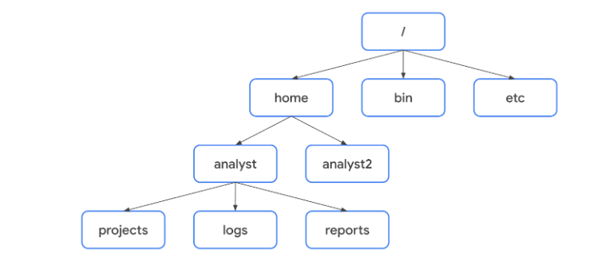

# Navegar por el sistema de archivos de Linux

## Bienvenido al Módulo 3
- ​​En esta sección, seguiremos aprendiendo más sobre ​Linux y cómo ​comunicarnos con el SO a través de su shell.
- ​Utilizará la línea de comandos ​para comunicarse con el SO.
- ​Aprenderá a introducir ​comandos en el shell y conocerá algunos de ​los principales comandos de Linux que ​utilizará como analista de seguridad.
- ​Específicamente, esto incluye ​navegar y gestionar el sistema de archivos.
- ​También se centrará en ​autenticar y autorizar usuarios.
- ​Esto significa que podrá ​utilizar una línea de comandos para añadir y ​eliminar usuarios del sistema y ​controlar a qué tienen acceso.
- ​Por último, siempre hay algo más que aprender.
- ​Cubriremos el acceso a recursos que ​apoyan el aprendizaje de nuevos comandos de Linux.

---

## Comandos Linux a través del shell Bash
- Como analista de seguridad, trabajará con ​registros de servidor y necesitará saber cómo navegar, ​gestionar y analizar archivos ​de forma remota sin una interfaz gráfica de usuario.
- ​Además, necesitará saber cómo ​verificar y configurar el acceso de usuarios y grupos.
- ​También necesitará dar autorización ​y establecer permisos de archivo.
- ​Esto significa que desarrollar habilidades con la línea de comandos ​es esencial para su trabajo como analista de seguridad.
- Utilizaremos el shell Bash.
- ​Bash es el shell por defecto en la mayoría de las distribuciones de Linux.
- ​En su mayor parte, los comandos clave de Linux que ​estará aprendiendo en esta sección son los mismos en todos los shells.
- ​Usted teclea comandos, y el OS ​responde con una respuesta a su comando.
- ​Un comando es una instrucción ​que le dice a la computadora que haga algo.
- Algunos comandos pueden decirle a la computadora que ​encuentre algo como un archivo específico.
- ​Otros pueden decirle que lance un programa. 
- ​O, puede ser que emita una cadena específica de texto.
- ​​Volvamos a introducir el comando echo.
- ​Puede que note que el comando ​que acabamos de introducir no está completo.
- ​Si vamos a usar el comando echo ​para dar salida a una cadena específica de ​texto, necesitamos especificar cuál es la cadena de texto.
- ​Para eso están los argumentos.
- ​Un argumento es la información específica que necesita un comando.
- ​Algunos comandos aceptan varios argumentos.
- ​​En este ejemplo, nuestro argumento era una cadena de texto. ​Los argumentos también pueden proporcionar otro tipo de información.
- ​Una cosa que es realmente importante en Linux es que ​todos los comandos y argumentos distinguen entre mayúsculas y minúsculas. 
- ​Esto incluye los nombres de archivos y directorios.
- ​Tenga esto en cuenta mientras aprende más sobre cómo ​utilizar Linux en sus tareas diarias como analista de seguridad.

---

## Comandos principales para la navegación y la lectura de archivos
- ​Imagine un árbol.
- ​¿Qué es lo primero en lo que se fijó del árbol? ​¿Diría que el tronco o las ramas?
- ​Estas últimas podrían llamar definitivamente su atención, ​¿pero qué hay de sus raíces?
- ​Todo en un árbol comienza en las raíces. 
- Algo similar ocurre cuando ​pensamos en el sistema de archivos de Linux.
- ​El Estándar de jerarquía del sistema de archivos, ​o FHS, es ​el componente del OS Linux que organiza los datos.
- ​Este sistema de archivos es ​una parte muy importante de Linux porque ​todo lo que hacemos en Linux se considera ​un archivo en algún lugar del Directorio del sistema.
- ​El FHS es un sistema jerárquico, ​y al igual que con un árbol, ​todo crece y se ramifica desde la raíz.
- ​El directorio raíz es ​el directorio de más alto nivel en Linux.
- ​Se designa con una única barra.
- ​Los subdirectorios se ramifican a partir del directorio raíz.
- ​Los subdirectorios se ramifican ​cada vez más lejos del directorio raíz. 
- Cuando se describe la estructura de directorios en Linux, se utilizan barras inclinadas ​al trazar ​hacia atrás a través de estas ramas hasta la raíz. 
- ​Por ejemplo, `/home/analyst/`, ​la primera barra indica el directorio raíz.
- ​Después se ramifica un nivel hacia el subdirectorio home.
- ​Otra barra indica que se está ramificando de nuevo.
- ​Esta vez es hacia ​el subdirectorio analyst que se encuentra dentro de home.
- ​Analizará estos archivos de registro para ​el uso de aplicaciones y la autenticación.
- Comandos de navegación y lectura de archivos
- pwd imprime el directorio de trabajo en la pantalla.
- ​Cuando utilice este comando, ​la salida le indicará en qué directorio se encuentra actualmente. 
- ​ls muestra los nombres de los archivos y ​directorios del directorio de trabajo actual.
- ​cd navega entre directorios.
- Este es el comando que utilizará ​cuando desee cambiar de directorio.
- ​Utilicemos estos comandos en Bash.
- ​Primero, escribiremos el comando ​pwd para mostrar la ubicación actual y, a continuación, pulsaremos intro.
- ​La salida es la ruta de acceso al ​directorio del analista en el que estamos trabajando actualmente.
- ​A continuación, introduzcamos ls para mostrar ​los archivos y directorios dentro del directorio del analista.
- ​La salida es el nombre de ​cuatro directorios: registros, informes antiguos, ​proyectos e informes, y un archivo llamado updates.txt.
- ​Digamos que ahora queremos entrar en ​el directorio logs para comprobar si hay accesos no autorizados.
- ​Introduciremos: cd logs ​para cambiar de directorio.
- ​No obtendremos ninguna salida ​en pantalla del comando cd, ​pero si volvemos a introducir pwd, ​su salida indica que el directorio de trabajo es logs.
- ​Logs es un subdirectorio del directorio analyst.
- ​Como analista de seguridad, ​también necesitará saber cómo ​leer el contenido de archivos en Linux.
- Por ejemplo, puede que necesite leer ​archivos que contengan ajustes de configuración para ​identificar posibles vulnerabilidades.
- O, podría mirar ​los informes de acceso de usuarios ​mientras investiga accesos no autorizados.
- ​Al leer el contenido de archivos, ​hay algunos comandos que le ayudarán.
- cat muestra el contenido de un archivo.
- ​Esto es útil, pero a veces ​no querrá el contenido completo de un archivo grande.
- ​En estos casos, puede utilizar el comando head.
- ​Muestra sólo el principio de ​un archivo, por defecto diez líneas.
- ​Probemos estos comandos.
- ​Imaginemos que queremos leer el contenido de ​acceso.txt, y que ya estamos ​en el directorio de trabajo donde se encuentra.
- ​Primero, introducimos el comando cat ​y luego lo seguimos con el nombre del archivo, ​acceso.txt.
- Y ​Bash devuelve el contenido completo de este archivo.
- ​Comparemos esto con el comando head.
- ​Cuando introducimos el comando head seguido de nuestro nombre de archivo, ​sólo se muestran las 10 primeras líneas de este archivo.

---

## Navegar por Linux y leer el contenido de los archivos
- Estándar de jerarquía del sistema de archivos (FHS)
   - Anteriormente, usted aprendió que el Estándar de jerarquía del sistema de archivos (FHS ) es el componente de Linux que organiza los datos.
   - El FHS es importante porque define cómo se organizan los directorios, el contenido de los directorios y otros tipos de almacenamiento en el sistema operativo.
   - Este diagrama ilustra la jerarquía de relaciones bajo el FHS:



- Bajo el FHS, la ubicación de un archivo puede describirse mediante una ruta de archivo.
- Una ruta de archivo es la ubicación de un archivo o directorio.
- En la ruta de archivo, los distintos niveles de la jerarquía están separados por una barra oblicua (/).

- Directorio raíz
   - El directorio raíz es el directorio de más alto nivel en Linux, y siempre se representa con una barra oblicua (/).
   - Todos los subdirectorios se ramifican a partir del directorio raíz.
   - Los subdirectorios pueden continuar ramificándose hasta tantos niveles como sea necesario.

- Directorios FHS estándar
   - Directamente debajo del directorio raíz, encontrará los directorios FHS estándar.
   - En el diagrama, home, bin, y etc son directorios FHS estándar.
   - He aquí algunos ejemplos de lo que contienen los directorios estándar:
      - /home: Cada usuario del sistema tiene su propio directorio personal.
      - /bin: Este directorio significa "binario" y contiene archivos binarios y otros ejecutables. Los ejecutables son archivos que contienen una serie de órdenes que una computadora debe seguir para ejecutar programas y realizar otras funciones.
      - /etc: Directorio que almacena los archivos de configuración del sistema.
      - /tmp: Este directorio almacena muchos archivos temporales. El directorio /tmp es utilizado habitualmente por los atacantes porque cualquier persona del sistema puede modificar los datos de estos archivos.
      - /mnt: Este directorio significa "montar" y almacena soportes, como unidades USB y discos duros.

>[!TIP] Puede utilizar el comando man hier para obtener más información sobre el FHS y sus directorios estándar.

- Subdirectorios específicos de usuario
   - Bajo home hay subdirectorios para usuarios específicos.
   - En el diagrama, estos usuarios son analyst y analyst2.
   - Cada usuario tiene sus propios subdirectorios personales, como projects, logs o reports.
   - Cuando la ruta de acceso conduce a un subdirectorio por debajo del directorio personal del usuario, el directorio personal del usuario puede representarse con la tilde (~).
   - Por ejemplo, /home/analyst/logs también puede representarse como ~/logs.
   - Puede navegar a subdirectorios específicos utilizando sus rutas de archivo absolutas o relativas.
   - La ruta de archivo absoluta es la ruta de archivo completa, que parte de la raíz.
   - Por ejemplo, /home/analyst/projects es una ruta de archivo absoluta.
   - La ruta de archivo relativa es la ruta de archivo que parte del directorio actual de un usuario.
   - Las rutas de archivo relativas pueden utilizar un punto (.) para representar el directorio actual, o dos puntos (..) para representar el padre del directorio actual.
   - Un ejemplo de ruta de archivo relativa podría ser ../projects.

- Comandos clave para navegar por el sistema de archivos
   - Los siguientes comandos de Linux pueden utilizarse para navegar por el sistema de archivos: pwd, ls, y cd.
   - pwd
      - El comando pwd imprime en pantalla el directorio de trabajo.
      - En otras palabras, devuelve el Directorio en el que se encuentra actualmente.
      - La salida le proporciona la ruta de acceso absoluta a este directorio.
      - Por ejemplo, si se encuentra en el directorio home y su nombre de usuario es analyst, al introducir pwd se obtiene /home/analyst.
      - Para saber cuál es su nombre de usuario, utilice el comando whoami.
      - El comando whoami devuelve el nombre de usuario del usuario actual.
      - Por ejemplo, si su nombre de usuario es analyst, al introducir whoami se obtiene analyst.
   - ls
      - El comando ls muestra los nombres de los archivos y directorios del directorio de trabajo actual.
      - Por ejemplo, ls devuelve directorios como logs, y un archivo llamado updates.txt.
      - Si desea devolver el contenido de un directorio que no es su directorio de trabajo actual, puede añadir un argumento después de ls con la ruta de acceso absoluta o relativa al directorio deseado.
      - Por ejemplo, si se encuentra en el directorio /home/analyst pero desea listar el contenido de su subdirectorio projects, puede introducir ls /home/analyst/projects o simplemente ls projects.
   - cd
      - El comando cd navega entre directorios.
      - Cuando necesite cambiar de directorio, debe utilizar este comando.
      - Para navegar a un subdirectorio del directorio actual, puede añadir un argumento después de cd con el nombre del subdirectorio.
      - Por ejemplo, si se encuentra en el directorio /home/analyst y desea navegar a su subdirectorio projects, puede introducir cd projects.
      - También puede navegar a cualquier directorio específico introduciendo la ruta de archivo absoluta.
      - Por ejemplo, si se encuentra en /home/analyst/projects, al introducir cd /home/analyst/logs cambiará su directorio actual a /home/analyst/logs.
   - Puede utilizar la ruta de archivo relativa e introducir cd .. para subir un nivel en la estructura de archivos.
   - Por ejemplo, si el directorio actual es /home/analyst/projects, al introducir cd .. cambiaría su directorio de trabajo a /home/analyst.

- Comandos comunes para leer el contenido de los archivos
   - Los siguientes comandos de Linux son útiles para leer el contenido de los archivos: cat, head, tail, y less.
   - cat
      - El comando cat muestra el contenido de un archivo.
      - Por ejemplo, al introducir cat updates.txt se devuelve todo lo que hay en el archivo updates.txt.
   - head
      - El comando head muestra sólo el principio de un archivo, por defecto 10 líneas.
      - El comando head puede ser útil cuando desea conocer el contenido básico de un archivo pero no necesita el contenido completo.
      - Si introduce head updates.txt sólo obtendrá las 10 primeras líneas del archivo updates.txt.
      - Si desea cambiar el número de líneas devueltas por head, puede especificar el número de líneas incluyendo -n.
      - Por ejemplo, si sólo desea mostrar las cinco primeras líneas del archivo updates.txt, introduzca head -n 5 updates.txt.
   - tail
      - El comando tail hace lo contrario que head.
      - Este comando puede utilizarse para mostrar sólo el final de un archivo, por defecto 10 líneas. 
      - Si introduce tail updates.txt obtendrá sólo las 10 últimas líneas del archivo updates.txt.
      - Puede utilizar tail para leer la información más reciente de un archivo de registro.
   - less
      - El comando less devuelve el contenido de un archivo página a página.
      - Por ejemplo, si introduce less updates.txt, la ventana del terminal cambiará para mostrar el contenido de updates.txt página a página.
      - Esto le permite avanzar y retroceder fácilmente por el contenido.
      - Una vez que haya accedido al contenido con el comando less, puede utilizar varios controles de teclado para desplazarse por el archivo:
         - Space bar: Avanzar una página
         - b: Retroceder una página
         - Down arrow: Avanzar una línea
         - Up arrow: Retroceder una línea
         - q: Salir y volver a la ventana de terminal anterior

---

## Actividad: Encontrar archivos con los comandos de Linux
- Introducción
   - En este laboratorio, aprenderá a navegar por una estructura de archivos de Linux, localizar archivos y leer su contenido.
   - Utilizará comandos de Linux en el shell Bash para completar estos pasos.

- Lo que hará
   - Encontrar su directorio de trabajo actual y mostrar su contenido
   - Navegar a un Directorio y listar subdirectorios
   - Visualizar el contenido de un archivo
   - Visualizar las 10 primeras líneas de un archivo

- Resumen de la actividad
   - Anteriormente, aprendiste sobre Linux y cómo comunicarte con el SO mediante la shell.
   - También aprendiste a usar algunos de los comandos principales para navegar por el sistema de archivos de Linux y leer contenido de los archivos que incluye.
   - Estas son habilidades fundamentales.
   - Por ejemplo, cuando investigas un acceso no autorizado, es posible que navegues hasta un informe sobre accesos de los usuarios y lo leas.
   - En este lab, navegarás por una estructura de archivos de Linux, ubicarás archivos y leerás su contenido.
   - También deberás responder algunas preguntas de opción múltiple en función de la información incluida en esos archivos.
   - Como analista de seguridad, es esencial que sepas cómo navegar por archivos, administrarlos y analizarlos mediante una shell de Linux sin una Interfaz gráfica de usuario.

- Situación
   - En este caso, debes ubicar y analizar la información de ciertos archivos ubicados en el directorio /home/analyst.
   - Estos son los pasos que seguirás:
      1. Obtendrás la información del directorio de trabajo actual en el que te encuentras y mostrarás su contenido.
      2. Navegarás hasta el directorio reports y obtendrás una lista de los subdirectorios que contiene.
      3. Navegarás hasta el subdirectorio users y mostrarás los contenidos del archivo Q1_added_users.txt.
      4. Navegarás hasta el directorio logs y mostrarás las primeras 10 líneas de un archivo que contiene.

- Comienza el lab

1. Obtén información del directorio actual
- ¿Cuál es tu directorio de trabajo actual?
   - [ ] /home
   - [x] /home/analyst
   - [ ] /var/logs
   - [ ] /home/analyst/logs
- ¿Cuántos directorios tiene el directorio de trabajo actual?
   - [ ] 2
   - [ ] 1
   - [ ] 5
   - [x] 4

2. Cambia el directorio y obtén una lista de los subdirectorios
- ¿Cómo se llama el subdirectorio en el directorio /home/analyst/reports?
   - [ ] analyst
   - [ ] projects
   - [x] users
   - [ ] logs

3. Ubica y lee el contenido de un archivo
- Navega hasta el directorio /home/analyst/reports/users.
- Obtén una lista de los archivos del directorio actual.
- Muestra el contenido del archivo Q1_added_users.txt.
- ¿En qué departamento trabaja el empleado con el nombre de usuario aezra?
   - [x] Human Resources
   - [ ] Finance
   - [ ] Information Technology
   - [ ] Sales
- ¿Cuál es el employee_id del usuario mreed en el departamento de Information Technology?
   - [ ] 1177
   - [ ] 1001
   - [ ] 1188
   - [x] 1104

4. Navega hasta un directorio y ubica un archivo
- Navega hasta el directorio /home/analyst/logs.
- Muestra el nombre del archivo que contiene.
- Muestra las 10 primeras líneas de este archivo.
- ¿Cuántos mensajes de advertencia hay en las primeras 10 líneas del archivo server_logs.txt?
   - [ ] 6
   - [x] 3
   - [ ] 2
   - [ ] 1

- Listado de comandos utilizados en este laboratorio
```bash
pwd
ls -l
cd reports
ls -l
cd users
ls -l
cat Q1_added_users.txt
cat Q1_added_users.txt | grep aezra
cat Q1_added_users.txt | grep mreed
cd ~/logs
ls -l
head server_logs.txt
head server_logs.txt | grep warning
```

---

## Ejemplar opcional: Encontrar archivos con los comandos de Linux
- Mismo laboratorio que el anterior.