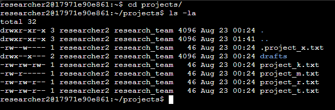
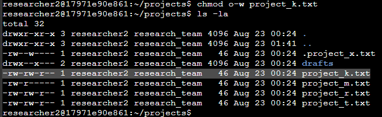
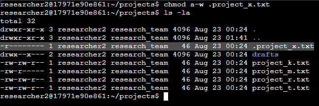
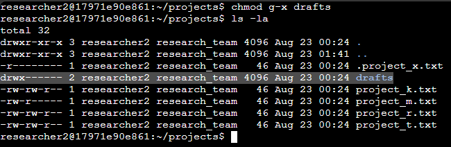

# Autenticación y autorización de usuarios

## Permisos de archivo y responsabilidad
- ​Aprenderemos cómo Linux representa los permisos ​y cómo puede comprobar los permisos ​asociados a archivos y directorios.
- ​Los permisos son el tipo de ​acceso concedido para un archivo o directorio.
- Los permisos están relacionados con la autorización.
- ​La autorización es el concepto de conceder ​acceso a recursos específicos en un sistema.
- ​La autorización le permite limitar ​el acceso a archivos o directorios especificados.
- ​Una buena regla a seguir es que ​el acceso a los datos es en la medida en que sea necesario.
- ​Puede imaginarse el riesgo que supondría para la seguridad ​que cualquiera ​pudiera acceder o modificar ​todo lo que quisiera en un sistema.
- ​En ​Linux existen tres tipos de permisos que puede tener un usuario autorizado.
- ​El primer tipo de permiso es el de lectura.
   - ​En un archivo, los permisos de lectura ​significan que se puede leer el contenido del archivo.
   - En un directorio, ​este permiso significa que se pueden leer ​todos los archivos de ese directorio.
- ​Los siguientes son los permisos de escritura.
   - ​Los permisos de escritura en un archivo permiten ​modificar el contenido del archivo.
   - ​En un directorio, los permisos de escritura indican que ​se pueden crear nuevos archivos en ese directorio.
- ​Por último, también existen los permisos de ejecución.
   - ​Los permisos de ejecución sobre archivos significan que ​el archivo puede ejecutarse si se trata de un archivo ejecutable.
   - ​Los permisos de ejecución sobre directorios permiten a los usuarios ​entrar en un directorio y acceder a sus archivos.
- ​Se conceden permisos para ​tres tipos diferentes de propietarios.
   - ​El primer tipo es el usuario.
      - ​El usuario es el propietario del archivo.
      - ​Cuando crea un archivo, ​se convierte en el propietario del archivo, ​pero la propiedad puede cambiarse.
   - ​El grupo es el siguiente tipo.
      - ​Cada usuario forma parte de un determinado grupo.
      - ​Un grupo está formado por varios usuarios, ​y ésta es una forma de gestionar un entorno multiusuario.
   - ​Por último, está other.
      - ​Other puede considerarse todos los demás usuarios del sistema.
      - ​Básicamente, cualquier otra persona con acceso ​al sistema pertenece a este grupo.
      - ​En Linux, los permisos de archivo se ​representan con una cadena de 10 caracteres.
- ​Para un directorio con permisos completos para el grupo de usuarios, ​esta cadena sería: drwxrwxrwx.
- ​Examinemos lo que esto significa más detenidamente.
   - ​El primer carácter indica el tipo de archivo.
      - ​Como se muestra en este ejemplo, `​d` se utiliza para indicar que se trata de un directorio.
      - ​Si este carácter contuviera un guión `-` en su lugar, ​se trataría de un archivo normal.
   - ​El segundo, tercer y ​cuarto carácter indican los permisos del usuario.
      - ​En este ejemplo, `r` ​indica que el usuario tiene permisos de lectura, `​w` indica que el usuario tiene permisos de escritura, ​y `x` indica que el usuario tiene permisos de ejecución.
      - ​Si faltara uno de estos permisos, ​habría un guión en lugar de la letra.
      - ​Del mismo modo, los caracteres quinto, sexto, ​y séptimo indican ​permisos para el siguiente grupo tipo propietario.
      - ​Como se muestra aquí, ​el grupo tipo también tiene permisos de lectura, ​escritura y ejecución.
      - ​No hay guiones para indicar que ​no se ha concedido alguno de estos permisos.
   - ​Por último, los caracteres octavo a décimo ​indican permisos para el último tipo de propietario: otro.
      - ​También tienen permisos de lectura, escritura, ​y ejecución en este ejemplo.
      - ​Asegurarse de que los archivos y directorios están configurados ​con sus permisos de acceso adecuados es ​crítico para proteger los archivos confidenciales y ​mantener la seguridad general de un sistema.
      - ​Por ejemplo, los departamentos de nóminas ​manejan información sensible.
      - ​Si alguien ajeno ​al grupo de nóminas pudiera leer este archivo, ​esto supondría un problema de privacidad.
      - ​Otro ejemplo es cuando el usuario, ​el grupo y otros pueden todos escribir en un archivo.
- ​Este tipo de archivo se considera un archivo escribible por todos.
- ​Los archivos escribibles por todos pueden plantear importantes Riesgos de Seguridad.
- Entonces, ¿cómo comprobamos los permisos?
   - ​Primero, necesitamos entender qué son las opciones.
      - ​Las opciones modifican el comportamiento del comando.
      - ​Las opciones de un comando ​pueden ser una sola letra o una palabra completa.
      - ​Comprobar los permisos implica añadir ​opciones al comando ls.
      - ​En primer lugar, `ls -l` muestra ​permisos de archivos y directorios.
   - También es posible que desee mostrar ​archivos ocultos e identificar sus permisos.
      - ​Los archivos ocultos, que empiezan por ​un punto antes de su nombre, no ​aparecen normalmente cuando utiliza ls para mostrar el contenido de los archivos.
      - Introduciendo `ls -a` muestra los archivos ocultos.
      - ​Entonces puede combinar estas dos opciones para hacer ambas cosas.
- ​Introduciendo `ls -la` muestra los permisos ​para archivos y directorios, incluyendo los archivos ocultos.
- ​Vamos a entrar en Bash y probar estas opciones.
- ​En este momento, estamos en el subdirectorio del proyecto.
- ​Primero, vamos a utilizar el comando `ls` para mostrar su contenido.
- ​La salida muestra los archivos en este directorio, ​pero no sabemos nada acerca de sus permisos.
- ​Al utilizar `ls -l` en su lugar, ​obtenemos información ampliada sobre ​estos archivos.
- ​Los nombres de los ficheros están ahora a la derecha de cada fila.
- ​La primera pieza de información en cada fila ​muestra los permisos en ​el formato que discutimos antes.
- ​Dado que todos estos son ficheros y no directorios, ​fíjese cómo el primer carácter es un guión.
- ​Centrémonos en un archivo concreto: proyecto1.txt.
- ​Los caracteres segundo a cuarto de sus ​permisos nos muestran que el usuario ​tiene permisos de lectura y escritura ​pero carece de permisos de ejecución.
- ​Tanto en los caracteres quinto a ​séptimo como en los caracteres octavo a décimo, ​la secuencia es r--.
- Esto significa que el grupo y otros sólo tienen privilegios de lectura.
- Después de los permisos, `ls -l` muestra primero el nombre de usuario.
- ​Aquí, somos nosotros, analista.
- Luego viene el nombre del grupo; ​en nuestro caso, el grupo de Seguridad.
- ​Ahora utilicemos `ls -a` ​La salida incluye dos archivos más-archivos ocultos ​con los nombres: .hidden1.txt ​y .hidden2.txt
- ​Por último, también podemos utilizar `​ls -la` para mostrar los permisos de todos los archivos, ​incluidos estos archivos ocultos.

---

## Cambiar permisos
- ​​Cuando se trabaja como analista de seguridad, ​puede haber muchas razones para ​cambiar los permisos de un usuario.
- ​Un usuario puede haber cambiado de departamento ​o haber sido asignado a un grupo de trabajo diferente.
- ​Un usuario puede simplemente dejar de trabajar en ​un proyecto que requiere ciertos permisos.
- ​Estos cambios son necesarios para proteger ​los archivos del sistema de ser ​accidental o deliberadamente alterados o borrados.
- ​Exploremos un comando relacionado ​que ayuda a controlar este acceso.
- ​chmod cambia los permisos en archivos y directorios.
- ​El comando chmod significa modo de cambio.
- ​Hay dos modos para cambiar los permisos, ​pero nos centraremos en el simbólico.
- La mejor manera de ​aprender cómo funciona chmod es a través de un ejemplo.
- ​Sé que esto tiene muchos detalles, ​pero lo desglosaremos.
- ​Tenga en cuenta también que, como muchos comandos de Linux, ​no tiene que memorizar ​la información y siempre puede encontrar una referencia.
- ​Con chmod, necesita identificar para qué ​archivo o directorio desea ajustar los permisos.
- ​Este es el argumento final, ​en este caso, un archivo llamado: access.txt.
- ​El primer argumento, añadido directamente después de ​el comando chmod, indica cómo cambiar los permisos.
- ​Ahora mismo, esto puede parecer difícil de interpretar, ​pero pronto entenderemos por qué ​esto se llama modo simbólico.
- ​Previamente, aprendimos sobre los tres tipos ​de propietarios: usuario, grupo y otro.
- ​Para identificarlos con chmod, ​usamos u para representar al usuario, ​g para representar al grupo, ​y o para representar a otro.
- ​En este ejemplo concreto, ​`g` indica que haremos ​algunos cambios en los permisos de grupo, ​y `o` en los permisos para otros.
- Estos tipos de propietarios están separados ​por una coma en este argumento.
- ​¿Pero queremos añadir o quitar permisos?
- Pues bien, para ello, utilizamos operadores matemáticos.
- ​Así, el signo más después de `g` ​significa que queremos añadir permisos para grupo.
- ​El signo menos después de `o` ​significa que queremos quitárselos a otros.
- ​Y la última pregunta es: ¿qué tipo de cambios?
- ​Ya hemos aprendido que `r` representa permisos de lectura, ​`w` representa permisos de escritura, ​y `x` representa permisos de ejecución.
- Así que en este caso, la `w` indica ​que estamos añadiendo permisos de escritura al grupo, ​y la `r` indica que estamos quitando ​permisos de lectura a otros.
- ​Pero ahora que lo hemos desglosado, ​quizá ya no parezca ​tanto un idioma extranjero.
- ​​Empezaremos en el subdirectorio logs.
- ​Si utilizamos el comando `ls -l`, ​nos mostrará los permisos del archivo.
- ​Muestra los permisos del único archivo ​de este directorio: access.txt.
- ​Los caracteres segundo a cuarto ​indican que el usuario tiene permisos de lectura y escritura.
- ​Los caracteres quinto a séptimo ​muestran que el grupo sólo tiene permisos de lectura.
- ​Y los caracteres octavo a décimo muestran ​que otros sólo tienen permisos de lectura.
- ​Necesitamos ajustar estos permisos.
- ​Queremos asegurarnos de que los analistas en ​el grupo de seguridad tienen permiso de escritura, ​pero quitamos los permisos de lectura del propietario-tipo otro, ​así que añadimos permisos de escritura para ​el grupo y quitamos los permisos de lectura para otro.
- ​Volvamos a ejecutar `ls -l`.
- ​Esto muestra un cambio en los permisos para access.txt.
- ​Note cómo en el segmento medio ​de los permisos para el grupo, ​`w` se ha añadido para dar permisos de escritura.
- ​Y otro cambio es que ​se ha eliminado la `r` en el último segmento, ​indicando que se han eliminado los permisos de lectura ​para `other`.
- ​Como se mencionó anteriormente, estos guiones ​indican una falta de permisos.
- Ahora, `other` carece de todos los permisos.

---

## Comandos de permiso
- Permisos de lectura
   - En Linux, los permisos se representan con una cadena de 10 caracteres.
   - Los permisos incluyen:
      - leer: para archivos, esta es la capacidad de leer el contenido del archivo; para directorios, esta es la capacidad de leer todo el contenido en el directorio incluyendo tanto archivos como subdirectorios
      - escribir: para archivos, esta es la capacidad de hacer modificaciones en el contenido del archivo; para directorios, esta es la capacidad de crear nuevos archivos en el directorio
      - ejecutar: para los archivos, es la capacidad de ejecutar el archivo si se trata de un programa; para los directorios, es la capacidad de entrar en el directorio y acceder a sus archivos
   - Estos permisos se otorgan a estos tipos de propietarios:
      - usuario: el propietario del archivo
      - grupo: un grupo mayor del que forma parte el propietario
      - otro: todos los demás usuarios del sistema
   - Cada carácter de la cadena de 10 caracteres transmite información diferente sobre estos permisos.
   - La siguiente tabla describe el propósito de cada carácter:

| Carácter | Ejemplo | Significado |
| --- | --- | --- |
| 1° | drwxrwxrwx | tipo de archivo: `d` para un directorio `-` para un archivo regular |
| 2º | drwxrwxrwx | permisos de lectura para el usuario `r` si el usuario tiene permisos de lectura `-` si el usuario carece de permisos de lectura |
| 3º | drwxrwxrwx | permisos de escritura para el usuario `w` si el usuario tiene permisos de escritura `-` si el usuario carece de permisos de escritura |
| 4º | drwxrwxrwx | permisos de ejecución para el usuario `x` si el usuario tiene permisos de ejecución `-` si el usuario carece de permisos de ejecución |
| 5º | drwxrwxrwx | permisos de lectura para el grupo `r` si el grupo tiene permisos de lectura `-` si el grupo carece de permisos de lectura |
| 6º | drwxrwxrwx | permisos de escritura para el grupo `w` si el grupo tiene permisos de escritura `-` si el grupo carece de permisos de escritura |
| 7º | drwxrwxrwx | permisos de ejecución para el grupo `x` si el grupo tiene permisos de ejecución `-` si el grupo carece de permisos de ejecución |
| 8º | drwxrwxrwx | permisos de lectura para otros `r` si el otro tipo de propietario tiene permisos de lectura `-` si el otro tipo de propietario carece de permisos de lectura |
| 9º | drwxrwxrwx | permisos de escritura para otro `w` si el otro tipo de propietario tiene permisos de escritura `-` si el otro tipo de propietario carece de permisos de escritura |
| 10º | drwxrwxrwx | permisos de ejecución para otro `x` si el otro tipo de propietario tiene permisos de ejecución `-` si el otro tipo de propietario carece de permisos de ejecución |

- Exploración de los permisos existentes
   - Puede utilizar el comando `ls` para investigar quién tiene permisos sobre archivos y directorios.
   - Existen opciones adicionales que puede añadir al comando `ls` para que su comando sea más específico.
   - Algunas de estas opciones proporcionan detalles sobre los permisos.
   - He aquí algunas opciones de `ls` importantes para los analistas de Seguridad:
      - `ls -a`: Muestra los archivos ocultos. Los archivos ocultos comienzan con un punto (.) al principio.
      - `ls -l`: Muestra los permisos de archivos y directorios. También muestra otra información adicional, como el nombre del propietario, el grupo, el tamaño del archivo y la hora de la última modificación.
      - `ls -la`: Muestra los permisos de archivos y directorios, incluidos los archivos ocultos. Es una combinación de las otras dos opciones.
   
- Cambio de permisos
   - El principio de privilegio mínimo es el concepto de conceder sólo el acceso y la autorización mínimos necesarios para completar una tarea o función.
   - En otras palabras, los usuarios no deben tener privilegios que vayan más allá de lo necesario.
   - No seguir el principio de privilegio mínimo puede crear riesgos de Seguridad.
   - El comando chmod puede ayudarle a gestionar esta autorización.
   - El comando chmod cambia los permisos de archivos y directorios.

- Uso de chmod
   - El comando chmod requiere dos argumentos.
   - El primer argumento indica cómo cambiar los permisos, y el segundo argumento indica el archivo o directorio para el que desea cambiar los permisos.
   - Por ejemplo, el siguiente comando añadiría todos los permisos a login_sessions.txt:
   - `chmod u+rwx,g+rwx,o+rwx login_sessions.txt`
   - Si quisiera quitar todos los permisos, podría utilizar:
   - `chmod u-rwx,g-rwx,o-rwx login_sessions.txt`
   - Otra forma de asignar estos permisos es utilizar el signo igual (=) en este primer argumento.
   - El uso de `=` con chmod establece, o asigna, los permisos exactamente como se especifican.
   - Por ejemplo, el siguiente comando establecería permisos de lectura para login_sessions.txt para usuario, grupo y otros:
      - `chmod u=r,g=r,o=r login_sessions.txt`
   - Este comando sobrescribe los permisos existentes.
   - Por ejemplo, si el usuario tenía previamente permisos de escritura, estos permisos de escritura se eliminan después de que usted especifique sólo permisos de lectura con `=`
   - La siguiente tabla repasa cómo se utiliza cada carácter dentro del primer argumento de chmod:

| Carácter | Descripción |
| --- | --- |
| u | indica que se realizarán cambios en los permisos de usuario |
| g | indica que se realizarán cambios en los permisos de grupo |
| o | indica que se realizarán cambios en otros permisos |
| + | añade permisos al usuario, grupo u otro |
| - | elimina permisos del usuario, grupo u otro |
| = | asigna permisos al usuario, grupo u otro |

- Cuando hay cambios de permisos a más de un tipo de propietario, se necesitan comas para separar los cambios para cada tipo de propietario.
- No debe añadir espacios después de esas comas.

- El principio de privilegio mínimo en acción
- Como analista de Seguridad, puede encontrarse con una situación como la siguiente:
   - Hay un archivo llamado `bonuses.txt` dentro de un directorio de `compensación`.
   - El propietario de este archivo es un miembro del departamento de Recursos Humanos con el nombre de usuario hrrep1.
   - Se ha decidido que hrrep1 necesita acceder a este archivo.
   - Pero, como este archivo contiene información confidencial, nadie más del grupo hr necesita acceso.
- Usted ejecuta `ls -l` para comprobar los permisos de los archivos en el directorio de compensación y descubre que los permisos para `bonuses.txt` son `-rw-rw----`.
- El tipo de propietario del grupo tiene permisos de lectura y escritura que no se ajustan al principio de privilegio mínimo.
- Para remediar la situación, usted introduce `chmod g-rw bonuses.txt`.
- Ahora, sólo el usuario que necesita acceder a este archivo para llevar a cabo sus responsabilidades laborales puede acceder a este archivo.

---

## Actividad: Gestionar la autorización
- Introducción
   - En este laboratorio, aprenderá a examinar y gestionar los permisos de archivos.
   - Estas habilidades pueden utilizarse al configurar la autorización de usuarios.
   - Utilizará comandos Linux en el Shell Bash para completar este laboratorio.
   - Mientras completa este laboratorio por favor tome capturas de pantalla o anote los comandos que utiliza en el Shell Bash.
- Lo que hará
   - Comprobar los permisos de los archivos de un directorio
   - Comprobar si hay permisos de archivos incorrectos y cambiar los permisos según sea necesario
   - Eliminar el acceso no autorizado a un directorio
- Resumen de la actividad
   - En este lab, usarás comandos de Linux para configurar autorizaciones.
   - La autorización implica dar acceso a recursos específicos de un sistema.
   - Es un concepto importante porque, sin la autorización, cualquier usuario podría acceder a todos los archivos que pertenecen a otros usuarios o a archivos del sistema y modificarlos.
   - Sin dudas, se correrían riesgos de seguridad.
   - En Linux, se usan permisos de archivos y de directorios para especificar quién tiene acceso a archivos y directorios específicos.
   - Explorarás los permisos de archivos y de directorios, y cambiarás la propiedad de un archivo y un directorio para limitar quién puede acceder a ellos.
   - Como analista de seguridad, configurar permisos de acceso adecuados es fundamental para proteger información sensible y mantener la seguridad general de un sistema.
- Situación
   - En este caso, debes examinar y administrar los permisos de los archivos del directorio /home/researcher2/projects para el usuario researcher2.
   - El usuario researcher2 es parte del grupo research_team.
   - Debes verificar los permisos para todos los archivos del directorio, incluidos los archivos ocultos, para asegurarte de que coincidan con el grado de autorización que debería otorgarse.
   - De no ser así, debes cambiar los permisos.
   - Estos son los pasos que seguirás:
      1. Verificarás los permisos del usuario y el grupo para todos los archivos del directorio projects.
      2. Verificarás si algún archivo tiene permisos incorrectos y los modificarás según sea necesario.
      3. Verificarás los permisos del directorio /home/researcher2/drafts y los modificarás para quitar los accesos no autorizados.

- Comienza el lab

1. Verifica los detalles de archivos y directorios
- Navega hasta el directorio projects
- Obtén una lista del contenido y los permisos del directorio projects
- ¿Cómo se llama el grupo propietario de los archivos en el directorio projects?
   - [ ] other_users
   - [ ] security_team
   - [x] research_team
   - [ ] researcher2
- Verifica si existen archivos ocultos en el directorio projects
- ¿Cuál de estos archivos está oculto en el directorio projects?
   - [x] .project_x.txt
   - [ ] .project_r.txt
   - [ ] No hay archivos ocultos
   - [ ] .project_m.txt

2. Cambia los permisos de archivos
- Verifica si algún archivo del directorio projects tiene permisos de escritura para el tipo de propietario 'otro'
- ¿Qué archivo les otorga permisos de escritura a otros usuarios?
   - [ ] project_t.txt
   - [ ] project_m.txt
   - [x] project_k.txt
- Cambia los permisos del archivo que hayas identificado en el paso anterior, de modo que otros usuarios no tengan permisos de escritura.
- El archivo project_m.txt es restringido y nadie debería poder leerlo ni escribirlo, ni siquiera el grupo.
- Obtén una lista del contenido y los permisos del directorio actual y verifica si el grupo tiene permisos de lectura o escritura
- ¿Cuáles son los permisos grupales del archivo project_m.txt?
   - [ ] Lectura, escritura y ejecución
   - [ ] Lectura y escritura
   - [x] Solo lectura
- Usa el comando chmod para cambiar los permisos del archivo project_m.txt, de modo que el grupo no tenga permisos de escritura ni de lectura

3. Cambia los permisos de un archivo oculto
- Verifica los permisos del archivo oculto .project_x.txt y responde la siguiente pregunta
- ¿Qué tipo de propietario tiene permisos de escritura incorrectos?
   - [x] El usuario y el grupo
   - [ ] Solo el grupo
   - [ ] Solo el usuario
- Cambia los permisos del archivo .project_x.txt, de modo que tanto el usuario como el grupo puedan leerlo, pero no escribirlo

4. Cambia los permisos de un directorio
- Verifica los permisos del directorio drafts y responde la siguiente pregunta
- ¿El grupo tiene acceso al directorio drafts?
   - [x] Sí
   - [ ] No
- Quita el permiso de ejecución del grupo correspondiente al directorio drafts


- Listado de comandos utilizados en este laboratorio
```bash
pwd
ls -la projects/
chmod o-w projects/project_k.txt
ls -la projects/
ls -la projects/project_m.txt
chmod g-r projects/project_m.txt
ls -la projects/.project_x.txt
chmod u-w,g-w projects/.project_x.txt
chmod u+r,g+r projects/.project_x.txt
ls -la projects/.project_x.txt
chmod g-x drafts/
ls -la projects/drafts/
```

---

## Ejemplo opcional: Gestionar la autorización
- Mismo laboratorio que el anterior.

---

## Ejemplo: Gestionar la autorización
- Resumen de la actividad
En esta actividad de laboratorio, utilizarás comandos de Linux para configurar la autorización.

La autorización es el concepto de otorgar acceso a recursos específicos en un sistema. Es importante porque sin autorización cualquier usuario podría acceder y modificar todos los archivos pertenecientes a otros usuarios o archivos del sistema. Esto sería sin duda un riesgo para la seguridad.

En Linux, los permisos de archivo y directorio se utilizan para especificar quién tiene acceso a archivos y directorios específicos. Explorarás los permisos de archivos y directorios y cambiarás la propiedad de un archivo y un directorio para limitar quién puede acceder a ellos.

Como analista de seguridad, establecer permisos de acceso apropiados es crítico para proteger información sensible y mantener la seguridad general de un sistema.

Este ejemplo es un recorrido de la actividad anterior de Qwiklab, incluyendo instrucciones detalladas y soluciones. Puedes usar este ejemplo si no pudiste completar el laboratorio y/o necesitas una guía extra para completar las tareas del laboratorio. También puede consultar este ejemplo para preparar la prueba calificada de este módulo.

- Listado de comandos utilizados en este laboratorio
```bash
cd projects
ls -l
ls -la
ls -l
chmod o-w project_k.txt
ls -l
chmod g-r project_m.txt
ls -la
chmod u-w,g-w,g+r .project_x.txt
ls -l 
chmod g-x drafts
```

- Conclusión
   - Ahora tienes experiencia práctica en el uso de comandos básicos del shell Bash de Linux para
      - examinar permisos de archivo y directorio,
      - cambiar permisos de archivos, y
      - cambiar permisos en directorios.

---

## Actividad del Portfolio: Utilizar los comandos de Linux para gestionar los permisos de archivo
- Escenario
- Usted es un profesional de la seguridad en una gran organización.
- Usted trabaja principalmente con su equipo de investigación.
- Parte de su trabajo consiste en garantizar que los usuarios de este equipo estén autorizados con los permisos adecuados.
- Esto ayuda a mantener el sistema seguro.
- Su tarea es examinar los permisos existentes en el sistema de archivos.
- Tendrá que determinar si los permisos coinciden con la autorización que debería darse.
- Si no coinciden, tendrá que modificar los permisos para autorizar a los usuarios apropiados y eliminar cualquier acceso no autorizado.
- Este escenario implica investigar y actualizar los mismos permisos de archivo que los del laboratorio Gestionar autorización.
- Puede volver a visitar el laboratorio para obtener capturas de pantalla e incluirlas en su documento de portafolio.

- Instrucciones paso a paso

1. Acceder a la plantilla
- [Plantilla Permisos de archivo en Linux](./resources/File permissions in Linux .docx)

2. Acceder al material de apoyo
- El documento Instrucciones para incluir comandos de Linux proporciona instrucciones y mejores prácticas para incluir ejemplos de comandos de Linux en su actividad del portafolio.
   - [Instrucciones para incluir comandos Linux](./resources/Instructions for including Linux commands .docx)
- El documento Permisos de archivo actuales muestra cómo se construye la estructura de archivos para esta actividad del portafolio. También se proporcionan los permisos de archivo para cada archivo o directorio.
   - [Permisos de archivo actuales](./resources/Current file permissions .docx)
- Se recomienda que utilices el laboratorio Gestionar autorización para completar esta actividad del portafolio.
- Si estás revisando el laboratorio, usar el documento Permisos de archivo actuales es opcional porque esta estructura de archivos ya ha sido creada para ti.

3. Comprobar los detalles de archivos y directorios
- En el laboratorio Gestionar autorizaciones, compruebe los permisos establecidos para los archivos y subdirectorios del directorio de proyectos.
- Asegúrese de que muestra todos los permisos, incluidos los archivos ocultos.
- O bien, utilice el contenido del documento Permisos de archivo actuales para determinar los permisos actuales.
- Describa el comando que puede utilizar para comprobar los permisos en la sección
- Comprobar los detalles de archivos y directorios de la plantilla Permisos de archivo en Linux.
- Desde el laboratorio, tome una captura de pantalla del comando Linux que utilizó.
- O bien, escriba este comando directamente en la plantilla.
- Luego, utilice la salida de este comando en el laboratorio o el contenido del documento Permisos de archivo actuales para indicar los permisos actuales.
- Si utiliza el documento Permisos de archivo actuales, escríbalos en la cadena de 10 caracteres que formaría parte de la salida del comando.

4. Describir la cadena de permisos
- Elija un ejemplo del resultado del paso anterior.
- En la sección Describa la cadena de permisos de la plantilla Permisos de archivos en Linux, escriba una breve descripción que explique la cadena de 10 caracteres del ejemplo.
- Debe describir para qué sirve la cadena de 10 caracteres y qué representa cada carácter.

5. Cambiar permisos de archivos
- La organización no permite que otras personas tengan acceso de escritura a ningún archivo.
- Basándose en los permisos establecidos en el Paso 3, identifique qué archivo necesita que se modifiquen sus permisos.
- Utilice un comando de Linux para modificar estos permisos.
- Describa el comando que utilizó y su resultado en la sección Cambiar permisos de archivo de la plantilla Permisos de archivo en Linux.
- En el laboratorio Gestionar autorización, toma una captura de pantalla del comando Linux que utilizaste.
- O bien, escriba este comando directamente en la plantilla.

6. Cambiar los permisos de archivo de un archivo oculto
- El equipo de investigación ha archivado .project_x.txt, por eso es un archivo oculto.
- Este archivo no debería tener permisos de escritura para nadie, pero el usuario y el grupo deberían poder leer el archivo.
- Utiliza un comando de Linux para asignar a .project_x.txt la autorización adecuada.
- Describa el comando que utilizó y su resultado en la sección Cambiar permisos de archivo en un archivo oculto de la plantilla Permisos de archivo en Linux.
- En el laboratorio Gestionar autorización, tome una captura de pantalla del comando Linux que utilizó.
- O bien, escriba este comando directamente en la plantilla.

7. Cambiar los permisos de directorio
- Los archivos y directorios del directorio projects pertenecen al usuario researcher2.
- Sólo researcher2 debe poder acceder al directorio drafts y a su contenido.
- Utiliza un comando de Linux para modificar los permisos en consecuencia.
- Describa el comando que utilizó y su resultado en la sección Cambiar permisos de directorio de la plantilla Permisos de archivos en Linux .
- En el laboratorio Gestionar autorización, toma una captura de pantalla del comando Linux que utilizaste.
- O bien, escriba este comando directamente en la plantilla.

8. Finalice su documento
- Para finalizar el documento y dejar claro su propósito a los posibles empleadores, asegúrese de completar las secciones Descripción del proyecto y Resumen de la plantilla Permisos de archivo en Linux .
- En la sección Descripción del proyecto, ofrezca una visión general del escenario y de lo que usted logra a través de Linux.
- Escriba de dos a cuatro frases.
- En la sección Resumen, proporcione un breve resumen de las tareas anteriores y conéctelas con el escenario.
- Escriba aproximadamente de dos a cuatro frases.
- Qué incluir en su respuesta
- Asegúrate de incluir lo siguiente en tu actividad completada:
   - Capturas de pantalla de los comandos o versiones mecanografiadas de los comandos
   - Explicaciones de los comandos
   - Una descripción del proyecto al principio
   - Un resumen al final
   - Detalles sobre el uso de chmod para actualizar los permisos de archivo
   - Detalles sobre la comprobación de permisos de archivo con ls -la
   - Detalles sobre la interpretación de la cadena de 10 caracteres que representa los permisos de archivo
   - Detalles sobre archivos ocultos y directorios

9. Evalúe su actividad

- Su documento incluye capturas de pantalla o versiones mecanografiadas de sus comandos.
   - [x] Sí
   - [ ] No
- Su documento incluye al principio una descripción del Proyecto.
   - [x] Sí
   - [ ] No
- Su documento incluye explicaciones de sus comandos y su salida.
   - [x] Sí
   - [ ] No
- Su documento incluye un resumen al final.
   - [x] Sí
   - [ ] No
- Su documento incluye detalles sobre el uso de chmod para actualizar los permisos de archivo.
   - [x] Sí
   - [ ] No
- Su documento incluye detalles sobre la comprobación de permisos de archivo con ls -la.
   - [x] Sí
   - [ ] No
- Su documento incluye detalles sobre la interpretación de la cadena de 10 caracteres que representa los permisos de archivo.
   - [x] Sí
   - [ ] No
- Su documento incluye detalles sobre archivos ocultos y directorios
   - [x] Sí
   - [ ] No


### File permissions in Linux

- Project description
En ese informe se revisarán los permisos de archivos y directorios dentro de `home/researcher2/projects/`. Se utilizarán comandos como `ls -la` y `chmod` para examinar y modificar los permisos de archivos y directorios según sea necesario. El objetivo es garantizar que los permisos estén configurados correctamente para proteger la información sensible y mantener la seguridad del sistema.

- Check file and directory details


Ingresamos a la carpeta del usuario con el comando `cd /home/researcher2/projects/` y luego ejecutamos `ls -la` para listar todos los archivos y directorios, incluidos los ocultos, junto con sus permisos. La salida muestra los permisos actuales de cada archivo y directorio.

- Describe the permissions string
La cadena de permisos de 10 caracteres se interpreta de la siguiente manera:
   - 1er carácter: tipo de archivo (d para directorio, - para archivo regular)
   - 2do carácter: permiso de lectura para el usuario `researcher2` (r si tiene permiso, - si no)
   - 3er carácter: permiso de escritura para el usuario `researcher2` (w si tiene permiso, - si no)
   - 4to carácter: permiso de ejecución para el usuario `researcher2` (x si tiene permiso, - si no)
   - 5to carácter: permiso de lectura para el grupo `research_team` (r si tiene permiso, - si no)
   - 6to carácter: permiso de escritura para el grupo `research_team` (w si tiene permiso, - si no)
   - 7mo carácter: permiso de ejecución para el grupo `research_team` (x si tiene permiso, - si no)
   - 8vo carácter: permiso de lectura para otros (r si tiene permiso, - si no)
   - 9no carácter: permiso de escritura para otros (w si tiene permiso, - si no)
   - 10mo carácter: permiso de ejecución para otros (x si tiene permiso, - si no)

- Change file permissions
Según las políticas de la organización, ningún archivo debe tener permisos de escritura para otros usuarios. En la imagen anterior podemos ver que el archivo `project_k.txt` tiene permisos de escritura para otros. Para corregir esto, ejecutamos el comando `chmod o-w project_k.txt`.
   - `chmod`: comando para cambiar los permisos de archivos y directorios.
   - `o-w`: indica que se deben eliminar los permisos de escritura para otros usuarios.
   - `project_k.txt`: el archivo al que se le aplicarán los cambios de permisos.
Comprobamos que los cambios fueron exitosos utilizando el comando `ls -la` nuevamente, y observamos que los permisos de escritura para otros han sido eliminados.



- Change file permissions on a hidden file
Los archivos ocultos (archivados) no deberían tener permisos de escritura para nadie, en las imagenes anteriores se detecta que el archivo oculto `.project_x.txt` tiene permisos de escritura para el usuario y el grupo. Para corregir esto, ejecutamos el comando `chmod a-w .project_x.txt`.
   - `a-w`: indica que se deben eliminar los permisos de escritura para todos (usuario, grupo y otros).
Comprobamos que los cambios fueron exitosas utilizando el comando `ls -la` nuevamente, y observamos que los permisos de escritura para el usuario y el grupo han sido eliminados.



- Change directory permissions
Según las políticas de la organización, solo el usuario dueño del directorio debe tener permisos de acceso. En el caso de revisión actual se detecta que el directorio `drafts` tiene permisos de ejecución para el grupo. Para corregir esto, ejecutamos el comando `chmod g-x drafts`.
   - `g-x`: indica que se deben eliminar los permisos de ejecución para el grupo.
Comprobamos que los cambios fueron exitosos utilizando el comando `ls -la` nuevamente, y observamos que los permisos de ejecución para el grupo han sido eliminados.



- Summary
Luego de una revisión exhaustiva de los permisos de archivos y directorios en `/home/researcher2/projects/`, se realizaron los ajustes necesarios para garantizar que los permisos cumplan con las políticas de seguridad de la organización. Se eliminaron los permisos de escritura para otros usuarios en `project_k.txt`, se ajustaron los permisos del archivo oculto `.project_x.txt` para que solo el usuario y el grupo puedan leerlo, y se eliminaron los permisos de ejecución para el grupo en el directorio `drafts`. Estos cambios aseguran que solo los usuarios autorizados tengan acceso a la información sensible, manteniendo así la seguridad del sistema.

---

## Ejemplo de actividad del Portfolio: Utilizar los comandos de Linux para gestionar los permisos de archivo
- El ejemplo utiliza detalles del escenario dado e incluye lo siguiente:
   - Capturas de pantalla de los comandos o versiones mecanografiadas de los comandos
   - Explicaciones de los comandos
   - Una descripción del Proyecto al principio
   - Un resumen al final
   - Detalles sobre el uso de chmod para actualizar los permisos de archivo
   - Detalles sobre la comprobación de permisos de archivo con ls -la
   - Detalles sobre la interpretación de la cadena de 10 caracteres que representa los permisos de archivo
   - Detalles sobre archivos ocultos y directorios
- [Ejemplo Permisos de archivo en Linux](./resources/File-permissions-in-Linux-exemplar.docx)

---

## Añadir y eliminar usuarios
- La ​autenticación es el proceso mediante el cual un usuario ​demuestra que es quien dice ser ​en el sistema.
- ​Al igual que en un edificio físico, ​no se debe permitir la entrada a todos los usuarios.
- ​No todos los usuarios deben tener acceso al sistema.
- ​Pero también queremos asegurarnos de ​que todos los que deberían tener acceso al sistema lo tengan.
- ​Por eso necesitamos añadir usuarios.
- ​Los usuarios nuevos pueden ser nuevos ​en la organización o en un grupo.
- ​Esto podría estar relacionado con un cambio en la ​estructura organizacional o simplemente con una directiva ​de la gerencia para trasladar a alguien.
- ​Además, cuando los usuarios ​abandonan la organización, deben eliminarse.
- ​Ya no deberían tener ​acceso a ninguna parte del sistema.
- ​O si simplemente cambiaron de grupo, ​deberían eliminarse de los grupos de ​los que ya no forman parte.
- ​Ahora que hemos explicado por qué es ​importante añadir y eliminar usuarios, ​hablemos de otro tipo de usuario, el usuario root.
- ​Un usuario root, o superusuario, ​es un usuario con privilegios elevados para modificar el sistema.
- ​Los usuarios habituales tienen limitaciones, mientras ​que el usuario root no las tiene.
- ​Las personas que necesitan realizar ​tareas específicas se pueden agregar temporalmente como usuarios root.
- ​Los usuarios root pueden crear, modificar ​o eliminar cualquier archivo y ejecutar cualquier programa.
- ​Solo los usuarios root o las cuentas con ​privilegios root pueden agregar nuevos usuarios.
- ​Así que quizás te preguntes cómo te conviertes en superusuario. 
- Bueno, una forma es iniciar sesión como usuario root, ​pero ejecutar comandos como usuario root se ​considera una mala práctica cuando se usa Linux.
- ​¿Por qué es ​potencialmente problemático ejecutar comandos como usuario root?
- ​El primer problema de iniciar sesión ​como root son los riesgos de Seguridad.
- ​Los actores malintencionados intentarán violar la cuenta root.
- ​Dado que es la cuenta más poderosa, para mantenerse a salvo, ​la cuenta root debería tener los inicios de sesión deshabilitados.
- Otro problema es que es muy ​fácil cometer errores irreversibles.
- ​Es muy fácil escribir un comando incorrecto en la CLI ​y, si lo ejecuta como usuario root, ​corre un mayor riesgo de cometer un error irreversible, ​como eliminar un directorio de forma permanente
- ​Por último, está la preocupación por la rendición de cuentas.
- ​En un entorno multiusuario como Linux, ​hay muchos usuarios.
- ​Si un usuario se ejecuta como root, ​no hay forma de rastrear quién ejecutó exactamente un comando.
- ​Una solución para ayudar a resolver este problema es el sudo.
- ​sudo es un comando que otorga temporalmente ​permisos elevados a usuarios específicos.
- ​Esto proporciona ​un enfoque más controlado en comparación con root, ​que ejecuta todos los comandos con privilegios de root.
- ​sudo resuelve muchos ​problemas relacionados con la ejecución como root.
- ​sudo proviene de super-user-do ​y te permite ejecutar comandos como ​usuario avanzado sin tener que ​iniciar y cerrar sesión en otra cuenta.
- ​Al ejecutar sudo, se te pedirá que introduzcas la contraseña del usuario con el que has iniciado sesión actualmente.
- ​No todos los usuarios de un sistema pueden convertirse en superusuarios.
- ​Los usuarios deben tener acceso a sudo a través de ​un archivo de configuración denominado archivo sudoers.
- ​Ahora que hemos aprendido sobre sudo, ​veamos cómo podemos usarlo con ​otro comando para agregar usuarios.
- ​Este comando es `useradd`.
- ​useradd añade un usuario al sistema.
- ​Solo los usuarios root o con ​privilegios sudo pueden usar un comando useradd.
- Veamos un ejemplo específico ​en el que necesitamos añadir un usuario.
- ​Imaginemos que un nuevo representante se une ​al departamento de ventas y se le asignará ​el nombre de usuario salesrep7.
- ​Tenemos la tarea de añadirlos al sistema.
- ​Vamos a intentar añadir el nuevo usuario.
- ​Primero, necesitamos usar el comando sudo, ​seguido del comando useradd ​y, por último, el nombre de usuario que queremos agregar, ​en este caso, salesrep7.
- Este comando no muestra nada en la pantalla.
- ​Pero como recibimos un nuevo cursor Bash ​y no un mensaje de error, ​podemos estar seguros de que ​el comando funcionó correctamente.
- ​Si no lo hubiera hecho, habría aparecido un mensaje de error.
- ​A veces, un error tiene que ver con ​algo tan simple como escribir mal useradd.
- ​O puede ser porque no teníamos privilegios de sudo.
- Ahora vamos a aprender a hacer lo contrario.
- ​Aprendamos cómo eliminar un usuario con `userdel`.
- ​userdel elimina un usuario del sistema.
- ​Del mismo modo, necesitamos permisos de root a los que ​accederemos a través de sudo para usar userdel.
- ​Volvamos a nuestro ejemplo del usuario que agregamos.
- ​Imaginemos que dos meses después, ​el representante de ventas que acabamos de ​añadir al sistema deja la empresa.
- ​Ese usuario ya no debería tener acceso al sistema.
- ​Vamos a eliminar ese usuario del sistema.
- ​De nuevo, primero se usa el comando sudo y ​luego agregamos el comando userdel.
- ​Por último, añadimos el nombre del usuario que queremos eliminar.
- ​De nuevo, sabemos que se ejecutó correctamente porque ​hay un nuevo cursor Bash y no un mensaje de error.

---

## Uso responsable de sudo
- El comando sudo es importante para los analistas de Seguridad porque permite a los usuarios tener permisos elevados sin poner en riesgo el sistema ejecutando comandos como usuario root.
- Uso responsable de sudo
   - Para gestionar la autorización y autenticación, necesita ser un usuario root, o un usuario con privilegios elevados para modificar el sistema.
   - Al usuario root también se le puede llamar "superusuario"
   - Usted se convierte en usuario root iniciando sesión como usuario root.
   - Sin embargo, ejecutar comandos como usuario root no es recomendable en Linux porque puede crear Riesgos de Seguridad si actores maliciosos comprometen esa cuenta.
   - También es fácil cometer errores irreversibles, y el sistema no puede rastrear quién ejecutó un comando.
   - Por estas razones, en lugar de registrarse como usuario root, se recomienda utilizar sudo en Linux cuando necesite privilegios elevados.
   - El comando sudo otorga temporalmente permisos elevados a usuarios específicos.
   - El nombre de este comando proviene de "superusuario do"
   - Los usuarios deben tener acceso en un archivo de configuración para utilizar sudo.
   - Este archivo se llama "archivo sudoers"
   - Aunque utilizar sudo es preferible a iniciar sesión como usuario root, es importante ser consciente de que los usuarios con permisos elevados para utilizar sudo podrían correr más riesgos en caso de ataque.
   - Puede comparar esto a un hotel con una llave maestra.
   - La llave maestra puede utilizarse para acceder a cualquier habitación del hotel.
   - Hay algunos trabajadores del hotel que necesitan esta clave para realizar su trabajo.
   - Por ejemplo, para limpiar todas las habitaciones, el conserje escanearía su tarjeta de identificación y luego utilizaría esta llave maestra.
   - Sin embargo, si alguien ajeno a la red del hotel obtuviera acceso a la tarjeta de identificación y a la llave maestra del conserje, podría acceder a cualquier habitación del hotel.
   - En este ejemplo, el conserje con la clave maestra representa a un usuario que utiliza sudo para obtener privilegios elevados.
   - Debido a los peligros de sudo, sólo los usuarios que realmente necesiten utilizarlo deberían tener estos permisos.
   - Además, incluso si necesita acceso a sudo, debe tener cuidado de utilizarlo sólo con los comandos que necesite y nada más.
   - Ejecutar comandos con sudo permite a los usuarios saltarse los típicos Controles de seguridad que existen para impedir el acceso elevado a un atacante.
   - Tenga cuidado con sudo si copia comandos de una fuente en línea. Es importante que no utilice sudo accidentalmente.
- Autenticación y autorización con sudo
   - Puede utilizar sudo con muchas tareas de gestión de autenticación y autorización.
   - Como recordatorio, la autenticación es el proceso de verificar quién es alguien, y la autorización es el concepto de conceder acceso a recursos específicos en un sistema.
   - Algunos de los comandos clave utilizados para estas tareas son los siguientes:
- useradd
   - El comando useradd añade un usuario al sistema.
   - Para añadir un usuario con el nombre de usuario de fgarcia con sudo, introduzca `sudo useradd fgarcia`.
   - Existen opciones adicionales que puede utilizar con useradd:
      - -g: Establece el grupo por defecto del usuario, también llamado su grupo primario
      - -G: Añade al usuario a grupos adicionales, también llamados grupos suplementarios o secundarios
   - Para utilizar la opción -g, el grupo primario debe especificarse después de -g.
   - Por ejemplo, al introducir `sudo useradd -g security fgarcia` se añade fgarcia como nuevo usuario y se asigna que su grupo primario sea security.
   - Para utilizar la opción -G, el grupo suplementario debe pasarse al comando después de -G. Puede añadir más de un grupo suplementario a la vez con la opción -G.
   - Al introducir `sudo useradd -G finance,admin fgarcia` se añade fgarcia como nuevo usuario y se añade a los grupos existentes finance y admin.
- usermod
   - El comando usermod modifica las cuentas de usuario existentes.
   - Las mismas opciones -g y -G del comando useradd pueden utilizarse con usermod si ya existe un usuario.
   - Para cambiar el grupo primario de un usuario existente, necesita la opción -g.
   - Por ejemplo, si introduce `sudo usermod -g executive fgarcia` cambiará el grupo primario de fgarcia por el grupo executive.
   - Para añadir un grupo suplementario para un usuario existente, necesita la opción -G.
   - También necesita la opción -a, que añade el usuario a un grupo existente y sólo se utiliza con la opción -G.
   - Por ejemplo, introduciendo `sudo usermod -a -G marketing fgarcia` añadiría el usuario existente fgarcia al grupo suplementario marketing.
   - Al cambiar el grupo suplementario de un usuario existente, si no incluye la opción -a, -G sustituirá cualquier grupo suplementario existente por los grupos especificados después de usermod.
   - El uso de -a con -G garantiza que se añadan los nuevos grupos pero que no se sustituyan los grupos existentes.
   - Existen otras opciones que puede utilizar con usermod para especificar cómo desea modificar el usuario, entre las que se incluyen:
      - -d: Cambia el Directorio personal del usuario.
      - -l: Cambia el nombre de usuario.
      - -L: Bloquea la cuenta para que el usuario no pueda registrarse.
   - La opción siempre va después del comando usermod.
   - Por ejemplo, para cambiar el directorio principal de fgarciaa /home/garcia_f, introduzca `sudo usermod -d /home/garcia_f fgarcia`.
   - La opción -d sigue directamente al comando usermod antes de los otros dos argumentos necesarios.
- userdel
   - El comando userdel borra un usuario del sistema.
   - Por ejemplo, si introduce `sudo userdel fgarcia` borrará fgarcia como usuario.
   - Tenga cuidado antes de borrar un usuario utilizando este comando.
   - El comando userdel no borra los archivos del directorio personal del usuario a menos que utilice la opción -r.
   - Introducir `sudo userdel -r fgarcia` eliminaría fgarcia como usuario y borraría todos los archivos de su directorio personal.
   - Antes de borrar cualquier archivo de usuario, debe asegurarse de que tiene copias de seguridad por si las necesita más adelante.
   - En lugar de borrar al usuario, podría considerar desactivar su cuenta con `usermod -L`.
   - Esto evita que el usuario se registre mientras le sigue dando acceso a su cuenta y a los permisos asociados.
   - Por ejemplo, si un usuario abandonara una organización, esta opción le permitiría identificar sobre qué archivos tiene la propiedad, de modo que podría mover esta propiedad a otros usuarios.
- chown
   - El comando chown cambia la propiedad de un archivo o directorio.
   - Puede utilizar chown para cambiar la propiedad del usuario o del grupo.
   - Para cambiar el usuario propietario del archivo access.txt a fgarcia, introduzca `sudo chown fgarcia access.txt`.
   - Para cambiar el propietario de grupo de access.txt a security, introduzca `sudo chown :security access.txt`.
   - Debe introducir dos puntos (:) antes de security para designarlo como nombre de grupo.
   - De forma similar a useradd, usermod, y userdel, existen opciones adicionales que pueden utilizarse con chown.

---

## Actividad: Añadir y gestionar usuarios con comandos Linux
- Introducción
   - En este laboratorio, aprenderá a añadir usuarios y a gestionar el acceso de usuarios en un sistema.
   - Estas habilidades se pueden utilizar cuando se trabaja con la tecnología de autenticación.
   - Utilizará comandos de Linux en el shell Bash para completar este laboratorio.
- Lo que hará
   - Añadir un nuevo empleado
   - Cambiar la Responsabilidad de un archivo
   - Añadir el nuevo empleado a un nuevo grupo
   - Eliminar al empleado del sistema
- Resumen de la actividad
   - Anteriormente, nos centramos en la autorización, el concepto que implica dar acceso a recursos específicos de un sistema.
   - Otro concepto importante en la seguridad es la autenticación.
   - Esta es el proceso mediante el cual un usuario demuestra que es quien dice ser en el sistema.
   - Cuando administran este aspecto, los analistas de seguridad deben asegurarse de lo siguiente:
      - No todos los usuarios tienen acceso al sistema.
      - Los usuarios nuevos (quienes son nuevos en la organización o un grupo) se agregan al sistema.
      - Los usuarios actuales que cambian de grupo o se van de la organización se borran del sistema.
      - En este lab, usarás los comandos useradd, usermod, userdel y chown para administrar el acceso de los usuarios en la shell Bash de Linux.
   - Importante: Debes usar el prefijo sudo al comienzo de todos los comandos que uses en este lab.
   - Agregar o quitar usuarios y grupos son tareas que requieren privilegios de administrador (superusuario) y deberás usar el prefijo sudo con los comandos correspondientes a estas tareas.
- Situación
   - En esta situación, un nuevo empleado con el nombre de usuario researcher9 se une a una organización.
   - Debes agregarlo al sistema y seguir administrando su acceso durante su permanencia en la organización.
   - Estos son los pasos que seguirás:
      1. Agregarás un nuevo empleado al sistema
      2. Luego al grupo primario correspondiente.
      3. Harás que este empleado sea propietario de un archivo relacionado con un proyecto en particular.
      4. Agregarás al nuevo empleado a un grupo complementario.
      5. Por último, borrarás al empleado del sistema.

- Comienza el lab

1. Agrega un usuario nuevo
- Escribe un comando para agregar al sistema a un usuario llamado researcher9
- Usa el comando usermod y la opción -g para agregar a researcher9 al grupo research_team y establecerlo como su grupo primario.

2. Asigna la propiedad del archivo
- Usa el comando chown para establecer a researcher9 como el propietario de /home/researcher2/projects/project_r.txt.

3. Agrega al usuario a un grupo secundario
- Usa el comando usermod con las opciones -a y -G para agregar a researcher9 al grupo sales_team y establecerlo como su grupo secundario.

4. Borra un usuario
- Ejecuta un comando para borrar a researcher9 del sistema
- Ejecuta el siguiente comando para borrar el grupo researcher9, que ya no es necesario `sudo groupdel researcher9`

- Listado de comandos utilizados en este laboratorio
```bash
sudo useradd researcher9
sudo usermod -g research_team researcher9
sudo chown researcher9 /home/researcher2/projects/project_r.txt
ls -la /home/researcher2/projects/project_r.txt
sudo usermod -a -G sales_team researcher9
sudo userdel researcher9
sudo groupdel researcher9
```