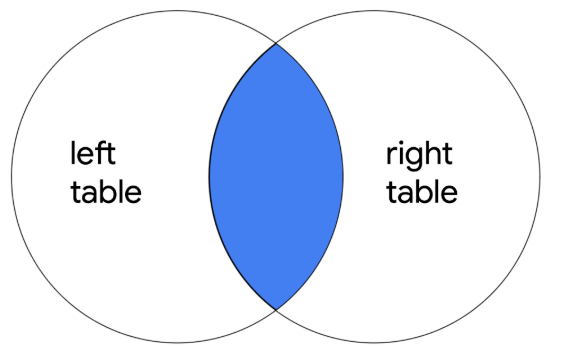
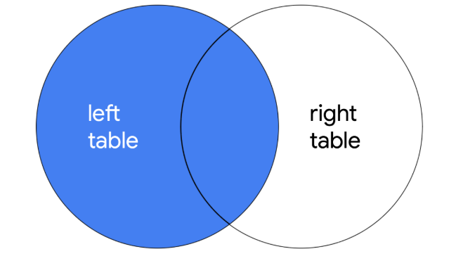
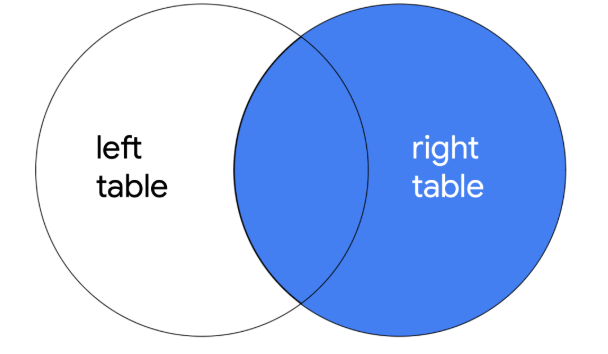
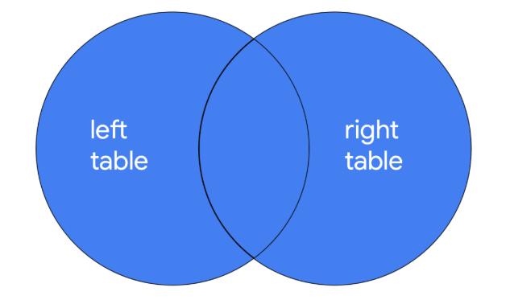
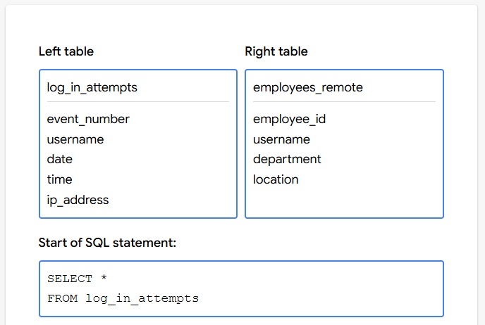

# Uniones SQL

## Unir tablas en SQL
- El último concepto que vamos a introducir en ​esta sección es la unión de tablas al consultar una base de datos.
- ​Esto resulta útil cuando se necesita ​información de dos tablas diferentes de una base de datos.
- ​Digamos que tenemos dos tablas: ​una que nos informa sobre las vulnerabilidades de seguridad de ​diferentes sistemas operativos, y otra ​sobre diferentes máquinas de nuestra empresa, ​incluidos sus sistemas operativos.
- ​Tener la capacidad de combinarlas ​nos proporciona una lista de máquinas vulnerables.
- ​Dado que ahora estamos trabajando con dos tablas, ​necesitamos una forma de decirle a SQL ​de qué tabla estamos cogiendo columnas.
- ​En nuestra base de datos de ejemplo, ​tenemos una columna employee_id ​tanto en la tabla de empleados como en la de máquinas.
- ​En las sentencias SQL que contienen dos columnas, ​SQL necesita saber a qué columna nos estamos refiriendo.
- ​La forma de resolver esto es ​escribiendo primero el nombre de la tabla, ​luego un punto y después el nombre de una columna.
- ​Así, tendríamos empleados seguido de un punto, ​seguido del nombre de la columna.
- ​Esta es la columna employee_id de la tabla de empleados.
- ​De forma similar, esta es la columna employee_id ​de la tabla de máquinas.
- ​Ahora que entendemos esta sintaxis, ​apliquémosla a un JOIN
- ​Imaginemos que queremos obtener ​un conocimiento más profundo de ​los empleados que acceden a las máquinas de nuestra empresa.
- ​¡Podemos hacerlo uniendo las tablas de empleados y ​las de máquinas!
- ​Primero tenemos que identificar ​la columna compartida que ​utilizaremos para conectar las dos tablas.
- ​En este caso, utilizaremos una clave primaria y ​una tabla para conectar con ​otra tabla en la que es una clave foránea.
- ​La clave primaria de la tabla de empleados es employee_id, ​que es una clave foránea en la tabla de máquinas.
- ​employee_id es una clave primaria ​en la tabla de empleados porque tiene ​un valor único para cada fila de ​la tabla de empleados, y no tiene valores vacíos.
- ​No tenemos garantía de que la columna employee_id de ​la tabla de máquinas siga ​los mismos criterios, ya que es ​una clave foránea y no una clave primaria.
- ​A continuación, utilizaremos un tipo de unión llamado INNER JOIN.
   - Un INNER JOIN devuelve filas que coinciden en ​una columna especificada que existe en más de una tabla.
   - ​Las tablas suelen contener muchas más filas, ​pero para explicar mejor a qué nos referimos con INNER JOIN, ​centrémonos en sólo cuatro filas de ​la tabla de empleados y cuatro filas de la tabla de máquinas.
   - ​También observaremos ​sólo unas pocas columnas de cada tabla para este ejemplo.
   - ​Digamos que elegimos ​employee_id en ambas tablas para realizar un INNER JOIN.
   - ​Veamos las dos filas en las que hay una coincidencia.
   - ​Ambas tablas tienen 1188 y ​1189 en sus respectivas columnas employee_id, ​por lo que se consideran coincidentes.
   - ​Los resultados de la unión son las dos filas que tienen 1188 ​y 1189 y todas las columnas de ambas tablas.
- ​Antes de pasar a las consultas, ​tenemos que hablar de los valores NULL en las tablas.
- ​En SQL, NULL representa un valor que falta por cualquier motivo.
- ​En este caso, podría tratarse de ​máquinas que no están asignadas a ningún empleado.
- ​Ahora, llevemos esto a SQL ​y hagamos un INNER JOIN en las tablas completas.
- ​Imaginemos que queremos unir ​estas tablas para obtener una lista de usuarios y ​su ubicación en la oficina que también muestre ​qué sistema operativo utilizan en sus máquinas.
- ​employee_id es una columna común entre estas tablas y ​podemos utilizarla para unirlas.
- ​Pero no necesitaremos mostrar esta columna en los resultados. 
- Primero, comencemos con una consulta básica ​que indique que queremos seleccionar las columnas username, ​office y operating_system.
- ​Queremos que empleados sea nuestra tabla primera o izquierda, así que ​la utilizaremos en nuestra sentencia FROM.
- ​Ahora, escribimos la parte de la consulta que le dice a SQL ​que una la tabla máquinas con la tabla empleados.
- ​Desglosemos esta consulta.
- ​INNER JOIN le dice a SQL que realice el INNER JOIN.
- ​A continuación, nombramos la segunda tabla ​que queremos combinar con la primera.
- ​A esto se le llama la tabla correcta. ​En este caso, queremos unir máquinas con ​la tabla de empleados que ya estaba ​identificada después de FROM.
- ​Por último, le decimos a SQL en qué columna basar la unión.
- ​En nuestro caso, estamos utilizando la columna employee_id.
- ​Dado que estamos utilizando dos tablas, ​tenemos que identificar la tabla ​y seguirla con el nombre de la columna.
- ​Así, tenemos employees.employee_id.
- Y máquinas.employee_id.
- ​Revisemos el resultado. ​¡Perfecto! Ahora hemos unido dos tablas.
- ​Los resultados de nuestra consulta muestran ​los registros que coinciden en la columna employee_id.
- ​Note que estos registros ​contienen columnas de ambas tablas, ​pero sólo las que hemos ​indicado mediante nuestra sentencia SELECT.

---

## Tipos de uniones
- En algunas situaciones, es posible que necesitemos ​todas las entradas de una o ambas tablas.
- ​Aquí es donde necesitamos utilizar las uniones externas.
- ​Existen tres tipos de uniones externas: LEFT JOIN, ​RIGHT JOIN y FULL OUTER JOIN.
- Similar a las uniones internas, ​las uniones externas combinan dos tablas; ​sin embargo, no necesitan necesariamente ​una coincidencia entre columnas para devolver una fila.
- ​Qué filas se devuelven depende del tipo de unión.
- ​LEFT JOIN devuelve todos los registros de la primera tabla, ​pero sólo devuelve filas de ​la segunda tabla que coincidan en una columna especificada.
- ​Al igual que hicimos en el vídeo anterior, vamos a ​examinar este tipo de unión ​observando sólo cuatro filas de ​dos tablas con un número reducido de columnas.
- ​Employees es la tabla izquierda, o la primera tabla, ​y machines es la tabla derecha, o la segunda tabla.
- ​Unámonos en employee_id.
- ​Hay un valor coincidente en ​esta columna para dos de los cuatro registros.
- ​Cuando ejecutamos la unión, ​SQL devuelve estas filas con el valor coincidente, ​todas las demás filas de ​la tabla izquierda y todas las columnas de ambas tablas.
- ​Los registros de la tabla de empleados que ​no coincidían pero que se devolvieron mediante el LEFT ​JOIN contienen valores NULOS ​en columnas que procedían de la tabla de máquinas.
- ​A continuación, hablemos de los RIGHT JOIN.
- ​La RIGHT JOIN devuelve todos ​los registros de la segunda tabla ​pero sólo devuelve las filas de ​la primera tabla que coincidan en una columna especificada.
- Con una RIGHT JOIN sobre el ejemplo anterior, ​el resultado completo devuelve las filas coincidentes de ambas, ​todas las filas de ​la segunda tabla y todas las columnas de ambas tablas.
- ​Para los valores que no existen en ninguna de las tablas, ​nos quedamos con un valor NULO.
- ​Por último, hablaremos de las uniones externas completas.
- ​FULL OUTER JOIN devuelve todos los registros ​de ambas tablas.
- Utilizando nuestro mismo ejemplo, ​un FULL OUTER JOIN devuelve todas las columnas de todas las tablas.
- ​Si una fila no tiene un valor para ​una columna concreta, devuelve NULL.
- ​Por ejemplo, la tabla máquinas ​no tiene ninguna fila con employee_id ​1190, por lo que los valores para esa fila y las ​columnas que proceden de la tabla máquinas es NULL.
- ​Para implementar left joins, right joins, ​y full outer joins en SQL, se utiliza ​la misma estructura sintáctica que la de INNER JOIN ​pero se utilizan estas palabras clave: ​LEFT JOIN, RIGHT JOIN, ​y FULL OUTER JOIN.
- ​Como analista de seguridad, ​no es necesario que se las sepa todas de memoria.
- ​Una vez que entienda el tipo de unión que necesita, ​podrá buscar y encontrar rápidamente ​toda la información que necesita para ejecutar estas consultas.

---

## Comparar tipos de uniones
- Uniones INNER JOIN
   - El primer tipo de unión que puede realizar es una unión interna.
   - INNER JOIN devuelve las filas que coinciden en una columna especificada que existe en más de una tabla.
   - Sólo devuelve las filas en las que hay una coincidencia, pero al igual que otros tipos de uniones, devuelve todas las columnas especificadas de todas las tablas unidas.
   - Por ejemplo, si la consulta une dos tablas con SELECT *, se devuelven todas las columnas de ambas tablas.
   - Si una columna existe en las dos tablas, se devuelve dos veces cuando se utiliza SELECT *



- La sintaxis de un inner join
   - Para escribir una consulta utilizando INNER JOIN, puede utilizar la siguiente sintaxis: `SELECT * FROM employees INNER JOIN machines ON employees.device_id = machines.device_id;` 
   - Debe especificar las dos tablas a unir incluyendo la primera o tabla izquierda después de FROM y la segunda o tabla derecha después de INNER JOIN.
   - Después del nombre de la tabla derecha, utilice la palabra clave ON y el operador = para indicar la columna sobre la que está uniendo las tablas.
   - Es importante que especifique tanto el nombre de la tabla como el de la columna en esta parte de la unión colocando un punto (.) entre la tabla y la columna.
   - Además de seleccionar todas las columnas, puede seleccionar sólo determinadas columnas.
   - Por ejemplo, si sólo desea que la unión devuelva las columnas username, operating_system y device_id, puede escribir esta consulta:
      - `SELECT username, operating_system, employees.device_id FROM  employees INNER JOIN machines ON employees.device_id = machines.device_id;`
   - En la consulta de ejemplo, username y operating_system sólo aparecen en una de las dos tablas, por lo que se escriben sólo con el nombre de la columna.
   - En cambio, como device_id aparece en las dos tablas, es necesario indicar cuál devolver especificando tanto el nombre de la tabla como el de la columna (employees.device_id).

- Uniones externas
   - Las uniones externas amplían lo que se devuelve de una unión.
   - Cada tipo de unión externa devuelve todas las filas de una tabla o de ambas.

- LEFT JOIN (izquierdas)
   - Al unir dos tablas, LEFT JOIN  devuelve todos los registros de la primera tabla, pero sólo devuelve las filas de la segunda tabla que coincidan en una columna especificada.
   - La sintaxis para utilizar LEFT JOIN se demuestra en la siguiente consulta: `SELECT * FROM employees LEFT JOIN machines ON employees.device_id = machines.device_id;`
   - Como con todas las uniones, debe especificar la primera tabla o tabla izquierda como la tabla que viene después de FROM y la segunda tabla o tabla derecha como la tabla que viene después de LEFT JOIN.
   - En la consulta del ejemplo, como employees es la tabla izquierda, se devuelven todos sus registros.
   - Sólo se devuelven los registros que coinciden en la columna device_id de la tabla derecha, machines.



- RIGHT JOIN
   - Al unir dos tablas, RIGHT JOIN devuelve todos los registros de la segunda tabla, pero sólo devuelve las filas de la primera tabla que coinciden en una columna especificada. 
   - La siguiente consulta demuestra la sintaxis de RIGHT JOIN: `SELECT * FROM employees RIGHT JOIN machines ON employees.device_id = machines.device_id;`
   - RIGHT JOIN tiene la misma sintaxis que LEFT JOIN, con la única diferencia de que la palabra clave RIGHT JOIN indica a SQL que produzca una salida diferente.
   - La consulta devuelve todos los registros de machines, que es la segunda tabla o tabla derecha. Sólo se devuelven los registros coincidentes de employees, que es la primera tabla o izquierda.
   - Puede utilizar LEFT JOIN y RIGHT JOIN y obtener exactamente los mismos resultados si utiliza las tablas en orden inverso.
   - La siguiente consulta RIGHT JOIN devuelve exactamente el mismo resultado que la consulta LEFT JOIN demostrada en la sección anterior: `SELECT * FROM machines RIGHT JOIN employees ON employees.device_id = machines.device_id;`
   - Todo lo que tiene que hacer es cambiar el orden de las tablas que aparecen antes y después de la palabra clave utilizada para la unión, y habrá intercambiado las tablas izquierda y derecha.
   


- FULL OUTER JOIN
   - FULL OUTER JOIN devuelve todos los registros de ambas tablas.
   - Puede considerarlo como una forma de unir completamente dos tablas.
   - Puede revisar la sintaxis para utilizar FULL OUTER JOIN en la siguiente consulta: `SELECT * FROM employees FULL OUTER JOIN machines ON employees.device_id = machines.device_id;`
   - Los resultados de una consulta FULL OUTER JOIN incluyen todos los registros de ambas tablas.
   - De forma similar a INNER JOIN, el orden de las tablas no cambia los resultados de la consulta.



---

## Identifique: Elija el tipo de join adecuado
- You’re working with two tables: one contains details on login attempts, and the other contains details on remote employees. These tables can be joined on the username column.


- Which join type is appropriate?

1. You only need to view the login attempts made by remote employees, so you want to return only the records that match on the username column.
- [x] INNER JOIN
- [ ] RIGHT JOIN
- [ ] LEFT JOIN
- [ ] FULL OUTER JOIN
> INNER JOIN will return only the records that match on username.

2. You need to examine how often remote employees log in compared to other employees. Therefore, you want to return all records from the log_in_attempts table but only the records that match on the username column from the employees_remote table.
- [ ] INNER JOIN
- [ ] RIGHT JOIN
- [x] LEFT JOIN
- [ ] FULL OUTER JOIN
> LEFT JOIN will return all records that match on username and all records from the left table (log_in_attempts).

3. You need to check employee engagement for remote workers. This means you want to return all records from the employees_remote table and only the records that match on the username column from the log_in_attempts table.
- [ ] INNER JOIN
- [x] RIGHT JOIN
- [ ] LEFT JOIN
- [ ] FULL OUTER JOIN
> RIGHT JOIN will return records that match on username and all records from the right table (employees_remote).

4. You need a complete picture of login attempts. You also need to know full details about all remote employees. This means you want to return all records from both tables.
- [ ] INNER JOIN
- [ ] RIGHT JOIN
- [ ] LEFT JOIN
- [x] FULL OUTER JOIN
> FULL OUTER JOIN will return all records from both tables.

---

## Actividad: Completar un JOIN
- Introducción
   - En este laboratorio, utilizará INNER JOIN, LEFT JOIN y RIGHT JOIN en SQL para recuperar información de dos tablas diferentes.
   - Utilizará estos diferentes tipos de uniones SQL para unir datos de tablas separadas de máquinas, empleados e intentos de inicio de sesión.
   - Utilizará el shell de MariaDB para ejecutar consultas SQL.

- Lo que hará
   - Utilice un inner join para encontrar información sobre los empleados y sus máquinas
   - Utilice una left join y una right join para encontrar información sobre los empleados y sus máquinas
   - Utilice un inner join para encontrar información sobre los empleados y sus intentos de inicio de sesión

- Resumen de actividad
   - Como analista de seguridad, con frecuencia te darás cuenta de que necesitas datos de más de una tabla.
   - Anteriormente, aprendiste que una base de datos relacional es una base de datos estructurada que contiene tablas relacionadas entre sí.
   - Las uniones de SQL te permiten combinar tablas que tienen una columna en común.
   - Esto es útil cuando debes conectar información que aparece en tablas diferentes.
   - En este lab, usarás uniones de SQL para conectar tablas separadas y recuperar la información que necesites.

- Situación
   - En esta situación, investigarás un incidente de seguridad reciente que afectó a algunas máquinas.
   - Tu objetivo es obtener de la base de datos la información necesaria para la investigación.
   - Estos son los pasos que seguirás: 
      1. Usarás una unión interna para identificar cuáles son las máquinas que usa cada empleado.
      2. Usarás uniones derechas o izquierdas para identificar las máquinas que no pertenezcan a ningún usuario en particular, así como los usuarios que no tienen ninguna máquina específica asignada.
      3. Usarás una unión interna para obtener una lista de todos los intentos de acceso que realizaron los empleados.

- Comienza el lab
1. Relaciona a los empleados con sus máquinas
- Ejecuta la siguiente consulta para recuperar los registros de la tabla machines: `SELECT * FROM machines;`
- Realiza la siguiente consulta para ejecutar la unión interna entre las tablas machines y employees según la columna device_id. Reemplaza la X y la Y con este nombre de columna: `SELECT * FROM machines INNER JOIN employees ON machines.X = employees.Y;`
- How many rows did the inner join return?
   - [x] 185
   - [ ] 132
   - [ ] 85
   - [ ] 124

2. Obtén más datos
- Ejecuta la siguiente consulta en SQL para conectar las tablas machines y employees a través de una unión hacia la izquierda. Debes reemplazar la X con la palabra clave en la consulta: `SELECT * FROM machines X JOIN employees ON machines.device_id = employees.device_id;`
- What is the value in the username column for the last record returned?
   - [ ] cgriffin
   - [ ] asundara
   - [ ] areyes
   - [x] NULL
- Ejecuta la siguiente consulta en SQL para conectar las tablas machines y employees a través de una unión hacia la derecha. Debes reemplazar la X con la palabra clave en la consulta para resolver el problema: `SELECT * FROM machines X JOIN employees ON machines.device_id = employees.device_id;`
- What is the value in the username column for the last record returned?
   - [x] areyes
   - [ ] cgriffin
   - [ ] asundara
   - [ ] NULL

3. Recupera datos de intentos de acceso
- Ejecuta la siguiente consulta en SQL para realizar una unión interna de las tablas employees y log_in_attempts. Reemplaza la X por el nombre de la tabla correcta: Luego, reemplaza la Y y la Z por el nombre de la columna que conecta las dos tablas: `SELECT * FROM employees INNER JOIN X ON Y = Z;`
- How many records are returned by this inner join?
   - [x] 200
   - [ ] 175
   - [ ] 210
   - [ ] 145

- Listado de queries utilizadas en el lab
```sql
-- PART 1
SELECT * 
FROM machines;

SELECT * 
FROM machines 
INNER JOIN employees ON machines.device_id = employees.device_id;

SELECT COUNT(*) quantity 
FROM machines 
INNER JOIN employees ON machines.device_id = employees.device_id;

-- PART 2
SELECT * 
FROM machines 
LEFT JOIN employees ON machines.device_id = employees.device_id;

SELECT * 
FROM machines
RIGHT JOIN employees ON machines.device_id = employees.device_id;

-- PART 3
SELECT * 
FROM employees 
INNER JOIN log_in_attempts ON employees.username = log_in_attempts.username;
```

---

## Ejemplar: Completar un JOIN
- Resumen de actividades
   - Como analista de seguridad, a menudo necesitarás datos de más de una tabla.
   - Anteriormente, aprendió que una base de datos relacional es una base de datos estructurada que contiene tablas relacionadas entre sí.
   - Las uniones SQL le permiten combinar tablas que contienen una columna compartida. Esto resulta útil cuando se necesita conectar información que aparece en tablas diferentes.
   - En esta actividad de laboratorio, utilizará las uniones SQL para conectar tablas separadas y recuperar la información necesaria.

- Listado de queries de ejemplo para el lab
```sql
SELECT * 
FROM machines;

SELECT * 
FROM machines 
INNER JOIN employees ON machines.X = employees.Y;

SELECT * 
FROM machines 
INNER JOIN employees ON machines.device_id = employees.device_id;

SELECT * 
FROM machines 
X JOIN employees ON machines.device_id = employees.device_id;

SELECT * 
FROM machines 
LEFT JOIN employees ON machines.device_id = employees.device_id;

SELECT * 
FROM machines
X JOIN employees ON machines.device_id = employees.device_id;

SELECT * 
FROM machines 
RIGHT JOIN employees ON machines.device_id = employees.device_id;
``` 

- Conclusión
   - Ha completado esta actividad y debería ser capaz de utilizar las uniones para combinar datos de varias tablas de una base de datos.
   - Ahora tiene experiencia práctica en el uso de
      - INNER JOIN,
      - LEFT JOIN,
      - RIGHT JOIN.