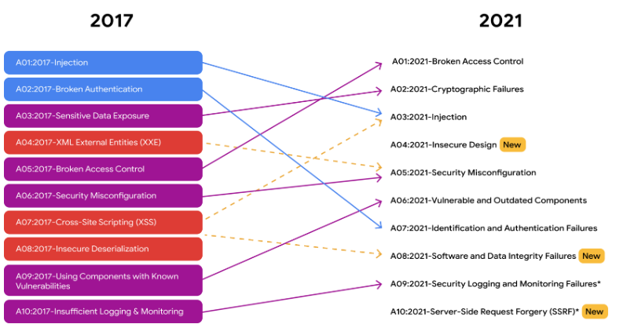

# Navegar por las amenazas, los riesgos y las vulnerabilidades

## Amenazas, riesgos y vulnerabilidades
- ​Como analista de Seguridad de nivel básico, una de sus muchas funciones será gestionar los activos ​digitales y físicos de una organización
- Durante su vida útil, las organizaciones adquieren todo tipo de activos, incluidos los ​espacios físicos de oficinas, las computadoras, la PII de los clientes, la propiedad intelectual, ​como patentes o datos protegidos por derechos de autor, y mucho más
- Desafortunadamente, las organizaciones operan en un entorno que presenta ​múltiples amenazas, riesgos y vulnerabilidades de Seguridad para sus activo
- ​Una amenaza es cualquier circunstancia o evento que pueda afectar negativamente a los activos
- ​Un ejemplo de amenaza es un ataque de ingeniería social. 
   - ​La ingeniería social es una técnica de manipulación que aprovecha el error humano ​para obtener información privada, acceso o objetos de valor
   - Los enlaces maliciosos en los mensajes de correo electrónico que parecen provenir de empresas ​o personas legítimas son un método de ingeniería social conocido como suplantación de identidad
   - Como recordatorio, la suplantación de identidad es una técnica que se utiliza para adquirir datos confidenciales, ​como nombres de usuario, contraseñas o información bancaria
- Los riesgos son diferentes de las amenazas. ​Un riesgo es cualquier cosa que pueda afectar la confidencialidad, la integridad ​o la disponibilidad de un recurso. ​Piense en un riesgo como la probabilidad de que ocurra una amenaza
   - Un ejemplo de riesgo para una organización podría ser la falta de protocolos de respaldo ​para garantizar que la información almacenada pueda recuperarse en caso de accidente o ​incidente de Seguridad. 
- ​Las organizaciones tienden a calificar los riesgos en diferentes niveles: bajo, medio ​y alto, según las posibles amenazas y el valor de un recurso
- Un recurso de bajo riesgo es la información que no perjudicaría la reputación de la organización ni ​las operaciones en curso, y que no causaría daños financieros si se viera comprometida
   - ​Esto incluye información pública, como el contenido del sitio web o ​los datos de investigación publicados
- Un recurso de riesgo medio puede incluir información que no está disponible ​para el público y que puede causar algún daño a las finanzas, la ​reputación o las operaciones en curso de la organización
   - Por ejemplo, la publicación anticipada de las ganancias trimestrales de una empresa podría afectar ​el valor de sus acciones
- Un recurso de alto riesgo es cualquier información protegida por reglamentos o leyes ​que, si se pone en peligro, tendría un impacto negativo grave en ​las finanzas, las operaciones en curso o la reputación de una organización
   - Esto podría incluir activos filtrados con SPII, PII o propiedad intelectual. 
- Una vulnerabilidad es una debilidad que puede ser aprovechada por una amenaza
- Y vale la pena señalar que tanto la vulnerabilidad como ​la amenaza deben estar presentes para que exista un riesgo
- Algunos ejemplos de vulnerabilidades son: un firewall, un software o una ​aplicación desactualizados, contraseñas débiles o datos confidenciales desprotegidos
- Las personas también pueden considerarse una vulnerabilidad.
- Las ​acciones de las personas pueden afectar significativamente a la red interna de una organización.
- ​Ya sea un cliente, un proveedor externo o un empleado, el ​mantenimiento de la Seguridad debe ser un esfuerzo conjunto. 
- Las organizaciones deben mejorar continuamente sus esfuerzos a la hora de ​identificar y mitigar las vulnerabilidades para minimizar las amenazas y los riesgos
- Los analistas principiantes pueden respaldar este objetivo alentando a los empleados a ​denunciar actividades sospechosas y supervisando y ​documentando activamente el acceso de los empleados a los activos críticos

---

## Impactos clave de las amenazas, Riesgos y vulnerabilidades
- El ransomware es un ataque malicioso en el que los actores de la amenaza encriptan ​los datos de una organización y luego exigen un pago para restaurar el acceso
   - Una vez que el ransomware es implementado por un atacante, ​puede congelar los sistemas de red, dejar los dispositivos inutilizables y ​encriptar o bloquear los datos confidenciales, haciendo que los dispositivos sean inaccesibles
   - El agente de amenaza exige entonces un rescate antes de proporcionar una clave de desencriptación ​que permita a las organizaciones volver a sus operaciones comerciales normales
   - Piense en una clave de desencriptación como una contraseña proporcionada para recuperar el acceso a sus datos
   - Tenga en cuenta que cuando se producen negociaciones de rescate o los datos son filtrados por agentes de amenaza, ​estos eventos pueden ocurrir a través de la red oscura. 
   - Aunque mucha gente utiliza los motores de búsqueda para navegar a sus cuentas de redes sociales o ​para comprar en línea, esto es sólo una pequeña parte de lo que realmente es la web
- La web es en realidad una red interconectada de contenidos en línea que está ​compuesta por tres capas: la web de superficie, la web profunda y la web oscura
   - La web de superficie es la capa que utiliza la mayoría de la gente. ​Contiene contenidos a los que se puede acceder utilizando un navegador web
   - La web profunda generalmente requiere autorización para acceder a ella. ​La intranet de una organización es un ejemplo de la web profunda, ​ya que sólo pueden acceder a ella los empleados u otras personas a las que se les haya concedido acceso
   - la web oscura utilizando un software especial. La web oscura suele tener una connotación negativa ya que es la capa web preferida ​por los delincuentes debido al secretismo que proporciona
- tres impactos clave de las amenazas, los riesgos y las vulnerabilidades
   -  El primer impacto que discutiremos es el impacto financiero
      - Cuando los recursos de una organización se ven comprometidos por un ataque, como el uso ​de software malicioso, las consecuencias financieras pueden ser significativas por una variedad de razones
      - Estas pueden incluir la interrupción de la Producción y los servicios, ​el coste de corregir el problema, y multas si los recursos se ven comprometidos ​debido al incumplimiento de las leyes y Regulaciones
   - ​El segundo impacto es el robo de identidad
      -  ​Las organizaciones deben decidir si almacenan datos privados de clientes, ​empleados y proveedores externos, y durante cuánto tiempo.
      - ​Almacenar cualquier tipo de datos sensibles supone un riesgo para la organización
      - Los datos sensibles pueden incluir información de identificación personal, o ​PII, que puede venderse o filtrarse a través de la web oscura
   - El último impacto del que hablaremos es el daño a la reputación de una organización
      - Una base sólida de clientes respalda la misión, ​la visión y los objetivos financieros de una organización
      - Una vulnerabilidad explotada puede llevar a los clientes a buscar nuevas ​relaciones comerciales con la competencia o ​crear mala prensa que cause un daño permanente a la reputación de una organización
      - La pérdida de datos de clientes no sólo afecta a la reputación y ​finanzas de una organización, también puede dar lugar a sanciones legales y multas. 
- ​Se recomienda encarecidamente a las organizaciones que tomen las medidas de seguridad adecuadas y ​sigan ciertos protocolos para prevenir el impacto significativo de amenazas, ​riesgos y vulnerabilidades

---

## Amenaza: Gestionar las amenazas, los riesgos y las vulnerabilidades
- Una tarea típica de ​los analistas de ciberseguridad suele ser algo así como las solicitudes de excepciones
- Analizar si alguien necesita tener acceso especial a un dispositivo o documento ​en función del rol que desempeña la persona o del proyecto en el que está trabajando. 
- ​Una de las amenazas más comunes con las que nos encontramos es la mala configuración o la ​solicitud de acceso para algo que realmente no se necesita
- Por ejemplo, hace poco tuve un caso en el que un proveedor ​con el que trabajábamos había cambiado sus solicitudes de ámbito de OAuth
- Básicamente, eso significa que estaban solicitando más permisos para usar ​los servicios de Google que antes
- No estábamos realmente seguros de cómo hacerlo porque no era ​una situación con la que nos hayamos topado antes. ​Por lo tanto, aún está en curso, pero ​estamos trabajando con los equipos de socios para desarrollar una solución para eso
- ​Creo que otra cosa que hemos visto son los sistemas anticuados, ​las máquinas que necesitan ser reparadas. ​Parece un problema de TI, pero también es definitivamente un problema de ciberseguridad. 
- Para poder hacer realmente cualquier cosa, necesitas comunicarte no solo con el equipo del ​que formas parte, sino también con otros equipos

---

## Marco de gestión de riesgos del NIST
- el Instituto Nacional de Estándares y Tecnología ( ​NIST) proporciona muchos marcos que utilizan los ​profesionales de la Seguridad para gestionar ​los riesgos, las amenazas y las vulnerabilidades
- Como analista principiante, ​es posible que no participe en todos estos pasos, ​pero es importante que se familiarice con este framework
- Tener una sólida comprensión básica ​de cómo mitigar y gestionar los riesgos puede ​diferenciarse de otros candidatos al ​iniciar su búsqueda de empleo en el campo de la Seguridad
- Hay siete pasos en la RMF:
1. Preparar:
   - Preparar se refiere a las actividades que son necesarias para gestionar ​los riesgos de Seguridad y privacidad antes de que se produzca una violación. 
   - Como analista principiante, ​es probable que utilice este paso para supervisar los riesgos e ​identificar los controles que se pueden utilizar para reducir esos riesgos
2. Clasificar:
   -  se utiliza para desarrollar ​procesos y tareas de gestión de riesgos
   - Luego, los profesionales de seguridad utilizan esos procesos y ​desarrollan tareas pensando en cómo el ​riesgo puede afectar la confidencialidad, la integridad y la disponibilidad de los sistemas y la información
   - Como analista principiante, ​necesitará saber cómo ​seguir los procesos establecidos ​por su organización para reducir los riesgos para los ​activos críticos, como la información privada de los cliente
3. Seleccionar:
   - Seleccionar medios para elegir, personalizar ​y capturar la documentación de ​los controles que protegen a una organización
   - Un ejemplo del paso de selección sería mantener ​un manual de estrategias actualizado o ayudar a ​administrar otra documentación que les permita a usted y ​a su equipo abordar los problemas de manera más eficiente.
4. Implementar:
   - implementar ​planes de Seguridad y privacidad para la organización
   - Disponer de buenos planes es esencial para ​minimizar el impacto de los riesgos de Seguridad actuales
   - Por ejemplo, si observas un patrón en el que los ​empleados necesitan restablecer constantemente las contraseñas, ​implementar un cambio en ​los requisitos de contraseñas puede ayudar a resolver este problema
5. Evaluar:
   - Evaluar significa determinar si ​los controles establecidos se implementan correctamente
   - Una organización siempre quiere ​operar de la manera más eficiente posible.
   - Por lo tanto, es esencial tomarse el tiempo para ​analizar si los protocolos ​, procedimientos y controles implementados que están en ​vigor satisfacen las necesidades de la organización. 
   - los analistas identifican ​las posibles debilidades y determinan ​si las herramientas, ​los procedimientos, los controles ​y los protocolos de la organización deben ​cambiarse para gestionar mejor los riesgos potenciales
6. Autorizar:
   - Autorizar significa ser responsable de ​los riesgos de Seguridad y privacidad que ​puedan existir en una organización
   - Como analista, ​el paso de autorización podría implicar la generación de informes, el ​desarrollo de planes de acción ​y el establecimiento de hitos del proyecto que estén ​alineados con los objetivos de Seguridad de su organización
7. Monitorear:
   - Monitorear significa estar al tanto de cómo funcionan los sistemas. La ​evaluación y el mantenimiento de las operaciones técnicas ​son tareas que los analistas realizan a diario. 
   - ​Parte de mantener un nivel bajo de ​riesgo para una organización es ​saber cómo los sistemas actuales respaldan ​los objetivos de Seguridad de la organización
   -  ​Si los sistemas existentes no cumplen con esos objetivos, es ​posible que se necesiten cambios

---

## Gestionar las amenazas, los riesgos y las vulnerabilidades comunes
- Comprender el panorama actual de las amenazas proporciona a las organizaciones la capacidad de crear políticas y procesos diseñados para ayudar a prevenir y mitigar este tipo de problemas de Seguridad
- Gestión de riesgos
   - Un objetivo primordial de las organizaciones es proteger los recursos.
   - Un recurso es un artículo que se percibe que tiene valor para una organización
   - Algunos ejemplos de recursos digitales son la información personal de empleados, clientes o Proveedores, como:
      - Números de la Seguridad Social (SSN), o números únicos de identificación nacional asignados a las personas
      - Fechas de nacimiento
      - Números de cuentas bancarias
      - Direcciones postales
   - Entre los ejemplos de recursos físicos se incluyen:
      - Quioscos de pago
      - Servidores
      - Computadoras de escritorio
      - Espacios de oficina
   - Algunas estrategias comunes utilizadas para gestionar los riesgos incluyen:
      - Aceptación: Aceptar un riesgo para evitar que se interrumpa la continuidad del negocio
      - Evitación: Creación de un plan para evitar el riesgo por completo
      - Transferencia: Transferencia del riesgo a un tercero para que lo gestione
      - Mitigación: Disminuir el impacto de un Riesgo conocido
- Amenazas, riesgos y vulnerabilidades más comunes en la actualidad
   - Una Amenaza es cualquier circunstancia o Evento que pueda impactar negativamente en los recursos
   - Como analista de Seguridad de nivel básico, su trabajo consiste en ayudar a defender los recursos de la organización de las amenazas internas y externas
   - Por lo tanto, comprender los tipos comunes de amenazas es importante para el trabajo diario de un analista. A modo de recordatorio, las amenazas comunes incluyen:
      - Amenazas internas: Miembros del personal o proveedores abusan de su acceso autorizado para obtener datos que pueden perjudicar a una organización.
      - Amenazas persistentes avanzadas (APT): Un agente de amenaza mantiene el acceso no autorizado a un sistema durante un largo periodo de tiempo.
   - Riesgos
      - Un Riesgo es todo aquello que puede afectar a la confidencialidad, integridad y disponibilidad de un recurso
      - Una fórmula básica para determinar el nivel de riesgo es que éste es igual a la probabilidad de una amenaza
      - Una forma de pensar en esto es que un riesgo es llegar tarde al trabajo y las amenazas son el tráfico, un accidente, un pinchazo, etc.
      - Hay diferentes factores que pueden afectar a la probabilidad de un riesgo para los recursos de una organización, entre ellos:
         - Riesgo externo: Cualquier cosa fuera de la organización que tenga el potencial de dañar los recursos de la organización, como los agentes de amenaza que intentan acceder a información privada
         - Riesgo interno: Un empleado actual o anterior, un proveedor o un socio de confianza que suponga un riesgo para la Seguridad
         - Sistemas heredados: Sistemas antiguos que podrían no estar contabilizados o actualizados, pero que aún pueden tener un impacto en los recursos, como las estaciones de trabajo o los antiguos sistemas Mainframe. Por ejemplo, una organización puede tener una vieja máquina expendedora que acepta pagos con tarjeta de crédito o una estación de trabajo que sigue conectada al sistema de contabilización heredado.
         - Riesgo multiparte: Externalizar el trabajo a proveedores externos puede darles acceso a la propiedad intelectual, como secretos comerciales, diseños de software e invenciones.
         - Cumplimiento normativo/licencias de software: Software que no está actualizado o en conformidad, o parches que no se instalan a tiempo
- Nota: La lista de tipos de ataques comunes del OWASP contiene tres nuevos riesgos para los años 2017 a 2021: diseño inseguro, fallos en la integridad del software y los datos, y falsificación de peticiones del lado del servidor. Esta actualización subraya el hecho de que la Seguridad es un Campo en constante evolución. También demuestra la importancia de mantenerse al día sobre las tácticas y técnicas actuales de los Agentes de amenaza, de modo que pueda estar mejor preparado para gestionar este tipo de riesgos.

- Vulnerabilidades
   - Una vulnerabilidad es una debilidad que puede ser explotada por una amenaza
   - Por lo tanto, las organizaciones necesitan inspeccionar regularmente las vulnerabilidades de sus sistemas. Algunas vulnerabilidades incluyen:
      - ProxyLogon
         - Una vulnerabilidad de autenticación previa que afecta al servidor Microsoft Exchange.
         - Esto significa que un Agente de amenaza puede completar un proceso de autenticación de usuario para implementar código malicioso desde una ubicación remota.
      - ZeroLogon
         - Una vulnerabilidad en el protocolo de autenticación Netlogon de Microsoft.
         - Un protocolo de autenticación es una forma de verificar la identidad de una persona.
         - Netlogon es un servicio que garantiza la identidad de un usuario antes de permitirle el acceso a la ubicación de un sitio web.
      - Log4Shell
         - Permite a los atacantes ejecutar código Java en la computadora de otra persona o filtrar información confidencial.
         - Para ello, permite a un atacante remoto tomar el control de dispositivos conectados a Internet y ejecutar código malicioso.
      - PetitPotam
         - Afecta al gestor de redes de área local (LAN) de nueva tecnología de Windows (NTLM).
         - Se trata de una técnica de robo que permite a un atacante basado en LAN iniciar una solicitud de autenticación.
      - Fallos en el registro y el Monitoreo de Seguridad
         - Capacidades insuficientes de registro y monitorización que dan lugar a que los atacantes exploten vulnerabilidades sin que la organización lo sepa
      - Falsificación de peticiones del lado del servidor
         - Permite a los atacantes manipular una aplicación del lado del servidor para que acceda y actualice los recursos del backend.
         - También puede permitir a los agentes de amenaza robar Datos.
- Como analista de seguridad de nivel básico, podría trabajar en la Gestión de vulnerabilidades, que consiste en Monitorear un sistema para identificar y mitigar las vulnerabilidades
- Aunque existan parches y actualizaciones, si no se aplican pueden producirse intrusiones
- Por esta razón, es importante un monitoreo constante. Cuanto antes identifique una organización una vulnerabilidad y la aborde aplicando parches o actualizando sus sistemas, antes se podrá mitigar, reduciendo la exposición de la organización a la vulnerabilidad.  

---

## Ponga a prueba sus Conocimientos: Navegue por las amenazas, los riesgos y las vulnerabilidades

1. ¿Qué es una vulnerabilidad?
- [ ] Cualquier cosa que pueda afectar a la confidencialidad, integridad y disponibilidad de un recurso
- [ ] Cualquier circunstancia o Evento que pueda impactar negativamente en los recursos
- [ ] La capacidad de una organización para gestionar su defensa de activos y datos críticos y reaccionar ante los cambios
- [x] Una debilidad que puede ser explotada por una amenaza
> Una vulnerabilidad es una debilidad que puede ser explotada por una amenaza. 

2. Rellene el espacio en blanco: La Información protegida por Regulaciones o leyes es un _____. Si se ve comprometida, es probable que se produzca un grave impacto negativo en las finanzas, las operaciones o la reputación de una organización
- [ ] recurso de bajo Riesgo
- [x] recurso de alto Riesgo
- [ ] recurso de nuevo riesgo
- [ ] recurso de riesgo medio
> La Información protegida por Regulaciones o leyes es un recurso de alto Riesgo. Si se ve comprometida, es probable que se produzca un grave impacto negativo en las finanzas, las operaciones o la reputación de una organización. 

3. ¿Cuáles son los impactos clave de las amenazas, los riesgos y las vulnerabilidades? Seleccione tres respuestas
- [x] Daños a la Reputación
- [x] Robo de identidad
- [ ] Retención de empleados
- [x] Daños financieros
> Los impactos clave de las amenazas, riesgos y vulnerabilidades son los daños financieros, el robo de identidad y el daño a la reputación. 

4. Rellene el espacio en blanco: Los pasos del Marco de Gestión de Riesgos (RMF) son Preparar, _____, Seleccionar, Implementar, Evaluar, Autorizar y Monitorear
- [ ] comunicar
- [ ] producir
- [ ] reflejar
- [x] categorizar
> Los pasos del RMF son Preparar, Categorizar, Seleccionar, Implementar, Evaluar, Autorizar y Monitorear. En el paso de categorizar, los profesionales de la Seguridad desarrollan procesos y tareas de gestión de riesgos.