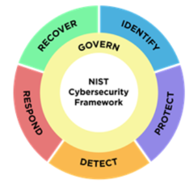

# Marcos del NIST

## Marcos del NIST
- Las organizaciones utilizan los marcos ​como punto de partida para desarrollar planes que mitiguen los riesgos ​, las amenazas y las vulnerabilidades de ​los datos y activos confidenciales
- Afortunadamente, hay organizaciones en todo el mundo que ​crean marcos que los profesionales de seguridad ​pueden usar para desarrollar esos planes
- analizaremos dos de ​los ​marcos del Instituto Nacional de Estándares y Tecnología (NIST) que pueden respaldar los ​esfuerzos de seguridad continuos para todo tipo de organizaciones, ​incluidas las empresas con y sin fines de lucro, ​así como las agencias gubernamentales
- Si bien el NIST es una organización con sede en EE. UU., ​la orientación que proporciona puede ayudar a los analistas de todo ​el mundo a entender cómo ​implementar prácticas esenciales de ciberseguridad. 
- Un marco del NIST que ​analizaremos a lo largo del programa es el ​Marco de Ciberseguridad del NIST, o CSF
- El CSF es un marco voluntario ​que consiste en estándares ​, directrices y mejores prácticas ​para gestionar el riesgo de ciberseguridad
- Este marco es ampliamente respetado y esencial para ​mantener la seguridad independientemente de ​la organización para la que trabaje.
- Actualización: El Marco de Ciberseguridad del NIST es un marco voluntario que consta de normas, directrices y mejores prácticas para gestionar los riesgos de ciberseguridad.
- En la última versión, CSF v2.0, se ha añadido una nueva función "Gobernar", que hace hincapié en la importancia de una sólida gobernanza de la ciberseguridad.
- Este marco es ampliamente respetado y esencial para mantener la seguridad independientemente de la organización para la que trabaje.
- El CSF consta ahora de seis importantes funciones básicas: Gobernar, Identificar, Proteger, Detectar, Responder y Recuperar..
- El CSF v2.0 también hace mayor hincapié en la gestión de riesgos de la cadena de suministro.

- nos centraremos en ​cómo el CSF beneficia a las organizaciones ​y cómo puede usarse para protegerse contra las amenazas, ​los riesgos y las vulnerabilidades, ​proporcionando un ejemplo en el lugar de trabajo
- Imagine que una mañana recibe ​una notificación de alto riesgo de que ​una estación de trabajo se ha visto comprometida
- Identifica la estación de trabajo ​y descubre que hay ​un dispositivo desconocido conectado a ella. 
- Bloqueas el dispositivo desconocido de forma remota para detener ​cualquier amenaza potencial y proteger a la organización
- A continuación, retire la estación de trabajo infectada ​para evitar la propagación del daño y utilice ​herramientas para detectar cualquier comportamiento adicional de los actores de amenazas ​e identificar el dispositivo desconocido
- Usted responde investigando ​el incidente para determinar quién usó el dispositivo desconocido, ​cómo se produjo la amenaza, ​qué se vio afectado y dónde se originó el ataque
- En este caso, descubres que un empleado estaba cargando ​su teléfono infectado mediante ​un puerto USB de su portátil de trabajo
- Por último, haga ​todo lo posible para recuperar los archivos o datos que ​se hayan visto afectados y corregir cualquier daño que ​la amenaza haya causado a la propia estación de trabajo
- Como se demostró en el ejemplo anterior, ​las funciones principales del CSF del NIST ​proporcionan orientación ​y dirección específicas para los profesionales de la seguridad
- ​Este marco se utiliza para desarrollar planes para gestionar ​un incidente de forma adecuada y rápida a fin de reducir el riesgo, ​proteger a la organización contra una amenaza ​y mitigar cualquier posible vulnerabilidad. 
- ​El CSF del NIST también amplía la protección del ​gobierno federal de los Estados Unidos con la publicación ​especial del NIST, o SP 800-53. 
- Proporciona un marco unificado para proteger ​la seguridad de los sistemas de información ​dentro del gobierno federal, ​incluidos los sistemas proporcionados por ​empresas privadas para uso del gobierno federal
- Los controles de seguridad proporcionados por ​este marco se utilizan para mantener ​la tríada CID de los sistemas utilizados por el gobierno.
- Como son elementos fundamentales de la profesión de seguridad, ​el NIST CSF ​es un marco útil con el ​que la mayoría de los profesionales de la seguridad están familiarizados ​, y conocer el NIST, ​SP 800-53, es ​crucial si está interesado ​en trabajar para el gobierno federal de los EE. UU. 